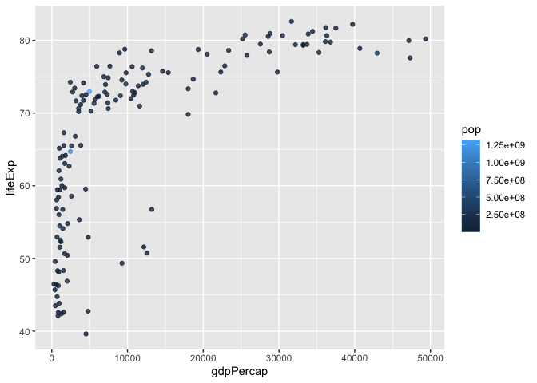

# Class 5: Data Viz with ggplot
Noel Lim PID: A17652474

## Plotting in R

R has lots of ways to make plots and figures. This includes so-called
**base** graphics and packages like **ggplot2**

``` r
plot(cars)
```


This is a **base** R plot of the in-built `cars` dataset that has only
two columns:

``` r
head(cars)
```

      speed dist
    1     4    2
    2     4   10
    3     7    4
    4     7   22
    5     8   16
    6     9   10

> Q. How would we plot this weee dataset with **ggplot2**?

All ggplot figures have at least 3 layers:

- **data**
- **aes**thetics (how the data map to the plot) -**geams** (how we draw
  the plot, lines, points, etc.)

Before I use any new package I need to download and instill it with the
`install.packages()` command.

I never use `install.packages()` within my quarto document otherwise I
will install the package over and over and over again - which is silly!

Once a package is installed I can load it up with the `library()`
function.

``` r
#install.packages("ggplot2")
library(ggplot2)
ggplot(cars) +
  aes(x=speed, y=dist) +
  geom_point() 
```


**Key-point**: For simple plots (like the one above) ggplot is more
verbose (we need to do more typing) but as plots get more complicated
ggplot starts to be more clear and simple than base R plot()

``` r
p <- ggplot(cars) +
  aes(speed, dist) +
  geom_point() +
  geom_smooth(method = "lm", se=TRUE) +
  labs(title= "Stopping distance of old cars", 
       subtitle = "From the inbuilt cars dataset") +
  theme_bw()
```

``` r
p
```

    `geom_smooth()` using formula = 'y ~ x'


### Hands on Worksheet Questions

> Q1. For which phases is data visualization important in our scientific
> workflows?

All of the above

> Q2. True or False? The ggplot2 package comes already installed with R?

False

> Q3. Which plot types are typically NOT used to compare distributions
> of numeric variables?

Network graphs

> Q4. Which statement about data visualization with ggplot2 is
> incorrect?

ggplot is the only way to create plots in R

> Q5. Which geometric layer should be used to create scatter plots in
> ggplot2?

geom_point()

> Q6. In your own RStudio can you add a trend line layer to help show
> the relationship between the plot variables with the geom_smooth()
> function?

``` r
ggplot(cars) +
  aes(x=speed, y=dist) +
  geom_point() +
  geom_smooth()
```

    `geom_smooth()` using method = 'loess' and formula = 'y ~ x'


> Q7. Argue with geom_smooth() to add a straight line from a linear
> model without the shaded standard error region?

``` r
ggplot(cars) +
  aes(x=speed, y=dist) +
  geom_point() +
  geom_smooth(method="lm", se=FALSE)
```

    `geom_smooth()` using formula = 'y ~ x'


> Q8. Can you finish this plot by adding various label annotations with
> the labs() function and changing the plot look to a more conservative
> “black & white” theme by adding the theme_bw() function:

``` r
ggplot(cars) + 
  aes(x=speed, y=dist) +
  geom_point() +
  labs(title="Speed and Stopping Distances of Cars",
       x="Speed (MPH)", 
       y="Stopping Distance (ft)",
       subtitle = "Your informative subtitle text here",
       caption="Dataset: 'cars'") +
  geom_smooth(method="lm", se=FALSE) +
  theme_bw()
```

    `geom_smooth()` using formula = 'y ~ x'


``` r
url <- "https://bioboot.github.io/bimm143_S20/class-material/up_down_expression.txt"
genes <- read.delim(url)
head(genes)
```

            Gene Condition1 Condition2      State
    1      A4GNT -3.6808610 -3.4401355 unchanging
    2       AAAS  4.5479580  4.3864126 unchanging
    3      AASDH  3.7190695  3.4787276 unchanging
    4       AATF  5.0784720  5.0151916 unchanging
    5       AATK  0.4711421  0.5598642 unchanging
    6 AB015752.4 -3.6808610 -3.5921390 unchanging

> Q9. Use the nrow() function to find out how many genes are in this
> dataset. What is your answer?

``` r
nrow(genes)
```

    [1] 5196

> Q10. Use the colnames() function and the ncol() function on the genes
> data frame to find out what the column names are (we will need these
> later) and how many columns there are. How many columns did you find?

``` r
colnames(genes)
```

    [1] "Gene"       "Condition1" "Condition2" "State"     

``` r
ncol(genes)
```

    [1] 4

> Q11. Use the table() function on the State column of this data.frame
> to find out how many ‘up’ regulated genes there are. What is your
> answer?

``` r
table(genes$State)
```


          down unchanging         up 
            72       4997        127 

> Q12. Using your values above and 2 significant figures. What fraction
> of total genes is up-regulated in this dataset?

``` r
round( table(genes$State)/nrow(genes) * 100, 2 )
```


          down unchanging         up 
          1.39      96.17       2.44 

> Q13. Complete the code below to produce the following plot

``` r
p <- ggplot(genes) + 
    aes(x=Condition1, y=Condition2, col=State) +
    geom_point()
p + scale_colour_manual( values=c("blue","green","red") )
```


> Q14. Nice, now add some plot annotations to the p object with the
> labs() function so your plot looks like the following:

``` r
p + scale_colour_manual(values=c("blue","green","red")) +
    labs(title="Gene Expresion Changes Upon Drug Treatment",
         x="Control (no drug) ",
         y="Drug Treatment")
```


``` r
# File location online
url <- "https://raw.githubusercontent.com/jennybc/gapminder/master/inst/extdata/gapminder.tsv"

gapminder <- read.delim(url)
```

``` r
# install.packages("dplyr")  ## un-comment to install if needed
library(dplyr)
```


    Attaching package: 'dplyr'

    The following objects are masked from 'package:stats':

        filter, lag

    The following objects are masked from 'package:base':

        intersect, setdiff, setequal, union

``` r
gapminder_2007 <- gapminder %>% filter(year==2007)
```

> Q15. Complete the code below to produce a first basic scater plot of
> this gapminder_2007 dataset:

``` r
ggplot(gapminder_2007) +
  aes(x=gdpPercap, y=lifeExp) +
  geom_point()
```


``` r
ggplot(gapminder_2007) +
  aes(x=gdpPercap, y=lifeExp) +
  geom_point(alpha=0.5)
```


``` r
ggplot(gapminder_2007) +
  aes(x=gdpPercap, y=lifeExp, color=continent, size=pop) +
  geom_point(alpha=0.5)
```


``` r
ggplot(gapminder_2007) + 
  aes(x = gdpPercap, y = lifeExp, color = pop) +
  geom_point(alpha=0.8)
```



``` r
ggplot(gapminder_2007) + 
  aes(x = gdpPercap, y = lifeExp, size = pop) +
  geom_point(alpha=0.5)
```


``` r
ggplot(gapminder_2007) + 
  geom_point(aes(x = gdpPercap, y = lifeExp,
                 size = pop), alpha=0.5) + 
  scale_size_area(max_size = 10)
```


> Q16. Can you adapt the code you have learned thus far to reproduce our
> gapminder scatter plot for the year 1957? What do you notice about
> this plot is it easy to compare with the one for 2007?

``` r
gapminder_1957 <- gapminder %>% filter(year==1957)

ggplot(gapminder_1957) + 
  aes(x = gdpPercap, y = lifeExp, color=continent,
                 size = pop) +
  geom_point(alpha=0.7) + 
  scale_size_area(max_size = 10) 
```


> Q17. Do the same steps above but include 1957 and 2007 in your input
> dataset for ggplot(). You should now include the layer
> facet_wrap(~year) to produce the following plot:

``` r
gapminder_1957 <- gapminder %>% filter(year==1957 | year==2007)

ggplot(gapminder_1957) + 
  geom_point(aes(x = gdpPercap, y = lifeExp, color=continent,
                 size = pop), alpha=0.7) + 
  scale_size_area(max_size = 10) +
  facet_wrap(~year)
```


``` r
table (gapminder$year)
```


    1952 1957 1962 1967 1972 1977 1982 1987 1992 1997 2002 2007 
     142  142  142  142  142  142  142  142  142  142  142  142 

``` r
length (unique(gapminder$year) )
```

    [1] 12

``` r
library(dplyr)
```

> Q. Extract data for the US in 1992

``` r
filter(gapminder, country== "United States",
       year==1992)
```

            country continent year lifeExp       pop gdpPercap
    1 United States  Americas 1992   76.09 256894189  32003.93

What was the population of Ireland in the last year we have data for?

``` r
filter(gapminder, country== "Ireland",
       year==2007)
```

      country continent year lifeExp     pop gdpPercap
    1 Ireland    Europe 2007  78.885 4109086     40676

> Q. What countries in data set had population smaller than Ireland in
> 2007

- First limit/subset the dataset to the year 2007

``` r
gap07 <- filter(gapminder, year==2007)
```

- Then find the `pop` value for Ireland

ire_pop \<- filter(gap07, country==“Ireland”)\[“pop”\] ire_pop

- Then extract all rows with `pop` less than Ireland’s

``` r
filter(gapminder, pop < 4109086)
```

                         country continent year lifeExp     pop   gdpPercap
    1                    Albania    Europe 1952  55.230 1282697   1601.0561
    2                    Albania    Europe 1957  59.280 1476505   1942.2842
    3                    Albania    Europe 1962  64.820 1728137   2312.8890
    4                    Albania    Europe 1967  66.220 1984060   2760.1969
    5                    Albania    Europe 1972  67.690 2263554   3313.4222
    6                    Albania    Europe 1977  68.930 2509048   3533.0039
    7                    Albania    Europe 1982  70.420 2780097   3630.8807
    8                    Albania    Europe 1987  72.000 3075321   3738.9327
    9                    Albania    Europe 1992  71.581 3326498   2497.4379
    10                   Albania    Europe 1997  72.950 3428038   3193.0546
    11                   Albania    Europe 2002  75.651 3508512   4604.2117
    12                   Albania    Europe 2007  76.423 3600523   5937.0295
    13                   Bahrain      Asia 1952  50.939  120447   9867.0848
    14                   Bahrain      Asia 1957  53.832  138655  11635.7995
    15                   Bahrain      Asia 1962  56.923  171863  12753.2751
    16                   Bahrain      Asia 1967  59.923  202182  14804.6727
    17                   Bahrain      Asia 1972  63.300  230800  18268.6584
    18                   Bahrain      Asia 1977  65.593  297410  19340.1020
    19                   Bahrain      Asia 1982  69.052  377967  19211.1473
    20                   Bahrain      Asia 1987  70.750  454612  18524.0241
    21                   Bahrain      Asia 1992  72.601  529491  19035.5792
    22                   Bahrain      Asia 1997  73.925  598561  20292.0168
    23                   Bahrain      Asia 2002  74.795  656397  23403.5593
    24                   Bahrain      Asia 2007  75.635  708573  29796.0483
    25                     Benin    Africa 1952  38.223 1738315   1062.7522
    26                     Benin    Africa 1957  40.358 1925173    959.6011
    27                     Benin    Africa 1962  42.618 2151895    949.4991
    28                     Benin    Africa 1967  44.885 2427334   1035.8314
    29                     Benin    Africa 1972  47.014 2761407   1085.7969
    30                     Benin    Africa 1977  49.190 3168267   1029.1613
    31                     Benin    Africa 1982  50.904 3641603   1277.8976
    32                   Bolivia  Americas 1952  40.414 2883315   2677.3263
    33                   Bolivia  Americas 1957  41.890 3211738   2127.6863
    34                   Bolivia  Americas 1962  43.428 3593918   2180.9725
    35                   Bolivia  Americas 1967  45.032 4040665   2586.8861
    36    Bosnia and Herzegovina    Europe 1952  53.820 2791000    973.5332
    37    Bosnia and Herzegovina    Europe 1957  58.450 3076000   1353.9892
    38    Bosnia and Herzegovina    Europe 1962  61.930 3349000   1709.6837
    39    Bosnia and Herzegovina    Europe 1967  64.790 3585000   2172.3524
    40    Bosnia and Herzegovina    Europe 1972  67.450 3819000   2860.1698
    41    Bosnia and Herzegovina    Europe 1977  69.860 4086000   3528.4813
    42    Bosnia and Herzegovina    Europe 1997  73.244 3607000   4766.3559
    43                  Botswana    Africa 1952  47.622  442308    851.2411
    44                  Botswana    Africa 1957  49.618  474639    918.2325
    45                  Botswana    Africa 1962  51.520  512764    983.6540
    46                  Botswana    Africa 1967  53.298  553541   1214.7093
    47                  Botswana    Africa 1972  56.024  619351   2263.6111
    48                  Botswana    Africa 1977  59.319  781472   3214.8578
    49                  Botswana    Africa 1982  61.484  970347   4551.1421
    50                  Botswana    Africa 1987  63.622 1151184   6205.8839
    51                  Botswana    Africa 1992  62.745 1342614   7954.1116
    52                  Botswana    Africa 1997  52.556 1536536   8647.1423
    53                  Botswana    Africa 2002  46.634 1630347  11003.6051
    54                  Botswana    Africa 2007  50.728 1639131  12569.8518
    55                   Burundi    Africa 1952  39.031 2445618    339.2965
    56                   Burundi    Africa 1957  40.533 2667518    379.5646
    57                   Burundi    Africa 1962  42.045 2961915    355.2032
    58                   Burundi    Africa 1967  43.548 3330989    412.9775
    59                   Burundi    Africa 1972  44.057 3529983    464.0995
    60                   Burundi    Africa 1977  45.910 3834415    556.1033
    61  Central African Republic    Africa 1952  35.463 1291695   1071.3107
    62  Central African Republic    Africa 1957  37.464 1392284   1190.8443
    63  Central African Republic    Africa 1962  39.475 1523478   1193.0688
    64  Central African Republic    Africa 1967  41.478 1733638   1136.0566
    65  Central African Republic    Africa 1972  43.457 1927260   1070.0133
    66  Central African Republic    Africa 1977  46.775 2167533   1109.3743
    67  Central African Republic    Africa 1982  48.295 2476971    956.7530
    68  Central African Republic    Africa 1987  50.485 2840009    844.8764
    69  Central African Republic    Africa 1992  49.396 3265124    747.9055
    70  Central African Republic    Africa 1997  46.066 3696513    740.5063
    71  Central African Republic    Africa 2002  43.308 4048013    738.6906
    72                      Chad    Africa 1952  38.092 2682462   1178.6659
    73                      Chad    Africa 1957  39.881 2894855   1308.4956
    74                      Chad    Africa 1962  41.716 3150417   1389.8176
    75                      Chad    Africa 1967  43.601 3495967   1196.8106
    76                      Chad    Africa 1972  45.569 3899068   1104.1040
    77                   Comoros    Africa 1952  40.715  153936   1102.9909
    78                   Comoros    Africa 1957  42.460  170928   1211.1485
    79                   Comoros    Africa 1962  44.467  191689   1406.6483
    80                   Comoros    Africa 1967  46.472  217378   1876.0296
    81                   Comoros    Africa 1972  48.944  250027   1937.5777
    82                   Comoros    Africa 1977  50.939  304739   1172.6030
    83                   Comoros    Africa 1982  52.933  348643   1267.1001
    84                   Comoros    Africa 1987  54.926  395114   1315.9808
    85                   Comoros    Africa 1992  57.939  454429   1246.9074
    86                   Comoros    Africa 1997  60.660  527982   1173.6182
    87                   Comoros    Africa 2002  62.974  614382   1075.8116
    88                   Comoros    Africa 2007  65.152  710960    986.1479
    89               Congo, Rep.    Africa 1952  42.111  854885   2125.6214
    90               Congo, Rep.    Africa 1957  45.053  940458   2315.0566
    91               Congo, Rep.    Africa 1962  48.435 1047924   2464.7832
    92               Congo, Rep.    Africa 1967  52.040 1179760   2677.9396
    93               Congo, Rep.    Africa 1972  54.907 1340458   3213.1527
    94               Congo, Rep.    Africa 1977  55.625 1536769   3259.1790
    95               Congo, Rep.    Africa 1982  56.695 1774735   4879.5075
    96               Congo, Rep.    Africa 1987  57.470 2064095   4201.1949
    97               Congo, Rep.    Africa 1992  56.433 2409073   4016.2395
    98               Congo, Rep.    Africa 1997  52.962 2800947   3484.1644
    99               Congo, Rep.    Africa 2002  52.970 3328795   3484.0620
    100              Congo, Rep.    Africa 2007  55.322 3800610   3632.5578
    101               Costa Rica  Americas 1952  57.206  926317   2627.0095
    102               Costa Rica  Americas 1957  60.026 1112300   2990.0108
    103               Costa Rica  Americas 1962  62.842 1345187   3460.9370
    104               Costa Rica  Americas 1967  65.424 1588717   4161.7278
    105               Costa Rica  Americas 1972  67.849 1834796   5118.1469
    106               Costa Rica  Americas 1977  70.750 2108457   5926.8770
    107               Costa Rica  Americas 1982  73.450 2424367   5262.7348
    108               Costa Rica  Americas 1987  74.752 2799811   5629.9153
    109               Costa Rica  Americas 1992  75.713 3173216   6160.4163
    110               Costa Rica  Americas 1997  77.260 3518107   6677.0453
    111               Costa Rica  Americas 2002  78.123 3834934   7723.4472
    112            Cote d'Ivoire    Africa 1952  40.477 2977019   1388.5947
    113            Cote d'Ivoire    Africa 1957  42.469 3300000   1500.8959
    114            Cote d'Ivoire    Africa 1962  44.930 3832408   1728.8694
    115                  Croatia    Europe 1952  61.210 3882229   3119.2365
    116                  Croatia    Europe 1957  64.770 3991242   4338.2316
    117                  Croatia    Europe 1962  67.130 4076557   5477.8900
    118                 Djibouti    Africa 1952  34.812   63149   2669.5295
    119                 Djibouti    Africa 1957  37.328   71851   2864.9691
    120                 Djibouti    Africa 1962  39.693   89898   3020.9893
    121                 Djibouti    Africa 1967  42.074  127617   3020.0505
    122                 Djibouti    Africa 1972  44.366  178848   3694.2124
    123                 Djibouti    Africa 1977  46.519  228694   3081.7610
    124                 Djibouti    Africa 1982  48.812  305991   2879.4681
    125                 Djibouti    Africa 1987  50.040  311025   2880.1026
    126                 Djibouti    Africa 1992  51.604  384156   2377.1562
    127                 Djibouti    Africa 1997  53.157  417908   1895.0170
    128                 Djibouti    Africa 2002  53.373  447416   1908.2609
    129                 Djibouti    Africa 2007  54.791  496374   2082.4816
    130       Dominican Republic  Americas 1952  45.928 2491346   1397.7171
    131       Dominican Republic  Americas 1957  49.828 2923186   1544.4030
    132       Dominican Republic  Americas 1962  53.459 3453434   1662.1374
    133       Dominican Republic  Americas 1967  56.751 4049146   1653.7230
    134                  Ecuador  Americas 1952  48.357 3548753   3522.1107
    135                  Ecuador  Americas 1957  51.356 4058385   3780.5467
    136              El Salvador  Americas 1952  45.262 2042865   3048.3029
    137              El Salvador  Americas 1957  48.570 2355805   3421.5232
    138              El Salvador  Americas 1962  52.307 2747687   3776.8036
    139              El Salvador  Americas 1967  55.855 3232927   4358.5954
    140              El Salvador  Americas 1972  58.207 3790903   4520.2460
    141        Equatorial Guinea    Africa 1952  34.482  216964    375.6431
    142        Equatorial Guinea    Africa 1957  35.983  232922    426.0964
    143        Equatorial Guinea    Africa 1962  37.485  249220    582.8420
    144        Equatorial Guinea    Africa 1967  38.987  259864    915.5960
    145        Equatorial Guinea    Africa 1972  40.516  277603    672.4123
    146        Equatorial Guinea    Africa 1977  42.024  192675    958.5668
    147        Equatorial Guinea    Africa 1982  43.662  285483    927.8253
    148        Equatorial Guinea    Africa 1987  45.664  341244    966.8968
    149        Equatorial Guinea    Africa 1992  47.545  387838   1132.0550
    150        Equatorial Guinea    Africa 1997  48.245  439971   2814.4808
    151        Equatorial Guinea    Africa 2002  49.348  495627   7703.4959
    152        Equatorial Guinea    Africa 2007  51.579  551201  12154.0897
    153                  Eritrea    Africa 1952  35.928 1438760    328.9406
    154                  Eritrea    Africa 1957  38.047 1542611    344.1619
    155                  Eritrea    Africa 1962  40.158 1666618    380.9958
    156                  Eritrea    Africa 1967  42.189 1820319    468.7950
    157                  Eritrea    Africa 1972  44.142 2260187    514.3242
    158                  Eritrea    Africa 1977  44.535 2512642    505.7538
    159                  Eritrea    Africa 1982  43.890 2637297    524.8758
    160                  Eritrea    Africa 1987  46.453 2915959    521.1341
    161                  Eritrea    Africa 1992  49.991 3668440    582.8585
    162                  Eritrea    Africa 1997  53.378 4058319    913.4708
    163                  Finland    Europe 1952  66.550 4090500   6424.5191
    164                    Gabon    Africa 1952  37.003  420702   4293.4765
    165                    Gabon    Africa 1957  38.999  434904   4976.1981
    166                    Gabon    Africa 1962  40.489  455661   6631.4592
    167                    Gabon    Africa 1967  44.598  489004   8358.7620
    168                    Gabon    Africa 1972  48.690  537977  11401.9484
    169                    Gabon    Africa 1977  52.790  706367  21745.5733
    170                    Gabon    Africa 1982  56.564  753874  15113.3619
    171                    Gabon    Africa 1987  60.190  880397  11864.4084
    172                    Gabon    Africa 1992  61.366  985739  13522.1575
    173                    Gabon    Africa 1997  60.461 1126189  14722.8419
    174                    Gabon    Africa 2002  56.761 1299304  12521.7139
    175                    Gabon    Africa 2007  56.735 1454867  13206.4845
    176                   Gambia    Africa 1952  30.000  284320    485.2307
    177                   Gambia    Africa 1957  32.065  323150    520.9267
    178                   Gambia    Africa 1962  33.896  374020    599.6503
    179                   Gambia    Africa 1967  35.857  439593    734.7829
    180                   Gambia    Africa 1972  38.308  517101    756.0868
    181                   Gambia    Africa 1977  41.842  608274    884.7553
    182                   Gambia    Africa 1982  45.580  715523    835.8096
    183                   Gambia    Africa 1987  49.265  848406    611.6589
    184                   Gambia    Africa 1992  52.644 1025384    665.6244
    185                   Gambia    Africa 1997  55.861 1235767    653.7302
    186                   Gambia    Africa 2002  58.041 1457766    660.5856
    187                   Gambia    Africa 2007  59.448 1688359    752.7497
    188                Guatemala  Americas 1952  42.023 3146381   2428.2378
    189                Guatemala  Americas 1957  44.142 3640876   2617.1560
    190                   Guinea    Africa 1952  33.609 2664249    510.1965
    191                   Guinea    Africa 1957  34.558 2876726    576.2670
    192                   Guinea    Africa 1962  35.753 3140003    686.3737
    193                   Guinea    Africa 1967  37.197 3451418    708.7595
    194                   Guinea    Africa 1972  38.842 3811387    741.6662
    195            Guinea-Bissau    Africa 1952  32.500  580653    299.8503
    196            Guinea-Bissau    Africa 1957  33.489  601095    431.7905
    197            Guinea-Bissau    Africa 1962  34.488  627820    522.0344
    198            Guinea-Bissau    Africa 1967  35.492  601287    715.5806
    199            Guinea-Bissau    Africa 1972  36.486  625361    820.2246
    200            Guinea-Bissau    Africa 1977  37.465  745228    764.7260
    201            Guinea-Bissau    Africa 1982  39.327  825987    838.1240
    202            Guinea-Bissau    Africa 1987  41.245  927524    736.4154
    203            Guinea-Bissau    Africa 1992  43.266 1050938    745.5399
    204            Guinea-Bissau    Africa 1997  44.873 1193708    796.6645
    205            Guinea-Bissau    Africa 2002  45.504 1332459    575.7047
    206            Guinea-Bissau    Africa 2007  46.388 1472041    579.2317
    207                    Haiti  Americas 1952  37.579 3201488   1840.3669
    208                    Haiti  Americas 1957  40.696 3507701   1726.8879
    209                    Haiti  Americas 1962  43.590 3880130   1796.5890
    210                 Honduras  Americas 1952  41.912 1517453   2194.9262
    211                 Honduras  Americas 1957  44.665 1770390   2220.4877
    212                 Honduras  Americas 1962  48.041 2090162   2291.1568
    213                 Honduras  Americas 1967  50.924 2500689   2538.2694
    214                 Honduras  Americas 1972  53.884 2965146   2529.8423
    215                 Honduras  Americas 1977  57.402 3055235   3203.2081
    216                 Honduras  Americas 1982  60.909 3669448   3121.7608
    217         Hong Kong, China      Asia 1952  60.960 2125900   3054.4212
    218         Hong Kong, China      Asia 1957  64.750 2736300   3629.0765
    219         Hong Kong, China      Asia 1962  67.650 3305200   4692.6483
    220         Hong Kong, China      Asia 1967  70.000 3722800   6197.9628
    221                  Iceland    Europe 1952  72.490  147962   7267.6884
    222                  Iceland    Europe 1957  73.470  165110   9244.0014
    223                  Iceland    Europe 1962  73.680  182053  10350.1591
    224                  Iceland    Europe 1967  73.730  198676  13319.8957
    225                  Iceland    Europe 1972  74.460  209275  15798.0636
    226                  Iceland    Europe 1977  76.110  221823  19654.9625
    227                  Iceland    Europe 1982  76.990  233997  23269.6075
    228                  Iceland    Europe 1987  77.230  244676  26923.2063
    229                  Iceland    Europe 1992  78.770  259012  25144.3920
    230                  Iceland    Europe 1997  78.950  271192  28061.0997
    231                  Iceland    Europe 2002  80.500  288030  31163.2020
    232                  Iceland    Europe 2007  81.757  301931  36180.7892
    233                  Ireland    Europe 1952  66.910 2952156   5210.2803
    234                  Ireland    Europe 1957  68.900 2878220   5599.0779
    235                  Ireland    Europe 1962  70.290 2830000   6631.5973
    236                  Ireland    Europe 1967  71.080 2900100   7655.5690
    237                  Ireland    Europe 1972  71.280 3024400   9530.7729
    238                  Ireland    Europe 1977  72.030 3271900  11150.9811
    239                  Ireland    Europe 1982  73.100 3480000  12618.3214
    240                  Ireland    Europe 1987  74.360 3539900  13872.8665
    241                  Ireland    Europe 1992  75.467 3557761  17558.8155
    242                  Ireland    Europe 1997  76.122 3667233  24521.9471
    243                  Ireland    Europe 2002  77.783 3879155  34077.0494
    244                   Israel      Asia 1952  65.390 1620914   4086.5221
    245                   Israel      Asia 1957  67.840 1944401   5385.2785
    246                   Israel      Asia 1962  69.390 2310904   7105.6307
    247                   Israel      Asia 1967  70.750 2693585   8393.7414
    248                   Israel      Asia 1972  71.630 3095893  12786.9322
    249                   Israel      Asia 1977  73.060 3495918  13306.6192
    250                   Israel      Asia 1982  74.450 3858421  15367.0292
    251                  Jamaica  Americas 1952  58.530 1426095   2898.5309
    252                  Jamaica  Americas 1957  62.610 1535090   4756.5258
    253                  Jamaica  Americas 1962  65.610 1665128   5246.1075
    254                  Jamaica  Americas 1967  67.510 1861096   6124.7035
    255                  Jamaica  Americas 1972  69.000 1997616   7433.8893
    256                  Jamaica  Americas 1977  70.110 2156814   6650.1956
    257                  Jamaica  Americas 1982  71.210 2298309   6068.0513
    258                  Jamaica  Americas 1987  71.770 2326606   6351.2375
    259                  Jamaica  Americas 1992  71.766 2378618   7404.9237
    260                  Jamaica  Americas 1997  72.262 2531311   7121.9247
    261                  Jamaica  Americas 2002  72.047 2664659   6994.7749
    262                  Jamaica  Americas 2007  72.567 2780132   7320.8803
    263                   Jordan      Asia 1952  43.158  607914   1546.9078
    264                   Jordan      Asia 1957  45.669  746559   1886.0806
    265                   Jordan      Asia 1962  48.126  933559   2348.0092
    266                   Jordan      Asia 1967  51.629 1255058   2741.7963
    267                   Jordan      Asia 1972  56.528 1613551   2110.8563
    268                   Jordan      Asia 1977  61.134 1937652   2852.3516
    269                   Jordan      Asia 1982  63.739 2347031   4161.4160
    270                   Jordan      Asia 1987  65.869 2820042   4448.6799
    271                   Jordan      Asia 1992  68.015 3867409   3431.5936
    272                   Kuwait      Asia 1952  55.565  160000 108382.3529
    273                   Kuwait      Asia 1957  58.033  212846 113523.1329
    274                   Kuwait      Asia 1962  60.470  358266  95458.1118
    275                   Kuwait      Asia 1967  64.624  575003  80894.8833
    276                   Kuwait      Asia 1972  67.712  841934 109347.8670
    277                   Kuwait      Asia 1977  69.343 1140357  59265.4771
    278                   Kuwait      Asia 1982  71.309 1497494  31354.0357
    279                   Kuwait      Asia 1987  74.174 1891487  28118.4300
    280                   Kuwait      Asia 1992  75.190 1418095  34932.9196
    281                   Kuwait      Asia 1997  76.156 1765345  40300.6200
    282                   Kuwait      Asia 2002  76.904 2111561  35110.1057
    283                   Kuwait      Asia 2007  77.588 2505559  47306.9898
    284                  Lebanon      Asia 1952  55.928 1439529   4834.8041
    285                  Lebanon      Asia 1957  59.489 1647412   6089.7869
    286                  Lebanon      Asia 1962  62.094 1886848   5714.5606
    287                  Lebanon      Asia 1967  63.870 2186894   6006.9830
    288                  Lebanon      Asia 1972  65.421 2680018   7486.3843
    289                  Lebanon      Asia 1977  66.099 3115787   8659.6968
    290                  Lebanon      Asia 1982  66.983 3086876   7640.5195
    291                  Lebanon      Asia 1987  67.926 3089353   5377.0913
    292                  Lebanon      Asia 1992  69.292 3219994   6890.8069
    293                  Lebanon      Asia 1997  70.265 3430388   8754.9639
    294                  Lebanon      Asia 2002  71.028 3677780   9313.9388
    295                  Lebanon      Asia 2007  71.993 3921278  10461.0587
    296                  Lesotho    Africa 1952  42.138  748747    298.8462
    297                  Lesotho    Africa 1957  45.047  813338    335.9971
    298                  Lesotho    Africa 1962  47.747  893143    411.8006
    299                  Lesotho    Africa 1967  48.492  996380    498.6390
    300                  Lesotho    Africa 1972  49.767 1116779    496.5816
    301                  Lesotho    Africa 1977  52.208 1251524    745.3695
    302                  Lesotho    Africa 1982  55.078 1411807    797.2631
    303                  Lesotho    Africa 1987  57.180 1599200    773.9932
    304                  Lesotho    Africa 1992  59.685 1803195    977.4863
    305                  Lesotho    Africa 1997  55.558 1982823   1186.1480
    306                  Lesotho    Africa 2002  44.593 2046772   1275.1846
    307                  Lesotho    Africa 2007  42.592 2012649   1569.3314
    308                  Liberia    Africa 1952  38.480  863308    575.5730
    309                  Liberia    Africa 1957  39.486  975950    620.9700
    310                  Liberia    Africa 1962  40.502 1112796    634.1952
    311                  Liberia    Africa 1967  41.536 1279406    713.6036
    312                  Liberia    Africa 1972  42.614 1482628    803.0055
    313                  Liberia    Africa 1977  43.764 1703617    640.3224
    314                  Liberia    Africa 1982  44.852 1956875    572.1996
    315                  Liberia    Africa 1987  46.027 2269414    506.1139
    316                  Liberia    Africa 1992  40.802 1912974    636.6229
    317                  Liberia    Africa 1997  42.221 2200725    609.1740
    318                  Liberia    Africa 2002  43.753 2814651    531.4824
    319                  Liberia    Africa 2007  45.678 3193942    414.5073
    320                    Libya    Africa 1952  42.723 1019729   2387.5481
    321                    Libya    Africa 1957  45.289 1201578   3448.2844
    322                    Libya    Africa 1962  47.808 1441863   6757.0308
    323                    Libya    Africa 1967  50.227 1759224  18772.7517
    324                    Libya    Africa 1972  52.773 2183877  21011.4972
    325                    Libya    Africa 1977  57.442 2721783  21951.2118
    326                    Libya    Africa 1982  62.155 3344074  17364.2754
    327                    Libya    Africa 1987  66.234 3799845  11770.5898
    328                   Malawi    Africa 1952  36.256 2917802    369.1651
    329                   Malawi    Africa 1957  37.207 3221238    416.3698
    330                   Malawi    Africa 1962  38.410 3628608    427.9011
    331                     Mali    Africa 1952  33.685 3838168    452.3370
    332               Mauritania    Africa 1952  40.543 1022556    743.1159
    333               Mauritania    Africa 1957  42.338 1076852    846.1203
    334               Mauritania    Africa 1962  44.248 1146757   1055.8960
    335               Mauritania    Africa 1967  46.289 1230542   1421.1452
    336               Mauritania    Africa 1972  48.437 1332786   1586.8518
    337               Mauritania    Africa 1977  50.852 1456688   1497.4922
    338               Mauritania    Africa 1982  53.599 1622136   1481.1502
    339               Mauritania    Africa 1987  56.145 1841240   1421.6036
    340               Mauritania    Africa 1992  58.333 2119465   1361.3698
    341               Mauritania    Africa 1997  60.430 2444741   1483.1361
    342               Mauritania    Africa 2002  62.247 2828858   1579.0195
    343               Mauritania    Africa 2007  64.164 3270065   1803.1515
    344                Mauritius    Africa 1952  50.986  516556   1967.9557
    345                Mauritius    Africa 1957  58.089  609816   2034.0380
    346                Mauritius    Africa 1962  60.246  701016   2529.0675
    347                Mauritius    Africa 1967  61.557  789309   2475.3876
    348                Mauritius    Africa 1972  62.944  851334   2575.4842
    349                Mauritius    Africa 1977  64.930  913025   3710.9830
    350                Mauritius    Africa 1982  66.711  992040   3688.0377
    351                Mauritius    Africa 1987  68.740 1042663   4783.5869
    352                Mauritius    Africa 1992  69.745 1096202   6058.2538
    353                Mauritius    Africa 1997  70.736 1149818   7425.7053
    354                Mauritius    Africa 2002  71.954 1200206   9021.8159
    355                Mauritius    Africa 2007  72.801 1250882  10956.9911
    356                 Mongolia      Asia 1952  42.244  800663    786.5669
    357                 Mongolia      Asia 1957  45.248  882134    912.6626
    358                 Mongolia      Asia 1962  48.251 1010280   1056.3540
    359                 Mongolia      Asia 1967  51.253 1149500   1226.0411
    360                 Mongolia      Asia 1972  53.754 1320500   1421.7420
    361                 Mongolia      Asia 1977  55.491 1528000   1647.5117
    362                 Mongolia      Asia 1982  57.489 1756032   2000.6031
    363                 Mongolia      Asia 1987  60.222 2015133   2338.0083
    364                 Mongolia      Asia 1992  61.271 2312802   1785.4020
    365                 Mongolia      Asia 1997  63.625 2494803   1902.2521
    366                 Mongolia      Asia 2002  65.033 2674234   2140.7393
    367                 Mongolia      Asia 2007  66.803 2874127   3095.7723
    368               Montenegro    Europe 1952  59.164  413834   2647.5856
    369               Montenegro    Europe 1957  61.448  442829   3682.2599
    370               Montenegro    Europe 1962  63.728  474528   4649.5938
    371               Montenegro    Europe 1967  67.178  501035   5907.8509
    372               Montenegro    Europe 1972  70.636  527678   7778.4140
    373               Montenegro    Europe 1977  73.066  560073   9595.9299
    374               Montenegro    Europe 1982  74.101  562548  11222.5876
    375               Montenegro    Europe 1987  74.865  569473  11732.5102
    376               Montenegro    Europe 1992  75.435  621621   7003.3390
    377               Montenegro    Europe 1997  75.445  692651   6465.6133
    378               Montenegro    Europe 2002  73.981  720230   6557.1943
    379               Montenegro    Europe 2007  74.543  684736   9253.8961
    380                  Namibia    Africa 1952  41.725  485831   2423.7804
    381                  Namibia    Africa 1957  45.226  548080   2621.4481
    382                  Namibia    Africa 1962  48.386  621392   3173.2156
    383                  Namibia    Africa 1967  51.159  706640   3793.6948
    384                  Namibia    Africa 1972  53.867  821782   3746.0809
    385                  Namibia    Africa 1977  56.437  977026   3876.4860
    386                  Namibia    Africa 1982  58.968 1099010   4191.1005
    387                  Namibia    Africa 1987  60.835 1278184   3693.7313
    388                  Namibia    Africa 1992  61.999 1554253   3804.5380
    389                  Namibia    Africa 1997  58.909 1774766   3899.5243
    390                  Namibia    Africa 2002  51.479 1972153   4072.3248
    391                  Namibia    Africa 2007  52.906 2055080   4811.0604
    392              New Zealand   Oceania 1952  69.390 1994794  10556.5757
    393              New Zealand   Oceania 1957  70.260 2229407  12247.3953
    394              New Zealand   Oceania 1962  71.240 2488550  13175.6780
    395              New Zealand   Oceania 1967  71.520 2728150  14463.9189
    396              New Zealand   Oceania 1972  71.890 2929100  16046.0373
    397              New Zealand   Oceania 1977  72.220 3164900  16233.7177
    398              New Zealand   Oceania 1982  73.840 3210650  17632.4104
    399              New Zealand   Oceania 1987  74.320 3317166  19007.1913
    400              New Zealand   Oceania 1992  76.330 3437674  18363.3249
    401              New Zealand   Oceania 1997  77.550 3676187  21050.4138
    402              New Zealand   Oceania 2002  79.110 3908037  23189.8014
    403                Nicaragua  Americas 1952  42.314 1165790   3112.3639
    404                Nicaragua  Americas 1957  45.432 1358828   3457.4159
    405                Nicaragua  Americas 1962  48.632 1590597   3634.3644
    406                Nicaragua  Americas 1967  51.884 1865490   4643.3935
    407                Nicaragua  Americas 1972  55.151 2182908   4688.5933
    408                Nicaragua  Americas 1977  57.470 2554598   5486.3711
    409                Nicaragua  Americas 1982  59.298 2979423   3470.3382
    410                Nicaragua  Americas 1987  62.008 3344353   2955.9844
    411                Nicaragua  Americas 1992  65.843 4017939   2170.1517
    412                    Niger    Africa 1952  37.444 3379468    761.8794
    413                    Niger    Africa 1957  38.598 3692184    835.5234
    414                    Niger    Africa 1962  39.487 4076008    997.7661
    415                   Norway    Europe 1952  72.670 3327728  10095.4217
    416                   Norway    Europe 1957  73.440 3491938  11653.9730
    417                   Norway    Europe 1962  73.470 3638919  13450.4015
    418                   Norway    Europe 1967  74.080 3786019  16361.8765
    419                   Norway    Europe 1972  74.340 3933004  18965.0555
    420                   Norway    Europe 1977  75.370 4043205  23311.3494
    421                     Oman      Asia 1952  37.578  507833   1828.2303
    422                     Oman      Asia 1957  40.080  561977   2242.7466
    423                     Oman      Asia 1962  43.165  628164   2924.6381
    424                     Oman      Asia 1967  46.988  714775   4720.9427
    425                     Oman      Asia 1972  52.143  829050  10618.0385
    426                     Oman      Asia 1977  57.367 1004533  11848.3439
    427                     Oman      Asia 1982  62.728 1301048  12954.7910
    428                     Oman      Asia 1987  67.734 1593882  18115.2231
    429                     Oman      Asia 1992  71.197 1915208  18616.7069
    430                     Oman      Asia 1997  72.499 2283635  19702.0558
    431                     Oman      Asia 2002  74.193 2713462  19774.8369
    432                     Oman      Asia 2007  75.640 3204897  22316.1929
    433                   Panama  Americas 1952  55.191  940080   2480.3803
    434                   Panama  Americas 1957  59.201 1063506   2961.8009
    435                   Panama  Americas 1962  61.817 1215725   3536.5403
    436                   Panama  Americas 1967  64.071 1405486   4421.0091
    437                   Panama  Americas 1972  66.216 1616384   5364.2497
    438                   Panama  Americas 1977  68.681 1839782   5351.9121
    439                   Panama  Americas 1982  70.472 2036305   7009.6016
    440                   Panama  Americas 1987  71.523 2253639   7034.7792
    441                   Panama  Americas 1992  72.462 2484997   6618.7431
    442                   Panama  Americas 1997  73.738 2734531   7113.6923
    443                   Panama  Americas 2002  74.712 2990875   7356.0319
    444                   Panama  Americas 2007  75.537 3242173   9809.1856
    445                 Paraguay  Americas 1952  62.649 1555876   1952.3087
    446                 Paraguay  Americas 1957  63.196 1770902   2046.1547
    447                 Paraguay  Americas 1962  64.361 2009813   2148.0271
    448                 Paraguay  Americas 1967  64.951 2287985   2299.3763
    449                 Paraguay  Americas 1972  65.815 2614104   2523.3380
    450                 Paraguay  Americas 1977  66.353 2984494   3248.3733
    451                 Paraguay  Americas 1982  66.874 3366439   4258.5036
    452                 Paraguay  Americas 1987  67.378 3886512   3998.8757
    453              Puerto Rico  Americas 1952  64.280 2227000   3081.9598
    454              Puerto Rico  Americas 1957  68.540 2260000   3907.1562
    455              Puerto Rico  Americas 1962  69.620 2448046   5108.3446
    456              Puerto Rico  Americas 1967  71.100 2648961   6929.2777
    457              Puerto Rico  Americas 1972  72.160 2847132   9123.0417
    458              Puerto Rico  Americas 1977  73.440 3080828   9770.5249
    459              Puerto Rico  Americas 1982  73.750 3279001  10330.9891
    460              Puerto Rico  Americas 1987  74.630 3444468  12281.3419
    461              Puerto Rico  Americas 1992  73.911 3585176  14641.5871
    462              Puerto Rico  Americas 1997  74.917 3759430  16999.4333
    463              Puerto Rico  Americas 2002  77.778 3859606  18855.6062
    464              Puerto Rico  Americas 2007  78.746 3942491  19328.7090
    465                  Reunion    Africa 1952  52.724  257700   2718.8853
    466                  Reunion    Africa 1957  55.090  308700   2769.4518
    467                  Reunion    Africa 1962  57.666  358900   3173.7233
    468                  Reunion    Africa 1967  60.542  414024   4021.1757
    469                  Reunion    Africa 1972  64.274  461633   5047.6586
    470                  Reunion    Africa 1977  67.064  492095   4319.8041
    471                  Reunion    Africa 1982  69.885  517810   5267.2194
    472                  Reunion    Africa 1987  71.913  562035   5303.3775
    473                  Reunion    Africa 1992  73.615  622191   6101.2558
    474                  Reunion    Africa 1997  74.772  684810   6071.9414
    475                  Reunion    Africa 2002  75.744  743981   6316.1652
    476                  Reunion    Africa 2007  76.442  798094   7670.1226
    477                   Rwanda    Africa 1952  40.000 2534927    493.3239
    478                   Rwanda    Africa 1957  41.500 2822082    540.2894
    479                   Rwanda    Africa 1962  43.000 3051242    597.4731
    480                   Rwanda    Africa 1967  44.100 3451079    510.9637
    481                   Rwanda    Africa 1972  44.600 3992121    590.5807
    482    Sao Tome and Principe    Africa 1952  46.471   60011    879.5836
    483    Sao Tome and Principe    Africa 1957  48.945   61325    860.7369
    484    Sao Tome and Principe    Africa 1962  51.893   65345   1071.5511
    485    Sao Tome and Principe    Africa 1967  54.425   70787   1384.8406
    486    Sao Tome and Principe    Africa 1972  56.480   76595   1532.9853
    487    Sao Tome and Principe    Africa 1977  58.550   86796   1737.5617
    488    Sao Tome and Principe    Africa 1982  60.351   98593   1890.2181
    489    Sao Tome and Principe    Africa 1987  61.728  110812   1516.5255
    490    Sao Tome and Principe    Africa 1992  62.742  125911   1428.7778
    491    Sao Tome and Principe    Africa 1997  63.306  145608   1339.0760
    492    Sao Tome and Principe    Africa 2002  64.337  170372   1353.0924
    493    Sao Tome and Principe    Africa 2007  65.528  199579   1598.4351
    494             Saudi Arabia      Asia 1952  39.875 4005677   6459.5548
    495                  Senegal    Africa 1952  37.278 2755589   1450.3570
    496                  Senegal    Africa 1957  39.329 3054547   1567.6530
    497                  Senegal    Africa 1962  41.454 3430243   1654.9887
    498                  Senegal    Africa 1967  43.563 3965841   1612.4046
    499             Sierra Leone    Africa 1952  30.331 2143249    879.7877
    500             Sierra Leone    Africa 1957  31.570 2295678   1004.4844
    501             Sierra Leone    Africa 1962  32.767 2467895   1116.6399
    502             Sierra Leone    Africa 1967  34.113 2662190   1206.0435
    503             Sierra Leone    Africa 1972  35.400 2879013   1353.7598
    504             Sierra Leone    Africa 1977  36.788 3140897   1348.2852
    505             Sierra Leone    Africa 1982  38.445 3464522   1465.0108
    506             Sierra Leone    Africa 1987  40.006 3868905   1294.4478
    507                Singapore      Asia 1952  60.396 1127000   2315.1382
    508                Singapore      Asia 1957  63.179 1445929   2843.1044
    509                Singapore      Asia 1962  65.798 1750200   3674.7356
    510                Singapore      Asia 1967  67.946 1977600   4977.4185
    511                Singapore      Asia 1972  69.521 2152400   8597.7562
    512                Singapore      Asia 1977  70.795 2325300  11210.0895
    513                Singapore      Asia 1982  71.760 2651869  15169.1611
    514                Singapore      Asia 1987  73.560 2794552  18861.5308
    515                Singapore      Asia 1992  75.788 3235865  24769.8912
    516                Singapore      Asia 1997  77.158 3802309  33519.4766
    517          Slovak Republic    Europe 1952  64.360 3558137   5074.6591
    518          Slovak Republic    Europe 1957  67.450 3844277   6093.2630
    519                 Slovenia    Europe 1952  65.570 1489518   4215.0417
    520                 Slovenia    Europe 1957  67.850 1533070   5862.2766
    521                 Slovenia    Europe 1962  69.150 1582962   7402.3034
    522                 Slovenia    Europe 1967  69.180 1646912   9405.4894
    523                 Slovenia    Europe 1972  69.820 1694510  12383.4862
    524                 Slovenia    Europe 1977  70.970 1746919  15277.0302
    525                 Slovenia    Europe 1982  71.063 1861252  17866.7218
    526                 Slovenia    Europe 1987  72.250 1945870  18678.5349
    527                 Slovenia    Europe 1992  73.640 1999210  14214.7168
    528                 Slovenia    Europe 1997  75.130 2011612  17161.1073
    529                 Slovenia    Europe 2002  76.660 2011497  20660.0194
    530                 Slovenia    Europe 2007  77.926 2009245  25768.2576
    531                  Somalia    Africa 1952  32.978 2526994   1135.7498
    532                  Somalia    Africa 1957  34.977 2780415   1258.1474
    533                  Somalia    Africa 1962  36.981 3080153   1369.4883
    534                  Somalia    Africa 1967  38.977 3428839   1284.7332
    535                  Somalia    Africa 1972  40.973 3840161   1254.5761
    536                Swaziland    Africa 1952  41.407  290243   1148.3766
    537                Swaziland    Africa 1957  43.424  326741   1244.7084
    538                Swaziland    Africa 1962  44.992  370006   1856.1821
    539                Swaziland    Africa 1967  46.633  420690   2613.1017
    540                Swaziland    Africa 1972  49.552  480105   3364.8366
    541                Swaziland    Africa 1977  52.537  551425   3781.4106
    542                Swaziland    Africa 1982  55.561  649901   3895.3840
    543                Swaziland    Africa 1987  57.678  779348   3984.8398
    544                Swaziland    Africa 1992  58.474  962344   3553.0224
    545                Swaziland    Africa 1997  54.289 1054486   3876.7685
    546                Swaziland    Africa 2002  43.869 1130269   4128.1169
    547                Swaziland    Africa 2007  39.613 1133066   4513.4806
    548                    Syria      Asia 1952  45.883 3661549   1643.4854
    549                     Togo    Africa 1952  38.596 1219113    859.8087
    550                     Togo    Africa 1957  41.208 1357445    925.9083
    551                     Togo    Africa 1962  43.922 1528098   1067.5348
    552                     Togo    Africa 1967  46.769 1735550   1477.5968
    553                     Togo    Africa 1972  49.759 2056351   1649.6602
    554                     Togo    Africa 1977  52.887 2308582   1532.7770
    555                     Togo    Africa 1982  55.471 2644765   1344.5780
    556                     Togo    Africa 1987  56.941 3154264   1202.2014
    557                     Togo    Africa 1992  58.061 3747553   1034.2989
    558      Trinidad and Tobago  Americas 1952  59.100  662850   3023.2719
    559      Trinidad and Tobago  Americas 1957  61.800  764900   4100.3934
    560      Trinidad and Tobago  Americas 1962  64.900  887498   4997.5240
    561      Trinidad and Tobago  Americas 1967  65.400  960155   5621.3685
    562      Trinidad and Tobago  Americas 1972  65.900  975199   6619.5514
    563      Trinidad and Tobago  Americas 1977  68.300 1039009   7899.5542
    564      Trinidad and Tobago  Americas 1982  68.832 1116479   9119.5286
    565      Trinidad and Tobago  Americas 1987  69.582 1191336   7388.5978
    566      Trinidad and Tobago  Americas 1992  69.862 1183669   7370.9909
    567      Trinidad and Tobago  Americas 1997  69.465 1138101   8792.5731
    568      Trinidad and Tobago  Americas 2002  68.976 1101832  11460.6002
    569      Trinidad and Tobago  Americas 2007  69.819 1056608  18008.5092
    570                  Tunisia    Africa 1952  44.600 3647735   1468.4756
    571                  Tunisia    Africa 1957  47.100 3950849   1395.2325
    572                  Uruguay  Americas 1952  66.071 2252965   5716.7667
    573                  Uruguay  Americas 1957  67.044 2424959   6150.7730
    574                  Uruguay  Americas 1962  68.253 2598466   5603.3577
    575                  Uruguay  Americas 1967  68.468 2748579   5444.6196
    576                  Uruguay  Americas 1972  68.673 2829526   5703.4089
    577                  Uruguay  Americas 1977  69.481 2873520   6504.3397
    578                  Uruguay  Americas 1982  70.805 2953997   6920.2231
    579                  Uruguay  Americas 1987  71.918 3045153   7452.3990
    580                  Uruguay  Americas 1992  72.752 3149262   8137.0048
    581                  Uruguay  Americas 1997  74.223 3262838   9230.2407
    582                  Uruguay  Americas 2002  75.307 3363085   7727.0020
    583                  Uruguay  Americas 2007  76.384 3447496  10611.4630
    584       West Bank and Gaza      Asia 1952  43.160 1030585   1515.5923
    585       West Bank and Gaza      Asia 1957  45.671 1070439   1827.0677
    586       West Bank and Gaza      Asia 1962  48.127 1133134   2198.9563
    587       West Bank and Gaza      Asia 1967  51.631 1142636   2649.7150
    588       West Bank and Gaza      Asia 1972  56.532 1089572   3133.4093
    589       West Bank and Gaza      Asia 1977  60.765 1261091   3682.8315
    590       West Bank and Gaza      Asia 1982  64.406 1425876   4336.0321
    591       West Bank and Gaza      Asia 1987  67.046 1691210   5107.1974
    592       West Bank and Gaza      Asia 1992  69.718 2104779   6017.6548
    593       West Bank and Gaza      Asia 1997  71.096 2826046   7110.6676
    594       West Bank and Gaza      Asia 2002  72.370 3389578   4515.4876
    595       West Bank and Gaza      Asia 2007  73.422 4018332   3025.3498
    596                   Zambia    Africa 1952  42.038 2672000   1147.3888
    597                   Zambia    Africa 1957  44.077 3016000   1311.9568
    598                   Zambia    Africa 1962  46.023 3421000   1452.7258
    599                   Zambia    Africa 1967  47.768 3900000   1777.0773
    600                 Zimbabwe    Africa 1952  48.451 3080907    406.8841
    601                 Zimbabwe    Africa 1957  50.469 3646340    518.7643
