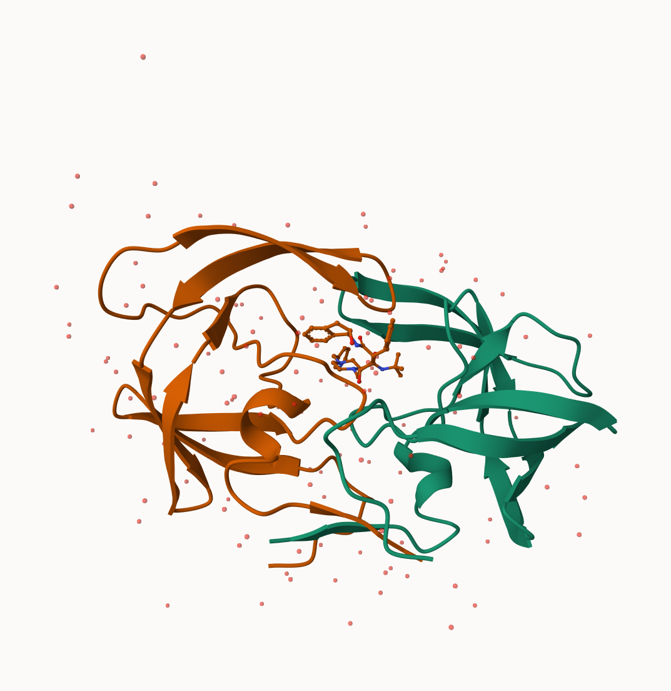
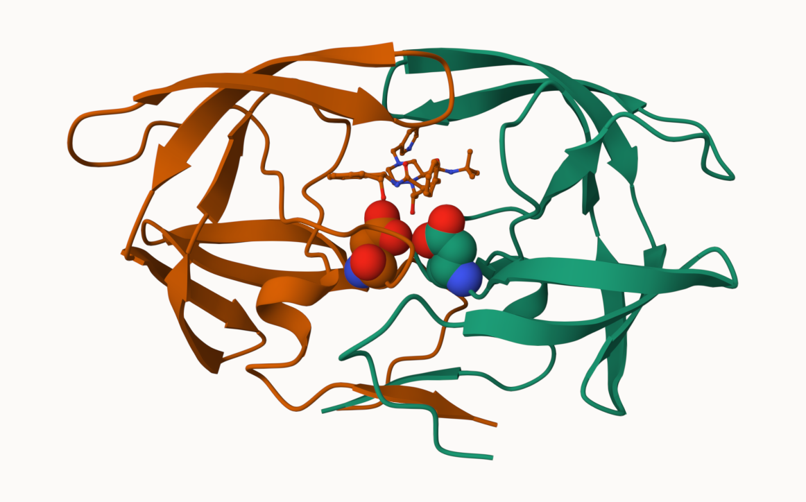
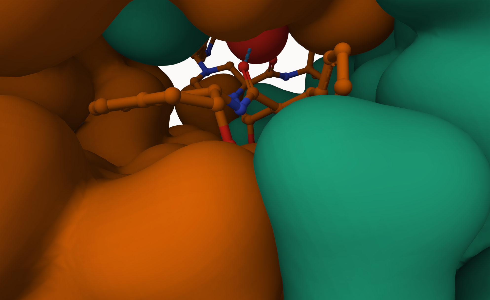
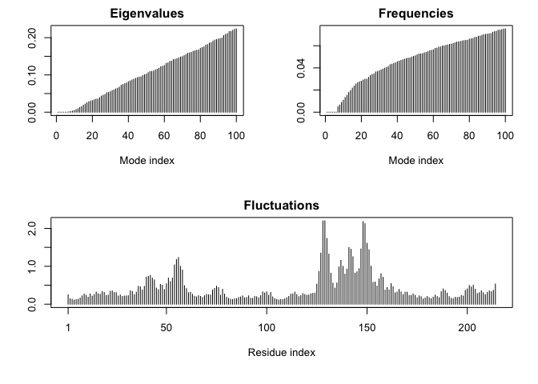

# Class 9: Structural Bioinformatics pt.1
Noel Lim (PID: A17652474)

The main database for structural data is called the PBD (Protein Data
Bank). Let’s see what it contains:

Data from: https://www.rcsb.com/stats

Read this into R

``` r
pdbdb <- read.csv("Data Export Summary.csv")
```

and answer the following questions:

> Q1: What percentage of structures in the PDB are solved by X-Ray and
> Electron Microscopy.

``` r
pdbdb$Total
```

    [1] "195,610" "12,318"  "13,720"  "4,531"   "213"     "22"     

I need to remove the comma and convert to numeric to do math:

``` r
as.numeric( sub(",","", pdbdb$Total) )
```

    [1] 195610  12318  13720   4531    213     22

I could turn this into a function to fix the whole table or any future
table I read like this:

``` r
x <- pdbdb$Total
as.numeric( sub(",","",x))
```

    [1] 195610  12318  13720   4531    213     22

``` r
comma2numeric <- function(x) {
  as.numeric( sub(",","", x))
}
```

Test it

``` r
comma2numeric(pdbdb$X.ray)
```

    [1] 167192   9639   8730   2869    170     11

``` r
apply(pdbdb, 2, comma2numeric)
```

    Warning in FUN(newX[, i], ...): NAs introduced by coercion

         Molecular.Type  X.ray    EM   NMR Multiple.methods Neutron Other  Total
    [1,]             NA 167192 15572 12529              208      77    32 195610
    [2,]             NA   9639  2635    34                8       2     0  12318
    [3,]             NA   8730  4697   286                7       0     0  13720
    [4,]             NA   2869   137  1507               14       3     1   4531
    [5,]             NA    170    10    33                0       0     0    213
    [6,]             NA     11     0     6                1       0     4     22

## Or try a different read/import function:

``` r
library(readr)
pdbdb <- read_csv("Data Export Summary.csv")
```

    Rows: 6 Columns: 8
    ── Column specification ────────────────────────────────────────────────────────
    Delimiter: ","
    chr (1): Molecular Type
    dbl (3): Multiple methods, Neutron, Other
    num (4): X-ray, EM, NMR, Total

    ℹ Use `spec()` to retrieve the full column specification for this data.
    ℹ Specify the column types or set `show_col_types = FALSE` to quiet this message.

``` r
sum(pdbdb$Total)
```

    [1] 226414

``` r
sum(pdbdb$`X-ray`)/sum(pdbdb$Total) * 100
```

    [1] 83.30359

``` r
sum(pdbdb$EM)/sum(pdbdb$Total) * 100
```

    [1] 10.18091

> Q2: What proportion of structures in the PDB are protein?

``` r
pdbdb$Total[1]/ sum(pdbdb$Total) * 100
```

    [1] 86.39483

> Q3: Type HIV in the PDB website search box on the home page and
> determine how many HIV-1 protease structures are in the current PDB?

## Mol\*

Mol\* (pronounced “molstar”) is a new web-based molecular viewer than we
will need to learn the basics of here.

https://molstar.org/viewer/

We will use PDB code: 1HSG



Some more custom images:






## The Bio3D package

The bio3d package allows us to do all sorts of structural bioinformatics
work in R.

Let’s start with how it can read these PDB files:

``` r
library(bio3d)

pdb <- read.pdb("1hsg")
```

      Note: Accessing on-line PDB file

``` r
pdb
```


     Call:  read.pdb(file = "1hsg")

       Total Models#: 1
         Total Atoms#: 1686,  XYZs#: 5058  Chains#: 2  (values: A B)

         Protein Atoms#: 1514  (residues/Calpha atoms#: 198)
         Nucleic acid Atoms#: 0  (residues/phosphate atoms#: 0)

         Non-protein/nucleic Atoms#: 172  (residues: 128)
         Non-protein/nucleic resid values: [ HOH (127), MK1 (1) ]

       Protein sequence:
          PQITLWQRPLVTIKIGGQLKEALLDTGADDTVLEEMSLPGRWKPKMIGGIGGFIKVRQYD
          QILIEICGHKAIGTVLVGPTPVNIIGRNLLTQIGCTLNFPQITLWQRPLVTIKIGGQLKE
          ALLDTGADDTVLEEMSLPGRWKPKMIGGIGGFIKVRQYDQILIEICGHKAIGTVLVGPTP
          VNIIGRNLLTQIGCTLNF

    + attr: atom, xyz, seqres, helix, sheet,
            calpha, remark, call

``` r
attributes(pdb)
```

    $names
    [1] "atom"   "xyz"    "seqres" "helix"  "sheet"  "calpha" "remark" "call"  

    $class
    [1] "pdb" "sse"

``` r
head(pdb$atom)
```

      type eleno elety  alt resid chain resno insert      x      y     z o     b
    1 ATOM     1     N <NA>   PRO     A     1   <NA> 29.361 39.686 5.862 1 38.10
    2 ATOM     2    CA <NA>   PRO     A     1   <NA> 30.307 38.663 5.319 1 40.62
    3 ATOM     3     C <NA>   PRO     A     1   <NA> 29.760 38.071 4.022 1 42.64
    4 ATOM     4     O <NA>   PRO     A     1   <NA> 28.600 38.302 3.676 1 43.40
    5 ATOM     5    CB <NA>   PRO     A     1   <NA> 30.508 37.541 6.342 1 37.87
    6 ATOM     6    CG <NA>   PRO     A     1   <NA> 29.296 37.591 7.162 1 38.40
      segid elesy charge
    1  <NA>     N   <NA>
    2  <NA>     C   <NA>
    3  <NA>     C   <NA>
    4  <NA>     O   <NA>
    5  <NA>     C   <NA>
    6  <NA>     C   <NA>

``` r
pdbseq(pdb)[25]
```

     25 
    "D" 

> Q7. How many amino acid residues are there in this pdb object?

``` r
sum(pdb$calpha)
```

    [1] 198

``` r
length(pdbseq(pdb))
```

    [1] 198

> Q8. Name one of the two non-protein residues?

HOH and MK1

> Q9. How many protein chains are in this structure?

2

``` r
unique(pdb$atom$chain)
```

    [1] "A" "B"

## Predicting functional motions of a single structure

Let’s do a bioinformatics prediction of functional motions - i.e. the
movements that one of these molecules needs to make to do its stuff

``` r
adk <- read.pdb("6s36")
```

      Note: Accessing on-line PDB file
       PDB has ALT records, taking A only, rm.alt=TRUE

``` r
adk
```


     Call:  read.pdb(file = "6s36")

       Total Models#: 1
         Total Atoms#: 1898,  XYZs#: 5694  Chains#: 1  (values: A)

         Protein Atoms#: 1654  (residues/Calpha atoms#: 214)
         Nucleic acid Atoms#: 0  (residues/phosphate atoms#: 0)

         Non-protein/nucleic Atoms#: 244  (residues: 244)
         Non-protein/nucleic resid values: [ CL (3), HOH (238), MG (2), NA (1) ]

       Protein sequence:
          MRIILLGAPGAGKGTQAQFIMEKYGIPQISTGDMLRAAVKSGSELGKQAKDIMDAGKLVT
          DELVIALVKERIAQEDCRNGFLLDGFPRTIPQADAMKEAGINVDYVLEFDVPDELIVDKI
          VGRRVHAPSGRVYHVKFNPPKVEGKDDVTGEELTTRKDDQEETVRKRLVEYHQMTAPLIG
          YYSKEAEAGNTKYAKVDGTKPVAEVRADLEKILG

    + attr: atom, xyz, seqres, helix, sheet,
            calpha, remark, call

``` r
# Perform flexibility prediction 
m <- nma(adk)
```

     Building Hessian...        Done in 0.014 seconds.
     Diagonalizing Hessian...   Done in 0.262 seconds.

``` r
plot(m)
```



Write out multi-model PDB file that we can use to make an animation of
the predicted motions.

``` r
mktrj(m, file="adk.pdb")
```

I can open this in Mol\* to play the trajectory…
