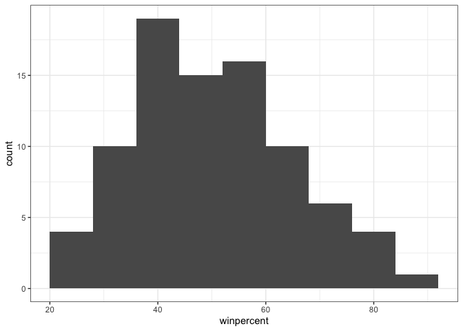
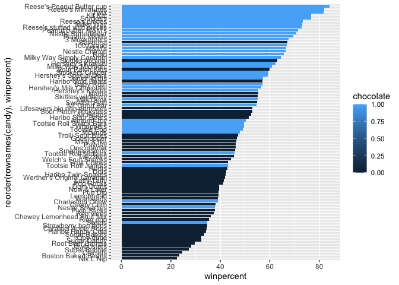

# Class 10: Halloween Candy Project
Noel Lim (PID: A17652474)

Today is Halloween, an ole Irish holiday, let’s celebrate by eating
candy.

We will explore some data all about Halloween candy from the 538
website.

``` r
candy <- read.csv("candy-data.csv", row.names = 1)
head(candy)
```

                 chocolate fruity caramel peanutyalmondy nougat crispedricewafer
    100 Grand            1      0       1              0      0                1
    3 Musketeers         1      0       0              0      1                0
    One dime             0      0       0              0      0                0
    One quarter          0      0       0              0      0                0
    Air Heads            0      1       0              0      0                0
    Almond Joy           1      0       0              1      0                0
                 hard bar pluribus sugarpercent pricepercent winpercent
    100 Grand       0   1        0        0.732        0.860   66.97173
    3 Musketeers    0   1        0        0.604        0.511   67.60294
    One dime        0   0        0        0.011        0.116   32.26109
    One quarter     0   0        0        0.011        0.511   46.11650
    Air Heads       0   0        0        0.906        0.511   52.34146
    Almond Joy      0   1        0        0.465        0.767   50.34755

> Q. How many candy entries

``` r
nrow(candy)
```

    [1] 85

> Q2. How many fruit candy types are in the dataset

``` r
sum(candy$fruity)
```

    [1] 38

``` r
sum(candy$chocolate)
```

    [1] 37

> Q3. What is your favorite candy in the dataset and what is it’s
> winpercent value?

``` r
candy["Skittles original","winpercent"]
```

    [1] 63.08514

``` r
candy["Rolo",]$winpercent
```

    [1] 65.71629

``` r
library(dplyr)
```


    Attaching package: 'dplyr'

    The following objects are masked from 'package:stats':

        filter, lag

    The following objects are masked from 'package:base':

        intersect, setdiff, setequal, union

``` r
candy |>
  filter(rownames(candy)=="Haribo Happy Cola") |>
  select(winpercent)
```

                      winpercent
    Haribo Happy Cola   34.15896

> Q. Find fruity candy with a winpercent above 50%

``` r
candy |>
  filter(winpercent > 50) |>
  filter(fruity==1)
```

                                chocolate fruity caramel peanutyalmondy nougat
    Air Heads                           0      1       0              0      0
    Haribo Gold Bears                   0      1       0              0      0
    Haribo Sour Bears                   0      1       0              0      0
    Lifesavers big ring gummies         0      1       0              0      0
    Nerds                               0      1       0              0      0
    Skittles original                   0      1       0              0      0
    Skittles wildberry                  0      1       0              0      0
    Sour Patch Kids                     0      1       0              0      0
    Sour Patch Tricksters               0      1       0              0      0
    Starburst                           0      1       0              0      0
    Swedish Fish                        0      1       0              0      0
                                crispedricewafer hard bar pluribus sugarpercent
    Air Heads                                  0    0   0        0        0.906
    Haribo Gold Bears                          0    0   0        1        0.465
    Haribo Sour Bears                          0    0   0        1        0.465
    Lifesavers big ring gummies                0    0   0        0        0.267
    Nerds                                      0    1   0        1        0.848
    Skittles original                          0    0   0        1        0.941
    Skittles wildberry                         0    0   0        1        0.941
    Sour Patch Kids                            0    0   0        1        0.069
    Sour Patch Tricksters                      0    0   0        1        0.069
    Starburst                                  0    0   0        1        0.151
    Swedish Fish                               0    0   0        1        0.604
                                pricepercent winpercent
    Air Heads                          0.511   52.34146
    Haribo Gold Bears                  0.465   57.11974
    Haribo Sour Bears                  0.465   51.41243
    Lifesavers big ring gummies        0.279   52.91139
    Nerds                              0.325   55.35405
    Skittles original                  0.220   63.08514
    Skittles wildberry                 0.220   55.10370
    Sour Patch Kids                    0.116   59.86400
    Sour Patch Tricksters              0.116   52.82595
    Starburst                          0.220   67.03763
    Swedish Fish                       0.755   54.86111

``` r
top.candy <- candy[candy$winpercent > 50,]
top.candy[top.candy$fruity==1,]
```

                                chocolate fruity caramel peanutyalmondy nougat
    Air Heads                           0      1       0              0      0
    Haribo Gold Bears                   0      1       0              0      0
    Haribo Sour Bears                   0      1       0              0      0
    Lifesavers big ring gummies         0      1       0              0      0
    Nerds                               0      1       0              0      0
    Skittles original                   0      1       0              0      0
    Skittles wildberry                  0      1       0              0      0
    Sour Patch Kids                     0      1       0              0      0
    Sour Patch Tricksters               0      1       0              0      0
    Starburst                           0      1       0              0      0
    Swedish Fish                        0      1       0              0      0
                                crispedricewafer hard bar pluribus sugarpercent
    Air Heads                                  0    0   0        0        0.906
    Haribo Gold Bears                          0    0   0        1        0.465
    Haribo Sour Bears                          0    0   0        1        0.465
    Lifesavers big ring gummies                0    0   0        0        0.267
    Nerds                                      0    1   0        1        0.848
    Skittles original                          0    0   0        1        0.941
    Skittles wildberry                         0    0   0        1        0.941
    Sour Patch Kids                            0    0   0        1        0.069
    Sour Patch Tricksters                      0    0   0        1        0.069
    Starburst                                  0    0   0        1        0.151
    Swedish Fish                               0    0   0        1        0.604
                                pricepercent winpercent
    Air Heads                          0.511   52.34146
    Haribo Gold Bears                  0.465   57.11974
    Haribo Sour Bears                  0.465   51.41243
    Lifesavers big ring gummies        0.279   52.91139
    Nerds                              0.325   55.35405
    Skittles original                  0.220   63.08514
    Skittles wildberry                 0.220   55.10370
    Sour Patch Kids                    0.116   59.86400
    Sour Patch Tricksters              0.116   52.82595
    Starburst                          0.220   67.03763
    Swedish Fish                       0.755   54.86111

To get a quick insight into a new dataset some folks like using the
skimer package and its `skim()` function.

``` r
skimr::skim(candy)
```

|                                                  |       |
|:-------------------------------------------------|:------|
| Name                                             | candy |
| Number of rows                                   | 85    |
| Number of columns                                | 12    |
| \_\_\_\_\_\_\_\_\_\_\_\_\_\_\_\_\_\_\_\_\_\_\_   |       |
| Column type frequency:                           |       |
| numeric                                          | 12    |
| \_\_\_\_\_\_\_\_\_\_\_\_\_\_\_\_\_\_\_\_\_\_\_\_ |       |
| Group variables                                  | None  |

Data summary

**Variable type: numeric**

| skim_variable | n_missing | complete_rate | mean | sd | p0 | p25 | p50 | p75 | p100 | hist |
|:---|---:|---:|---:|---:|---:|---:|---:|---:|---:|:---|
| chocolate | 0 | 1 | 0.44 | 0.50 | 0.00 | 0.00 | 0.00 | 1.00 | 1.00 | ▇▁▁▁▆ |
| fruity | 0 | 1 | 0.45 | 0.50 | 0.00 | 0.00 | 0.00 | 1.00 | 1.00 | ▇▁▁▁▆ |
| caramel | 0 | 1 | 0.16 | 0.37 | 0.00 | 0.00 | 0.00 | 0.00 | 1.00 | ▇▁▁▁▂ |
| peanutyalmondy | 0 | 1 | 0.16 | 0.37 | 0.00 | 0.00 | 0.00 | 0.00 | 1.00 | ▇▁▁▁▂ |
| nougat | 0 | 1 | 0.08 | 0.28 | 0.00 | 0.00 | 0.00 | 0.00 | 1.00 | ▇▁▁▁▁ |
| crispedricewafer | 0 | 1 | 0.08 | 0.28 | 0.00 | 0.00 | 0.00 | 0.00 | 1.00 | ▇▁▁▁▁ |
| hard | 0 | 1 | 0.18 | 0.38 | 0.00 | 0.00 | 0.00 | 0.00 | 1.00 | ▇▁▁▁▂ |
| bar | 0 | 1 | 0.25 | 0.43 | 0.00 | 0.00 | 0.00 | 0.00 | 1.00 | ▇▁▁▁▂ |
| pluribus | 0 | 1 | 0.52 | 0.50 | 0.00 | 0.00 | 1.00 | 1.00 | 1.00 | ▇▁▁▁▇ |
| sugarpercent | 0 | 1 | 0.48 | 0.28 | 0.01 | 0.22 | 0.47 | 0.73 | 0.99 | ▇▇▇▇▆ |
| pricepercent | 0 | 1 | 0.47 | 0.29 | 0.01 | 0.26 | 0.47 | 0.65 | 0.98 | ▇▇▇▇▆ |
| winpercent | 0 | 1 | 50.32 | 14.71 | 22.45 | 39.14 | 47.83 | 59.86 | 84.18 | ▃▇▆▅▂ |

Looks like the `winpercent` variable or column is measured on a
different scale than everything else! I will need to scale my data
before doing analysis like PCA etc.

> Q8. Plot a histogram of winpercent values

We can do this a few ways, e.g. the “base” R `hist()` function or with
`ggplot()`

``` r
hist(candy$winpercent, breaks=100)
```


``` r
library(ggplot2)

ggplot(candy) +
  aes(winpercent) +
  geom_histogram(binwidth = 8) +
  theme_bw()
```



> Q9. Is the distribution of winpercent values symmetrical?

No

> Q10. Is the center of the distribution above or below 50%?

``` r
summary(candy$winpercent)
```

       Min. 1st Qu.  Median    Mean 3rd Qu.    Max. 
      22.45   39.14   47.83   50.32   59.86   84.18 

> Q11. On average is chocolate candy higher or lower ranked than fruit
> candy?

``` r
fruit.candy <- candy |>
  filter(fruity==1)

summary(fruit.candy$winpercent)
```

       Min. 1st Qu.  Median    Mean 3rd Qu.    Max. 
      22.45   39.04   42.97   44.12   52.11   67.04 

``` r
#choco.candy <- candy[as.logical(candy$chocolate,]$winpercent

choc.candy <- candy |>
  filter(chocolate==1)
summary(choc.candy$winpercent)
```

       Min. 1st Qu.  Median    Mean 3rd Qu.    Max. 
      34.72   50.35   60.80   60.92   70.74   84.18 

> Q12. Is this difference statistically significant?

``` r
t.test(choc.candy$winpercent, fruit.candy$winpercent)
```


        Welch Two Sample t-test

    data:  choc.candy$winpercent and fruit.candy$winpercent
    t = 6.2582, df = 68.882, p-value = 2.871e-08
    alternative hypothesis: true difference in means is not equal to 0
    95 percent confidence interval:
     11.44563 22.15795
    sample estimates:
    mean of x mean of y 
     60.92153  44.11974 

> Q13. What are the five least liked candy types in this set?

> Q14. What are the top 5 all time favorite candy types out of this set?

``` r
play <- c("d","a","c")
sort(play)
```

    [1] "a" "c" "d"

``` r
order(play)
```

    [1] 2 3 1

``` r
play[ order(play) ]
```

    [1] "a" "c" "d"

``` r
sort(c(5,2,10), decreasing = T)
```

    [1] 10  5  2

``` r
tail( candy[order( candy$winpercent),],5)
```

                              chocolate fruity caramel peanutyalmondy nougat
    Snickers                          1      0       1              1      1
    Kit Kat                           1      0       0              0      0
    Twix                              1      0       1              0      0
    Reese's Miniatures                1      0       0              1      0
    Reese's Peanut Butter cup         1      0       0              1      0
                              crispedricewafer hard bar pluribus sugarpercent
    Snickers                                 0    0   1        0        0.546
    Kit Kat                                  1    0   1        0        0.313
    Twix                                     1    0   1        0        0.546
    Reese's Miniatures                       0    0   0        0        0.034
    Reese's Peanut Butter cup                0    0   0        0        0.720
                              pricepercent winpercent
    Snickers                         0.651   76.67378
    Kit Kat                          0.511   76.76860
    Twix                             0.906   81.64291
    Reese's Miniatures               0.279   81.86626
    Reese's Peanut Butter cup        0.651   84.18029

Let’s do a barplot of winpercent values

``` r
ggplot(candy) +
  aes(x=winpercent, 
      y=reorder(rownames(candy), winpercent),
      fill=chocolate)+
  geom_col()
```



I want a more custom color scheme where I can see both chocolate and bar
and fruity etc. all from the one plot. To do this we can roll our own
color vector…

``` r
#Place holder color vector
mycols <- rep("black", nrow(candy))
mycols[as.logical(candy$chocolate)] <- "chocolate"
mycols[as.logical(candy$bar)] <- "brown"
mycols[as.logical(candy$fruity)] <- "pink"
```

``` r
# Use blue for your favorite candy
mycols[ rownames(candy)=="Twix"] <- "blue"
mycols
```

     [1] "brown"     "brown"     "black"     "black"     "pink"      "brown"    
     [7] "brown"     "black"     "black"     "pink"      "brown"     "pink"     
    [13] "pink"      "pink"      "pink"      "pink"      "pink"      "pink"     
    [19] "pink"      "black"     "pink"      "pink"      "chocolate" "brown"    
    [25] "brown"     "brown"     "pink"      "chocolate" "brown"     "pink"     
    [31] "pink"      "pink"      "chocolate" "chocolate" "pink"      "chocolate"
    [37] "brown"     "brown"     "brown"     "brown"     "brown"     "pink"     
    [43] "brown"     "brown"     "pink"      "pink"      "brown"     "chocolate"
    [49] "black"     "pink"      "pink"      "chocolate" "chocolate" "chocolate"
    [55] "chocolate" "pink"      "chocolate" "black"     "pink"      "chocolate"
    [61] "pink"      "pink"      "chocolate" "pink"      "brown"     "brown"    
    [67] "pink"      "pink"      "pink"      "pink"      "black"     "black"    
    [73] "pink"      "pink"      "pink"      "chocolate" "chocolate" "brown"    
    [79] "pink"      "blue"      "pink"      "pink"      "pink"      "black"    
    [85] "chocolate"

``` r
ggplot(candy) +
  aes(x=winpercent, 
      y=reorder(rownames(candy), winpercent)) +
  geom_col(fill=mycols)
```


Plot of winpercent vs pricepercent to see what would be the best candy
to buy …

``` r
mycols[as.logical(candy$fruity)] <- "red"
```

``` r
ggplot(candy) +
  aes(winpercent, pricepercent) +
  geom_point(col=mycols)
```


Add labels

``` r
ggplot(candy) +
  aes(winpercent, pricepercent, label=rownames(candy)) +
  geom_point(col=mycols) +
  geom_text(col=mycols)
```


Make the labels non-overlapping

``` r
library(ggrepel)

ggplot(candy) +
  aes(winpercent, pricepercent, label=rownames(candy)) +
  geom_point(col=mycols) +
  geom_text_repel(col=mycols, max.overlaps=8)
```

    Warning: ggrepel: 37 unlabeled data points (too many overlaps). Consider
    increasing max.overlaps


> Q19. Which candy type is the highest ranked in terms of winpercent for
> the least money - i.e. offers the most bang for your buck?

Reeses Miniatures

> Q20. What are the top 5 most expensive candy types in the dataset and
> of these which is the least popular?

Nik L Nip

``` r
library(corrplot)
```

    corrplot 0.95 loaded

``` r
cij <- cor(candy)
corrplot(cij)
```


# PCA

``` r
pca <- prcomp(candy, scale=TRUE)
summary(pca)
```

    Importance of components:
                              PC1    PC2    PC3     PC4    PC5     PC6     PC7
    Standard deviation     2.0788 1.1378 1.1092 1.07533 0.9518 0.81923 0.81530
    Proportion of Variance 0.3601 0.1079 0.1025 0.09636 0.0755 0.05593 0.05539
    Cumulative Proportion  0.3601 0.4680 0.5705 0.66688 0.7424 0.79830 0.85369
                               PC8     PC9    PC10    PC11    PC12
    Standard deviation     0.74530 0.67824 0.62349 0.43974 0.39760
    Proportion of Variance 0.04629 0.03833 0.03239 0.01611 0.01317
    Cumulative Proportion  0.89998 0.93832 0.97071 0.98683 1.00000

``` r
plot(pca$x[,1],pca$x[,2], col=mycols, pch=16)
```


How do the original variables (columns) attribute to the new PCs. I will
look at PC1 here

``` r
loadings <- as.data.frame(pca$rotation)

ggplot(loadings) +
  aes(PC1, reorder(rownames(loadings), PC1), fill=PC1) +
  geom_col()
```


Let’s make a nicer score plot with ggplot. Again I need a data.frame
with all the stuff I want (PC results and candy data) for my plot as
input

``` r
pc.results <- cbind(candy,pca$x)

ggplot(pc.results) +
  aes(PC1, PC2, label=rownames(pc.results)) +
  geom_point(col=mycols) +
  geom_text_repel(col=mycols, max.overlaps = 8) +
  labs(title="Candy Space via PCA")
```

    Warning: ggrepel: 34 unlabeled data points (too many overlaps). Consider
    increasing max.overlaps


