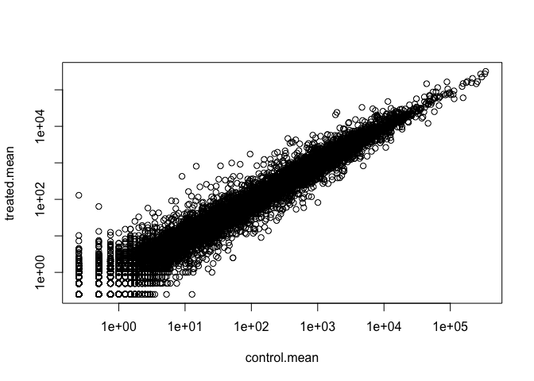

# Class 13: RNASeq with DESeq2
Noel Lim (PID: A17652474)

Today we wil analyze some RNASeq data from Himes et al. on the effects
of dexamrthasone (dex), a synthetic glucocorticoid steroid on air smooth
muscle cells (ASM).

## Data import

``` r
## Complete the missing code
counts <- read.csv("airway_scaledcounts.csv", row.names=1)
metadata <-  read.csv("airway_metadata.csv", row.names=1)
```

A wee peak

``` r
head(counts)
```

                    SRR1039508 SRR1039509 SRR1039512 SRR1039513 SRR1039516
    ENSG00000000003        723        486        904        445       1170
    ENSG00000000005          0          0          0          0          0
    ENSG00000000419        467        523        616        371        582
    ENSG00000000457        347        258        364        237        318
    ENSG00000000460         96         81         73         66        118
    ENSG00000000938          0          0          1          0          2
                    SRR1039517 SRR1039520 SRR1039521
    ENSG00000000003       1097        806        604
    ENSG00000000005          0          0          0
    ENSG00000000419        781        417        509
    ENSG00000000457        447        330        324
    ENSG00000000460         94        102         74
    ENSG00000000938          0          0          0

``` r
head(metadata)
```

                   dex celltype     geo_id
    SRR1039508 control   N61311 GSM1275862
    SRR1039509 treated   N61311 GSM1275863
    SRR1039512 control  N052611 GSM1275866
    SRR1039513 treated  N052611 GSM1275867
    SRR1039516 control  N080611 GSM1275870
    SRR1039517 treated  N080611 GSM1275871

> Q1. How many genes are in this dataset?

``` r
nrow(counts)
```

    [1] 38694

> Q2. How many ‘control’ cell lines do we have?

``` r
sum(metadata$dex == "control")
```

    [1] 4

``` r
table(metadata$dex)
```


    control treated 
          4       4 

## Toy differential expression analysis

Calculate the mean per gene count values for all “control” samples
(i.e. columns in `counts`) and do the same for “treated” and then
compare them.

1.  Find all “control” values/columns in `counts`

``` r
control.inds <- metadata$dex == "control"
control.counts <- counts[,control.inds]
```

2.  Find the mean per gene across all control columns.

``` r
control.mean <- apply(control.counts, 1, mean)
```

3.  Do the same steps to find the `treated.mean` values

``` r
treated.inds <- metadata$dex == "treated"
treated.counts <- counts[,treated.inds]
treated.mean <- apply(treated.counts, 1, mean)
plot(treated.mean, control.mean)
```


``` r
meancounts <- data.frame(control.mean, treated.mean)
```

``` r
plot(meancounts)
```


``` r
plot(meancounts, log="xy")
```

    Warning in xy.coords(x, y, xlabel, ylabel, log): 15032 x values <= 0 omitted
    from logarithmic plot

    Warning in xy.coords(x, y, xlabel, ylabel, log): 15281 y values <= 0 omitted
    from logarithmic plot



We most frequently use log2 transformations for this type of data.

``` r
log2(10/10)
```

    [1] 0

``` r
log2(20/10)
```

    [1] 1

``` r
log2(10/20)
```

    [1] -1

These log2 values make the interpretation of “fold-change” a little
easier and a rule-of-thumb in the filed is a log2 fold-change of 2+ or
-2 is where we start to pay attention.

``` r
log2(40/10)
```

    [1] 2

Let’s calculate the log2 (fold-change) and add it to our `meancounts`
data.frame.

``` r
meancounts$log2fc <- log2(meancounts$treated.mean/meancounts$control.mean)
head(meancounts)
```

                    control.mean treated.mean      log2fc
    ENSG00000000003       900.75       658.00 -0.45303916
    ENSG00000000005         0.00         0.00         NaN
    ENSG00000000419       520.50       546.00  0.06900279
    ENSG00000000457       339.75       316.50 -0.10226805
    ENSG00000000460        97.25        78.75 -0.30441833
    ENSG00000000938         0.75         0.00        -Inf

``` r
to.rm <- rowSums(meancounts[,1:2]==0) > 0
mycounts <- meancounts[!to.rm,]
```

> Q. How many genes do I have left after this zero count filtering?

``` r
nrow(mycounts)
```

    [1] 21817

> Q. How many genes are “up” regulated upon drug treatment at a
> threshold of +2 log2-fold-change?

1.  I need to extract the log2fc values
2.  I need to find those that are above +2
3.  Count them

``` r
sum(mycounts$log2fc > 2)
```

    [1] 250

> Q. How many genes are “down” regulated upon drug treatment at a
> threshold of -2 log2-fc??

``` r
sum(mycounts$log2fc < -2)
```

    [1] 367

Wow hold on we are missing the stats here. Is the difference in the mean
counts significant???

Let’s do this analysis the right way with stats and use the **DESeq2**
package

## DESeq analysis

``` r
library(DESeq2)
```

    Warning: package 'GenomeInfoDb' was built under R version 4.4.2

The first function that we will use will setup the data in the way
(format) DESeq wants it.

``` r
dds <- DESeqDataSetFromMatrix(countData = counts,
                       colData = metadata,
                       design = ~dex)
```

    converting counts to integer mode

    Warning in DESeqDataSet(se, design = design, ignoreRank): some variables in
    design formula are characters, converting to factors

The main function in the package is called `DESeq()` and we can run it
on our `dds` object

``` r
dds <- DESeq(dds)
```

    estimating size factors

    estimating dispersions

    gene-wise dispersion estimates

    mean-dispersion relationship

    final dispersion estimates

    fitting model and testing

I will get the results from dds with the `results()` function:

``` r
res <- results(dds)
head(res)
```

    log2 fold change (MLE): dex treated vs control 
    Wald test p-value: dex treated vs control 
    DataFrame with 6 rows and 6 columns
                      baseMean log2FoldChange     lfcSE      stat    pvalue
                     <numeric>      <numeric> <numeric> <numeric> <numeric>
    ENSG00000000003 747.194195     -0.3507030  0.168246 -2.084470 0.0371175
    ENSG00000000005   0.000000             NA        NA        NA        NA
    ENSG00000000419 520.134160      0.2061078  0.101059  2.039475 0.0414026
    ENSG00000000457 322.664844      0.0245269  0.145145  0.168982 0.8658106
    ENSG00000000460  87.682625     -0.1471420  0.257007 -0.572521 0.5669691
    ENSG00000000938   0.319167     -1.7322890  3.493601 -0.495846 0.6200029
                         padj
                    <numeric>
    ENSG00000000003  0.163035
    ENSG00000000005        NA
    ENSG00000000419  0.176032
    ENSG00000000457  0.961694
    ENSG00000000460  0.815849
    ENSG00000000938        NA

Make a common overall results figure from this analysis. This is
designed to keep our iner biologist and inner stats nerd happy - it
plots fold-change vs P-value

``` r
plot(res$log2FoldChange, -log(res$padj))
abline(v=c(-2,2), col="gray")
abline(h=-log(0.005), col="gray")
```


Add some color to this plot:

``` r
mycols <- rep("gray", nrow(res))
mycols[res$log2FoldChange > 2] <- "red"
mycols[res$log2FoldChange < -2] <- "red"
mycols[res$padj > 0.005] <- "gray"

plot(res$log2FoldChange, -log(res$padj), col=mycols)
abline(v=c(-2,2), col="gray")
abline(h=-log(0.005), col="gray")
```


I want to save my results to date out to disc

``` r
write.csv(res, file="myresults.csv")
```

We will pick this up next day and add **annotation** (i.e. what are
these genes of interest) and do **pathway analysis** (what biology) are
they known to be involved with.

I need to translate our gene identifiers “ENSG0000…” into gene names
that the rest of the world can understand.

To fo this “annotation” I will use the “AnnotationDbi” package. I can
install this with `BiocManager::install()`

``` r
library(AnnotationDbi)
library(org.Hs.eg.db)
```

``` r
columns(org.Hs.eg.db)
```

     [1] "ACCNUM"       "ALIAS"        "ENSEMBL"      "ENSEMBLPROT"  "ENSEMBLTRANS"
     [6] "ENTREZID"     "ENZYME"       "EVIDENCE"     "EVIDENCEALL"  "GENENAME"    
    [11] "GENETYPE"     "GO"           "GOALL"        "IPI"          "MAP"         
    [16] "OMIM"         "ONTOLOGY"     "ONTOLOGYALL"  "PATH"         "PFAM"        
    [21] "PMID"         "PROSITE"      "REFSEQ"       "SYMBOL"       "UCSCKG"      
    [26] "UNIPROT"     

I will use `mapIds()` function to “map” my identifiers to those from
different databases. I will go between “ENSEMBL” and “SYMBOL” (and then
after “GENENAME”).

``` r
res$symbol <- mapIds(org.Hs.eg.db,
       keys = rownames(res),
       keytype = "ENSEMBL",
       column = "SYMBOL")
```

    'select()' returned 1:many mapping between keys and columns

``` r
#head(res)
```

Add “GENENAME”

``` r
res$genename <- mapIds(org.Hs.eg.db,
       keys = row.names(res),
       keytype = "ENSEMBL",
       column = "GENENAME")
```

    'select()' returned 1:many mapping between keys and columns

Add “ENTREZID”

``` r
res$entrez <- mapIds(org.Hs.eg.db,
       keys = rownames(res),
       keytype = "ENSEMBL",
       column = "ENTREZID")
```

    'select()' returned 1:many mapping between keys and columns

Save our annotated results object.

``` r
write.csv(res, file="resutls_annotated.csv")
```

## Pathway Analysis

Now that we have our results with added annotation we can do some
pathway mapping.

Let’s use the *gage* package to look for KEGG pathways in our results
(genes of interest). I will also use the *pathview* package

``` r
library(pathview)
```

    Warning: package 'pathview' was built under R version 4.4.2

``` r
library(gage)
library(gageData)

data(kegg.sets.hs)
```

What **gage** wants as input is not my big table/data.frame of results.
It just wants a “vector of importance”. For RNASeq data like we have
this is our log2FC values…

``` r
foldchanges = res$log2FoldChange
names(foldchanges) = res$entrez
head(foldchanges)
```

           7105       64102        8813       57147       55732        2268 
    -0.35070302          NA  0.20610777  0.02452695 -0.14714205 -1.73228897 

Now let’s run the gage pathway analysis.

``` r
# Get the results
keggres = gage(foldchanges, gsets=kegg.sets.hs)
```

What is in this `keggres` object?

``` r
attributes(keggres)
```

    $names
    [1] "greater" "less"    "stats"  

``` r
head(keggres$les, 3)
```

                                          p.geomean stat.mean        p.val
    hsa05332 Graft-versus-host disease 0.0004250461 -3.473346 0.0004250461
    hsa04940 Type I diabetes mellitus  0.0017820293 -3.002352 0.0017820293
    hsa05310 Asthma                    0.0020045888 -3.009050 0.0020045888
                                            q.val set.size         exp1
    hsa05332 Graft-versus-host disease 0.09053483       40 0.0004250461
    hsa04940 Type I diabetes mellitus  0.14232581       42 0.0017820293
    hsa05310 Asthma                    0.14232581       29 0.0020045888

Let’s use the pathview package to look at one of these highlighted KEGG
pathways with our genes highighted. “hsa05310 Asthma”

``` r
pathview(gene.data=foldchanges, pathway.id="hsa05310")
```

    'select()' returned 1:1 mapping between keys and columns

    Info: Working in directory /Users/noellim/Desktop/BIMM143/bimm143/class13

    Info: Writing image file hsa05310.pathview.png


