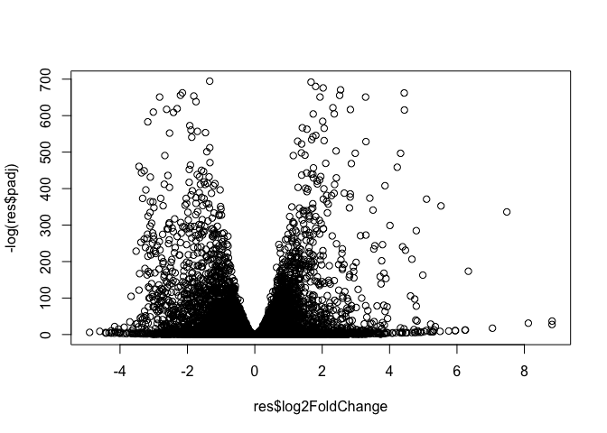
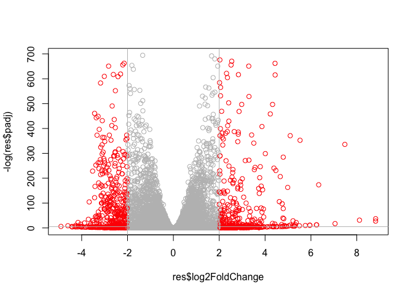

# Class 14
Noel Lim (PID: A177652474)

## Background

Today we will complete an RNASeq analysis from counts to pathways.

We will work with data on differential analysis of lung fibroblasts in
response to loss of the developmental transcription factor HOXA1.

## Data Import

``` r
counts <- read.csv("GSE37704_featurecounts.csv", row.names = 1)
metadata <- read.csv("GSE37704_metadata.csv")
```

A wee peak

``` r
head(metadata)
```

             id     condition
    1 SRR493366 control_sirna
    2 SRR493367 control_sirna
    3 SRR493368 control_sirna
    4 SRR493369      hoxa1_kd
    5 SRR493370      hoxa1_kd
    6 SRR493371      hoxa1_kd

Check correspondence of the columns of `counts` and the rows of
`metadata`

``` r
colnames(counts)
```

    [1] "length"    "SRR493366" "SRR493367" "SRR493368" "SRR493369" "SRR493370"
    [7] "SRR493371"

``` r
metadata$id
```

    [1] "SRR493366" "SRR493367" "SRR493368" "SRR493369" "SRR493370" "SRR493371"

We need to remove the first “length” column from our `counts`

``` r
countData <- counts[,-1]
colnames(countData) == metadata$id
```

    [1] TRUE TRUE TRUE TRUE TRUE TRUE

> Q. How many genes do we have?

``` r
nrow(countData)
```

    [1] 19808

## DESeq Setup

``` r
library(DESeq2)
```

    Warning: package 'GenomeInfoDb' was built under R version 4.4.2

``` r
dds <- DESeqDataSetFromMatrix(countData = countData,
                              colData = metadata,
                              design = ~condition)
```

    Warning in DESeqDataSet(se, design = design, ignoreRank): some variables in
    design formula are characters, converting to factors

## DESeq Analysis

``` r
dds <- DESeq(dds)
```

    estimating size factors

    estimating dispersions

    gene-wise dispersion estimates

    mean-dispersion relationship

    final dispersion estimates

    fitting model and testing

``` r
res <- results(dds)
```

And a wee peak:

``` r
head(res)
```

    log2 fold change (MLE): condition hoxa1 kd vs control sirna 
    Wald test p-value: condition hoxa1 kd vs control sirna 
    DataFrame with 6 rows and 6 columns
                     baseMean log2FoldChange     lfcSE      stat     pvalue
                    <numeric>      <numeric> <numeric> <numeric>  <numeric>
    ENSG00000186092    0.0000             NA        NA        NA         NA
    ENSG00000279928    0.0000             NA        NA        NA         NA
    ENSG00000279457   29.9136       0.179257  0.324822  0.551863 0.58104205
    ENSG00000278566    0.0000             NA        NA        NA         NA
    ENSG00000273547    0.0000             NA        NA        NA         NA
    ENSG00000187634  183.2296       0.426457  0.140266  3.040350 0.00236304
                          padj
                     <numeric>
    ENSG00000186092         NA
    ENSG00000279928         NA
    ENSG00000279457 0.68707978
    ENSG00000278566         NA
    ENSG00000273547         NA
    ENSG00000187634 0.00516278

## Result visualization

``` r
plot(res$log2FoldChange, -log(res$padj))
```



Add some color

``` r
mycols <- rep("gray", nrow(res))
mycols[abs(res$log2FoldChange) > 2] <- "red"
res$padj
```

        [1]            NA            NA  6.870798e-01            NA            NA
        [6]  5.162780e-03  1.767405e-35  1.135361e-07  9.189880e-01  4.038172e-01
       [11]  1.306799e-24  2.377101e-02  4.224207e-16            NA  2.620293e-01
       [16]            NA  9.263552e-01  5.093091e-01  7.096740e-15  4.506618e-08
       [21]  7.831890e-01  4.934895e-11  2.241538e-02  2.531300e-17  6.034169e-01
       [26]  8.440015e-03  8.051563e-02  9.570854e-01  4.758183e-02  6.458779e-34
       [31]  2.112304e-01  7.233194e-15  1.821069e-01  9.787947e-01            NA
       [36]  4.593889e-01  8.208258e-01  3.407502e-15  1.624522e-15  1.453461e-01
       [41]  4.604894e-01            NA  3.217975e-02  3.628198e-08  9.804102e-01
       [46]  5.204827e-01  3.808280e-52  5.387470e-01  2.047387e-05  8.807070e-01
       [51]  3.469966e-01  4.057274e-01  7.342469e-01            NA            NA
       [56]  1.334982e-01  3.266467e-03  2.607059e-33  8.223975e-01  2.274243e-01
       [61]  9.541892e-02  1.462157e-01  3.824752e-01            NA  3.134201e-03
       [66]  1.702813e-40            NA  4.185516e-01            NA  7.786202e-01
       [71]  4.986978e-01  1.467843e-01  6.231008e-09  4.122543e-01  5.957256e-01
       [76]  6.576724e-01  5.807979e-01  6.567136e-09  3.971421e-07  1.067803e-01
       [81]  5.833344e-01  9.526032e-01  3.153415e-09  6.792663e-02  1.878327e-01
       [86]  3.869603e-01  6.621840e-02  9.889161e-15            NA  9.607843e-01
       [91]  4.257034e-08  4.199498e-02  6.820140e-01  5.396295e-06  1.670917e-17
       [96]  1.311798e-09            NA  1.895190e-01  2.063000e-34  4.867127e-01
      [101]  1.324864e-02  3.191167e-13  5.333184e-01  4.025694e-37  2.841786e-01
      [106]            NA  1.539513e-01  4.297198e-11  7.399077e-12  7.745598e-01
      [111]  5.693881e-32 2.373404e-302            NA            NA  5.436087e-01
      [116]  3.383025e-08  2.126355e-15  5.236400e-03  6.689790e-01  3.813590e-01
      [121]  6.008099e-12  9.953218e-03            NA  4.903184e-02  5.304295e-18
      [126]  2.848786e-02            NA  5.609334e-44  2.093054e-03  1.270972e-02
      [131]  8.948933e-01  9.993888e-01  8.196012e-01  1.090649e-02  1.060117e-01
      [136]  3.762325e-01            NA  1.186661e-05            NA  4.707937e-01
      [141] 1.089642e-117  4.508842e-02  8.488222e-01  5.962498e-01  8.643065e-03
      [146]  1.819199e-01  4.089297e-05  8.672361e-01  4.012259e-01  8.057864e-03
      [151]  1.020875e-05  1.658641e-07            NA  1.541345e-02  1.402273e-11
      [156]  2.234007e-01  6.494492e-01  2.524614e-01  6.129245e-02  1.509684e-05
      [161]  1.506150e-04  1.571020e-01  3.911529e-09  7.690788e-05  2.748500e-31
      [166]            NA            NA            NA            NA            NA
      [171]            NA  4.836419e-01            NA            NA            NA
      [176]            NA            NA            NA            NA            NA
      [181]            NA            NA  9.176275e-01            NA            NA
      [186]            NA            NA            NA            NA            NA
      [191]            NA            NA            NA  3.545925e-03  1.089325e-05
      [196]  9.605156e-07  1.076001e-38  8.952305e-01  4.489920e-84            NA
      [201]            NA            NA  3.062120e-01  1.515112e-13  7.198792e-01
      [206]  6.050343e-33            NA  4.150425e-05  4.571542e-01            NA
      [211]  3.942158e-02  8.313343e-01  1.587461e-01  4.025242e-01            NA
      [216]  1.222574e-06            NA  3.774039e-01  8.047678e-01  3.197945e-21
      [221]  8.281047e-01  4.452376e-02  8.501475e-01  3.488746e-36            NA
      [226]  3.372393e-01            NA  1.171270e-01            NA            NA
      [231]  3.124460e-05  4.245990e-61  2.885848e-03  1.043935e-27            NA
      [236]  3.072383e-01            NA            NA            NA            NA
      [241]  9.780282e-43  2.743664e-05  7.769109e-01            NA            NA
      [246]            NA            NA            NA  1.353331e-02  9.726082e-01
      [251]  9.518921e-01  5.062416e-23  3.238720e-16  8.973905e-01  8.458354e-01
      [256]  5.188330e-08  1.601698e-08  1.029824e-01            NA  8.861223e-04
      [261]            NA  2.009433e-04            NA  8.401834e-01            NA
      [266]            NA  7.840032e-01            NA            NA            NA
      [271]            NA            NA  4.097108e-05  5.176789e-01  6.074595e-01
      [276]  3.547765e-07  2.050576e-07  1.372384e-05  1.608212e-08  1.098044e-17
      [281]  4.576042e-02  5.704506e-35  1.339877e-06  8.981343e-01  2.964036e-02
      [286]  3.569868e-02  4.049921e-01  8.963700e-01  1.032604e-28            NA
      [291]            NA  9.571937e-01  2.326982e-01  9.599702e-10            NA
      [296]            NA            NA            NA  7.227674e-02            NA
      [301]            NA  1.884753e-08  2.572121e-03  1.527441e-01  2.357131e-80
      [306]  1.358551e-02  2.026779e-06  8.828381e-01  1.541760e-02  4.565115e-34
      [311]  2.381283e-01  2.835519e-32  1.048824e-16  1.414059e-02  1.732301e-51
      [316]  8.060842e-03  7.913844e-10  1.189581e-10            NA  1.759094e-37
      [321]  4.796031e-05  6.334318e-01            NA            NA  8.228295e-01
      [326]  7.379409e-21  9.914949e-06  2.765940e-04            NA  9.324399e-15
      [331]  4.022588e-11  7.245581e-04  5.026173e-19  4.136579e-03  1.263802e-01
      [336]  1.436257e-30  7.122820e-01  7.648857e-06  5.246546e-01  1.030703e-08
      [341]  2.210253e-15            NA  9.964276e-01  2.738856e-05  8.140243e-03
      [346]  1.435438e-19  1.031054e-03  4.586599e-25            NA            NA
      [351]  6.726980e-01            NA  2.717219e-01  4.997937e-01            NA
      [356]  5.341169e-16  1.455920e-02  5.625290e-01  6.552247e-01            NA
      [361]            NA            NA  6.718480e-20  6.100376e-20  4.806696e-04
      [366]  1.403981e-04  2.263975e-02  5.419298e-08            NA  4.723432e-01
      [371]  1.117719e-02  1.532931e-10            NA            NA  5.303725e-02
      [376]  5.716467e-12            NA  7.480172e-01  1.073213e-36  1.177801e-04
      [381]  9.176275e-01  6.309806e-03  1.422852e-01            NA  7.666153e-03
      [386]  1.143308e-14  4.702703e-08            NA  2.030189e-01  7.034376e-01
      [391]  7.717468e-02  6.786195e-15            NA  4.337044e-03  5.715495e-03
      [396]            NA  5.457432e-04  3.158291e-03  7.079010e-01  4.028741e-07
      [401]  2.903278e-01  4.075029e-01  1.728069e-03  4.857642e-08  6.671364e-01
      [406]  1.542525e-01  1.256728e-02  4.481451e-01  3.932445e-06  5.137494e-14
      [411]  5.924896e-01  2.956346e-26  1.043116e-05  2.430851e-02  2.326982e-01
      [416]  3.203875e-19  8.094690e-01  6.068859e-01  8.262060e-07  1.720491e-04
      [421]  6.168722e-02  1.182735e-05  4.902999e-02  4.981586e-01  1.678743e-07
      [426]  3.386710e-01  5.104912e-01  1.935635e-09  5.999562e-44  5.362306e-02
      [431]  6.521536e-94  6.138563e-01  8.737522e-04  2.285570e-01  2.398077e-12
      [436]  8.161337e-08  7.799195e-01  9.210255e-02  5.912819e-01  7.597123e-02
      [441]  2.790477e-53  6.624370e-01            NA  1.592990e-02  1.299787e-54
      [446]  9.095449e-01  2.519328e-02  4.864981e-13            NA            NA
      [451]  1.007995e-01  5.512451e-03  2.017460e-33 5.853620e-100  9.633886e-37
      [456]  2.151956e-72  4.700855e-02  6.184668e-01  8.812577e-01  1.769143e-04
      [461]  2.168302e-05  1.262075e-18  1.114390e-01  5.887187e-02  1.553550e-01
      [466]  9.645463e-01  2.012999e-13  9.130779e-01  8.409605e-01            NA
      [471]            NA  1.892837e-02  4.999903e-01            NA            NA
      [476]            NA  2.889936e-01            NA  5.482314e-01  9.338780e-02
      [481]  8.253192e-02  1.599587e-05  2.642323e-04  1.386911e-18  8.017287e-11
      [486]  3.199905e-01  5.313728e-01  3.897513e-04  2.495117e-34  8.091637e-07
      [491]  8.934898e-02  1.952739e-01  2.621223e-01  7.114485e-01  7.598578e-04
      [496]  8.320686e-01  5.074129e-01  8.346473e-01  1.181473e-02  9.152829e-19
      [501]  1.451761e-38  2.959611e-01  3.657898e-03  7.762860e-01            NA
      [506]            NA  3.789721e-33  2.647177e-06  6.662398e-03  2.151300e-01
      [511]  2.568131e-02            NA  6.362885e-01 4.169346e-115            NA
      [516]  7.093589e-02  7.758526e-08  5.283572e-05  8.242467e-17  3.516092e-03
      [521]  1.279733e-06  4.809221e-19  9.829455e-01  1.659956e-01  5.489250e-12
      [526]  1.408519e-14            NA            NA  3.716079e-02 6.940413e-157
      [531]  1.877729e-06  1.623295e-01  5.334566e-01  8.370954e-32  9.093089e-04
      [536]            NA            NA  8.709498e-03  9.271919e-01            NA
      [541]  2.362381e-05  4.594925e-01  1.266142e-04  9.788830e-20  1.556280e-04
      [546]  1.344879e-01            NA  8.904162e-01  9.561975e-01  1.165609e-01
      [551]  3.104404e-08  3.712682e-02  3.773170e-01  7.159989e-01  5.600791e-01
      [556]  5.996390e-01  9.470830e-01  7.080923e-24  3.904310e-02  3.614993e-01
      [561]  1.135479e-02            NA            NA  4.550233e-12            NA
      [566]            NA  9.623470e-02            NA  6.599872e-01  1.373054e-03
      [571]  9.401989e-01  3.484171e-04  4.517213e-22            NA  1.258874e-33
      [576]  3.808511e-01  1.224880e-11  8.107340e-01  8.044122e-01  2.083366e-57
      [581]  6.851526e-01  4.884014e-26  7.966918e-01            NA            NA
      [586]  4.656603e-03            NA 6.976109e-173  4.809755e-07  3.362103e-09
      [591]  5.715817e-01  1.860790e-01  3.713102e-47  6.634480e-01  4.764286e-05
      [596]  7.259287e-01  9.401989e-01  1.279586e-07  1.625260e-32  1.270900e-20
      [601]  1.272911e-01  4.689621e-10  2.769748e-01  5.675009e-01  8.851223e-01
      [606]  9.820334e-03  7.609323e-01  5.321915e-01  2.435051e-99  3.419369e-21
      [611]  8.043328e-01  1.960878e-14  5.552358e-03  8.877252e-13  2.914271e-08
      [616]  1.050847e-01  1.557781e-17  5.935444e-03  2.300732e-08  4.780853e-01
      [621]  8.813824e-01  6.851526e-01  6.861618e-11  5.313005e-01  5.184538e-06
      [626]  1.920697e-09  1.573530e-01  9.987419e-06  1.388089e-01  1.026508e-08
      [631]  2.516654e-04  1.210335e-03  1.235267e-25  5.641611e-20            NA
      [636]  2.677885e-01            NA  3.279238e-02  1.330363e-01  1.746997e-18
      [641]  3.796647e-01  1.454669e-01  4.434569e-04  4.131929e-01            NA
      [646]            NA  1.958367e-01  5.520955e-01  7.478675e-03  7.590817e-01
      [651]  5.229302e-24            NA            NA            NA            NA
      [656]            NA            NA            NA  6.046455e-34  2.974064e-01
      [661]  9.098639e-01  6.110244e-01  3.078408e-01            NA  2.188949e-01
      [666]  1.787218e-05            NA  6.704816e-01            NA            NA
      [671]  1.905243e-04  2.220470e-41            NA  6.703076e-15  8.039916e-01
      [676] 8.838262e-129  2.739635e-02  9.070246e-01  1.274694e-04  6.802609e-03
      [681]  1.045388e-02  5.720654e-01  3.622151e-02  3.104173e-02  2.325294e-20
      [686]  3.555718e-01  7.316770e-01  5.513467e-01            NA  6.042234e-37
      [691]  1.199004e-01  5.808904e-03  5.681266e-01  2.814114e-02            NA
      [696]  4.378418e-02  3.016367e-01  4.123876e-04  3.186971e-03  3.762092e-02
      [701]  6.906630e-04            NA  5.734803e-01  1.120753e-58  1.728814e-03
      [706]  9.216281e-01  8.854427e-02  6.155632e-06            NA  2.090057e-70
      [711]  1.687623e-01            NA            NA  1.866306e-02  2.240629e-11
      [716]  2.560264e-01  7.234305e-03  8.345701e-01            NA            NA
      [721]  1.643234e-02  4.050591e-02            NA            NA  2.031850e-95
      [726]            NA            NA  3.497634e-01  2.398694e-05  1.894567e-66
      [731]  9.758981e-03  8.174591e-01            NA            NA  8.344414e-04
      [736]  7.862226e-01  4.482228e-01  1.299671e-04  5.245623e-06  9.480886e-01
      [741]            NA  4.986978e-01            NA  4.854448e-08  9.365920e-05
      [746]  3.146303e-05            NA            NA  7.718828e-21  1.379192e-04
      [751]  4.572777e-01  3.623832e-01            NA  2.735776e-03  2.117579e-08
      [756]  7.463849e-01  7.428573e-15  2.184051e-35            NA  8.665242e-01
      [761]  2.425388e-04  3.781559e-06  1.177423e-16  9.949815e-01  3.300606e-23
      [766]  9.231793e-01  1.310165e-12  2.261756e-56  3.481269e-01            NA
      [771]  2.265170e-03  3.744809e-20  3.186415e-06            NA            NA
      [776]            NA  9.657663e-14  4.416136e-10  2.225202e-48  3.338008e-03
      [781] 1.220402e-191  1.165609e-01 2.203373e-111  6.661356e-01  6.332548e-01
      [786]  3.818510e-02  5.604240e-02  8.524021e-01            NA  1.537393e-01
      [791]            NA  1.113799e-03  3.053103e-17  3.532900e-01  1.607813e-03
      [796]  4.479495e-01            NA            NA            NA  9.665600e-10
      [801]  3.568748e-02            NA  7.590817e-01  1.596732e-03  6.017292e-01
      [806]  5.094685e-01            NA  8.892630e-01  5.371851e-07  3.854868e-02
      [811]  5.685479e-06  5.390212e-02  9.902242e-19  3.464489e-08  2.050833e-02
      [816]  1.335777e-08  2.273820e-27  1.456188e-02  4.188055e-13  3.614389e-02
      [821]  8.258933e-02  5.439421e-30  1.941252e-30  7.902359e-04  2.524391e-04
      [826]  9.029451e-01            NA  1.076980e-07  8.311431e-12  4.352123e-02
      [831]  2.013529e-62  2.809937e-29  8.171784e-01  9.906372e-07  2.210938e-01
      [836]  1.198491e-03  3.912161e-02  8.463784e-05  2.031035e-19  6.048353e-21
      [841]  4.727524e-01  2.191378e-05  2.970534e-03  6.592531e-15            NA
      [846]            NA  2.383625e-05  3.646665e-02  2.556335e-01            NA
      [851]  8.769093e-25  9.872999e-44  1.669878e-06  1.899569e-02  6.859888e-05
      [856]  7.811589e-01 3.275639e-110  6.143447e-25            NA  9.301545e-02
      [861]            NA            NA  5.573608e-02  8.756377e-67            NA
      [866]  1.900896e-10  8.945801e-01            NA  1.566505e-11  9.185957e-01
      [871]  8.087767e-10  7.743568e-21            NA  2.247167e-09  1.424629e-01
      [876]  8.698340e-01  7.736628e-04            NA  5.140268e-02  9.157943e-01
      [881]  5.491810e-01  3.299627e-18  2.378174e-06  4.867127e-01  1.647426e-12
      [886]  3.213451e-05  5.750181e-10  6.631665e-08  6.106741e-01  8.952271e-06
      [891]  3.801686e-08  9.020756e-23  8.239986e-01 2.380663e-121  5.385308e-01
      [896]  2.231492e-05  1.439393e-01  0.000000e+00  3.269430e-02  5.931742e-01
      [901]  5.527058e-01  8.844503e-01  9.661242e-08  3.899182e-08  7.143607e-09
      [906]  2.261090e-02  9.824639e-09  5.256817e-01  1.852004e-05  7.076587e-01
      [911]  1.154135e-06  1.171790e-17  7.276056e-05  3.767752e-04  6.055219e-01
      [916]  5.024517e-14  3.460042e-01  2.116775e-03  5.445356e-01  5.208498e-13
      [921]  7.268637e-03  4.114618e-01  5.183795e-01  1.279641e-02            NA
      [926]  1.755498e-01  1.819800e-01  1.864054e-01            NA            NA
      [931]            NA            NA  6.394696e-01  4.252828e-09  6.697582e-02
      [936]  1.507099e-04            NA            NA  8.888154e-11  8.698915e-01
      [941]  5.483432e-02  9.664678e-01  9.550039e-02  3.170639e-01            NA
      [946]  1.996648e-26  5.475881e-03  1.778834e-20  2.131909e-02  1.623009e-03
      [951]  4.372002e-01  4.051215e-02  5.310414e-54  5.661366e-01  7.672330e-38
      [956]  5.438353e-01  4.579143e-23  2.510913e-01  2.627542e-04  8.163958e-01
      [961]  4.528964e-02  1.007677e-08  2.960081e-01  3.292631e-08            NA
      [966]  8.916365e-01  7.182391e-01  1.767690e-05            NA  4.882603e-01
      [971]  8.251650e-01            NA  1.079063e-02  9.834054e-01  7.028522e-01
      [976]            NA            NA  9.473544e-01  2.718651e-01  1.413007e-01
      [981]  3.845059e-01  2.354699e-11            NA            NA  5.959941e-01
      [986]  2.997827e-02            NA  5.600791e-01  1.898141e-02  6.104115e-01
      [991]  4.378418e-02  6.051431e-01            NA  7.999925e-03  1.970701e-02
      [996]  2.504208e-07  3.921434e-01  8.251650e-01            NA            NA
     [1001]  1.943127e-01  4.387613e-03  9.308000e-02  3.566176e-02  5.404581e-54
     [1006]  9.577674e-01  9.986154e-02  1.937997e-04  3.358838e-95  6.663281e-19
     [1011]            NA  4.478140e-02  2.013842e-02  3.083012e-02  8.047778e-01
     [1016]  1.683658e-06  1.063777e-17  5.802831e-06  9.405940e-01  7.342469e-01
     [1021]  2.765666e-02  7.418990e-07  2.617282e-04  1.229591e-01            NA
     [1026]  7.030814e-05  1.271125e-05  1.508900e-03            NA  9.684008e-01
     [1031]  2.427913e-01  1.362182e-05            NA            NA  5.767389e-01
     [1036]  1.970486e-06  2.715460e-35            NA            NA  3.865671e-01
     [1041]            NA  6.599420e-15  3.034612e-02  9.103320e-01            NA
     [1046]  1.835444e-14            NA  4.543780e-20  3.189061e-02            NA
     [1051]  2.134321e-12  0.000000e+00  2.793106e-16  2.764676e-01  7.356149e-01
     [1056]            NA  7.206228e-01            NA            NA            NA
     [1061]  1.138741e-66  2.439326e-51            NA            NA            NA
     [1066] 2.317554e-188  6.206916e-01  1.491000e-01  1.075347e-02            NA
     [1071]  1.351445e-01            NA  2.628573e-05  1.511959e-03            NA
     [1076]  5.343300e-03            NA  2.378169e-04            NA  2.407976e-01
     [1081]  3.242212e-02  9.410793e-01            NA  5.447334e-01  7.945032e-01
     [1086]  1.023265e-02  9.598800e-01  4.094208e-01  4.500492e-02  4.580559e-01
     [1091]  1.238408e-02  1.272990e-04  4.143982e-03  2.525759e-02  2.670727e-02
     [1096]            NA  1.740645e-20  3.487960e-05  6.569955e-01  1.306924e-03
     [1101]            NA  1.753319e-01            NA  2.052054e-04            NA
     [1106]  3.748622e-02  4.541635e-18  5.961417e-01  1.237803e-12  1.400290e-01
     [1111]  1.807816e-01            NA            NA  6.341375e-01  3.108045e-01
     [1116]  8.171784e-01            NA  8.657851e-03  2.719814e-73  1.076268e-01
     [1121]  5.008315e-01            NA            NA  1.605311e-02  1.267189e-01
     [1126]  4.795863e-01  2.033063e-01            NA  9.462158e-01  5.917556e-96
     [1131]  2.148215e-01            NA  9.645463e-01  4.476085e-01  9.772401e-02
     [1136]  6.541105e-01  2.894018e-03  8.718056e-01  2.636439e-01  5.845763e-02
     [1141]  7.260273e-01  1.862544e-10  3.394804e-36  6.737284e-01  2.362335e-21
     [1146]  3.179957e-15  7.208601e-01  1.962307e-03            NA  3.563619e-01
     [1151]  7.853122e-01  3.072770e-01  2.055686e-11  6.360234e-02  5.255790e-88
     [1156]  1.076465e-01  5.269252e-02            NA  1.798906e-05  2.455019e-06
     [1161]  2.128809e-01  3.703924e-01  6.609808e-01  9.413173e-01  2.936735e-03
     [1166]  3.835918e-02  9.237009e-01  5.500721e-01  1.435164e-47  3.387687e-99
     [1171]  1.434617e-01  1.322236e-07  9.176275e-01  5.509411e-02  8.428826e-06
     [1176]            NA  4.115976e-01  3.626072e-01  9.044508e-04  8.994491e-01
     [1181]  5.469766e-21  2.647713e-10  1.373572e-34  8.904162e-01  5.884604e-01
     [1186]  4.437582e-01  3.906413e-15  5.088943e-13            NA            NA
     [1191]  1.102915e-17  7.681297e-01  5.654052e-02            NA            NA
     [1196]  4.255477e-01  9.633154e-01  3.386710e-01 2.834825e-109  2.428523e-02
     [1201]            NA  9.213778e-01            NA  7.348007e-01  2.857262e-01
     [1206]            NA            NA            NA            NA            NA
     [1211]            NA            NA            NA            NA            NA
     [1216]            NA            NA            NA  8.995944e-01            NA
     [1221]            NA            NA            NA            NA            NA
     [1226]            NA            NA            NA            NA            NA
     [1231]            NA            NA            NA            NA            NA
     [1236]            NA            NA            NA            NA            NA
     [1241]            NA            NA            NA            NA            NA
     [1246]            NA            NA            NA            NA            NA
     [1251]            NA            NA  1.489894e-79  1.531684e-01  2.416959e-04
     [1256]  3.626934e-01  2.397581e-03  5.875727e-11  7.607671e-01  2.156268e-02
     [1261]  6.669170e-01  4.310013e-01  8.208258e-01  1.755408e-08            NA
     [1266]  1.295272e-04            NA  1.138511e-02  2.701634e-03  1.418330e-01
     [1271]  3.575708e-09  1.529298e-10  6.071052e-01  4.936227e-01  5.701966e-14
     [1276]  9.546022e-01  7.797585e-01  3.365711e-92            NA  2.822516e-04
     [1281]  1.952485e-05  2.161801e-06            NA  2.179517e-82  2.652782e-01
     [1286]            NA            NA  4.161931e-27  2.279304e-01  3.942443e-02
     [1291]            NA  2.293908e-09 8.279051e-238  3.041664e-03  3.961964e-28
     [1296]  4.917397e-60  3.219895e-06            NA  1.796041e-15  1.716549e-01
     [1301]            NA  8.367749e-02  2.416959e-04            NA  9.404596e-01
     [1306]  6.834976e-01  1.035214e-03  5.324030e-02  7.851938e-01            NA
     [1311]  3.615255e-01  5.048808e-01            NA            NA  1.155026e-01
     [1316]  2.777093e-01  1.603673e-20  5.463629e-03  1.143957e-17  5.216236e-03
     [1321]  7.520569e-05            NA  2.055596e-03  4.974533e-03  6.969267e-01
     [1326]  3.046458e-12  3.531859e-03  3.404159e-02  3.719788e-01  5.550509e-01
     [1331]  2.064526e-26  4.798739e-02            NA  1.129389e-21  5.885635e-02
     [1336]  6.355451e-02  4.971368e-04            NA  1.217355e-87  3.216000e-76
     [1341]  7.257718e-01  6.316957e-02            NA  3.217035e-01            NA
     [1346]  3.464178e-01  1.096139e-10  6.334318e-01  5.313644e-15            NA
     [1351]  1.355039e-03  5.465756e-01            NA            NA  1.921386e-48
     [1356] 2.195736e-101            NA  5.016012e-01  3.087589e-06  7.204748e-01
     [1361]            NA  9.014522e-01  1.389824e-57  2.038102e-06  1.223341e-02
     [1366]  4.395331e-02  1.515315e-09  3.108142e-01  5.129264e-01  8.155248e-01
     [1371]            NA            NA  8.376554e-38  5.924896e-01  4.571389e-04
     [1376]            NA  1.919265e-09            NA            NA            NA
     [1381]            NA            NA            NA  2.761853e-30  3.888332e-04
     [1386]            NA            NA            NA            NA            NA
     [1391]            NA            NA            NA            NA            NA
     [1396]            NA            NA            NA            NA            NA
     [1401]            NA            NA            NA            NA  4.745112e-01
     [1406]  5.451204e-04            NA            NA            NA            NA
     [1411]            NA            NA            NA            NA            NA
     [1416]  5.288645e-01            NA  9.491380e-01  9.030695e-01  6.508601e-01
     [1421]            NA  2.359935e-02 2.104964e-142            NA            NA
     [1426]  8.897160e-03            NA            NA  3.322534e-22            NA
     [1431]            NA  8.857229e-01  1.843789e-58  6.731056e-03  9.854179e-01
     [1436]  9.287654e-01  1.785264e-31  3.537040e-17  2.452901e-01  4.260356e-09
     [1441]            NA            NA            NA            NA            NA
     [1446]            NA            NA            NA            NA  4.986978e-01
     [1451]            NA  8.599111e-01  2.994836e-08  6.814168e-01            NA
     [1456]  1.321619e-01  9.571570e-01  9.750424e-01  3.821989e-01  8.354333e-04
     [1461]  6.432994e-06  1.405601e-08  2.902959e-01  1.699216e-09  1.488283e-01
     [1466]  4.401239e-01  4.534918e-01            NA  1.930965e-02  9.388130e-01
     [1471]            NA  2.362876e-02  2.579229e-02            NA  3.430491e-01
     [1476]  8.815949e-01            NA            NA            NA  3.477709e-01
     [1481]  8.690897e-01  1.869997e-02  4.002045e-44  5.526739e-02  2.083856e-04
     [1486]            NA  1.213957e-08            NA  7.745598e-01  2.036707e-41
     [1491] 5.884354e-147  6.885589e-42  2.586190e-06  9.177248e-01  6.267185e-40
     [1496] 1.152577e-126  3.673668e-46  6.054352e-03            NA            NA
     [1501]            NA  1.378469e-01 3.823616e-102  2.800243e-03  1.923197e-01
     [1506]  6.661356e-01  2.230069e-30  4.632237e-03  4.968053e-01            NA
     [1511]            NA            NA  4.230331e-02            NA  9.139772e-11
     [1516]            NA  3.367043e-66  2.388524e-01  7.609404e-01  1.480899e-07
     [1521]  8.189525e-08  3.018903e-07  4.368368e-12  4.927735e-01            NA
     [1526]            NA            NA  2.260582e-14  1.256697e-01  2.105852e-09
     [1531]  1.998507e-01  1.520924e-23            NA            NA  1.553152e-09
     [1536]            NA            NA  3.070266e-01  7.046389e-06  5.891845e-05
     [1541]            NA  5.648667e-02  2.614736e-05            NA  8.944529e-01
     [1546]  8.734502e-02  4.796294e-01  6.939015e-01  1.387580e-17            NA
     [1551]  5.029613e-10  1.716566e-03  2.589324e-02  5.710042e-01            NA
     [1556]  1.446200e-33  4.936504e-01  1.263277e-19  8.849801e-13  5.565713e-01
     [1561]            NA  7.745598e-01  1.086543e-01  2.689690e-04  2.227542e-17
     [1566]  8.671198e-04  6.362885e-01  8.364236e-21  3.101623e-06            NA
     [1571]  2.503353e-26  3.373751e-11            NA            NA            NA
     [1576]  1.443660e-06  5.759710e-06  4.783870e-01  2.262686e-01  1.236518e-01
     [1581]  1.046885e-02            NA  9.228282e-13  4.986978e-01  1.698667e-04
     [1586]  1.918361e-10  7.592049e-01  8.602724e-01            NA            NA
     [1591]            NA            NA  3.108055e-04  5.711192e-01  1.806995e-02
     [1596]  2.806756e-01  3.364161e-01  1.265707e-01  7.015501e-01  8.707586e-01
     [1601]  3.348455e-30  3.893320e-04  2.036889e-05            NA            NA
     [1606]  9.502405e-01            NA            NA  4.597474e-01  3.588772e-02
     [1611]            NA  3.479684e-01  8.597875e-08            NA 9.500425e-118
     [1616]  2.280276e-01  3.999047e-01  5.921098e-06  4.003415e-02  1.040265e-62
     [1621]  2.295762e-48            NA  1.094243e-20  1.232661e-32  3.433528e-16
     [1626]  1.162283e-01  1.238605e-85  5.246490e-02  3.395847e-01  1.282553e-05
     [1631]  2.533970e-11 1.492178e-231  6.360899e-03  1.236333e-12  1.467484e-05
     [1636]            NA  8.895382e-01            NA  4.429071e-76  8.284677e-76
     [1641]  2.908927e-02  1.059001e-06            NA            NA            NA
     [1646]  3.596391e-11  1.357577e-05  8.997872e-02  9.908963e-01  2.366942e-65
     [1651]  2.581913e-13  6.303615e-04  7.270226e-01            NA            NA
     [1656]            NA            NA            NA            NA            NA
     [1661] 3.926665e-188  7.507088e-03  8.100931e-01  1.271108e-16  9.607843e-01
     [1666]  7.445404e-01  4.839004e-03            NA            NA  9.688664e-06
     [1671]  7.874931e-19  1.997848e-61  3.592443e-02  3.499445e-54            NA
     [1676]  7.028522e-01  1.201373e-13            NA            NA  5.663433e-01
     [1681]  7.257718e-01  1.813743e-01  1.062030e-01            NA            NA
     [1686]  3.540942e-14  0.000000e+00  2.068499e-15  2.516730e-01  9.162802e-02
     [1691]  6.442093e-33  3.887933e-12  2.898823e-01            NA            NA
     [1696]  3.327329e-15            NA            NA  2.317049e-24  3.281772e-05
     [1701]  6.291434e-01  9.063922e-05  7.313353e-05  9.320669e-03  8.274362e-28
     [1706]  2.492180e-03  4.544119e-01  5.986000e-03            NA  4.940136e-04
     [1711]            NA  2.746135e-03  5.014413e-01  3.912862e-28  7.087194e-13
     [1716]  3.719117e-01  7.634754e-01 1.882383e-121            NA  2.242077e-16
     [1721]  2.927880e-09  4.559534e-02  9.343699e-01  1.122080e-08  6.263699e-01
     [1726]  3.963086e-03  9.475978e-01  1.151794e-52  7.228655e-26  1.177797e-13
     [1731]  1.572163e-01  8.525652e-01  1.039489e-08  4.237718e-01  5.496579e-01
     [1736]  7.053981e-01  2.177408e-01  2.023470e-16  3.210453e-15            NA
     [1741]            NA  4.374107e-01  1.349531e-01  1.175364e-01  1.289365e-02
     [1746]  2.287832e-15  2.608805e-04  1.170356e-01            NA            NA
     [1751]  5.568331e-06            NA            NA            NA  3.628880e-02
     [1756]  5.008412e-05  5.267531e-07  4.853160e-03  1.319904e-61  1.638412e-19
     [1761]  2.149455e-25            NA            NA  1.260853e-01  2.925929e-08
     [1766]  1.273480e-02            NA            NA            NA  6.637023e-03
     [1771]  5.261376e-01            NA            NA  2.420504e-21            NA
     [1776]            NA            NA  2.151449e-46  1.160538e-01  3.733118e-01
     [1781]  3.962909e-07  1.380726e-03  1.460294e-07  2.345923e-39  7.257718e-01
     [1786]  6.919755e-03  8.546430e-01  9.928349e-57  2.278020e-46  9.761090e-01
     [1791]  2.044027e-03  8.287722e-03  5.720654e-01  4.294851e-38            NA
     [1796]  1.146996e-03  1.387026e-53  4.551727e-02  2.456502e-10  5.424112e-47
     [1801]  2.003753e-01  2.927622e-19  3.215141e-01  3.611683e-18            NA
     [1806]  1.533793e-02  1.881660e-02  1.387492e-02  8.071538e-01  2.246416e-01
     [1811]  7.861344e-31  3.185388e-08  1.553737e-12  1.162158e-02  7.384710e-17
     [1816]  6.544784e-03 2.214700e-283  5.506494e-58  1.004892e-03  2.739014e-01
     [1821]  4.662020e-02  6.460209e-01  1.320671e-01  1.763203e-11  1.126371e-03
     [1826]  2.250242e-01            NA  4.600578e-75  3.929637e-01  8.466325e-01
     [1831]  6.598470e-26            NA  3.137721e-01  4.149332e-02  8.039916e-01
     [1836]  7.417821e-02  1.579731e-06  9.213053e-01  6.848820e-01  5.050781e-08
     [1841]  1.056096e-03  9.061984e-02            NA  2.352712e-01  5.017507e-01
     [1846]  2.189724e-02            NA            NA 5.036447e-106  8.208258e-01
     [1851]  1.074651e-03  7.195217e-03  7.995363e-04  8.125571e-01  2.296445e-15
     [1856]  1.294044e-63  6.995157e-01  5.554892e-18 8.143170e-120  8.613744e-01
     [1861]  8.550192e-14  8.425873e-01            NA            NA  2.095801e-02
     [1866]            NA  3.140865e-05  1.699558e-11  9.949815e-01  6.577997e-01
     [1871]  1.342160e-05 9.419222e-269            NA  3.625078e-01  9.292295e-01
     [1876]  7.399275e-01  7.552654e-08  1.891250e-04  2.322781e-02  6.661356e-01
     [1881]            NA  4.322671e-01            NA  8.792168e-12  3.792858e-01
     [1886]  8.632667e-01  8.228295e-01  6.895014e-01  4.801465e-03  8.878794e-03
     [1891]  3.721709e-17  1.367126e-05  3.642858e-01            NA  4.070987e-05
     [1896]  4.588953e-01  1.225697e-04  3.086296e-01            NA  9.314663e-02
     [1901]            NA  9.629362e-01  3.774039e-01  1.859691e-01  1.925296e-39
     [1906]  4.155350e-11  2.494943e-01  2.321896e-38  2.003003e-01  8.217160e-02
     [1911]  1.410220e-06  2.192943e-01  1.772145e-56  3.604335e-03  6.700307e-02
     [1916]  2.077348e-20  2.952281e-01  6.386225e-01  9.856362e-01  9.845404e-03
     [1921]  4.122062e-06  3.659927e-01            NA  8.221591e-05  8.858324e-02
     [1926] 3.351640e-187  3.439781e-01  9.984235e-01  1.101839e-09  4.895758e-01
     [1931]  4.477120e-01  2.314808e-02  2.398655e-01  8.377357e-07  9.948332e-01
     [1936]            NA  1.807179e-19  4.159341e-01  4.805780e-01  4.843743e-01
     [1941]  2.965679e-10  3.147975e-01  5.436087e-01  1.906226e-08  5.017684e-35
     [1946]  4.148355e-26  1.502940e-04            NA  2.048812e-05  2.870162e-02
     [1951]            NA  2.509580e-01            NA            NA            NA
     [1956]            NA  6.981537e-01  9.102003e-52  9.560648e-01  2.768804e-01
     [1961]  6.788682e-46  7.745598e-01  1.337438e-01  1.073876e-09  5.494615e-01
     [1966]  5.742258e-25            NA            NA            NA  2.484056e-34
     [1971]  1.496361e-05  2.131605e-19  1.816516e-02  2.824438e-01  9.995173e-42
     [1976]  4.158422e-01  1.383540e-16  5.906859e-01  5.324237e-02  6.569955e-01
     [1981]  2.712044e-01  9.044383e-01  7.678331e-05  2.060849e-02  4.717252e-16
     [1986]  1.865073e-02  2.550253e-01  3.997132e-02            NA  7.660880e-02
     [1991]  5.873972e-10  2.864272e-13  7.168513e-01  8.490882e-01            NA
     [1996]            NA            NA            NA            NA            NA
     [2001]            NA            NA            NA            NA            NA
     [2006]            NA  4.318903e-02  7.824428e-01            NA            NA
     [2011]            NA            NA            NA            NA            NA
     [2016]            NA            NA            NA            NA            NA
     [2021]            NA            NA            NA            NA            NA
     [2026]            NA            NA            NA            NA            NA
     [2031]            NA            NA            NA            NA            NA
     [2036]            NA            NA            NA            NA  4.403767e-03
     [2041]  2.300187e-01  6.352971e-01  1.045886e-02            NA  2.293883e-01
     [2046]  2.632230e-19  3.006965e-01  8.181387e-03            NA  5.525041e-01
     [2051]  3.083896e-01  2.756299e-29            NA  2.737112e-01  5.171998e-01
     [2056]  4.958116e-07            NA  8.153772e-01  3.266467e-03  3.724248e-01
     [2061]            NA            NA  1.433559e-11  4.649981e-01  6.981537e-01
     [2066]  7.057112e-02  6.088986e-24  4.287874e-21  2.944092e-09  8.677358e-03
     [2071]  1.494350e-10  4.112924e-01  3.322478e-02  4.595321e-01  3.897942e-02
     [2076]  9.910407e-01  5.199114e-01  4.852476e-05  1.621342e-01 6.603590e-176
     [2081]  7.562596e-16  5.039224e-55  5.158053e-04  7.405835e-01  3.790461e-01
     [2086]  7.082005e-61  2.262686e-01  1.356385e-01  1.294359e-02  1.958856e-05
     [2091]  1.355865e-03            NA  4.020483e-01  3.573766e-05  7.213283e-25
     [2096]  7.387085e-12  2.009193e-09            NA  3.509999e-03            NA
     [2101]  5.484907e-01  9.848747e-02  1.653331e-01            NA  6.172111e-02
     [2106]  3.774039e-01            NA  5.011074e-01  1.668024e-80  5.616356e-01
     [2111]  3.532662e-25  6.624908e-01  3.806437e-79  9.765175e-98  1.683063e-18
     [2116]  5.626475e-19  3.754517e-03  5.611141e-02  5.835496e-01            NA
     [2121]            NA  3.390930e-05  1.091475e-04  1.028929e-11  8.758178e-01
     [2126]  7.075279e-01  6.814168e-01  1.918742e-14  5.819897e-02  2.540377e-27
     [2131]  7.014719e-01            NA            NA  2.235155e-05  4.912448e-01
     [2136]  9.497474e-01  3.164830e-09  1.885404e-40  7.945032e-01  4.650389e-01
     [2141]  8.525652e-01  2.192589e-01  2.521158e-01  3.425299e-38  1.662076e-07
     [2146]  1.003481e-01  3.367051e-02  9.813557e-01  4.112556e-11  8.018556e-01
     [2151]  2.458835e-11  9.685732e-01            NA            NA            NA
     [2156]  4.891436e-01  2.035604e-19  3.678027e-28            NA  3.861077e-01
     [2161]  2.962962e-45  1.162438e-05  7.099534e-28  7.491644e-12  7.989629e-02
     [2166]  3.214132e-01  5.738607e-01  8.934654e-05            NA            NA
     [2171]  1.931673e-03  1.915538e-03  6.019368e-23  1.948189e-01            NA
     [2176]  7.780363e-01  7.097800e-01  9.302823e-01  1.724632e-03  3.123492e-01
     [2181]  1.922877e-01  3.592793e-05  2.229113e-04  2.218219e-04            NA
     [2186]  2.914778e-02  4.899649e-01  7.116958e-01  3.102021e-01            NA
     [2191]  2.139583e-01  1.560375e-05  4.072199e-02  5.577434e-30  3.170441e-03
     [2196]  3.130380e-01  1.069263e-01  9.106458e-01  3.389521e-04 1.038472e-156
     [2201]  1.334136e-01  1.989067e-05  4.665464e-01  1.166000e-01  2.810856e-02
     [2206]            NA            NA  5.706735e-01  6.820140e-01  8.197164e-25
     [2211]  2.349753e-26  3.364038e-09            NA  9.473544e-01  6.587964e-01
     [2216]  2.227227e-01  1.489435e-05            NA  5.362612e-01  7.198792e-01
     [2221]  6.423509e-01  1.800554e-13  4.600408e-01  3.910529e-17  2.788363e-06
     [2226]  3.616146e-04  6.581517e-65  6.637680e-72  8.887667e-39  0.000000e+00
     [2231]  1.375958e-81            NA  2.324813e-04  3.725438e-03  3.337313e-01
     [2236]  2.119071e-04            NA  1.520916e-06  8.554503e-02  4.489909e-01
     [2241]  4.108188e-05  2.676230e-01  1.589946e-49  1.324583e-04  1.911125e-12
     [2246]  4.545264e-03  7.870943e-01  2.741536e-01  7.291455e-31  2.197104e-01
     [2251]  6.255573e-21  7.384619e-01  9.894732e-01  3.003865e-04  3.489832e-01
     [2256]  2.660356e-58  7.336886e-01  3.932477e-01  6.645771e-22            NA
     [2261]  7.057511e-44  5.627459e-98  2.300589e-07            NA  2.784962e-19
     [2266]            NA  7.825991e-01  2.556039e-22  6.012307e-01  2.560462e-31
     [2271]  9.337492e-01            NA            NA  1.578338e-08  5.715281e-03
     [2276]  7.607671e-01  1.842986e-54  4.143836e-03            NA            NA
     [2281]  2.376261e-03  1.992662e-04  0.000000e+00            NA  1.087488e-02
     [2286]  1.866508e-01  3.420445e-02  6.074486e-02  9.239773e-09 6.811882e-121
     [2291]  3.445096e-11  9.260585e-01            NA  8.563302e-04  5.825659e-01
     [2296]  6.491097e-06  3.589659e-01  2.189701e-18  1.851349e-07  4.107870e-04
     [2301]  1.837773e-01  1.766608e-03            NA            NA            NA
     [2306]            NA            NA  8.497630e-01  9.750424e-01  8.525652e-01
     [2311]  1.705499e-03  6.204726e-09  3.133050e-01  1.238189e-01  7.266315e-01
     [2316]            NA            NA  3.144001e-93  1.606069e-02  2.006235e-58
     [2321]  5.612758e-01  2.894032e-08  1.113969e-01  1.235645e-40  4.069917e-06
     [2326]  2.429586e-03  8.031656e-01  3.586944e-12  3.757161e-02  1.593272e-04
     [2331]  7.070219e-01  5.909684e-01  7.945851e-04  1.449465e-01  7.435963e-01
     [2336]  3.782563e-01  1.361763e-03  7.480754e-01  5.368103e-05  6.056032e-15
     [2341]  1.417768e-81  5.857740e-02  1.069365e-09  3.907378e-07            NA
     [2346]  4.697619e-03  2.339521e-02  2.722985e-01  5.874224e-01  8.383726e-02
     [2351]  4.886175e-02            NA  7.231162e-17  4.690258e-23  1.064540e-16
     [2356]  1.489658e-01  2.652458e-01            NA  3.198138e-29  2.305249e-35
     [2361]  1.172914e-10  4.915592e-08  3.278004e-54  7.231069e-21  3.651211e-01
     [2366]  9.360720e-02  1.515487e-01  7.174305e-01            NA  3.124900e-03
     [2371]  3.852914e-07  2.987898e-53  9.021390e-01  1.130937e-01  9.470680e-01
     [2376]            NA  7.306095e-01            NA            NA            NA
     [2381]  2.152944e-65  1.625146e-10  6.841537e-01  5.427573e-20  2.913457e-32
     [2386]  4.961966e-14  4.682761e-01  5.245079e-01            NA  3.050528e-01
     [2391]  8.189461e-09  9.783531e-01  3.150376e-21  7.958401e-08  8.877652e-01
     [2396]  1.152105e-02  7.745598e-01            NA            NA            NA
     [2401]            NA  3.148674e-01  8.284116e-01  4.237718e-01  1.808562e-01
     [2406]  6.022774e-01  2.390026e-09  6.743795e-02  1.147704e-01  4.016668e-03
     [2411]  8.472809e-07  3.243386e-02  1.357626e-04  2.501188e-01  6.554269e-01
     [2416]            NA  2.048303e-05  2.673603e-54            NA  1.186952e-03
     [2421]  2.074378e-04  3.583633e-38  1.921909e-03  4.396259e-01  9.907189e-01
     [2426]            NA  8.043328e-01  6.088674e-01            NA  8.139191e-03
     [2431] 1.406673e-235  4.869981e-01  1.985818e-04  7.591290e-11  4.597026e-09
     [2436] 6.776443e-182            NA  9.172031e-01  3.025344e-46  2.038835e-01
     [2441]  6.699923e-01  8.404897e-01  9.628243e-01            NA  5.008356e-04
     [2446]  9.140304e-01  9.805063e-01  9.569939e-01  8.546430e-01  9.952243e-01
     [2451]  2.383332e-08            NA  8.525652e-01  5.466591e-07  7.711042e-01
     [2456]  3.286573e-01  1.190714e-04  9.457097e-01  1.111577e-06 1.266542e-184
     [2461]  7.678790e-01  1.583593e-17  2.590837e-57  1.887920e-02  4.203512e-05
     [2466]            NA            NA            NA            NA            NA
     [2471]  3.301670e-01            NA  3.306486e-10  2.608171e-01  2.329383e-08
     [2476]            NA  3.566422e-17  2.520406e-15  3.123956e-01  1.663824e-11
     [2481]  3.272131e-03  8.807070e-01  1.891954e-31  4.490146e-01  5.440314e-05
     [2486]  4.779096e-13  7.996385e-01            NA  2.451920e-10  1.418323e-01
     [2491]  4.808830e-07  3.571886e-02  5.747171e-02            NA            NA
     [2496]  4.691235e-05  9.270294e-01  1.366940e-01  1.293209e-01  2.962853e-17
     [2501]  3.852747e-01  7.853416e-01  2.697501e-04  7.352669e-01  9.528404e-01
     [2506]  3.348813e-05  3.886685e-78            NA            NA  9.490081e-01
     [2511]            NA  4.059596e-01  1.441840e-01  1.245289e-01            NA
     [2516]            NA  8.464773e-01            NA            NA  4.852525e-26
     [2521]  3.695492e-02            NA            NA            NA  5.022641e-01
     [2526]  2.293390e-01  3.541507e-01  9.556111e-04  3.380582e-01  6.186696e-02
     [2531]  1.339886e-02            NA  9.749089e-04  4.697020e-01            NA
     [2536]            NA  2.128719e-01  5.994031e-06  5.614036e-67  4.019276e-02
     [2541]  7.104422e-01  1.457557e-02  5.797187e-56            NA  2.205119e-01
     [2546]  5.177938e-18  3.514398e-01  9.666689e-03  7.352462e-03  1.305320e-14
     [2551]  7.143298e-01  8.907885e-03  4.459445e-69            NA  9.908906e-02
     [2556]  1.286787e-02  5.623369e-01  2.500709e-01  4.508694e-01  9.110656e-01
     [2561]  1.193377e-02            NA  5.087936e-01  9.197545e-02  9.801514e-03
     [2566]  3.493773e-08  3.008725e-02            NA  1.771172e-01  9.144941e-01
     [2571]  5.723759e-01  9.388130e-01            NA  8.912671e-01  5.348133e-03
     [2576]  8.422055e-01  3.992094e-01  3.945213e-01  2.929247e-01  1.887562e-01
     [2581]  1.970244e-07  2.963457e-01  2.710471e-01            NA  5.610682e-01
     [2586]  7.072639e-25  3.603474e-04  2.682488e-25  2.009724e-04  6.694886e-02
     [2591]  2.111038e-03  4.619085e-01  6.676044e-52  2.914776e-01  5.135050e-47
     [2596]  1.447730e-02  1.302924e-02  6.426083e-17  3.217035e-01            NA
     [2601]  1.364674e-01  3.772229e-06  8.836732e-01            NA  1.823834e-07
     [2606]            NA  2.088701e-01  6.808252e-02  1.531502e-60  1.855582e-18
     [2611]            NA  9.444873e-02  9.139365e-01  2.339521e-02            NA
     [2616]            NA            NA  8.208258e-01  9.241115e-01  5.284343e-32
     [2621]  1.036270e-27  2.249848e-06  9.792514e-03            NA  3.841470e-05
     [2626]            NA  2.605724e-73  1.104435e-07  8.089160e-01  3.724248e-01
     [2631]  3.998523e-03  9.981804e-01  8.313110e-01            NA            NA
     [2636]            NA 1.095623e-121            NA  2.063496e-02  1.711246e-05
     [2641]  9.989947e-01  1.619690e-05  9.921875e-01  2.421607e-01  3.412445e-01
     [2646]  7.396490e-01  6.287494e-02  1.841199e-05  6.295859e-01  8.291294e-01
     [2651]            NA  4.836156e-69  5.137661e-09 4.119980e-101            NA
     [2656]            NA            NA            NA            NA            NA
     [2661]            NA  9.353550e-02  2.257957e-01  3.750022e-01  9.852103e-01
     [2666]  9.775148e-04  8.246606e-23  2.484759e-12            NA  4.795642e-01
     [2671]  6.366645e-01  1.103806e-01            NA            NA            NA
     [2676]  5.222278e-23  1.270598e-01  2.873076e-02  9.141173e-01            NA
     [2681]            NA  4.078323e-02  2.730070e-02  4.365363e-52  7.353838e-01
     [2686]  6.563676e-07            NA  3.046322e-01  1.064806e-06            NA
     [2691]  8.935602e-07  5.613395e-01  1.094857e-06            NA  3.902650e-01
     [2696]  3.204944e-01  3.977129e-01  2.088976e-03  1.648344e-22  9.475846e-01
     [2701]  4.366667e-01  1.493672e-01  1.633411e-63  5.161045e-02  6.915782e-01
     [2706]            NA  1.072128e-04  4.311840e-02  8.405044e-02  2.915980e-24
     [2711]  7.227588e-37  7.038558e-01  3.716079e-02  3.097485e-01  6.793378e-86
     [2716]  1.437426e-04  7.810639e-01  3.436586e-02  4.666529e-02  8.190201e-03
     [2721]  1.560237e-01            NA            NA            NA            NA
     [2726]  4.490146e-01            NA            NA  1.455542e-01  9.366486e-06
     [2731]  5.978832e-08  1.036837e-01  5.428086e-08  6.057037e-01  3.761154e-01
     [2736]            NA  1.872015e-07  6.094454e-48  1.025635e-43  1.119467e-54
     [2741]            NA  7.053981e-01  2.164559e-21            NA  6.878986e-31
     [2746]  1.559741e-02  1.982371e-10  5.945080e-15  5.924896e-01  2.691957e-76
     [2751]  1.065095e-03            NA            NA  4.879884e-08  1.929450e-08
     [2756]            NA  7.924892e-14 1.039132e-107            NA  1.519180e-03
     [2761]  2.030335e-04  7.514296e-02  3.933408e-02  2.707881e-09  2.300677e-06
     [2766]  1.383900e-01  6.497571e-01  3.701586e-02  1.397875e-23 4.592030e-296
     [2771]  7.755582e-01  2.238272e-03  6.053497e-22  7.628456e-15  6.775069e-01
     [2776]  3.743454e-07  5.427168e-01  7.264821e-13  1.485193e-06  7.769109e-01
     [2781]  6.942208e-01  3.314302e-01  6.571638e-01            NA 1.877391e-216
     [2786]  6.797187e-06  9.206165e-01  5.460959e-01            NA  6.246168e-01
     [2791]  1.109509e-12            NA  8.868319e-01  2.030921e-31            NA
     [2796]            NA  1.443660e-06  5.744124e-01  1.687263e-26  4.713732e-01
     [2801]  7.570278e-01            NA            NA  2.126803e-01  9.804547e-01
     [2806]  5.539799e-45  4.414048e-06  4.456086e-10  8.208258e-01            NA
     [2811]  6.862943e-25            NA  4.014148e-04  5.632301e-01  2.112267e-01
     [2816]            NA  1.068163e-05            NA  2.502484e-02  3.921434e-01
     [2821]  7.485448e-01  3.035204e-06  5.221086e-01  3.849692e-13  9.695149e-01
     [2826]            NA  2.576705e-91  3.668382e-03  4.624108e-01  5.960298e-08
     [2831]  4.884975e-01  9.823052e-02  6.391039e-03  7.815679e-22            NA
     [2836]            NA            NA            NA  9.385150e-02            NA
     [2841]  1.848075e-01  5.149774e-02  3.224690e-01  7.116958e-01  7.468997e-01
     [2846]  6.531496e-01  9.856362e-01  2.160029e-12  2.749604e-02  3.921947e-01
     [2851]            NA            NA  1.700197e-01  1.029807e-02  5.692470e-01
     [2856]  3.047174e-02  5.237428e-07  1.815638e-02  1.306767e-07  3.438692e-18
     [2861]  8.682633e-04  5.958022e-03  4.622974e-01  2.084122e-02 1.488457e-151
     [2866]  3.880303e-02  2.665212e-32  9.533295e-28  7.109936e-22  8.839378e-05
     [2871]  7.975201e-24            NA  1.568134e-02  2.159405e-06  2.945378e-05
     [2876]  6.012557e-11  6.391904e-01  1.029348e-22  9.822219e-25  1.210082e-02
     [2881]  6.974767e-86            NA            NA            NA            NA
     [2886]            NA            NA            NA            NA            NA
     [2891]            NA            NA  8.568391e-01  1.410706e-02  1.518802e-19
     [2896]  2.567589e-05  7.716149e-01  1.006743e-01  9.826049e-04  1.734176e-01
     [2901]  6.306267e-06  8.461965e-01  2.023411e-01  6.344621e-49  2.252573e-20
     [2906]  9.681350e-01            NA  1.013654e-41            NA  8.836732e-01
     [2911]  1.776495e-35  4.742843e-30  1.315932e-06            NA  2.183655e-01
     [2916]  8.580302e-01  4.350510e-02  1.772098e-02  3.254603e-14  1.045886e-02
     [2921]  3.488228e-01  1.891876e-03  5.267740e-03  5.388092e-01  3.005468e-01
     [2926]            NA  1.358656e-04  3.506967e-02            NA  2.948921e-04
     [2931] 4.293927e-193  3.740926e-15  3.162826e-01 7.511038e-247 7.695809e-104
     [2936]  3.181655e-01  6.806894e-05  2.469855e-10  9.462158e-01  9.153932e-01
     [2941]  1.892719e-03  2.012552e-01  4.522254e-01  6.817286e-01  6.362091e-01
     [2946]  2.965058e-09  5.341322e-01  3.748615e-03  4.029005e-01  4.106945e-47
     [2951]  3.364064e-86  9.005606e-01  4.517080e-05  8.180947e-01  1.481386e-26
     [2956]  1.125800e-03  2.333504e-06  3.968679e-01  3.445061e-02  2.175558e-03
     [2961]  2.361876e-04  4.967391e-01  3.798666e-01  2.087151e-09  5.113443e-15
     [2966]  5.283824e-02  1.146479e-46  1.474732e-06  1.033498e-04            NA
     [2971]  9.136876e-18  6.606063e-26  7.581334e-08            NA  8.392492e-01
     [2976]  1.556690e-15  1.683248e-01  3.926535e-05  1.552893e-01  1.415144e-01
     [2981]  4.539662e-09  7.618247e-01  9.598700e-42  1.597470e-66            NA
     [2986]  5.162675e-04  9.034976e-03  1.558842e-07  5.507061e-02  8.142938e-01
     [2991]  5.000111e-10  2.323177e-01  2.662327e-15  8.113556e-01  1.065095e-03
     [2996]  4.512044e-01  2.275077e-01  1.815285e-10  2.929933e-01  6.422713e-21
     [3001]  2.672117e-19  5.161045e-02  4.015018e-23  1.240425e-13  4.697738e-02
     [3006]  8.827715e-04  4.435738e-07  8.935182e-01  2.039251e-89  6.277736e-01
     [3011]  8.356055e-07  9.180498e-01  2.488216e-10  1.785357e-03  1.093559e-08
     [3016]  3.538791e-09            NA            NA            NA  6.860260e-19
     [3021]  1.037409e-01  6.653585e-06  1.136125e-01  1.022855e-09  2.638104e-07
     [3026]  8.480661e-03            NA  4.575699e-04            NA  4.115320e-01
     [3031]  2.339521e-02            NA  1.653834e-08  4.322295e-01  9.186444e-01
     [3036]  6.147478e-04  9.826625e-02  2.498554e-01            NA            NA
     [3041]            NA            NA            NA  1.777672e-11  4.323831e-06
     [3046]            NA  9.152247e-01            NA  1.016241e-02  4.366903e-15
     [3051]            NA            NA            NA  1.668242e-46  7.729280e-01
     [3056]  7.027682e-01  7.580250e-11  2.398428e-04            NA  2.138715e-23
     [3061]  8.967073e-01  4.428671e-03  1.629217e-09  7.451579e-07  4.846748e-04
     [3066]  9.873046e-01  7.830952e-02  2.646190e-65  1.333247e-05  3.182122e-04
     [3071]  8.154842e-07 8.348497e-231            NA            NA  3.735288e-03
     [3076]  2.323389e-96            NA            NA            NA 5.502990e-111
     [3081]  7.435963e-01  2.908856e-02  1.075347e-02 7.058147e-172            NA
     [3086]  9.258040e-01  2.394719e-81            NA  4.786562e-03  1.017887e-11
     [3091]  9.970893e-01  3.002836e-01  8.018544e-05  8.703682e-01  6.200347e-17
     [3096]  4.242147e-03  1.109436e-10            NA            NA            NA
     [3101]  9.130144e-01            NA            NA            NA            NA
     [3106]  6.942208e-01  8.193387e-01  6.489940e-01  2.246707e-01  5.310081e-04
     [3111]  7.714771e-02  6.212639e-01  4.126882e-31  4.298309e-06  3.123492e-01
     [3116]  8.954502e-01  2.502431e-18            NA  4.426435e-08  5.711735e-01
     [3121]            NA  9.520653e-11  2.127014e-02  1.558752e-54  6.922266e-04
     [3126]            NA  1.874932e-48  1.963265e-04  9.688176e-04  6.942208e-01
     [3131]  4.758183e-02  2.249858e-01  1.117529e-05            NA            NA
     [3136]  2.021409e-01  7.228843e-32            NA  2.473728e-05  5.272417e-84
     [3141] 1.710544e-216  9.380924e-06  6.816046e-05  1.098631e-01 3.496140e-115
     [3146]            NA  5.729824e-01  2.760458e-26            NA  1.676423e-01
     [3151]  3.148189e-07  7.632278e-01  3.370963e-01  5.120003e-03  9.614843e-01
     [3156]  8.208258e-01            NA            NA  8.861781e-01  2.519328e-02
     [3161]  9.854179e-01  4.771788e-01  2.483439e-03  4.977154e-01  6.912052e-01
     [3166]  9.525901e-18  1.183127e-01            NA  5.367692e-01  4.756389e-15
     [3171]  1.573070e-03  3.789614e-13  5.074026e-13  6.120589e-02            NA
     [3176]  8.525652e-01  2.351638e-06  5.816470e-02  1.720963e-40  9.216281e-01
     [3181]  6.939052e-07            NA            NA  6.423676e-06  4.008010e-03
     [3186]  2.416826e-01  8.375095e-12  2.772166e-01            NA            NA
     [3191]            NA  8.946285e-01            NA            NA  7.745598e-01
     [3196]  8.963700e-01  4.693655e-11  7.799076e-01  4.118273e-03            NA
     [3201]  2.698812e-01  6.256457e-01            NA  1.278851e-07  8.690108e-01
     [3206]            NA  2.481948e-02  3.443869e-04            NA            NA
     [3211]            NA            NA            NA            NA            NA
     [3216]            NA            NA            NA  2.333010e-77  3.652528e-01
     [3221]            NA  5.137890e-04  5.440784e-02  8.538959e-58            NA
     [3226]            NA            NA            NA  1.855581e-09  3.675538e-01
     [3231]  1.989315e-28            NA  8.049832e-01  2.970558e-49  8.730998e-01
     [3236]  5.168743e-09  3.451047e-07  8.208258e-01  2.558158e-01  3.992071e-05
     [3241]  7.745598e-01  2.325614e-05  1.285985e-01  3.893994e-04  1.945691e-03
     [3246]  2.161135e-04  4.868756e-19  7.995879e-01  6.161573e-02            NA
     [3251]  5.715965e-06            NA            NA            NA  2.969272e-01
     [3256]            NA  2.860390e-15  7.977108e-01  1.235078e-01  2.772856e-01
     [3261]  1.322500e-09  2.969272e-01            NA            NA  9.066561e-02
     [3266]            NA            NA            NA  5.183464e-10  2.825101e-01
     [3271]  9.328229e-09  8.542365e-01  9.693673e-04  7.924055e-14  1.005547e-03
     [3276]  2.261090e-02  1.525106e-54  5.563055e-05  2.494369e-07  2.962248e-06
     [3281]  1.097476e-32  4.145867e-01  4.042660e-02  5.379547e-01            NA
     [3286]            NA            NA  1.101149e-08            NA  2.145657e-07
     [3291]            NA  5.266751e-01  9.387410e-01  1.459132e-03  2.683697e-03
     [3296]  4.457398e-03  5.340171e-01  6.083839e-02  6.102303e-01  8.125817e-31
     [3301]  8.627444e-03            NA  4.309790e-15            NA            NA
     [3306]  2.108779e-59  1.152014e-33  2.365412e-03  4.113981e-01  1.421452e-02
     [3311]  9.344305e-01  2.365804e-02            NA  4.599416e-02  3.056627e-02
     [3316]  1.544709e-03  2.864319e-04  3.220278e-01            NA  3.929811e-02
     [3321]  1.811466e-03            NA  9.101910e-01  5.628269e-10  2.532759e-01
     [3326]  9.136499e-08  2.473593e-03  1.531940e-07  1.521103e-32            NA
     [3331]  2.313922e-03  3.993100e-40  1.415647e-10  2.460101e-14            NA
     [3336]  4.021370e-01  5.407147e-19  6.089397e-01            NA            NA
     [3341]  1.728388e-15  1.088509e-06  6.855864e-01  1.285985e-01  1.353686e-01
     [3346]  2.002081e-01  2.802153e-06  6.316957e-02  7.769109e-01  8.999599e-54
     [3351]  1.582421e-14            NA  2.953381e-26  1.503294e-15  1.029184e-05
     [3356]  3.762828e-01  6.972285e-02  6.968839e-01            NA            NA
     [3361]  8.635957e-01  1.042970e-10  5.610682e-01  2.037296e-01  8.597190e-17
     [3366]  5.373243e-02  2.136137e-01  8.890175e-01  9.075708e-01            NA
     [3371]  5.611188e-05  7.891276e-03  3.392144e-01  7.612161e-01  9.355390e-01
     [3376]  2.658870e-01  2.252926e-23  6.782131e-02  2.264248e-04  1.669401e-01
     [3381]  3.016202e-04  9.906715e-07  3.806303e-03  1.586031e-02  4.779270e-04
     [3386]            NA  2.741645e-01  5.810301e-01  6.126602e-04            NA
     [3391]  3.755715e-01  5.726352e-14  6.407476e-01  1.483887e-12  2.813240e-13
     [3396]  1.678585e-04  1.949426e-05  1.204875e-03  9.982825e-02  4.120610e-01
     [3401]  1.065352e-10  4.517504e-01  8.643271e-01  3.507101e-01  2.025069e-01
     [3406]  1.408103e-01            NA  1.387866e-32 1.955715e-283            NA
     [3411]  5.442663e-01  6.079345e-01  2.533343e-01  1.523782e-08  1.139492e-02
     [3416]            NA  3.056387e-05  1.207090e-01  5.022641e-01  2.759976e-05
     [3421]  3.148545e-01  6.840548e-04  5.074418e-56  5.163749e-09  2.343048e-02
     [3426]            NA            NA  9.777460e-31  1.121137e-05  5.243592e-08
     [3431]  4.792305e-06  1.550350e-09  4.934395e-06  6.762223e-04  9.206165e-01
     [3436]            NA  6.456539e-02            NA  7.114041e-02  8.155792e-06
     [3441]  2.103018e-16  1.291853e-16  2.294199e-28  9.230981e-01  7.937957e-01
     [3446]  2.497211e-01  4.201576e-01  8.174591e-01  2.276863e-01  7.088744e-19
     [3451]  3.049441e-09            NA  5.137265e-01  4.046026e-02 2.074890e-106
     [3456]  1.193247e-05  6.691104e-01            NA            NA  1.787761e-05
     [3461]  2.048812e-05  2.131480e-02  1.290149e-04  1.239040e-02            NA
     [3466]            NA  6.180032e-08  7.835043e-32            NA            NA
     [3471]  1.099638e-11  9.598800e-01  8.788840e-06  6.906008e-01  8.982487e-01
     [3476]  8.425873e-01 3.215391e-114  7.927668e-01  4.168537e-02  9.963719e-01
     [3481]            NA            NA  3.547549e-08  5.318426e-02  3.358285e-03
     [3486]  4.815684e-01            NA  1.270598e-01            NA            NA
     [3491]  3.139068e-05  2.191377e-01  4.243311e-01  3.321168e-01            NA
     [3496]  9.021135e-01  4.120557e-01  1.860965e-06  1.063632e-05  6.103125e-01
     [3501]  4.323831e-06            NA  1.546448e-06  9.957292e-01  2.552731e-01
     [3506]  2.155096e-01  2.833152e-01  3.776447e-01  2.607525e-01  4.897382e-01
     [3511]  6.055219e-01  9.340869e-02  2.366217e-41  3.546976e-03            NA
     [3516]  3.356480e-05  3.535125e-02  7.217292e-01  9.744314e-10  7.604253e-22
     [3521]  5.862363e-02  2.908927e-02  9.668904e-01            NA  1.835001e-01
     [3526]            NA  3.218054e-01  2.857262e-01            NA            NA
     [3531]  1.343765e-01            NA            NA  8.490310e-01            NA
     [3536]            NA  6.845035e-13            NA  2.037876e-02  8.925941e-01
     [3541]            NA            NA            NA            NA            NA
     [3546]  9.277592e-01  7.333580e-01  3.491744e-05  4.708592e-03  9.776896e-01
     [3551]  1.696084e-03  3.223601e-05  2.234765e-26  2.991900e-05  6.554752e-01
     [3556]  8.034348e-28  5.402312e-05  7.742171e-22  9.322781e-19            NA
     [3561]  9.471917e-01  2.353032e-02            NA  3.455468e-01 3.808921e-122
     [3566]  1.696496e-01  9.336249e-02  1.489658e-01  1.622497e-01  2.700091e-01
     [3571]  6.047864e-01  4.517504e-01  2.085953e-05  4.198018e-01            NA
     [3576]  1.923219e-32  6.789551e-05  2.540565e-09  1.032515e-20  4.150868e-01
     [3581]  2.863538e-01  8.058932e-01  1.325446e-01  2.354423e-05  2.363717e-02
     [3586]  2.598827e-01  1.331704e-03  5.676162e-15  2.397375e-01  1.378779e-13
     [3591]  1.315874e-05  5.834761e-01  1.029161e-03  2.340436e-17            NA
     [3596]  5.665136e-01  3.086459e-02  1.735169e-08  6.291523e-01  1.794537e-02
     [3601]  6.081192e-02  4.786190e-01  7.433413e-01  7.824168e-12  2.931052e-01
     [3606]  1.875010e-01  1.948541e-03  1.840716e-17            NA  8.007821e-02
     [3611]  4.316564e-09            NA  1.653588e-01  2.098858e-02  1.981772e-20
     [3616]            NA            NA  8.616433e-02  8.532143e-06  1.864587e-02
     [3621]  2.926479e-82            NA  4.899172e-01  1.017328e-10  8.914877e-09
     [3626]            NA  3.142234e-13  3.266337e-01  5.471207e-03  9.291062e-01
     [3631]  6.531966e-15  6.394627e-01  3.542570e-07  7.135506e-01  7.224012e-02
     [3636]  1.717176e-01            NA  7.102672e-22  7.356149e-01  2.596173e-01
     [3641]  2.579954e-01  1.133773e-02  2.664050e-04  7.571472e-01  5.675672e-62
     [3646]  2.581453e-04  3.651966e-01  3.759712e-07  8.298736e-23  6.015718e-01
     [3651]            NA            NA            NA            NA            NA
     [3656]  3.772506e-02  8.955487e-03            NA  2.261514e-23  2.073696e-34
     [3661]  7.699556e-03  8.392043e-01  7.977108e-01  4.366670e-05  6.936190e-21
     [3666]  3.843723e-24  1.569991e-09            NA            NA  9.963719e-01
     [3671]  8.287565e-17  1.802425e-01  7.519133e-01  7.499949e-05  7.464569e-36
     [3676]  9.283269e-01            NA  8.670470e-01  7.185596e-05            NA
     [3681]  2.521180e-43  9.895247e-01  3.107798e-17  2.965338e-01  7.832590e-01
     [3686]  2.948519e-01  9.420736e-09            NA  6.115652e-01            NA
     [3691]  3.563897e-01            NA  3.724248e-01  8.912169e-02  2.017129e-03
     [3696]  4.785898e-01  2.723877e-10  1.529128e-02  3.890400e-05  8.341918e-42
     [3701]            NA  6.399106e-01  8.845850e-01  5.290810e-04  2.494823e-04
     [3706]  8.028590e-05            NA  1.384337e-97  5.699597e-01  5.715817e-01
     [3711]  2.359640e-02  6.604258e-05            NA  9.458096e-05  1.819563e-01
     [3716]  2.523789e-21  8.239162e-01  6.981537e-01  2.708728e-04  1.797549e-01
     [3721]  1.587128e-15  4.742973e-04  0.000000e+00            NA  9.681350e-01
     [3726]  8.953776e-01            NA  1.427871e-02  6.127894e-06  4.513002e-02
     [3731]  1.772725e-16            NA            NA  1.356776e-02  8.946285e-01
     [3736]  2.015014e-53  2.666530e-01            NA  1.418528e-01            NA
     [3741]            NA  2.946054e-01  3.467459e-02  2.112211e-02  3.133422e-02
     [3746]  4.423744e-03  1.332667e-23  9.201447e-05  5.663953e-05  1.756198e-31
     [3751]  1.792800e-19  3.356698e-02            NA            NA  1.816664e-43
     [3756]  5.572381e-06  7.766795e-01  2.072863e-25            NA  4.220831e-02
     [3761]  2.245359e-07  8.552166e-02  7.461995e-01  9.473544e-01            NA
     [3766]  5.995761e-05  8.018879e-11  1.303262e-18  4.826506e-01  4.787147e-01
     [3771]  4.835005e-06  3.267314e-01            NA  2.710079e-01  5.799306e-03
     [3776]  4.108715e-47  2.820678e-09  9.378686e-01 1.981750e-126  1.101423e-06
     [3781]            NA            NA  9.153398e-06  7.436161e-08  5.572381e-06
     [3786]  1.981965e-02  3.698407e-21  6.006001e-12            NA  3.343330e-05
     [3791]  1.880282e-05  8.755582e-01            NA  1.034807e-01  5.588834e-01
     [3796]  2.848050e-11            NA            NA            NA            NA
     [3801]            NA            NA            NA            NA            NA
     [3806]            NA            NA  7.959239e-39  2.330825e-05            NA
     [3811]  5.729504e-01  1.055687e-02  2.119185e-33  1.754923e-14  9.123070e-76
     [3816]            NA  4.386792e-02  5.406789e-02  5.837327e-15  7.019441e-03
     [3821]  4.853804e-06            NA  5.518725e-17  4.783225e-03  2.122295e-01
     [3826]  9.556031e-01  7.173039e-07  3.905005e-01  6.052394e-01  6.447634e-09
     [3831]  1.029807e-02  3.461640e-18  2.165969e-89  4.117194e-01 1.714920e-124
     [3836]  7.498709e-41  5.833344e-01  6.341133e-15  1.006847e-19  6.698024e-02
     [3841]            NA  1.944045e-04  7.853278e-49            NA  2.218413e-02
     [3846]            NA            NA            NA            NA            NA
     [3851]  9.176275e-01  2.781774e-91  8.003358e-01  6.180051e-02  4.352388e-02
     [3856]  2.623128e-29  2.867240e-20  4.804644e-05            NA  1.161735e-01
     [3861]  6.635129e-01  9.571570e-01  7.174233e-01  6.230772e-01  5.822029e-02
     [3866]  9.519926e-01  1.334037e-18            NA            NA  1.603310e-14
     [3871]  2.181589e-01  6.629130e-04  1.075375e-06  1.924985e-02  6.873274e-01
     [3876]  6.547959e-01  1.074690e-01  7.152331e-14  1.346751e-03  9.452524e-02
     [3881]  5.175246e-01  5.672908e-01            NA            NA            NA
     [3886]  9.128313e-02            NA            NA  8.977880e-08  8.934276e-03
     [3891]            NA            NA            NA  7.950066e-02  3.771569e-02
     [3896]  4.062889e-01  2.419393e-01  1.474561e-01  6.278580e-04            NA
     [3901]  2.456493e-01            NA  6.242136e-01  3.534190e-01            NA
     [3906]            NA  3.168979e-22  6.056339e-01  1.421814e-03  9.493553e-01
     [3911]  7.024616e-14  9.980338e-01  4.178971e-15  1.993576e-05  4.243311e-01
     [3916]  3.896686e-38            NA            NA  1.611627e-01  1.346817e-01
     [3921]  1.368688e-01  1.064073e-01  6.506759e-01            NA            NA
     [3926]            NA  8.799708e-02  3.296197e-03  9.077285e-01  1.555483e-01
     [3931]  1.256053e-60  5.626384e-08  5.113109e-09  7.910116e-01  1.367233e-29
     [3936]  2.458063e-02  2.148729e-08            NA  5.384821e-01  1.452106e-02
     [3941]  8.071863e-01  2.662124e-56  1.948292e-84  2.248911e-45            NA
     [3946]  5.101677e-38  1.308086e-01  3.379077e-84            NA  2.152919e-20
     [3951]  7.697661e-08  1.502168e-27  1.807988e-01  1.130348e-01            NA
     [3956]            NA  1.484579e-06            NA  7.224182e-01            NA
     [3961]  7.714656e-04            NA            NA            NA  4.117194e-01
     [3966]            NA  4.621452e-02  1.936843e-04  4.450585e-06  7.898351e-54
     [3971]  3.895372e-01  3.532025e-03 1.942801e-288            NA  1.761446e-02
     [3976]  1.688420e-10  2.825706e-04            NA  5.292157e-04  9.002866e-03
     [3981]  1.564171e-29  2.463068e-07  3.102021e-01  8.812577e-01  8.128130e-03
     [3986]            NA  1.090663e-20            NA  5.516142e-02  9.229862e-01
     [3991] 4.708729e-103  7.128869e-01  6.541031e-01  1.394133e-01  9.548906e-08
     [3996]  8.163818e-01            NA            NA  7.973329e-01  5.452725e-06
     [4001]            NA  5.187787e-01            NA  7.745598e-01  9.631399e-05
     [4006]  4.421176e-02            NA  6.222012e-03  9.549845e-01  5.945245e-01
     [4011]  3.440015e-05            NA  4.967736e-01  9.715671e-10  4.707272e-01
     [4016]  2.988848e-01  3.021714e-02 1.110539e-101  4.659166e-01  2.824955e-01
     [4021]            NA 1.189185e-284  7.252870e-05  3.626934e-01  3.380479e-01
     [4026]  1.449813e-04  3.314302e-01  6.652601e-04  6.322335e-01  2.491382e-08
     [4031]  1.856605e-01  7.070951e-01  9.053054e-03  2.234007e-01  3.939736e-50
     [4036]  3.011832e-03  3.358810e-05  7.241718e-01  1.578402e-01  8.097108e-03
     [4041]  7.826099e-02            NA  1.133899e-01  2.450231e-11  5.465756e-01
     [4046]  6.388912e-01  7.772803e-09  9.742057e-01  2.760458e-26  1.059403e-01
     [4051]  2.801421e-03  8.836732e-01  1.322483e-35  1.399798e-06  3.761544e-02
     [4056]            NA  6.822281e-01            NA            NA  5.374383e-01
     [4061]            NA  1.691534e-09  9.726961e-01  8.595750e-01            NA
     [4066]  3.088469e-18  5.715986e-01  9.909908e-37  9.516177e-08 3.619007e-174
     [4071]            NA  4.196902e-01            NA  9.166992e-66  5.409149e-21
     [4076]  9.470680e-01  4.424414e-26  1.982545e-01  1.705867e-01  5.483432e-02
     [4081]  2.219633e-02  7.955753e-01  3.051023e-02 1.458118e-100  2.505825e-01
     [4086]  5.411803e-09  1.975976e-04  2.762474e-13            NA  5.898433e-16
     [4091]            NA            NA            NA  8.441528e-01            NA
     [4096]  7.204748e-01  3.091500e-06  1.598220e-20  1.020800e-02  8.525652e-01
     [4101]  8.072770e-01  3.591827e-11  6.775069e-01  7.804800e-01  3.930462e-06
     [4106]            NA  4.625076e-14  6.282393e-02  1.601749e-05  2.104675e-01
     [4111]  3.546943e-02  1.578896e-04  3.314302e-01  5.294786e-01            NA
     [4116]            NA            NA  3.048856e-06            NA  3.921947e-01
     [4121]  8.174591e-01            NA            NA  1.326940e-02            NA
     [4126]  5.000284e-03  3.395264e-01  3.244576e-18            NA  1.837041e-03
     [4131]  4.396259e-01  6.775428e-05  4.158603e-26            NA 1.563225e-268
     [4136]  5.033941e-01  2.039027e-02  6.841537e-01  1.018923e-15  1.651204e-02
     [4141] 4.656730e-119  6.075235e-24  8.162216e-01  1.335870e-14  1.567660e-39
     [4146] 1.237838e-169  1.705867e-01  8.592180e-01  5.772319e-01  7.770358e-01
     [4151]  1.865366e-01  8.956922e-04  8.544523e-01  7.111227e-06  4.465459e-06
     [4156]            NA  7.180265e-02  4.700231e-03  8.803371e-03            NA
     [4161]  7.896553e-01 3.541914e-146  1.645035e-33  7.052032e-16            NA
     [4166]  2.407162e-11  1.080013e-05  1.932200e-04            NA            NA
     [4171]            NA            NA  9.188286e-01            NA            NA
     [4176]            NA  1.782567e-07  5.256817e-01  4.626322e-42  3.894765e-04
     [4181]            NA  9.215588e-01  4.998830e-01  3.490557e-01            NA
     [4186]            NA            NA  8.288866e-08  3.966650e-01  9.396704e-01
     [4191]  1.849997e-05  3.330495e-14  4.267458e-47  3.282038e-73  2.456502e-05
     [4196]  2.641676e-49            NA  1.431410e-52  2.359583e-02            NA
     [4201]  2.771535e-02            NA  9.556676e-01 1.353382e-118  4.934870e-27
     [4206]            NA  5.130436e-02  4.219397e-31  3.641566e-02            NA
     [4211]            NA  1.526343e-82  2.167495e-24  4.639921e-01  5.039761e-08
     [4216]  7.154481e-03  1.234951e-01  6.272253e-48  1.832555e-01  1.585904e-01
     [4221]  8.211718e-41  6.240602e-01  4.791356e-09  1.736453e-01  5.245862e-01
     [4226]  2.095770e-08            NA  7.444290e-01  6.842649e-03  9.655375e-02
     [4231]  6.089397e-01  8.228295e-01  6.213081e-01            NA 4.405172e-118
     [4236]  5.051146e-01  8.931117e-04  8.152294e-01  7.258038e-46            NA
     [4241]            NA            NA  1.012120e-01  5.630216e-10  4.629555e-08
     [4246]  1.232960e-01  8.980850e-01  1.953129e-07  7.849670e-05  3.174810e-01
     [4251]  7.485074e-03  1.571105e-18  8.411406e-01  2.237681e-05  6.166951e-08
     [4256]            NA  8.519740e-01  1.072384e-03  2.007008e-06  2.122490e-05
     [4261]  2.304019e-04  3.560611e-04  5.308343e-01  5.588834e-01  8.346377e-07
     [4266]  6.264550e-07  1.611434e-07  1.583250e-27 2.106193e-121  2.906632e-05
     [4271]  5.374383e-01  4.276371e-07  7.964742e-22            NA            NA
     [4276]            NA            NA  7.584697e-55  7.722645e-13            NA
     [4281]  5.106173e-05  4.015018e-23            NA  5.886157e-08            NA
     [4286]            NA            NA  3.588007e-01  7.535727e-18            NA
     [4291]            NA  1.283742e-76  4.406572e-24  3.224690e-01            NA
     [4296]  3.912900e-43  8.756631e-02  3.086296e-01  3.957614e-01  9.620241e-05
     [4301]            NA            NA  1.482955e-28  3.596086e-01            NA
     [4306]            NA  3.308082e-25  1.517814e-40  2.857262e-01  2.481688e-56
     [4311]  5.934426e-01 3.386755e-123  2.250235e-14  8.284116e-01 4.867077e-169
     [4316]  8.199451e-02  1.637332e-29  3.685131e-04  6.234710e-01  2.737150e-01
     [4321]            NA  6.827876e-04  2.737112e-01            NA  8.279323e-01
     [4326]  6.094143e-07            NA  7.962416e-01            NA            NA
     [4331]  5.113440e-02  5.323983e-06            NA  7.584808e-01  6.902876e-01
     [4336]  6.297725e-07  1.898918e-04  1.759203e-05  9.408127e-22  1.684292e-11
     [4341]  1.343368e-18  2.268442e-07  9.916458e-01  3.540593e-01  1.724671e-02
     [4346]  7.012647e-01  1.674872e-01  3.646137e-28  4.673884e-01  7.249952e-01
     [4351]  5.674505e-01  9.835144e-02  9.992950e-01  2.435646e-01  7.953283e-01
     [4356]  7.683281e-02  4.575982e-02  1.028295e-03  9.863060e-01  1.001313e-01
     [4361]  6.305230e-01  5.568391e-01  2.952057e-33  7.025931e-01  1.223031e-09
     [4366]  3.417849e-01  2.304987e-14  8.490882e-01  5.078797e-17  1.141260e-23
     [4371]  6.400983e-01 1.205060e-114  2.041319e-06  6.656854e-02  2.020735e-01
     [4376]  1.288652e-02            NA  8.217160e-02  3.742741e-05  5.379112e-34
     [4381] 4.292317e-132  5.768670e-01  5.708968e-01 5.486646e-167  5.681678e-05
     [4386]  5.363584e-12  1.864671e-04  1.710810e-01  9.817985e-01  3.691503e-10
     [4391]  8.503447e-02            NA  5.222529e-06  1.172243e-01  1.503711e-04
     [4396]  5.602644e-02  4.539106e-01  4.203065e-01  1.655594e-01  1.150115e-01
     [4401]  1.081302e-02  9.486678e-01  5.034355e-06            NA  9.021390e-01
     [4406]  5.258941e-23            NA  4.286102e-01            NA  5.599622e-02
     [4411]  1.753166e-07  3.537849e-01  6.800122e-33  4.997909e-03  1.947205e-01
     [4416]  9.923744e-13  1.727637e-07  8.897564e-02  3.467459e-02  3.539095e-01
     [4421]            NA            NA  4.400831e-01  7.466478e-01  1.124827e-11
     [4426]  3.107511e-05            NA  2.659518e-07  3.512044e-08  1.274835e-23
     [4431]  9.519630e-02  7.533397e-01  1.933407e-01  9.138464e-01  6.844388e-01
     [4436]            NA  6.816053e-20  8.169759e-01  3.585319e-02            NA
     [4441]  3.098237e-01  3.252077e-08  7.994859e-01  8.392992e-01  8.956369e-01
     [4446]            NA            NA            NA            NA            NA
     [4451]            NA            NA            NA            NA            NA
     [4456]            NA            NA            NA            NA            NA
     [4461]            NA            NA            NA            NA            NA
     [4466]            NA            NA            NA  3.493290e-01            NA
     [4471] 4.745571e-150  4.654273e-02            NA  5.734946e-01  9.761090e-01
     [4476]  1.354262e-01  1.754179e-31            NA  1.276172e-09  6.627217e-01
     [4481]  1.342428e-01  2.734795e-10  1.544756e-07  9.734097e-01            NA
     [4486]            NA            NA            NA  1.724632e-03  7.822858e-03
     [4491]  7.493116e-16            NA  2.823432e-02  4.076831e-33  8.045139e-01
     [4496]  3.750125e-03 5.741037e-114  5.245623e-06 1.265537e-179  4.846274e-01
     [4501]  9.674435e-01  1.023028e-78  1.132342e-01  2.687414e-10  7.134768e-01
     [4506]  3.882937e-13            NA  5.481116e-01            NA  4.264700e-10
     [4511]  6.635147e-04  4.019980e-01            NA  8.879819e-11  7.368640e-01
     [4516]  3.594333e-04            NA  4.444808e-03  6.635701e-05 3.954371e-105
     [4521]  1.885650e-01            NA            NA            NA  4.040321e-12
     [4526]  1.908215e-07  9.260585e-01  1.074732e-26            NA  5.771891e-13
     [4531]            NA  5.747171e-02  3.435983e-06  8.492898e-09  7.668776e-23
     [4536]  1.119203e-74  7.564368e-16  4.772564e-27  8.403958e-01  1.841328e-04
     [4541]  4.113887e-01  1.168585e-01  2.006644e-22  1.976866e-06  8.501475e-01
     [4546]  5.632145e-04            NA  7.607671e-01  4.259781e-01  8.155248e-01
     [4551]  3.658382e-26  2.167862e-02  6.490391e-06            NA  9.268063e-18
     [4556]  3.251263e-02  8.886239e-01  7.651171e-02  4.630714e-01  9.025538e-13
     [4561]            NA  1.095487e-04            NA  2.912282e-01  2.988456e-08
     [4566]            NA  2.128299e-67            NA  3.455362e-09  1.679561e-03
     [4571]  8.114236e-02  2.605704e-02  4.262176e-05  3.345962e-07  4.974359e-03
     [4576]  5.314753e-01  8.228295e-01  6.984244e-02  7.494661e-01            NA
     [4581]            NA  9.101296e-01  3.122923e-18  8.610108e-01            NA
     [4586]  5.825265e-01  2.168655e-02  1.040860e-01  2.484682e-14 4.961323e-148
     [4591]  7.958673e-06  4.127600e-35  3.732029e-01  1.036402e-10            NA
     [4596]  6.565822e-05  3.958835e-20  3.289707e-01  2.146156e-69  9.423924e-04
     [4601]  9.393098e-17  3.098590e-01  1.155106e-93  8.907336e-08            NA
     [4606]            NA  1.013624e-01  3.514725e-02  6.577930e-04  9.848963e-01
     [4611]  1.493784e-08  4.886217e-61 1.195454e-129  4.029005e-01  7.634754e-01
     [4616]  1.028705e-05            NA  4.834074e-03  5.614701e-15  1.323223e-04
     [4621]  2.666810e-28 1.513763e-130            NA  2.332026e-04  6.027425e-01
     [4626]            NA  7.086620e-02  9.774282e-01            NA            NA
     [4631]            NA            NA  2.902143e-01            NA            NA
     [4636]            NA            NA            NA            NA  6.538078e-01
     [4641]            NA            NA            NA            NA            NA
     [4646]  6.495761e-01            NA            NA            NA            NA
     [4651]            NA            NA            NA            NA            NA
     [4656]            NA            NA            NA            NA            NA
     [4661]            NA            NA            NA            NA  6.627217e-01
     [4666]  9.123668e-01  5.444288e-01  2.324319e-01  2.168966e-04  4.365023e-18
     [4671]  6.017986e-01  3.028770e-23            NA            NA  2.306390e-01
     [4676]  9.737317e-01  1.912775e-06            NA  1.457337e-03            NA
     [4681]            NA  9.011339e-35  1.772495e-07  7.216047e-02  3.222278e-10
     [4686]            NA            NA  2.351353e-08  4.153843e-13  6.481636e-05
     [4691]  6.096083e-01            NA  1.009374e-73 1.152445e-146  7.257718e-01
     [4696]  4.243451e-08  1.297441e-01  6.599872e-01  5.972169e-01  8.521986e-01
     [4701]  5.852128e-27  1.710995e-33            NA  2.035735e-09  4.959963e-04
     [4706]            NA            NA            NA  9.302823e-01  6.527093e-01
     [4711]  5.488662e-01  6.806396e-03  1.211546e-26  8.043328e-01            NA
     [4716]  8.501475e-01  7.780363e-01  2.840975e-02  5.748335e-01  9.684008e-01
     [4721]  8.742706e-01 1.058428e-136            NA  3.220886e-04  4.372513e-11
     [4726]  2.951672e-01  7.181845e-07  5.934426e-01  4.878506e-15            NA
     [4731]            NA  4.181209e-01  3.501567e-43  7.053075e-50  1.800299e-01
     [4736]  9.762846e-01  7.086167e-07  5.256809e-01  2.041520e-12  1.665498e-01
     [4741]  3.496938e-03  1.193324e-01  9.873035e-03  7.899327e-13  7.437203e-01
     [4746]  1.009960e-01  6.425992e-12            NA  5.395334e-02  8.599111e-01
     [4751]  5.094685e-01  9.546322e-01  8.117644e-01  2.068762e-08  5.608649e-01
     [4756]  9.509579e-01  2.862736e-29  2.764676e-01  2.885395e-04  4.212700e-12
     [4761]  8.115207e-01  1.410898e-01  1.577036e-04  4.401239e-01  4.572777e-01
     [4766]  9.482456e-21  8.871304e-05            NA            NA            NA
     [4771]            NA            NA  3.263034e-03  5.070817e-10  6.398999e-52
     [4776]  2.826915e-01  3.710712e-06  3.064688e-01            NA  1.638489e-22
     [4781]            NA  5.744958e-06  1.511163e-02  1.602308e-02  4.507802e-03
     [4786]  2.682178e-12            NA            NA            NA            NA
     [4791]  8.275689e-07            NA 2.246527e-131  2.998508e-03  3.381610e-02
     [4796]            NA  2.891956e-01  1.639871e-30  1.374294e-01  1.026245e-03
     [4801]  7.334337e-05  8.266904e-09            NA  5.948543e-02            NA
     [4806]  2.894544e-01            NA            NA            NA  7.150229e-02
     [4811]            NA            NA            NA  1.662768e-07  3.126754e-24
     [4816]  1.614764e-41  2.017199e-05            NA  4.537488e-04  4.661582e-01
     [4821]  4.550842e-01  4.878698e-02 3.675898e-112  1.411065e-36  1.778083e-07
     [4826]  3.540143e-01  1.195785e-22  1.000668e-15 1.419309e-126            NA
     [4831]  8.840463e-01  2.634638e-04  7.828022e-03  8.963263e-01  2.595969e-01
     [4836]  8.666631e-12            NA  7.237966e-06  2.359065e-03  1.629699e-04
     [4841]  2.027071e-03  4.725911e-43  3.196171e-38  1.863644e-09  5.599180e-61
     [4846]  1.705476e-01  1.000196e-51            NA  1.743097e-01  3.034206e-02
     [4851]  1.228937e-16  5.288296e-01  1.107219e-01  9.241309e-01  1.378955e-01
     [4856]  9.344305e-01  5.313227e-01  3.667076e-05  1.426976e-20  2.857768e-01
     [4861]  1.177663e-07  3.990530e-02  3.554748e-06  1.327960e-08  5.990579e-03
     [4866]            NA  2.479957e-05  5.193848e-01  1.088217e-07  4.790422e-36
     [4871] 2.020200e-129            NA            NA            NA  9.086290e-01
     [4876]  2.437965e-01  1.459223e-05  5.478851e-01  1.475997e-04  8.198131e-12
     [4881]  1.048996e-01  1.135100e-17  1.642187e-10            NA  3.724248e-01
     [4886]  1.573311e-42  2.592752e-04  8.784130e-02  1.631896e-01            NA
     [4891]  4.397392e-09  1.889268e-01  1.014548e-11 6.092868e-146  7.850506e-06
     [4896]  1.400281e-02  2.693425e-11            NA            NA            NA
     [4901]  3.438181e-06 1.631036e-125  6.152771e-01  7.586401e-01  3.913928e-16
     [4906]  1.929357e-17  2.724349e-05  4.676235e-05            NA  5.356284e-03
     [4911]  4.905614e-30  1.875213e-02  9.476863e-01  1.365657e-01  2.200065e-11
     [4916]  5.047638e-54  8.875425e-17  3.345678e-04  6.510776e-06  3.245988e-03
     [4921]  1.203896e-35 6.242551e-145  1.513917e-04  3.753076e-01  1.633294e-20
     [4926]  5.412132e-05  4.197921e-47  6.623002e-01  3.664186e-27  1.179746e-01
     [4931]  1.017119e-13  2.856851e-01  6.420592e-08            NA  5.867392e-07
     [4936]            NA  2.171976e-01  1.386454e-15  1.895906e-03  6.517305e-03
     [4941]  1.987468e-15  1.305051e-03  1.197866e-22  4.040825e-13            NA
     [4946]  8.925941e-01            NA            NA  1.343375e-07  2.329581e-03
     [4951]  2.897083e-39  3.379023e-01  1.253386e-03  5.800350e-01            NA
     [4956]  2.416959e-04  1.983926e-01  6.112168e-01            NA  2.359065e-03
     [4961] 1.358969e-145  1.594067e-01  6.196605e-02  1.698667e-04  8.454491e-19
     [4966]  9.559989e-28  8.213867e-07  4.550974e-36  1.850182e-06  8.912376e-54
     [4971]            NA  1.455061e-01  3.309834e-03  2.786083e-02  3.850907e-05
     [4976]  6.461925e-05  3.874767e-01  8.991183e-02  8.409903e-21  1.423320e-05
     [4981]  2.274557e-01  5.014413e-01            NA            NA  2.370523e-01
     [4986]  6.866135e-04            NA            NA            NA            NA
     [4991]            NA            NA  1.422852e-01  6.386090e-01  1.723017e-03
     [4996]            NA  7.747582e-01  1.430965e-03  2.095664e-02  6.741539e-01
     [5001]            NA  8.102132e-01  2.361645e-01  3.262750e-01  2.465147e-05
     [5006]  1.622330e-07  2.292270e-03  3.236753e-06            NA  5.378664e-01
     [5011]            NA  6.051431e-01            NA            NA            NA
     [5016]  6.267574e-01  9.883425e-01            NA  2.715723e-01  6.095745e-01
     [5021]            NA  4.706690e-02  3.258230e-01  1.037757e-35  2.961307e-07
     [5026]            NA  1.431725e-02  8.702443e-06  3.951717e-11  9.664678e-01
     [5031]  8.737583e-01  6.381264e-02  2.843237e-63  2.579229e-02  8.941948e-69
     [5036]  5.980819e-05  2.803710e-01  4.363259e-05  1.708853e-01  1.006660e-49
     [5041] 1.793323e-104  9.141173e-01  1.024562e-01  6.483476e-01  8.115387e-01
     [5046]  6.249411e-01            NA            NA            NA            NA
     [5051]  9.302823e-01  2.428743e-02  3.880303e-02  5.324390e-01  6.751869e-04
     [5056]  2.596318e-14  1.948189e-01  3.394769e-03  1.152455e-01  7.081406e-17
     [5061]            NA            NA  8.602671e-01  2.610809e-03  7.762636e-04
     [5066]  6.227353e-01  7.733061e-10  6.576724e-01  8.912671e-01  3.369171e-33
     [5071]  3.695716e-06  8.023711e-46  1.451901e-05            NA  2.450490e-32
     [5076]  1.100761e-18  4.368346e-01  7.140079e-01  5.546213e-01  6.640094e-07
     [5081]  9.378686e-01  9.594781e-03  3.201646e-09  5.465756e-01  4.970371e-03
     [5086]  1.001723e-01  8.927746e-04  6.439035e-02            NA            NA
     [5091]            NA  1.011618e-45            NA  5.908892e-01            NA
     [5096]  4.038172e-01            NA            NA  7.979317e-02            NA
     [5101]  9.607843e-01  4.496713e-10  1.328895e-08  7.755671e-04  8.241597e-01
     [5106]  9.433156e-20  8.386035e-02  8.107340e-01            NA  7.289019e-01
     [5111]  2.427057e-02  5.212435e-68  4.222007e-03  9.526383e-44            NA
     [5116]            NA            NA  1.232633e-05            NA  1.939148e-05
     [5121]  1.224659e-09  5.053438e-01  9.742405e-01  8.681561e-01  4.029470e-02
     [5126]            NA  9.134627e-01  3.420675e-05  2.749644e-02            NA
     [5131]  4.923750e-54  8.047613e-34  4.917517e-13            NA            NA
     [5136]  8.392043e-01  2.567284e-03  5.898636e-01  6.636650e-37  6.508601e-01
     [5141]  8.963068e-02  4.760090e-35  3.610279e-12  3.509274e-01  7.294974e-01
     [5146]  9.963492e-01  1.575869e-12            NA  1.219334e-26  1.425177e-02
     [5151]            NA  3.318011e-28  9.645873e-01  6.567536e-31  7.421213e-02
     [5156]            NA  7.722049e-04  5.924896e-01  1.397079e-04  3.728742e-01
     [5161]  8.757728e-01  7.336886e-01            NA  1.927948e-01            NA
     [5166]  7.105466e-58  6.704193e-21  6.404719e-02  4.710471e-03  3.572482e-02
     [5171]  8.319261e-01  5.860866e-14 8.418387e-163  8.263608e-03  1.033656e-36
     [5176]  1.725988e-03  7.551938e-02  7.306095e-01  6.001736e-01            NA
     [5181]  6.580819e-01  1.035676e-02  3.522643e-01  4.748551e-01  1.652167e-01
     [5186]  1.249126e-02            NA  3.968110e-04  4.143900e-02  1.468256e-18
     [5191]            NA            NA            NA  1.428723e-03  1.487629e-48
     [5196]  5.281158e-01  7.783524e-01  4.986978e-01  1.158167e-16  3.312331e-03
     [5201]  6.260435e-10  9.420986e-01 1.662668e-102  7.747242e-01  2.013645e-07
     [5206]  7.668781e-95  1.751598e-94            NA  6.130623e-01  1.411725e-49
     [5211]  2.633996e-08  2.508918e-01  2.256623e-14            NA  1.447730e-02
     [5216]  3.679074e-01  4.724956e-02            NA  6.281622e-01  7.745598e-01
     [5221]  1.452454e-11  1.498576e-12  8.071863e-01  6.544440e-10  9.321456e-02
     [5226]  4.734799e-01  1.920951e-01  8.969833e-01  1.138095e-02  1.865633e-37
     [5231]  9.721501e-01  3.749913e-10  4.070981e-02  3.937239e-06  4.226277e-06
     [5236]  9.260585e-01  2.623522e-01            NA  1.040004e-07  3.059461e-01
     [5241]            NA  1.500589e-38  1.024067e-01  3.017246e-94  6.602111e-01
     [5246]  1.408545e-09  6.981569e-02  3.554829e-11  2.520247e-01  2.521765e-24
     [5251]  2.297367e-12            NA            NA            NA  1.172317e-28
     [5256]            NA  6.205936e-02  4.582971e-04  7.699994e-01  1.376101e-03
     [5261]  2.678247e-15            NA  2.168655e-02            NA  4.884394e-68
     [5266]  4.902999e-02            NA  6.258944e-02  2.606849e-01  1.287844e-16
     [5271]  7.112715e-03  7.924377e-03 3.738676e-245            NA            NA
     [5276]  5.756832e-01            NA  7.348252e-16  9.561975e-01  1.682742e-05
     [5281]  2.092715e-06  8.686623e-09  4.330033e-05  5.637951e-08  2.888066e-03
     [5286]  2.848213e-44            NA            NA  7.879198e-01            NA
     [5291]  9.230115e-01  1.425931e-10  8.382979e-01  6.726347e-18  2.806685e-14
     [5296]  9.059681e-01  2.154218e-07  9.170940e-01  7.203752e-01  9.627227e-12
     [5301]  1.394461e-29  6.790046e-02  1.735748e-01  1.050924e-11            NA
     [5306]  1.179176e-08  1.316379e-05 9.051361e-214  1.980142e-20  3.022264e-03
     [5311]  5.333184e-01  8.404585e-01  6.696969e-02  3.992071e-05  9.464662e-02
     [5316]  9.126852e-03  3.631600e-01  9.019617e-01  2.314499e-02  8.473784e-01
     [5321]  1.346554e-01  4.751181e-02  8.480660e-01  2.384495e-01  1.879972e-02
     [5326]  1.820298e-01            NA  1.502940e-04  8.317058e-50  9.873000e-03
     [5331]            NA  4.033478e-02  1.710799e-26  2.899875e-02            NA
     [5336]  4.414635e-01  2.583336e-01  6.902555e-32  7.939791e-01  5.842599e-37
     [5341] 1.220402e-191  3.262593e-46  6.049560e-03  7.287838e-01  2.578062e-01
     [5346]  4.823069e-01  7.257718e-01  1.505364e-18  6.799780e-09  7.450769e-01
     [5351]  4.190919e-01  2.039207e-01            NA  6.014124e-01  3.157100e-19
     [5356]  1.839390e-93 2.907528e-301  0.000000e+00            NA  6.619635e-01
     [5361]  6.441211e-01  1.836280e-05  7.396490e-01  1.930165e-01            NA
     [5366]  4.565144e-06  1.086649e-04  1.055360e-03  1.639672e-24  9.834054e-01
     [5371]  2.211643e-01  2.095172e-01            NA  6.413520e-20  1.045598e-03
     [5376]  4.636966e-05  2.623322e-01  5.052228e-08  3.724232e-01  1.678479e-51
     [5381]            NA  3.422411e-17  4.693099e-01            NA  3.143938e-37
     [5386]  1.992638e-09 2.116128e-156  5.221086e-01  7.097800e-01  9.589725e-01
     [5391]  2.475869e-03  2.781262e-02  2.524614e-01  3.662063e-01  3.136364e-05
     [5396]  6.394802e-01 7.486251e-176  5.147408e-02  1.031622e-33  5.833893e-02
     [5401]  8.458782e-08  5.906189e-01  1.562747e-02  3.712226e-03  1.066985e-02
     [5406]  5.443065e-04  8.454119e-05  7.005103e-04  1.397772e-01  4.228034e-53
     [5411]  9.736516e-07  1.868332e-01            NA  8.187446e-01  8.576046e-03
     [5416]  7.697599e-34            NA  3.540218e-01  1.485630e-06  2.761909e-01
     [5421]  7.573009e-01  3.252752e-01  4.100808e-02  1.649055e-04  7.473000e-53
     [5426]  9.626050e-01  3.041485e-29  1.489404e-01  6.212508e-01  1.436045e-06
     [5431]            NA  2.731019e-08  5.963199e-54  9.525488e-01  1.366509e-02
     [5436]  1.698692e-08  7.076437e-01            NA            NA  7.531338e-06
     [5441]  3.034687e-01  4.665464e-01  8.913067e-19  1.645097e-02  2.264658e-04
     [5446]  1.869056e-07  2.188709e-01  5.485071e-29 5.876203e-133  4.325201e-01
     [5451]  2.836007e-13  1.623392e-09  1.274767e-29  3.151710e-02  2.535108e-02
     [5456]  3.055117e-03  4.383341e-01  2.407167e-44            NA  7.590817e-01
     [5461]  6.072565e-01  1.687467e-09            NA 2.535341e-166 4.851947e-180
     [5466]            NA  9.005329e-01  3.926250e-01  4.351760e-01  6.438310e-08
     [5471]  7.101802e-01  2.356030e-03  7.316924e-01  3.921352e-01  1.647618e-16
     [5476]  5.909932e-01  1.639100e-09  8.121748e-03            NA  7.840032e-01
     [5481]            NA            NA  2.718708e-06  6.272614e-03  1.190764e-01
     [5486]  1.749828e-01  3.642643e-03  2.170791e-03            NA 4.044577e-166
     [5491]            NA  8.574005e-01  1.471979e-29  8.909393e-02  7.515796e-01
     [5496]  2.887233e-08  1.972604e-14  4.396259e-01  1.721049e-04  3.840055e-05
     [5501]  4.175508e-04  2.987570e-31  7.762029e-20  5.331391e-12  1.331331e-03
     [5506]            NA 3.067830e-104  2.585804e-07  1.174554e-01            NA
     [5511]  1.562597e-08            NA  3.623834e-03  1.157674e-02  2.882726e-03
     [5516]  2.316636e-01  1.855180e-22            NA  4.132749e-02  1.286701e-03
     [5521]  7.426999e-13  1.349343e-04  8.626837e-01            NA  9.275841e-37
     [5526]            NA            NA            NA            NA  8.392043e-01
     [5531]  1.264002e-01  2.260053e-14  2.017702e-22  5.267268e-03  2.146849e-07
     [5536]  2.988435e-51            NA  4.985338e-06            NA            NA
     [5541]  1.544121e-08            NA  1.175955e-07            NA  9.185957e-01
     [5546]  5.588834e-01  5.825659e-01  8.904162e-01  5.615397e-01  3.697493e-03
     [5551]  4.343243e-29  4.637152e-01  8.040986e-35  4.213714e-19  1.193641e-02
     [5556]  2.127784e-11            NA  5.901158e-21  5.962498e-01  1.758623e-29
     [5561]  1.063512e-05  3.444649e-01  5.447637e-01  4.436910e-01  1.557798e-05
     [5566]  1.518041e-16  3.330510e-12  3.149439e-02  4.431828e-01  5.736333e-01
     [5571]  3.432740e-63  4.129478e-30            NA            NA            NA
     [5576]  9.176275e-01            NA            NA            NA 6.491365e-108
     [5581]  7.609405e-01            NA  2.281941e-14  5.512518e-02  2.455334e-03
     [5586]  9.509982e-01            NA  5.813513e-03            NA  9.756943e-01
     [5591]  6.341914e-02 3.066261e-193  2.342045e-17            NA  1.782722e-19
     [5596]  1.669090e-04  7.180265e-02  1.705984e-18  1.545039e-02  1.822988e-09
     [5601]  4.946149e-51  1.249124e-02  5.718442e-01  5.082490e-01  4.008664e-01
     [5606]  7.213351e-02  6.520834e-01  5.368413e-01            NA  3.947553e-01
     [5611]  4.986849e-01  1.699059e-02            NA  7.587043e-01  7.841218e-14
     [5616]  7.965822e-01  6.355534e-09  1.968267e-01  8.350822e-01  2.070791e-07
     [5621]  1.233388e-03  4.607380e-07  8.761544e-09            NA  4.302191e-55
     [5626]            NA  5.656003e-01  7.584288e-01  5.191856e-01  9.546322e-01
     [5631]  1.045620e-01  3.609503e-40  9.761090e-01  1.537226e-01  1.261849e-02
     [5636]  6.681425e-03  9.992950e-01            NA  1.361784e-10  2.982333e-01
     [5641]  4.241755e-06  9.854179e-01  5.630720e-01  2.118509e-01  1.713087e-02
     [5646]            NA  1.434617e-01  4.034447e-03  5.874224e-01            NA
     [5651]  1.706790e-01            NA            NA            NA            NA
     [5656]            NA            NA  3.797670e-15  8.042580e-04  2.764676e-01
     [5661]  2.820286e-04  6.257820e-02  2.018545e-10  8.720941e-03  6.060024e-10
     [5666]            NA  3.250839e-06  1.287562e-07  1.278339e-05  1.467772e-02
     [5671]  2.949103e-05  2.236223e-08            NA  1.024526e-09  4.361599e-06
     [5676]            NA  4.051282e-04  2.481730e-04  2.998240e-04  1.733291e-12
     [5681]  3.342032e-08  9.920174e-11  5.290901e-05  1.073379e-03  4.630759e-03
     [5686]  4.988246e-04  2.702818e-05  5.608359e-01  5.597781e-21  2.033541e-01
     [5691]  1.095882e-03  3.256223e-05  2.333172e-09  3.057367e-01  1.056720e-01
     [5696]  2.106510e-04  9.003849e-01  6.116976e-04  2.689327e-20  5.588834e-01
     [5701]  8.259801e-01  8.575825e-12  1.154510e-01  1.318483e-01  9.758090e-01
     [5706]  3.199009e-01  1.211015e-20  1.532376e-02  7.333653e-06 3.341740e-236
     [5711]  1.065775e-43  9.672358e-02  7.976646e-13            NA  7.532574e-01
     [5716]  9.522453e-04  1.771220e-07            NA  7.265903e-13  7.229518e-01
     [5721]  1.522887e-23            NA  3.284972e-07            NA  5.142635e-04
     [5726]            NA  8.657473e-01  2.274557e-01  2.959187e-89  8.943131e-01
     [5731]            NA            NA  4.090209e-01            NA            NA
     [5736]            NA            NA            NA            NA  6.525760e-10
     [5741]            NA  1.151531e-03  1.617511e-19  2.468998e-17  4.894604e-03
     [5746]  8.419151e-14  2.711632e-33  2.314800e-01  2.034384e-13  7.340761e-01
     [5751]  5.323787e-03            NA  5.246094e-13  2.390865e-01  3.886955e-09
     [5756]  3.947553e-01 1.590520e-227  7.420024e-01            NA  9.753445e-01
     [5761]  7.155310e-11  2.374048e-26  9.899284e-01  9.917860e-05  6.479892e-29
     [5766]  6.594712e-39  7.028921e-01  2.198537e-01  2.816953e-19  3.091752e-33
     [5771]            NA  3.625137e-01            NA  2.002184e-03  8.853882e-05
     [5776]  7.550534e-54  8.884255e-03  1.591255e-01            NA            NA
     [5781]  2.437518e-37  1.754962e-01  6.037746e-01  4.608163e-06  8.174591e-01
     [5786]  4.859950e-03            NA            NA  3.345533e-02  4.457398e-03
     [5791]  1.560354e-04  5.365119e-01  2.034155e-20            NA  9.821198e-01
     [5796]  2.682682e-13  7.476961e-47  1.807422e-19  5.623081e-01  2.746568e-01
     [5801]  1.251835e-04            NA            NA            NA  8.467441e-01
     [5806]  8.875322e-01            NA            NA  2.879406e-07            NA
     [5811] 9.961418e-214  2.611446e-03  6.394075e-01            NA  9.923970e-02
     [5816]  1.136858e-02  2.958640e-69  9.162344e-44  1.975674e-32  2.050754e-12
     [5821]            NA  1.675111e-05  3.050707e-02  5.785082e-03            NA
     [5826]  7.449987e-05  5.019722e-09  1.017955e-03  4.299076e-08  1.252791e-91
     [5831]            NA            NA            NA            NA            NA
     [5836]  4.160337e-10  7.365377e-01  2.261888e-79  4.050648e-14  9.269280e-01
     [5841]  1.015807e-22  1.410253e-08  8.571305e-01  5.614417e-82  3.007471e-03
     [5846]  2.175312e-03  8.713818e-01  1.238607e-05            NA            NA
     [5851]            NA            NA            NA  5.258220e-01            NA
     [5856]            NA  3.751458e-04  9.569939e-01            NA  3.623841e-21
     [5861]  3.764394e-13            NA  1.610178e-01  4.477120e-01  8.607796e-28
     [5866]  4.048912e-58  2.171798e-10  3.509850e-01  3.280675e-42  7.481021e-40
     [5871]  4.218768e-03            NA  3.761182e-01  1.299112e-15  5.931715e-90
     [5876]            NA            NA  6.872913e-09  2.353310e-02  1.583509e-20
     [5881]            NA            NA  1.924587e-12            NA  2.718609e-04
     [5886]  8.567362e-07  3.080911e-02  8.861781e-01  5.479761e-07  1.577101e-10
     [5891]  1.263841e-55  1.870954e-04  9.374807e-01  1.652585e-01  1.758934e-05
     [5896]            NA  6.507685e-01  9.144941e-01            NA  1.127421e-07
     [5901]  1.084834e-05  4.303076e-01  4.079427e-12  5.282707e-03  9.471189e-09
     [5906]  5.643243e-15  8.287102e-08  5.799042e-01            NA            NA
     [5911]  9.025878e-01  4.291612e-02  7.683281e-02  4.608345e-01  1.210416e-54
     [5916]  9.512832e-01  8.760383e-01  6.510848e-01  6.891484e-01  1.219191e-13
     [5921]            NA            NA            NA  9.005329e-01  6.023430e-04
     [5926]  8.461023e-02  4.487356e-69  1.645834e-01            NA  7.838590e-07
     [5931]  5.042858e-03  3.499720e-02  8.475227e-01  2.281072e-02  3.838843e-01
     [5936]  9.101296e-01  2.231225e-02  9.708458e-35  1.699558e-11  6.400149e-56
     [5941]            NA  1.008478e-11  1.376188e-04            NA  8.457446e-64
     [5946]  2.009143e-70  2.495309e-04  1.771979e-04  2.806296e-01  3.289707e-01
     [5951]  2.251175e-01  3.006437e-26  5.885874e-05            NA  2.497293e-01
     [5956]            NA  9.824476e-01  7.875644e-01            NA            NA
     [5961]            NA            NA            NA  6.588822e-01  9.762814e-04
     [5966]  5.516768e-19  2.012295e-01            NA  6.883668e-01  7.607671e-01
     [5971]  5.616951e-13  6.484753e-01  4.857642e-08  2.022846e-14  7.867780e-14
     [5976]  5.846466e-06  9.175655e-01  5.791706e-17  7.659958e-08  7.765065e-01
     [5981]  3.172248e-01  5.274934e-05  6.045058e-01  1.054027e-02 2.659305e-112
     [5986]  2.149270e-12  2.963457e-01  4.659777e-09  3.963283e-13  2.499797e-04
     [5991]  2.599535e-03  2.197711e-01  7.055732e-01  1.736427e-07  2.719990e-11
     [5996]  6.478901e-02  7.875644e-01  2.515259e-02  8.803261e-02  7.518056e-01
     [6001]            NA            NA  2.387783e-01  2.000482e-02            NA
     [6006]  8.565160e-01  1.169479e-92  2.737150e-01  1.657190e-01            NA
     [6011]  2.042067e-05  1.409524e-01            NA  6.544861e-01  4.721551e-03
     [6016]            NA  1.119040e-02  1.325966e-04  9.213778e-01  7.987975e-01
     [6021]  4.651066e-03  1.824370e-06            NA  7.715974e-01            NA
     [6026]            NA  1.705896e-48  3.643378e-17            NA  4.806396e-13
     [6031]  9.396704e-01  7.823880e-01  8.897169e-01  1.000005e-01  2.250242e-01
     [6036]  6.019307e-03  1.239040e-02  4.306052e-02  2.993481e-03  5.968213e-14
     [6041]  3.763721e-05  2.567921e-02  1.649055e-04  8.527211e-41  3.234897e-01
     [6046]  2.901098e-01  1.065987e-05  3.514926e-22            NA  7.334336e-01
     [6051] 1.118069e-133  8.787019e-19  8.525652e-01  1.979831e-01  2.538216e-01
     [6056]  1.980443e-20  3.546008e-12 1.914818e-123  5.017718e-04  2.617545e-09
     [6061]  1.421250e-02  9.008158e-01  9.860798e-03  0.000000e+00            NA
     [6066]            NA            NA            NA            NA  7.272758e-03
     [6071]  1.455061e-01  3.575497e-05  5.439063e-01  2.763319e-11  9.303661e-01
     [6076]  7.507917e-49  4.378339e-19            NA            NA  9.152247e-01
     [6081]  1.203303e-01            NA            NA            NA            NA
     [6086]            NA            NA            NA  1.149429e-02            NA
     [6091]  4.824410e-01            NA            NA  4.765739e-01            NA
     [6096]  8.439592e-01  9.748603e-01  1.166237e-01  1.251835e-04  4.277465e-01
     [6101]  4.776768e-01  1.023983e-01  3.931497e-62  7.466478e-01  3.891693e-21
     [6106]  6.512084e-01  3.083837e-01  7.561147e-01  8.572758e-01  2.155096e-01
     [6111]  2.969004e-01  2.908927e-02  1.902288e-01  8.239986e-01  9.089805e-01
     [6116]            NA            NA  4.226150e-01  2.375051e-02  1.178479e-01
     [6121]  4.796294e-01  3.631216e-02  3.814272e-17  4.798108e-17  1.202885e-05
     [6126]  8.521657e-04  1.199928e-30            NA  3.670066e-17  2.421550e-01
     [6131]  1.288786e-04  3.553738e-06  5.998850e-01  4.151738e-01  6.474802e-02
     [6136]            NA  9.980338e-01            NA  1.770912e-01  4.616803e-02
     [6141]            NA  2.712044e-01  2.764676e-01            NA            NA
     [6146]  8.228295e-01  6.987703e-01  8.935182e-01            NA            NA
     [6151]  6.426281e-02  8.392043e-01            NA  7.590817e-01            NA
     [6156]  7.206636e-01            NA  9.571071e-01  6.848820e-01  2.407400e-01
     [6161]  1.776063e-16  4.072563e-05  6.903500e-01  9.718216e-01  2.300977e-01
     [6166]            NA  1.880692e-03  6.130483e-01  9.804547e-01  3.759901e-02
     [6171]  1.308086e-01            NA            NA  3.308991e-01  9.618702e-07
     [6176]  9.684008e-01            NA            NA            NA            NA
     [6181]            NA            NA            NA            NA            NA
     [6186]            NA            NA            NA            NA  3.187053e-01
     [6191]            NA            NA            NA  9.328124e-01  6.741539e-01
     [6196]  1.417378e-43  4.821854e-03  1.186762e-08  1.726372e-01            NA
     [6201]            NA            NA            NA  9.903849e-01  3.310165e-01
     [6206]            NA  3.580509e-01  6.327503e-54  1.326883e-01  2.457247e-01
     [6211]  3.359368e-01  3.777019e-06  1.141981e-01  4.310176e-08  6.942208e-01
     [6216]  1.488285e-01  7.525798e-30  1.624465e-11  4.611070e-19 5.723706e-144
     [6221]  2.990669e-05  6.547043e-61  2.154082e-92  2.282241e-01  2.211752e-01
     [6226]            NA            NA            NA            NA            NA
     [6231]  2.494391e-01            NA            NA  3.888765e-06  1.894340e-62
     [6236]  2.116477e-01  9.351838e-02  4.552434e-21  5.928394e-06  1.140013e-15
     [6241]  1.022774e-03            NA  9.093886e-09            NA  7.053981e-01
     [6246]  7.331409e-01            NA            NA            NA            NA
     [6251]            NA            NA  1.762725e-16  1.723716e-24  6.500424e-01
     [6256]  1.267597e-10  7.883777e-06  4.796995e-03  7.306095e-01  9.844124e-01
     [6261]  4.916192e-02  2.619702e-03            NA            NA            NA
     [6266]            NA            NA            NA            NA  6.223706e-08
     [6271]  2.378256e-03  1.962393e-01            NA  9.470830e-01  6.903500e-01
     [6276] 2.169248e-103  1.251684e-01  4.594625e-01  9.366424e-04  8.970347e-14
     [6281]  8.634489e-11  6.163251e-84            NA  1.252643e-04  9.492315e-01
     [6286]  6.240997e-02            NA  4.768416e-01  2.007304e-06  7.149689e-01
     [6291]  6.834100e-01  9.135781e-03  3.626053e-01            NA  4.675898e-01
     [6296]            NA  8.859184e-02  1.286555e-14  9.075995e-01  3.252752e-01
     [6301]  3.560231e-11  8.039916e-01  5.466371e-01  5.772813e-06  2.429144e-12
     [6306]  2.078736e-01  3.701465e-02  7.767999e-01  4.214293e-01            NA
     [6311]            NA            NA            NA            NA            NA
     [6316]            NA            NA            NA  9.406858e-01            NA
     [6321]  3.245861e-14  1.022322e-07  2.118390e-01  1.647944e-11  9.498204e-05
     [6326]            NA  1.690755e-02  1.321999e-05            NA            NA
     [6331]  6.411826e-01  6.342251e-01  1.177860e-25  5.220253e-19  5.705113e-01
     [6336]  4.802541e-02  6.597891e-01  3.327345e-15  5.825659e-01  3.567134e-03
     [6341]  5.751977e-01  3.348166e-13  6.016878e-06  1.095100e-05  1.436205e-13
     [6346]  2.258679e-87  6.033056e-01  9.275144e-01  7.614432e-06            NA
     [6351]  7.088005e-23  4.956072e-05  1.274663e-10  6.218209e-01  2.432117e-02
     [6356]            NA  2.625241e-03  4.562260e-13  5.261792e-17  1.950783e-01
     [6361]            NA  7.388631e-01            NA  8.464773e-01  1.635761e-29
     [6366]  6.936243e-05  2.583679e-63  8.112808e-16  9.761090e-01  1.704308e-01
     [6371]  1.759454e-18  3.241257e-01  4.915203e-03  1.887966e-01  6.285503e-11
     [6376]  1.171587e-02  2.600217e-04  4.899649e-01  1.326806e-11  5.577781e-01
     [6381]            NA            NA            NA            NA  4.739576e-01
     [6386]  7.853122e-01  9.154088e-01  4.777215e-12  9.209026e-01            NA
     [6391]            NA  1.488169e-01            NA  4.621413e-16  3.540096e-01
     [6396]  5.852247e-47  0.000000e+00  7.257718e-01  5.105277e-01  1.004794e-12
     [6401]  3.277660e-01  5.294786e-01  3.648135e-03            NA  8.599529e-20
     [6406]  5.921438e-01  1.690455e-01  6.116526e-02  1.287505e-02  7.214797e-06
     [6411]  1.166073e-05  2.642323e-04  5.828782e-11  3.742074e-24            NA
     [6416]            NA  5.756432e-04            NA            NA            NA
     [6421]  3.146028e-01  7.456734e-10  2.415350e-07            NA            NA
     [6426]  3.229375e-02            NA            NA  4.374107e-01            NA
     [6431]            NA            NA            NA  3.043177e-01            NA
     [6436]  8.594139e-01  3.314302e-01  5.523385e-06            NA  1.294775e-01
     [6441]  7.214164e-01            NA            NA  4.707272e-01  9.141173e-01
     [6446]  2.393123e-01  2.790663e-01  2.324319e-01  1.044477e-16  3.720311e-01
     [6451]            NA  3.734890e-01  1.241408e-01  2.581633e-12  6.085664e-04
     [6456]  2.422049e-01  5.285706e-03  5.572081e-01  3.242274e-02  6.233021e-03
     [6461]            NA  5.389903e-04  4.624108e-01  1.172286e-21  1.522507e-07
     [6466]  7.818773e-01  3.539122e-07  8.196012e-01  7.442198e-19  1.008714e-02
     [6471]  6.550360e-04  3.783355e-11  7.036953e-06  3.054499e-25  5.286483e-02
     [6476]  8.886820e-01            NA            NA  2.002300e-04  1.216461e-04
     [6481]  3.027581e-01  9.270294e-01  5.307983e-04  1.323669e-01  5.916703e-61
     [6486]  4.150038e-07  1.170881e-05  1.079133e-07  8.632156e-01  6.280040e-01
     [6491]  1.345089e-02  1.202692e-08            NA  3.473462e-04  3.398091e-31
     [6496]            NA  8.433721e-08  1.532700e-14  7.438282e-45  4.519969e-01
     [6501]  1.849908e-01  5.464514e-01  9.420986e-01  2.027157e-10            NA
     [6506]  4.924705e-01  2.450945e-01  2.059282e-28            NA  1.834395e-01
     [6511]            NA  4.918112e-11  5.438353e-01  7.717289e-02  7.204748e-01
     [6516]            NA            NA            NA            NA            NA
     [6521] 2.974229e-246  2.476085e-08            NA  9.804453e-02            NA
     [6526]  1.312954e-24  1.206629e-01  6.319984e-04            NA            NA
     [6531]            NA            NA            NA            NA            NA
     [6536]            NA            NA            NA            NA            NA
     [6541]            NA            NA            NA            NA            NA
     [6546]  9.438337e-36  9.727194e-01  3.187978e-02 4.508183e-101  2.235688e-18
     [6551]            NA            NA            NA            NA  1.286671e-01
     [6556]  5.965610e-64  8.152294e-01            NA  3.469691e-02  9.168501e-68
     [6561]  8.362277e-01  2.495409e-03            NA            NA            NA
     [6566]            NA            NA            NA            NA  2.234541e-01
     [6571]  5.653822e-01  4.863515e-21  9.077285e-01  1.012898e-07  4.951489e-21
     [6576]  4.829200e-01  1.796869e-19            NA            NA  2.424170e-01
     [6581]            NA 3.303209e-133  7.036099e-01  7.861644e-02  4.802721e-02
     [6586]  1.697645e-05  5.137265e-01            NA  8.405661e-06  5.778542e-01
     [6591]  8.108299e-04  5.915168e-01  1.052155e-40  1.169656e-02  5.934822e-23
     [6596]            NA            NA  8.687226e-01            NA            NA
     [6601]            NA  9.683900e-01  1.174904e-01  1.574491e-02  1.397276e-02
     [6606]  2.547307e-25  4.683480e-37  2.340686e-81  4.764230e-02  3.065868e-90
     [6611]  7.362631e-01  3.690680e-01  5.565134e-57  6.627217e-01  8.164822e-01
     [6616]  3.435618e-01  4.998979e-02  1.617867e-15  5.150947e-06  2.541859e-03
     [6621]  6.444423e-01  3.683330e-09            NA  7.701006e-76  3.287069e-07
     [6626]  3.083558e-10  7.340177e-02  1.550708e-64  6.020339e-01  1.027773e-02
     [6631]            NA  1.842516e-31  2.530349e-03  3.543767e-02  6.281995e-20
     [6636]  9.571570e-01            NA  1.512441e-03            NA  5.524213e-05
     [6641]  3.201594e-01 2.502975e-180  1.920697e-09            NA  1.062030e-01
     [6646]            NA  2.300187e-01  2.033228e-03            NA  1.443652e-01
     [6651]  5.686016e-01            NA  4.372295e-01  1.531269e-01  2.929481e-02
     [6656]  2.162188e-03  9.616220e-03            NA            NA  1.419160e-13
     [6661]  4.159552e-21  9.679141e-01  5.021133e-06            NA  6.847668e-01
     [6666]  2.201550e-32  2.821259e-03  7.670561e-01  7.523460e-02  4.435738e-07
     [6671]  4.875786e-01            NA  1.983265e-01  8.803261e-02  1.369477e-05
     [6676]  6.007598e-01            NA  6.727560e-07            NA  6.291523e-01
     [6681]  1.263037e-03            NA  2.519509e-10            NA  2.665129e-02
     [6686]  4.354151e-01  1.222034e-04  8.458782e-08  3.432817e-06  3.376616e-10
     [6691]            NA            NA            NA  4.862329e-04  4.208498e-01
     [6696]  7.947447e-24            NA  3.630608e-10  1.816788e-01  5.158199e-01
     [6701] 4.194118e-168  1.019061e-01  4.465567e-50  1.468432e-06  8.395914e-09
     [6706]  3.325013e-01  7.530004e-01  2.063073e-02  5.147046e-01  6.354821e-05
     [6711]            NA  6.061432e-03  9.406858e-01            NA  6.287131e-04
     [6716]  2.952038e-01  3.993717e-10  6.078484e-01  6.076592e-15  7.833407e-21
     [6721]  9.215699e-02  8.690897e-01  6.836918e-01  2.259747e-01  3.302646e-01
     [6726]  8.636880e-01  2.050258e-03            NA  8.670470e-01  8.471396e-08
     [6731]            NA  7.020258e-01            NA  1.065615e-30  6.810572e-01
     [6736]  1.133953e-06  7.646822e-19            NA  1.308269e-03  4.694147e-05
     [6741]  4.157904e-04  4.325016e-03  7.618247e-01  2.175825e-03  8.578099e-01
     [6746]  4.060935e-08            NA            NA 2.023056e-249  9.239325e-13
     [6751]  5.705856e-02  9.451577e-02  5.321588e-01  8.239221e-01  7.094195e-02
     [6756]  2.693007e-08  7.726947e-28  1.705867e-01            NA  2.869987e-42
     [6761]            NA  1.354185e-04  8.284116e-01  3.992375e-02  8.945018e-05
     [6766]  5.285598e-03            NA            NA            NA  5.888270e-01
     [6771]            NA 2.394949e-142  1.351087e-09  1.837422e-02  3.715604e-02
     [6776]  4.571451e-02  4.675800e-03  4.604894e-01  4.989011e-18  8.204573e-01
     [6781]  1.710193e-20  7.014719e-01 1.064306e-112  6.706320e-01  2.720368e-36
     [6786]  8.271713e-01            NA  5.905694e-20            NA            NA
     [6791]  1.711193e-01  7.416968e-04  5.807054e-08  8.696332e-63            NA
     [6796]  2.011506e-09  1.025151e-18  3.150347e-01  3.706591e-20  7.274567e-03
     [6801]  1.762407e-02  5.507262e-12  5.358707e-01  8.809563e-01  6.531496e-01
     [6806]  9.470680e-01  9.774282e-01 1.094136e-232  1.940900e-57  6.329660e-53
     [6811]  7.893441e-01  8.503641e-24  5.589152e-01  3.878678e-02  9.887986e-01
     [6816]  5.299029e-54  5.600791e-01  7.297103e-01  4.261460e-07  3.524981e-01
     [6821]            NA            NA 3.559329e-133  1.617074e-03  2.173732e-02
     [6826]  1.657190e-01            NA            NA            NA            NA
     [6831]            NA            NA  8.297070e-01            NA  7.478849e-01
     [6836]  9.677745e-01  1.340115e-09  4.408086e-75  1.652763e-13  1.615998e-05
     [6841]  1.032362e-03  2.840183e-33  3.371641e-02  7.820628e-07  1.774862e-01
     [6846]  2.116098e-08  8.525652e-01  3.516568e-06  6.265057e-10  6.570850e-05
     [6851]  6.300100e-21  9.470830e-01            NA  7.618247e-01            NA
     [6856]  5.286935e-01            NA  2.974142e-06  2.153728e-37  6.162955e-01
     [6861]            NA  5.164250e-01  7.200110e-01  8.632827e-01  1.442817e-02
     [6866]  5.976880e-01  5.650968e-01  3.754228e-04  1.786507e-63  2.130375e-01
     [6871]  1.543153e-01            NA            NA  2.646430e-08  1.470737e-09
     [6876]  3.324102e-14  1.375514e-08  1.904744e-01  2.571683e-03  4.173220e-02
     [6881]  1.809421e-41            NA  6.300153e-01            NA            NA
     [6886]  1.204875e-03  8.861781e-01  2.260006e-01  5.207183e-27  3.999047e-01
     [6891]  5.673700e-01  8.767786e-12  3.330898e-07            NA  1.615520e-01
     [6896]            NA  9.783180e-03  1.013402e-05  7.586401e-01  7.739615e-02
     [6901]  2.413165e-06  4.135934e-01  6.823097e-01  6.161573e-02  1.458590e-01
     [6906]  9.717568e-04  6.510778e-01  5.650248e-01  2.727770e-13  2.003535e-11
     [6911]  2.323034e-07  9.795419e-01  1.274694e-04  2.943928e-02  1.515132e-02
     [6916]  8.228295e-01  2.731722e-01  7.457834e-01            NA  7.891643e-06
     [6921]  7.861468e-20  7.542686e-68  4.070987e-05  5.457758e-01  4.783918e-17
     [6926]  9.535020e-01  9.552968e-01  9.729304e-17  2.898781e-03            NA
     [6931]  2.555190e-18  4.263924e-08 1.708873e-151            NA  6.139688e-01
     [6936]  5.231719e-27  4.701072e-04  5.061126e-02  6.091122e-13  4.255477e-01
     [6941]            NA  8.629543e-10  7.666153e-03  1.014377e-01 3.892378e-143
     [6946]  3.102213e-03  8.392272e-07  3.501691e-01  1.336897e-01  2.474226e-62
     [6951]  1.691972e-16  3.539095e-01 2.041363e-202  1.237225e-01            NA
     [6956]  1.329923e-01  2.150545e-78  2.336577e-01  1.458432e-15  9.557610e-08
     [6961]  7.185026e-01  7.634754e-01            NA  1.378938e-47  3.518445e-01
     [6966]            NA            NA            NA            NA  2.949342e-16
     [6971]  1.452470e-13  7.782322e-01            NA  1.170047e-03            NA
     [6976]  8.986287e-03            NA  7.879613e-01  9.636040e-05  5.898453e-01
     [6981]  3.250584e-29            NA  9.443150e-01  3.642858e-01            NA
     [6986]            NA            NA            NA            NA            NA
     [6991]  2.362151e-05            NA            NA            NA            NA
     [6996]  6.472438e-01  1.347927e-04  2.872768e-05  4.201513e-10  8.565160e-01
     [7001]  1.241479e-01  1.111780e-04  5.142635e-04  9.288175e-01  5.394622e-01
     [7006]  4.033947e-01  1.440669e-07  1.813838e-02  7.421312e-15  1.492896e-01
     [7011]  7.129881e-07  3.177820e-01  2.431140e-03  4.141082e-01            NA
     [7016]  1.892104e-02  9.825704e-01  8.507485e-04  4.039817e-02            NA
     [7021]  7.328505e-04  8.521342e-02  2.912583e-73  5.666933e-01  2.198444e-01
     [7026]  5.510784e-31  9.495120e-01  7.063932e-01  3.727728e-10  1.998038e-02
     [7031]  7.694337e-06  1.968220e-02            NA  9.605882e-02  1.011617e-07
     [7036]  1.772366e-02  4.074366e-70  2.240290e-03  4.326803e-67  2.084739e-02
     [7041]  7.538779e-03  1.226426e-01  1.160547e-15  9.792602e-01            NA
     [7046]            NA            NA  2.118162e-11  8.128940e-18  2.041326e-07
     [7051]  2.915455e-04  7.306338e-02 1.497589e-105  3.005239e-13  3.008325e-04
     [7056]            NA  1.615399e-01            NA  5.642636e-04  3.911874e-03
     [7061]  1.621959e-30  9.930373e-01  3.972123e-01  8.715679e-02  3.435188e-02
     [7066]  5.010531e-08  4.130247e-05  8.967029e-01            NA  7.512392e-03
     [7071]  6.784271e-05  8.818409e-01  1.934455e-02  2.503390e-07            NA
     [7076]  2.811489e-01  1.250997e-05  8.936149e-01  2.777306e-06  3.062024e-07
     [7081]  9.423365e-10            NA            NA  1.954261e-10  4.170229e-13
     [7086]  5.252263e-18  3.926014e-26            NA  5.438353e-01  2.298317e-20
     [7091] 1.293140e-118  3.489832e-01            NA            NA  5.833482e-01
     [7096]            NA            NA  2.238042e-03  6.149119e-01  3.571102e-20
     [7101]            NA            NA            NA 3.507218e-120  1.932042e-06
     [7106]            NA  3.280664e-20  2.551244e-03            NA  1.425177e-02
     [7111]            NA            NA  4.788880e-09            NA            NA
     [7116]  8.346473e-01  4.714640e-01  4.060399e-14  9.695149e-01  2.681862e-08
     [7121]  3.048598e-65            NA  2.805191e-01  1.399964e-13  2.169585e-41
     [7126]  9.286811e-01  8.022739e-01  4.903457e-04  3.198291e-02  5.939120e-23
     [7131]  5.539726e-05            NA  9.855182e-01            NA            NA
     [7136]  1.502458e-06  4.491525e-09  7.479680e-02  7.564154e-18  3.245877e-01
     [7141]            NA  1.573652e-43  1.671273e-19  6.282461e-03            NA
     [7146]  8.364198e-14  3.947806e-03  1.030432e-03  3.835918e-02  3.763376e-04
     [7151]  5.242079e-46  1.773549e-01  8.087832e-01  1.586128e-01            NA
     [7156]  5.729504e-01  1.516897e-01            NA            NA  5.082490e-01
     [7161]  7.003619e-17  5.229839e-24  9.222651e-16  5.589168e-01            NA
     [7166]            NA            NA            NA  2.127442e-42  2.580435e-02
     [7171]  4.456402e-10  5.425111e-11  2.342184e-01            NA  8.010710e-05
     [7176]  5.116189e-02            NA  2.970757e-77  8.324253e-01  1.064073e-01
     [7181]            NA  3.038332e-01            NA  4.995922e-02            NA
     [7186]            NA            NA            NA            NA  3.411548e-01
     [7191]  3.491007e-02  2.833333e-02  2.200065e-11  1.884187e-04  1.658834e-08
     [7196]  4.740300e-01  1.029932e-07  1.398183e-48            NA  4.965692e-04
     [7201]  4.343825e-01  1.491945e-07  7.940707e-01  4.481215e-12  3.078408e-01
     [7206]  2.161718e-57            NA  3.718224e-01            NA  5.748510e-01
     [7211]            NA            NA  1.908038e-14  1.446384e-19  6.580380e-27
     [7216]            NA  1.878978e-01  1.241099e-06  7.742926e-01  7.709502e-05
     [7221]  3.008235e-03 1.800819e-190  4.633345e-01  8.880030e-01            NA
     [7226]  6.165367e-01  5.947774e-01  3.618489e-01  9.335484e-15  2.982256e-10
     [7231]  2.357077e-12            NA  5.009838e-02  7.781734e-01  2.007661e-01
     [7236]  7.716149e-01  3.795766e-70            NA  9.678464e-01  8.743090e-21
     [7241]  2.296368e-25            NA  1.062045e-01  8.704197e-01  6.708106e-01
     [7246]  4.757467e-01  1.759584e-02  2.702879e-31  4.150130e-14  5.555843e-32
     [7251]  3.305898e-02  9.470243e-08  9.653325e-06  9.060758e-46            NA
     [7256]  1.010860e-01  3.043993e-09  9.124516e-01            NA  2.250242e-01
     [7261]  9.745489e-02  1.048024e-58  2.845176e-69  1.937550e-03  7.741821e-04
     [7266]            NA            NA  4.226985e-10  6.627217e-01            NA
     [7271]            NA            NA  7.590817e-01  2.029385e-13            NA
     [7276]  5.776076e-03            NA            NA            NA  9.684446e-01
     [7281]  2.501381e-69  2.891956e-01  1.049836e-01            NA            NA
     [7286]  1.757320e-04  4.108929e-26  7.310652e-06  1.165494e-47  5.370775e-60
     [7291] 6.474123e-116  9.747065e-01  4.383503e-05            NA            NA
     [7296]            NA            NA            NA            NA            NA
     [7301]            NA  4.212164e-09  2.090111e-02  7.223936e-01  8.643271e-01
     [7306]  7.890831e-01  1.344728e-03  2.551846e-04            NA  1.634186e-05
     [7311]            NA  1.702765e-21  9.205189e-01  1.769453e-03            NA
     [7316]  4.730364e-05  5.475881e-03  7.138006e-01  6.617893e-01  8.428710e-01
     [7321]  2.667906e-09  9.560648e-01  4.708231e-01            NA            NA
     [7326]  8.174591e-01  2.038557e-13            NA  4.839295e-01            NA
     [7331]            NA  8.687206e-01  2.178445e-55  2.875306e-01  4.628692e-01
     [7336]            NA  6.895197e-01  2.873002e-01  4.016619e-06  7.823880e-01
     [7341]  2.674996e-02  7.297103e-01  3.485546e-03  6.971617e-04            NA
     [7346]  4.520306e-02  3.950537e-01  7.018740e-01  1.028328e-01  1.506647e-05
     [7351]  2.102537e-54  1.603760e-01  2.303556e-62            NA  8.953776e-01
     [7356]  3.569892e-01  8.241597e-01  9.062882e-02  6.503088e-01  5.990598e-06
     [7361]  7.241930e-02  1.132480e-08  5.625195e-02            NA  1.867160e-83
     [7366]  8.871593e-11  1.817497e-01  8.314797e-03  6.143946e-04  3.437966e-06
     [7371]  2.292938e-63  2.242725e-19  9.968081e-01  1.783795e-02  2.867409e-02
     [7376]            NA            NA  9.118167e-02  5.494029e-04  5.885491e-39
     [7381]  3.014279e-03  6.041675e-47  7.746966e-01  1.761961e-02  9.475846e-01
     [7386]  2.481945e-04 2.031391e-138  2.346374e-04            NA  1.032169e-70
     [7391]  6.881350e-05  2.115573e-01  9.681350e-01  3.096938e-01 9.278588e-135
     [7396]  1.908220e-02            NA  2.809192e-01  8.217160e-02  3.543392e-03
     [7401]  1.340706e-02  7.036485e-01  1.031042e-04  2.103582e-01  6.486580e-02
     [7406]  6.413316e-16  6.151400e-02  5.858077e-03            NA            NA
     [7411]            NA  2.898281e-04  5.903587e-01  2.277623e-02  8.734982e-02
     [7416]  4.395913e-17  5.399993e-02  2.578181e-16  7.911299e-01  1.188288e-15
     [7421]  7.132009e-01            NA  2.275077e-01  4.399125e-01  1.638637e-01
     [7426]  7.783032e-01  4.977208e-02  6.875661e-03  5.384539e-01  9.003593e-12
     [7431]  5.408243e-02  1.475273e-01            NA  3.390477e-06            NA
     [7436]            NA  1.791214e-38 1.643524e-204  1.079122e-26  1.595944e-04
     [7441]  9.366424e-04  3.708716e-10  4.333772e-03            NA            NA
     [7446]            NA  4.117387e-04            NA  2.801695e-14  6.464634e-05
     [7451]  6.262974e-04  1.126321e-02            NA            NA  5.042449e-01
     [7456]            NA 5.177661e-129            NA  4.875674e-02  9.070246e-01
     [7461]  7.090573e-05  2.299465e-16  9.169981e-04  5.898387e-01  9.408266e-11
     [7466]  1.150706e-31  4.431849e-43            NA  1.226185e-21  5.417576e-02
     [7471]  1.472203e-11  1.992189e-01  3.167254e-01            NA  1.312288e-10
     [7476]  1.613637e-02  2.436432e-01  1.620128e-05  6.512781e-01  3.235408e-02
     [7481]  8.812577e-01            NA  2.490340e-03  1.163044e-01            NA
     [7486]  3.217035e-01            NA            NA            NA  7.164080e-06
     [7491]  1.519424e-01            NA  4.471396e-01  6.279996e-01  7.311036e-04
     [7496]  6.466241e-33  7.755922e-46  8.543807e-02  6.317382e-01  2.056764e-08
     [7501]  5.358798e-03  2.167674e-01  2.967497e-06  5.083792e-01  2.261473e-04
     [7506]  7.307139e-01  7.735768e-01  8.935182e-01  5.600791e-01  8.525652e-01
     [7511]  7.859864e-01            NA  8.627527e-01  4.410035e-07  4.587524e-01
     [7516]  3.464016e-01  1.449314e-59  8.136561e-01  7.544620e-07            NA
     [7521]  1.661667e-02  2.811099e-01  1.189306e-03  6.106923e-06  4.245190e-01
     [7526]            NA  6.550385e-01  2.172320e-40  6.577150e-02            NA
     [7531]            NA  2.261189e-06  8.440375e-02  4.249702e-13  6.643113e-05
     [7536]  9.552111e-01  2.569689e-02            NA  9.488037e-02            NA
     [7541]  1.354688e-16  0.000000e+00  1.357079e-01  3.615357e-08  7.879613e-01
     [7546]            NA  2.103766e-13  5.003999e-02  4.757467e-01  8.739096e-01
     [7551]  9.805679e-01  1.317008e-01            NA            NA  5.262518e-12
     [7556]  3.065913e-02  9.548972e-01  4.567358e-01  1.623238e-24  4.393766e-01
     [7561]  5.444481e-04  3.730941e-01  1.519190e-01  7.971189e-01            NA
     [7566]  5.854584e-01  9.176275e-01            NA            NA            NA
     [7571]            NA  3.506645e-01            NA  2.414668e-01  4.604894e-01
     [7576]  1.438753e-05  2.646996e-13  3.902920e-03  4.750892e-01  6.809495e-01
     [7581]  9.861593e-06  8.174591e-01 3.251742e-101  7.703712e-13            NA
     [7586]  6.043587e-15  1.149766e-11  5.473673e-02  1.370829e-02  4.955315e-01
     [7591]  4.835023e-02  2.703872e-01  1.085915e-02 1.256359e-110  7.695711e-04
     [7596]  9.899284e-01  2.239429e-36  3.251269e-31  1.129594e-65            NA
     [7601]  2.408193e-01  3.906557e-01  3.631635e-01  6.892017e-03            NA
     [7606]  3.623834e-03 3.417626e-141  2.815224e-01  7.386813e-01  2.950170e-09
     [7611]  3.452114e-02  1.506341e-54  8.313749e-01  3.511480e-20  1.413420e-81
     [7616]  6.572922e-08  4.564421e-01  9.228280e-02  3.712931e-06  2.233452e-03
     [7621]  5.884604e-01            NA  4.795863e-01  2.073572e-31  2.951530e-01
     [7626]  8.294782e-11            NA  9.124095e-03  7.315116e-15  6.045243e-93
     [7631]  2.046859e-05  2.640577e-01  3.885348e-06            NA  7.408378e-01
     [7636]  7.451297e-05  2.486639e-02  7.940079e-01  1.500571e-34  2.258303e-16
     [7641]  9.590621e-01  5.927273e-48  3.984523e-80  6.334993e-02            NA
     [7646]  5.239369e-02            NA  6.880663e-01            NA            NA
     [7651]            NA            NA  1.405200e-01  2.396454e-10            NA
     [7656]            NA  2.793609e-21            NA            NA            NA
     [7661]  1.091239e-32            NA  4.288261e-17  4.800249e-01  5.456148e-02
     [7666]  8.329531e-01  3.555841e-07            NA            NA  4.933620e-02
     [7671]  8.775423e-01            NA  9.130741e-01            NA  4.602822e-28
     [7676]            NA  8.699007e-01  2.620455e-08  5.302561e-01  4.613219e-01
     [7681]  7.993673e-64  7.027612e-01  1.816516e-02 2.397308e-205  4.658274e-01
     [7686]  2.299868e-33  9.268621e-01  2.118357e-01  9.216281e-01  1.366602e-15
     [7691]  2.617376e-07  1.165010e-03            NA  5.715986e-01  8.227145e-32
     [7696]  1.125041e-02  9.541422e-04  7.163461e-01            NA  4.243311e-01
     [7701] 7.604791e-116  3.579196e-01            NA  1.586028e-03  4.281716e-40
     [7706]  4.947595e-01            NA  9.629362e-01  1.170078e-10  6.697091e-01
     [7711]  7.677009e-01  3.486360e-02  6.004510e-09  1.384841e-01  1.815622e-56
     [7716]  1.585213e-03  3.352244e-02            NA  1.841868e-54  5.074476e-81
     [7721]  7.128869e-01  7.121209e-01  4.749957e-02  1.865555e-01            NA
     [7726]  7.728517e-02  1.991628e-30  4.445447e-01  5.908892e-01  3.766687e-09
     [7731]  1.370308e-07            NA  7.224598e-12 2.114916e-122 5.360245e-292
     [7736]  1.932739e-01  1.456174e-12            NA  6.240854e-06            NA
     [7741]  8.888338e-01            NA  3.187481e-06  1.864050e-02  1.066751e-13
     [7746]  7.680214e-04  3.676279e-05  4.815684e-01  1.575519e-04            NA
     [7751]  6.873274e-01  7.968210e-01  6.252456e-28  1.697088e-94  3.809278e-02
     [7756]  1.401377e-37  3.903207e-01            NA  1.172895e-11  9.176810e-01
     [7761]  8.468540e-14  1.568969e-01  4.508694e-01  3.205265e-01  2.946054e-01
     [7766]  7.731964e-03  8.833398e-02            NA  2.037782e-02            NA
     [7771]  3.760178e-01  9.555787e-01            NA  3.524981e-01            NA
     [7776]            NA            NA            NA            NA  6.806304e-01
     [7781]            NA            NA  1.220121e-01            NA            NA
     [7786]            NA            NA            NA            NA            NA
     [7791]            NA            NA  9.056277e-01  6.582888e-01  8.337582e-01
     [7796]            NA  1.026944e-04  6.879240e-96  6.467626e-01            NA
     [7801]            NA            NA  1.862639e-02            NA  5.726164e-01
     [7806]            NA            NA            NA            NA            NA
     [7811]            NA            NA            NA            NA  4.977403e-01
     [7816]            NA            NA            NA            NA  6.828917e-01
     [7821]            NA  8.475744e-01  5.534574e-01            NA  2.373701e-04
     [7826]  2.035843e-19  6.788716e-15  9.652413e-02  8.464773e-01  7.053981e-01
     [7831]  5.008412e-05  2.755419e-02  5.393185e-04  2.259075e-05  7.783572e-01
     [7836]  8.153845e-01  1.069369e-01  3.403230e-01  2.387721e-02  2.874549e-10
     [7841]            NA            NA  7.020330e-01  3.473558e-01  4.250533e-03
     [7846]  6.438523e-02            NA            NA            NA            NA
     [7851]  6.852354e-01            NA            NA            NA  1.481763e-01
     [7856]  5.961864e-01            NA  1.664322e-09  2.474501e-01  7.618247e-01
     [7861]  8.346091e-07  1.034285e-01  7.940569e-06  2.476853e-24  1.061472e-02
     [7866]  5.137265e-01  1.684954e-32            NA            NA            NA
     [7871]  1.872935e-07  1.630647e-67  3.813281e-02  3.653742e-02            NA
     [7876]            NA  1.684135e-01  5.573823e-13            NA  1.600439e-05
     [7881]  3.267564e-02  1.140680e-12  1.382335e-02            NA  5.378245e-01
     [7886]            NA 1.006084e-102            NA  4.006312e-01            NA
     [7891]  8.916049e-02  8.179403e-03  7.399532e-01  3.173133e-01  1.771172e-01
     [7896]  3.536330e-01  6.140803e-25  1.270408e-02  1.434617e-01  4.803307e-98
     [7901]  1.185891e-25  4.403793e-01            NA  1.296794e-04  7.502979e-01
     [7906]  5.893135e-01            NA            NA            NA  2.428523e-02
     [7911]  1.100767e-03  4.285616e-01            NA  1.194499e-01            NA
     [7916]  5.780798e-12  2.343305e-14  9.668566e-01  6.586020e-01  6.131731e-02
     [7921]  1.057926e-03  2.976410e-02            NA            NA 2.214700e-283
     [7926]  6.156313e-31            NA            NA  2.252600e-06  6.247144e-05
     [7931]            NA  1.210573e-03            NA            NA  6.552903e-01
     [7936]            NA            NA  1.405880e-08  6.734737e-01  2.848187e-36
     [7941]            NA  4.567031e-03  4.471059e-01  4.818936e-03  3.175524e-01
     [7946]  7.011250e-07            NA  6.434591e-01  7.523989e-01  1.461372e-02
     [7951]            NA            NA 2.965141e-156            NA            NA
     [7956]            NA  5.918914e-01  5.610818e-03  2.394151e-03  7.261179e-01
     [7961]  3.643089e-02  6.819652e-01            NA  1.513386e-06  1.970921e-09
     [7966]            NA            NA  7.955340e-01            NA  7.142063e-01
     [7971]            NA            NA  3.307537e-01  3.016490e-03  7.779420e-01
     [7976]  1.179271e-16  1.054295e-28  9.863060e-01  3.400205e-06            NA
     [7981]  1.070430e-01  4.083771e-01  4.903388e-14  8.232607e-01  1.688343e-01
     [7986]  9.512337e-01  5.523718e-01            NA  1.235877e-07  2.144857e-04
     [7991]            NA            NA  2.680789e-02  7.262564e-01  2.253052e-14
     [7996]  5.143662e-01  2.917790e-03  7.300964e-01  8.155248e-01  1.756095e-41
     [8001]  1.564380e-03  5.365119e-01            NA            NA  7.549418e-04
     [8006]  9.842832e-01  8.279951e-22  1.945013e-02            NA            NA
     [8011]  5.237453e-02  7.108733e-01  1.224917e-10  1.730199e-84  4.692907e-06
     [8016]            NA  9.681350e-01  2.941957e-16  6.603463e-01  3.365885e-01
     [8021]  5.081080e-01  3.474943e-14            NA            NA            NA
     [8026]            NA            NA            NA            NA            NA
     [8031]  2.440556e-05            NA            NA            NA            NA
     [8036]  3.180126e-01            NA  4.021772e-31  6.541105e-01            NA
     [8041]  4.230888e-05            NA  1.388898e-29            NA            NA
     [8046]            NA            NA  4.364275e-99            NA            NA
     [8051]  3.652528e-01            NA  8.199235e-11            NA  3.050291e-20
     [8056]  1.158292e-11  9.900435e-22            NA            NA  1.550470e-03
     [8061]  3.926980e-23  8.815539e-13  1.107421e-05  1.265147e-14  2.246928e-01
     [8066]  9.858178e-01            NA  2.727677e-04            NA            NA
     [8071]            NA  1.261891e-02  2.053071e-01  7.586401e-01  7.079079e-02
     [8076]  3.140865e-05            NA  2.807897e-09            NA  5.679049e-01
     [8081]  5.335976e-01  5.560678e-02  1.685941e-66  3.549383e-01  1.584647e-09
     [8086]            NA  4.036736e-01  3.949745e-03  2.858719e-28 1.066205e-163
     [8091]  2.828663e-11            NA  5.034497e-01  4.724479e-01  3.475922e-01
     [8096]  3.153762e-01  4.527861e-01  3.304531e-01  6.942208e-01            NA
     [8101]  5.744004e-03  6.847306e-02  3.392458e-01            NA            NA
     [8106]            NA            NA            NA            NA            NA
     [8111]  5.114506e-28  9.525901e-18  5.161045e-02  5.622353e-02  4.861030e-01
     [8116]  5.283465e-04  1.149497e-02  4.204555e-01  1.352513e-09            NA
     [8121]            NA  2.201220e-03            NA  5.437646e-01  5.374383e-01
     [8126]  2.398207e-05  1.131135e-02  7.452984e-01  1.228434e-02  7.218295e-04
     [8131]  2.363374e-01  8.464773e-01  2.057573e-04  4.338096e-06            NA
     [8136]  2.751319e-12  4.272646e-02            NA  3.898745e-01  1.121567e-20
     [8141]  3.472086e-02  9.490180e-01            NA  7.087894e-01  8.939817e-01
     [8146]  2.516056e-01            NA            NA            NA            NA
     [8151]            NA            NA            NA            NA            NA
     [8156]            NA            NA            NA            NA            NA
     [8161]            NA  1.373514e-01  1.197487e-28            NA  9.838767e-01
     [8166]            NA  2.187106e-08            NA  2.392265e-01            NA
     [8171]  8.519310e-01  6.953623e-07  8.049687e-01  6.904717e-01  3.635968e-01
     [8176]            NA            NA            NA            NA            NA
     [8181]            NA            NA            NA            NA  7.101802e-01
     [8186]  8.876519e-01  1.505667e-08  9.441184e-01  8.652423e-06  9.458031e-01
     [8191]  2.004151e-31  5.372292e-01  1.381104e-06  2.508134e-01  6.170074e-01
     [8196]  2.498034e-04  5.862311e-01  7.299634e-01  8.195320e-01  3.734586e-02
     [8201]            NA  9.234473e-01  8.174591e-01  5.436087e-01  2.387713e-01
     [8206]            NA            NA            NA            NA  6.126229e-01
     [8211]  6.119387e-01            NA  7.008418e-10  6.465092e-01            NA
     [8216]  1.370067e-14  7.622239e-01  8.311628e-30  6.380884e-01  3.125860e-01
     [8221]  7.036078e-01  8.632827e-01  7.987975e-01  6.550741e-01  5.771103e-01
     [8226]  9.401989e-01  9.301072e-01            NA            NA  2.708756e-06
     [8231]  1.247432e-01  1.288086e-01 6.462670e-173            NA  4.591784e-51
     [8236]  7.589210e-28  1.014840e-01  8.887480e-01  7.987379e-01  8.064616e-14
     [8241]  4.581560e-09  1.034363e-02  4.800249e-01  8.861781e-01            NA
     [8246]            NA  1.040348e-01            NA            NA            NA
     [8251]  8.142938e-01  6.890726e-01  2.882787e-09 2.594090e-104  6.490922e-01
     [8256]  6.784427e-02            NA            NA  2.141792e-01  8.867253e-11
     [8261]            NA            NA  5.421460e-05  3.360832e-01            NA
     [8266]  1.726976e-14  2.312963e-11  3.132128e-02  6.992242e-01  8.932845e-03
     [8271]  4.508396e-02            NA            NA            NA  2.850551e-07
     [8276]  9.989947e-01  2.919216e-01  1.196978e-33  6.814143e-01  5.831603e-01
     [8281]  3.186698e-01  1.923436e-07            NA            NA            NA
     [8286]            NA            NA  9.579760e-01            NA  3.018966e-01
     [8291]            NA  1.844934e-10  9.451577e-02            NA  3.122522e-02
     [8296]  4.693931e-07            NA            NA  4.203208e-01  8.542657e-02
     [8301]            NA  1.487345e-13  2.313780e-12  7.834636e-01  5.192141e-13
     [8306]  5.118661e-01  1.412612e-51  7.273665e-15            NA  5.308223e-03
     [8311]            NA            NA            NA            NA            NA
     [8316]            NA  6.313452e-01  4.452816e-01  4.988246e-04            NA
     [8321]            NA  3.564742e-15  8.229707e-01  2.046257e-07            NA
     [8326]  6.984244e-02            NA  1.489026e-01  3.792818e-01  1.337856e-10
     [8331]            NA            NA  9.804547e-01            NA  2.442861e-01
     [8336]            NA  1.410139e-03  5.044626e-01  4.555080e-05            NA
     [8341]  4.957759e-49  2.210333e-17  8.553930e-01  4.142467e-02  8.278875e-01
     [8346]  1.281221e-06  9.662615e-01  2.285130e-02  2.062629e-46  1.578720e-32
     [8351]  3.985158e-01  8.739813e-01  2.898091e-01            NA  4.214293e-01
     [8356]            NA  3.200503e-60  6.280135e-09  6.342251e-01  1.598095e-57
     [8361]  8.762730e-06  8.044090e-02  5.019910e-13            NA  2.474501e-01
     [8366]            NA  8.643911e-01            NA            NA            NA
     [8371]            NA  2.639841e-03  8.101316e-01  3.093924e-01  3.340451e-07
     [8376]  3.827197e-01  3.800921e-01  1.165609e-01            NA  6.741539e-01
     [8381]  7.835851e-43            NA  9.576507e-02  1.325914e-03  4.105792e-45
     [8386]  2.541042e-19  2.680468e-01  2.851312e-03  7.602644e-04  1.917509e-01
     [8391]  2.757086e-06            NA            NA  5.437247e-01  9.011355e-01
     [8396]  1.086181e-01            NA            NA  4.936227e-01  2.925359e-01
     [8401]  1.096968e-01  2.738078e-03            NA            NA            NA
     [8406]  2.777070e-33            NA  6.251558e-05  2.671722e-01  7.996178e-02
     [8411]  7.674492e-04  1.074322e-29            NA  4.735429e-01  2.868218e-02
     [8416]            NA            NA  2.270656e-03  1.011779e-52  1.105363e-14
     [8421]            NA  5.410985e-01            NA  3.816768e-01  3.313794e-11
     [8426]  3.665643e-06 3.984486e-163  0.000000e+00            NA  6.577997e-01
     [8431]            NA  7.208601e-01  4.519969e-01  2.283409e-30  1.374648e-84
     [8436]  2.158963e-66  2.246928e-01  2.598356e-01  1.740929e-04            NA
     [8441]            NA  7.479680e-02  1.331584e-06  6.599872e-01  1.636484e-01
     [8446]  1.679611e-27            NA  6.470660e-04  6.985718e-03            NA
     [8451]            NA 1.419081e-242            NA            NA            NA
     [8456]  1.293507e-08  4.550842e-01  8.895931e-01  1.303136e-15  4.333426e-02
     [8461]  3.895674e-01            NA  4.062284e-03  6.502152e-11  2.896052e-18
     [8466]  3.102021e-01  2.329581e-03  5.121320e-03  1.234362e-06  3.043732e-01
     [8471]  2.121821e-08  1.362263e-02  4.790171e-01  8.955772e-01            NA
     [8476]  5.819323e-04            NA            NA            NA  8.992949e-15
     [8481]            NA            NA  3.164987e-26  8.708189e-01  5.235169e-02
     [8486]  1.451947e-05            NA            NA            NA            NA
     [8491]            NA            NA            NA            NA            NA
     [8496]            NA            NA            NA            NA            NA
     [8501]  3.287015e-01  6.089397e-01  3.027005e-02  7.456644e-40  2.269454e-43
     [8506]            NA            NA  6.229232e-04            NA            NA
     [8511]            NA            NA            NA  1.465930e-01  1.598878e-01
     [8516]  7.724868e-01            NA            NA  7.545256e-03  8.096771e-01
     [8521]  4.032084e-07  5.769294e-19  1.277961e-01  1.581026e-01  1.422929e-02
     [8526]  1.774855e-02            NA  6.680683e-01  4.159341e-01            NA
     [8531]            NA            NA  7.105403e-01            NA  2.092230e-06
     [8536]  1.699966e-01            NA            NA            NA  4.696713e-36
     [8541]            NA  7.999221e-01  1.856534e-14  1.677909e-09            NA
     [8546]  2.594602e-26  4.255554e-01  3.637483e-13  3.039288e-02  7.301437e-09
     [8551]  1.627886e-02  1.096832e-17  9.118308e-01            NA  5.813773e-08
     [8556]  3.157529e-01  4.594625e-01  5.809040e-01            NA            NA
     [8561]            NA            NA            NA            NA            NA
     [8566]            NA            NA            NA  8.204573e-01  2.313909e-05
     [8571]  3.343710e-11  5.417805e-18            NA            NA  8.452605e-01
     [8576]            NA            NA  6.025669e-01  1.975698e-18            NA
     [8581]            NA  2.559396e-01            NA  2.188949e-01  7.328746e-01
     [8586]            NA            NA  8.392043e-01            NA  1.823324e-02
     [8591]            NA            NA            NA            NA            NA
     [8596]            NA            NA            NA            NA            NA
     [8601]            NA            NA            NA            NA  4.073385e-02
     [8606]            NA  3.016077e-01  1.929450e-08  6.283133e-01  7.743890e-01
     [8611]            NA            NA  8.173316e-07            NA            NA
     [8616]            NA            NA  2.644841e-01  4.315481e-51  9.107804e-01
     [8621]  1.901517e-35  4.135934e-01  1.217197e-01            NA  1.241887e-12
     [8626]            NA            NA            NA            NA            NA
     [8631]  6.877926e-01            NA            NA            NA            NA
     [8636]            NA            NA            NA            NA            NA
     [8641]  5.274123e-02  3.832266e-06  5.555582e-01            NA            NA
     [8646]  7.129682e-01            NA            NA  4.883115e-01            NA
     [8651]  5.906253e-02  9.225006e-01  6.418935e-01  1.975906e-03  2.397375e-01
     [8656]  2.905438e-02            NA  5.852594e-01  3.842754e-51  1.066447e-12
     [8661]  1.040860e-01  1.474506e-01  7.235834e-01  9.927631e-01  2.971519e-06
     [8666]  3.701400e-01  1.117942e-18            NA  2.316347e-01  6.322782e-02
     [8671]  2.432392e-04  5.541734e-02  8.466325e-01  2.092617e-08  7.450414e-08
     [8676]            NA            NA            NA            NA            NA
     [8681]            NA 5.370401e-108  1.012667e-01  7.896881e-07  1.710810e-01
     [8686]  6.571638e-01  6.709267e-23  5.411199e-04  4.373500e-07  4.365913e-07
     [8691]  3.061629e-02  2.201923e-02  1.200821e-48  2.397701e-05  2.599451e-10
     [8696]  4.583964e-01  5.756832e-01  9.980338e-01  7.097800e-01  5.891675e-03
     [8701]  4.608103e-20  1.030221e-25            NA  4.766320e-02            NA
     [8706]  5.906056e-01  1.390215e-05            NA  7.584808e-01  5.498926e-02
     [8711]  1.585242e-01  3.641075e-02  3.378846e-01            NA  8.392992e-01
     [8716]  8.297070e-01            NA  5.426005e-05  9.497729e-01  1.209632e-01
     [8721]            NA            NA  6.960481e-01  1.896823e-07  2.297184e-11
     [8726]  5.218949e-02            NA  1.904070e-84  3.911022e-26  6.973827e-02
     [8731]  9.096121e-01  8.676563e-02  7.742926e-01  9.706789e-17  1.326990e-01
     [8736]  8.302721e-04            NA            NA            NA            NA
     [8741]            NA            NA            NA            NA            NA
     [8746]            NA            NA            NA            NA            NA
     [8751]            NA            NA            NA            NA            NA
     [8756]            NA            NA            NA            NA            NA
     [8761]            NA            NA            NA            NA            NA
     [8766]  4.757350e-02  2.163048e-02  3.668440e-56  2.109399e-37  3.921083e-01
     [8771]  7.550402e-05  4.771788e-01            NA  6.130623e-01            NA
     [8776]  3.874767e-01            NA  2.266551e-01  6.176714e-01  3.754788e-01
     [8781]  9.750460e-12  7.572859e-01  8.221648e-07            NA  8.392043e-01
     [8786]  1.010130e-08  3.284401e-28  5.751813e-37            NA            NA
     [8791]            NA            NA            NA            NA            NA
     [8796]  3.781584e-02            NA  3.012217e-01  1.997876e-03  5.077942e-04
     [8801]  2.597254e-07  1.825590e-01  2.671214e-01  3.285335e-14  9.553489e-01
     [8806]  7.211891e-01  6.873374e-11  2.278404e-45  3.842198e-01  2.279138e-09
     [8811]  3.154882e-01  1.165988e-03  2.959024e-11  2.031329e-23            NA
     [8816]  9.565182e-20  2.645788e-22  1.379554e-01            NA 4.315605e-187
     [8821]  4.481590e-43  1.299502e-70  1.179166e-01            NA            NA
     [8826]  7.605743e-09  1.905407e-01            NA  7.890831e-01 1.257639e-123
     [8831]  4.024869e-01  3.489832e-01  1.406773e-01  3.889910e-14  7.580064e-02
     [8836]  1.494571e-07  5.465756e-01  7.794287e-01            NA  1.517137e-23
     [8841]  1.237978e-01  3.530757e-09            NA  2.364720e-30  7.921402e-01
     [8846]  2.544091e-10  5.047161e-20            NA  1.052211e-01  2.934959e-01
     [8851]  8.441234e-01  2.821668e-09            NA  3.043136e-05  8.278907e-16
     [8856]  1.990066e-06  1.777692e-80  4.420445e-06  7.659757e-07  2.299342e-03
     [8861]  1.349343e-04  8.771797e-52  2.379187e-16  1.009391e-16  2.037296e-01
     [8866]  1.700630e-88  3.115331e-01            NA            NA  1.251684e-01
     [8871]  6.066194e-03  1.369729e-10  5.176789e-01  5.184640e-01  4.352742e-57
     [8876]            NA  1.592612e-02  6.019991e-40  8.078315e-01  7.176976e-82
     [8881]            NA            NA  1.390569e-01  1.672476e-03            NA
     [8886]  6.429081e-01  1.139364e-17  9.539951e-09  6.029033e-12  1.871732e-21
     [8891]  1.588362e-55            NA            NA  2.041314e-01            NA
     [8896]  1.113893e-04            NA  1.075413e-02  1.791835e-78  1.894485e-01
     [8901]  5.083268e-01  1.789138e-06  2.404026e-27  2.912633e-19  3.421410e-20
     [8906]  9.175801e-01  9.862688e-04  6.171478e-34  5.559101e-02  7.036485e-01
     [8911]  7.591417e-38  7.706383e-01  1.505079e-40  3.929637e-01  2.278428e-03
     [8916]  2.261502e-01  1.814107e-97  1.807426e-01  9.774282e-01  2.186124e-02
     [8921]  1.051585e-19            NA            NA  1.058946e-01  1.911306e-24
     [8926]  6.270330e-04  2.955768e-09  2.661974e-03  7.095407e-01  2.881461e-12
     [8931]            NA            NA  6.262380e-64  4.495833e-01  7.834549e-01
     [8936]  9.734803e-01  9.534367e-01  7.474478e-04  2.067002e-10  7.965160e-45
     [8941]  6.726876e-02  5.065410e-16            NA  4.973653e-39  1.632184e-46
     [8946]  7.607671e-01  5.772319e-01  1.873852e-55  2.644900e-02            NA
     [8951]            NA            NA            NA  5.965177e-21  5.031984e-02
     [8956]  3.048108e-26  3.620865e-11  7.676786e-39  1.236917e-32            NA
     [8961]  2.199590e-01  1.113809e-01  1.441759e-07 2.751437e-294  3.869030e-25
     [8966]  2.654588e-26            NA  3.201561e-08  1.414026e-70  3.861626e-05
     [8971]            NA            NA  1.374632e-01  5.924388e-01  9.222848e-02
     [8976]            NA  7.270186e-03  2.092230e-06  1.336674e-17  3.466510e-04
     [8981]  1.292493e-06  1.282050e-20  4.801942e-20  3.555468e-01  9.712034e-01
     [8986]  8.608617e-04            NA  1.143522e-01  7.126436e-01  3.362653e-83
     [8991]  5.807979e-01  6.446410e-03  1.073067e-84            NA            NA
     [8996]  1.390122e-25  3.203121e-01  6.540790e-51            NA  6.376344e-08
     [9001]  9.722710e-01            NA            NA            NA  4.956072e-05
     [9006]  3.156732e-03  3.569892e-01  2.706243e-02            NA  1.315599e-07
     [9011]  7.272758e-03            NA  2.184193e-02  3.835761e-02  2.960081e-01
     [9016]  1.897896e-02            NA  9.654106e-83  7.440938e-04  1.894643e-09
     [9021]            NA  6.903500e-01  5.144573e-02  8.393013e-01  5.003225e-10
     [9026]            NA  1.739745e-23            NA  2.186069e-03            NA
     [9031]            NA  2.190251e-03  1.899466e-02  2.024611e-04  4.192795e-01
     [9036]  1.208855e-16  3.023834e-05  6.708106e-01  9.636783e-01  6.561136e-01
     [9041]  1.888535e-73  2.917194e-01            NA  6.581676e-01  7.873898e-01
     [9046]  6.149482e-01  8.928250e-01            NA  7.745598e-01  7.019189e-01
     [9051]  5.686173e-16  1.905894e-01  1.208909e-01  7.257718e-01  5.906859e-01
     [9056]  1.337146e-45  1.913567e-01            NA  1.916587e-05  1.253052e-09
     [9061]  2.539017e-01  7.466478e-01            NA  7.224450e-29 2.287963e-230
     [9066]            NA  6.561825e-03  8.861216e-01            NA  7.985292e-05
     [9071]  1.579839e-26  1.220366e-05            NA  2.293090e-04  9.056277e-01
     [9076]  1.146535e-02  6.262177e-01  6.852923e-01  2.216666e-02            NA
     [9081]  3.335852e-01            NA  7.214512e-50  1.720785e-08  7.789159e-08
     [9086]  3.652371e-19  5.340756e-01  9.282516e-01  5.114511e-44  2.175186e-01
     [9091]            NA            NA  4.754828e-05  9.187339e-01 6.568707e-162
     [9096]  3.058469e-08            NA            NA  7.537667e-10            NA
     [9101]  1.676309e-09  6.637012e-01  5.770974e-03  8.830630e-01  1.526290e-07
     [9106]            NA  2.892834e-01  8.509200e-02  6.809590e-01  7.341064e-01
     [9111]            NA            NA            NA  5.450069e-04            NA
     [9116]            NA  9.189500e-01  6.882473e-01  2.364364e-05            NA
     [9121]            NA            NA  8.407326e-79  4.902415e-44  4.777507e-06
     [9126]  8.235977e-01  1.937997e-04  4.776768e-01  4.768311e-20  1.482574e-02
     [9131]  5.055198e-04  6.086886e-01  1.639531e-33  1.181172e-01            NA
     [9136]  6.101536e-02  4.482228e-01  1.389364e-03  2.492013e-01  1.200432e-05
     [9141]  1.657654e-01  4.135934e-01  4.496942e-38  1.299671e-04            NA
     [9146]  2.603192e-16            NA  7.572588e-02  3.883040e-05  1.039359e-03
     [9151]  8.343680e-01 9.873717e-271  5.388711e-03  2.721851e-02  2.955146e-04
     [9156]  3.101853e-01  5.673269e-01  3.833361e-06 2.733927e-151  5.882360e-08
     [9161]  3.044209e-01  2.788472e-01  6.170077e-01  4.323308e-19  1.833266e-04
     [9166]  3.425011e-01  1.055433e-01  3.081222e-11  8.891235e-02  3.822107e-04
     [9171]  6.738446e-03  3.543767e-16  1.533967e-31  1.046782e-03            NA
     [9176]  4.541261e-02  1.810795e-06  6.335787e-03  6.344307e-01  1.234289e-05
     [9181]            NA  4.857365e-32 4.324834e-223  6.039843e-05            NA
     [9186]  9.387410e-01  2.627834e-07  4.876250e-06            NA  3.801506e-02
     [9191]  4.614520e-29  9.864883e-52  8.271927e-31  8.017383e-02  2.599110e-06
     [9196]  1.713382e-03  1.874657e-03  6.278943e-01            NA  1.058683e-01
     [9201]  4.405853e-06  3.434009e-13  9.264901e-13            NA  2.246539e-38
     [9206]  6.843874e-01  4.688289e-03  5.035300e-01            NA            NA
     [9211]  7.323428e-03  1.224659e-09            NA  5.998700e-04  8.564739e-04
     [9216]            NA  1.279877e-02  1.840333e-07  6.010921e-03  1.897921e-03
     [9221]  3.910752e-15  3.871186e-01            NA            NA  5.888128e-01
     [9226]  1.302959e-16  1.065142e-03 2.935518e-214  3.902930e-59  2.965059e-02
     [9231]  4.364964e-33  2.828152e-02  5.563629e-02  4.988246e-04  1.186822e-01
     [9236]  3.720059e-08  2.463521e-04  1.798008e-04  1.187853e-03  3.057587e-51
     [9241]  7.600160e-02  1.927948e-01  5.057826e-04            NA  5.936010e-01
     [9246]  3.957678e-01  5.779536e-18  9.113542e-46  1.875251e-02  2.212470e-48
     [9251]  2.447739e-01            NA  3.222515e-42  7.935093e-05  1.235590e-06
     [9256]  5.730622e-01  1.707862e-05  7.034376e-01  8.392043e-01  2.017131e-02
     [9261]  9.387762e-01  8.670776e-19  7.010629e-15  3.158456e-03 2.805640e-219
     [9266]  2.504051e-01            NA            NA  4.248969e-02            NA
     [9271]            NA  2.919216e-01  3.803619e-01  1.688118e-01  4.191092e-44
     [9276]            NA            NA            NA  3.878060e-01  3.346999e-01
     [9281]  2.486856e-02  1.260443e-04  3.276685e-03  3.360448e-02  4.691087e-03
     [9286]  9.591906e-03  3.279624e-19  3.187631e-01  1.724977e-07            NA
     [9291]  7.642967e-01            NA  1.156594e-02  2.731628e-04  1.977755e-97
     [9296]  3.105827e-78            NA  4.865016e-07  8.952305e-01  1.380036e-02
     [9301]  5.916923e-01  3.345480e-06  1.339902e-01  5.705856e-02  8.496577e-02
     [9306]  8.100931e-01  1.037409e-01  1.155026e-01            NA            NA
     [9311]  4.138317e-09            NA            NA            NA            NA
     [9316]  4.003415e-02            NA            NA            NA  2.409924e-02
     [9321]            NA  1.220819e-02  1.189765e-01  2.859677e-01  9.387198e-01
     [9326]  8.861781e-01  2.494095e-04  9.738094e-02  2.659518e-07  4.018854e-03
     [9331]  4.118743e-04  2.014332e-02  1.096922e-04  8.856021e-03  1.736352e-01
     [9336]  1.279523e-08            NA  7.336886e-01  4.853656e-07  1.287345e-06
     [9341]  1.515392e-01  3.942206e-01  3.725895e-02  3.095233e-55  1.531464e-01
     [9346]  1.946037e-66            NA  1.029140e-01  1.169467e-03  2.951530e-01
     [9351]  1.474434e-05  1.664599e-01  1.189314e-21  4.561495e-01  5.020149e-06
     [9356]  9.418595e-12  1.255341e-39  2.274557e-01  2.897987e-05  6.198777e-08
     [9361]  3.921434e-01            NA  3.815679e-01  4.113846e-24  1.405021e-01
     [9366]  9.685732e-01  2.993796e-05  9.470852e-01  9.999703e-01  1.975823e-09
     [9371]  2.864119e-08  2.433779e-02  8.228295e-01  6.489656e-01  1.261067e-01
     [9376]  1.387299e-01  4.619565e-15  1.927568e-01            NA  2.403421e-04
     [9381]  2.782505e-02  2.357229e-14  9.225006e-01  1.053607e-11  9.352418e-06
     [9386]  8.884255e-03  6.713521e-19  1.174971e-02  7.867812e-01  3.934138e-10
     [9391]  6.567162e-02  1.499541e-01  8.009611e-01            NA  7.710678e-02
     [9396]  1.159017e-32  9.854179e-01  3.684633e-01            NA  3.340788e-04
     [9401]  2.006445e-38  5.883663e-02  1.869379e-01  1.745257e-02            NA
     [9406]  5.430336e-01  2.938782e-04  8.625266e-01  1.012071e-05  1.313813e-03
     [9411]  3.983108e-20  1.635579e-01  3.930462e-06            NA  8.946285e-01
     [9416]            NA            NA  1.351445e-01  4.864901e-16  9.564905e-67
     [9421]  8.264168e-26  6.686854e-19  1.872607e-08  9.064709e-01  9.382753e-08
     [9426]  3.906728e-02            NA  3.631635e-01  7.312594e-02            NA
     [9431]  9.157943e-01  2.332103e-02  2.703182e-01  1.865365e-09  8.398812e-18
     [9436]  8.347143e-02  8.391895e-14  3.184669e-07            NA  9.475644e-01
     [9441]  9.500526e-01  1.321195e-05  3.696424e-81  9.938510e-01            NA
     [9446]  5.809549e-36  2.188508e-11  2.227254e-01 6.307972e-109            NA
     [9451]  6.497200e-01  2.392007e-18  2.067195e-01  3.422325e-07  6.782680e-10
     [9456]  3.625404e-32            NA  8.909475e-01  3.948414e-73  1.459944e-08
     [9461]            NA            NA            NA            NA            NA
     [9466]            NA            NA            NA            NA            NA
     [9471]  3.631338e-06            NA            NA            NA            NA
     [9476]  5.333687e-01  3.525904e-02  2.287217e-16            NA  2.583644e-01
     [9481] 5.279679e-156  3.485546e-03            NA            NA  3.912581e-04
     [9486]  1.229025e-05  5.547970e-06  6.782568e-02            NA  2.435349e-87
     [9491]            NA  9.756521e-02            NA  1.137616e-07            NA
     [9496] 2.210501e-139  4.527776e-16  3.557106e-07  5.153374e-01  9.862082e-02
     [9501]  8.174591e-01            NA  7.280091e-01  5.540294e-12  5.602553e-01
     [9506]  7.820628e-07            NA  1.256284e-12  3.254934e-16  1.513917e-04
     [9511]            NA  2.375051e-02  2.927990e-18  1.357903e-17  8.801138e-01
     [9516]  4.052434e-02  1.846513e-16  1.750657e-01  9.110656e-01  9.110641e-10
     [9521]  9.260408e-01  2.097874e-03  3.489832e-01  1.211763e-04            NA
     [9526]  7.769109e-01  6.531496e-01  7.135405e-02  4.321470e-05  6.748202e-01
     [9531]  3.392305e-02  7.376765e-01            NA  9.671996e-01            NA
     [9536]  7.696940e-02            NA            NA  8.383492e-01  6.531496e-01
     [9541]  3.799098e-07            NA  7.151567e-04  2.089416e-11  9.303188e-01
     [9546]  3.727563e-02  1.405900e-12  1.462986e-05  3.726871e-04  8.525652e-01
     [9551]  7.849520e-01  1.985633e-01            NA  4.888581e-01  4.510612e-02
     [9556]  7.018740e-01  3.005835e-23  1.288311e-26  2.974064e-01  3.699448e-06
     [9561]  5.875648e-03            NA  5.204827e-01  5.961417e-01  1.743276e-05
     [9566]  1.139406e-02            NA            NA  1.379396e-02            NA
     [9571]  3.824443e-69  1.485271e-02  2.061478e-02  6.335990e-05  1.403063e-01
     [9576]  2.984586e-10  1.196493e-71            NA  9.820734e-01  5.606350e-05
     [9581]  1.155189e-01  3.190032e-16  5.921246e-07            NA  2.189233e-01
     [9586]            NA            NA  8.703722e-01  6.435868e-01  2.223328e-01
     [9591]  4.708084e-05  4.169243e-02  2.790794e-95  5.379547e-01            NA
     [9596]            NA  9.073262e-01            NA            NA            NA
     [9601]  9.598800e-01  3.524981e-01            NA            NA            NA
     [9606]            NA            NA            NA  6.827881e-01            NA
     [9611]            NA  1.473610e-01            NA            NA  3.581063e-01
     [9616]            NA  7.993312e-19  1.214829e-01            NA  4.033255e-07
     [9621]            NA  1.971682e-04 4.159453e-137  2.262686e-01  9.563310e-01
     [9626]  1.070059e-01            NA  1.618664e-41  1.026571e-03  2.098417e-64
     [9631]  5.961417e-01  1.394124e-72  2.081164e-06            NA  7.460353e-01
     [9636]            NA            NA  4.920448e-53            NA  9.176275e-01
     [9641] 4.667184e-241            NA  9.774282e-01  1.987524e-07  2.300032e-03
     [9646]  6.634233e-02  6.846294e-02  4.210490e-13  2.271368e-16  1.347157e-30
     [9651]  3.076473e-35            NA  2.918045e-05  2.402184e-01  1.277440e-02
     [9656]  2.349252e-21  2.327850e-33  2.831184e-06  3.238218e-01            NA
     [9661]            NA            NA  5.212230e-01            NA  4.365372e-02
     [9666]  3.731198e-02  1.026798e-01  4.537383e-02  8.643911e-01  5.159929e-04
     [9671]  8.824456e-10  4.443166e-09  8.228295e-01  1.252425e-02  6.474190e-01
     [9676]  2.436279e-01  5.094685e-01  7.130605e-10  5.445125e-37  1.311855e-09
     [9681]  2.870863e-01  1.055961e-08  8.528780e-01  7.142713e-01  6.520834e-01
     [9686]  2.209918e-02  4.637152e-01  7.153325e-01  4.787298e-54  7.364844e-36
     [9691]  2.114984e-48  1.045443e-09  9.717185e-01            NA            NA
     [9696]  9.600766e-06  2.480424e-20  1.044098e-01  7.607049e-05  5.333049e-04
     [9701]  8.392043e-01  4.899649e-01  1.299111e-06            NA            NA
     [9706]  5.032605e-02  5.973567e-02  4.249729e-01  1.191746e-01  9.176275e-01
     [9711]            NA  2.784495e-01  8.106370e-03  1.256728e-02  2.188949e-01
     [9716]  8.946285e-01  3.348684e-01  6.434311e-25  1.458350e-02            NA
     [9721]  3.694824e-01  6.420896e-02            NA  1.099555e-10            NA
     [9726]            NA  1.412588e-15  1.659408e-01  1.005071e-02  3.459119e-01
     [9731]            NA  9.110656e-01  1.326943e-16  1.416112e-19  2.266551e-01
     [9736]  1.440279e-22  1.211044e-03  9.203641e-01  7.738167e-01  9.143641e-01
     [9741]  9.176275e-01  7.411245e-03  5.014413e-01  1.969431e-01  1.770351e-53
     [9746]  1.574491e-02  1.986794e-01  8.914873e-03  8.574696e-01  1.672767e-05
     [9751]            NA  8.586282e-96  1.186488e-59  1.165282e-38  1.311671e-08
     [9756]  1.765269e-33  2.949139e-18  2.763981e-01  1.550695e-02  4.816339e-28
     [9761]  1.830218e-07  1.384673e-01  5.593736e-02  2.548815e-30  6.088958e-01
     [9766]  4.547518e-25  1.282060e-05  3.502096e-04  4.366771e-10  5.924896e-01
     [9771]  3.896133e-01  2.259151e-02            NA  9.854179e-01  1.689489e-01
     [9776]  2.046057e-02  4.057274e-01  9.706631e-04  1.164166e-03  2.919859e-01
     [9781]            NA            NA  1.658156e-51            NA            NA
     [9786]            NA            NA            NA            NA            NA
     [9791]            NA  8.662966e-05  7.019373e-01 3.716302e-103  6.910769e-18
     [9796]  3.241955e-02  1.577005e-03            NA  3.258906e-19  3.278240e-01
     [9801]  2.449846e-50  2.961307e-07            NA            NA  3.950271e-13
     [9806]  1.772169e-03 1.133031e-154  9.412064e-20  7.965817e-02  5.322343e-01
     [9811]  7.885836e-03  2.495043e-05  2.470204e-01  5.460233e-02  7.559905e-01
     [9816]  6.453722e-17            NA  3.245349e-04  9.302823e-01  4.617156e-01
     [9821]  3.181655e-01  1.365027e-16  7.373706e-02  1.798814e-22  1.711458e-02
     [9826]            NA  3.065224e-01  9.440015e-01  4.101126e-83  4.177023e-02
     [9831]  3.667513e-35  2.397643e-18  4.285844e-02  1.043895e-08  5.013435e-01
     [9836]  6.015718e-01  3.868765e-01  2.852825e-01  1.401373e-04  2.897083e-39
     [9841]  8.482319e-01  6.971912e-01            NA  7.609404e-01            NA
     [9846]  3.536330e-01  2.528843e-09  1.851079e-06  9.628405e-01  9.939689e-01
     [9851]  1.702765e-39  7.869978e-01            NA  1.875624e-25            NA
     [9856]            NA  3.376913e-16  1.093460e-10  2.997788e-91  1.664105e-01
     [9861]  1.046982e-30            NA  2.517156e-10  9.223647e-01 1.612997e-254
     [9866]  8.926693e-05  3.358283e-02  6.695081e-01  2.095958e-01  4.514472e-13
     [9871]  1.277853e-18  7.037435e-01  7.387085e-12  7.523295e-68  4.076453e-20
     [9876]  4.928271e-06  9.544762e-15  5.051146e-01  1.072830e-06 5.596774e-217
     [9881]  2.926176e-02  2.501652e-10  3.041137e-02            NA  5.317101e-01
     [9886]  2.823935e-16  1.044098e-01 1.705626e-132  1.598905e-01  3.176385e-04
     [9891]  4.360102e-06            NA            NA  6.492333e-01  6.211389e-03
     [9896]            NA            NA            NA            NA            NA
     [9901]            NA  1.341081e-20            NA  1.504436e-13  1.820710e-06
     [9906]  4.376712e-01  9.005126e-02            NA  8.066846e-01            NA
     [9911]  3.057587e-01            NA  3.622679e-17  9.272564e-07            NA
     [9916]            NA  9.470852e-01  8.525652e-01            NA  3.748882e-26
     [9921]  6.906303e-02  5.145861e-01  7.460147e-10  3.691241e-06  1.602399e-03
     [9926]  3.462670e-09  8.485317e-01  2.897414e-01  5.921140e-02  2.739189e-08
     [9931]            NA  4.500788e-01  1.191478e-24  8.726297e-01  9.830689e-16
     [9936]  5.179355e-02  5.962428e-05  9.546931e-03  3.317551e-04  7.061912e-01
     [9941]  1.941746e-01  1.260078e-03  8.089828e-01  1.091593e-02            NA
     [9946]  6.050649e-01            NA            NA  7.864580e-04  4.861030e-01
     [9951]  1.791481e-45  7.033474e-01  3.854221e-01  1.434730e-02  9.059212e-02
     [9956]  3.086459e-02  1.536585e-06  1.457208e-01  3.958105e-04  1.228935e-02
     [9961]            NA  7.877616e-04  7.124228e-01  4.480668e-09  9.714453e-01
     [9966]  7.677587e-01  1.696104e-01  2.361703e-02  6.128911e-01  8.372537e-02
     [9971]  1.976071e-06  4.446669e-31  3.023828e-03  6.261973e-30  7.700805e-19
     [9976]  1.725657e-01  2.910818e-05  9.075995e-01  2.730991e-27  9.683218e-02
     [9981]  4.148305e-01  3.209552e-01  1.590677e-04  6.544802e-05  2.460097e-02
     [9986]            NA  8.241597e-01  2.416156e-06  7.928158e-01  5.000619e-07
     [9991]  8.989346e-13  5.329738e-03  7.669310e-04  9.297012e-11  5.701608e-04
     [9996]  6.752328e-01  5.619117e-04  5.322081e-34  5.127114e-02  4.098394e-40
    [10001]  1.181041e-10  1.291164e-06  1.746468e-01  5.715817e-01  2.488646e-32
    [10006]  2.940720e-20  2.168266e-01  1.837583e-51  1.266764e-22  8.551913e-01
    [10011]  1.758764e-04  3.288674e-07  8.962811e-01  5.503837e-05            NA
    [10016]  3.277660e-01  1.133542e-05  1.026798e-01  1.262631e-02 2.574801e-106
    [10021]  4.359348e-03  9.164277e-02  2.259646e-06  6.082747e-03  5.278752e-10
    [10026]  1.309389e-46  9.383245e-01  5.197119e-02  9.552968e-01  8.733828e-01
    [10031]  1.121726e-04  4.513647e-01  4.108803e-02  6.835940e-01            NA
    [10036]  4.521748e-04  8.822097e-01  9.574500e-11  4.298047e-01            NA
    [10041]            NA  8.085651e-01  1.328240e-07  6.544964e-24  7.866094e-03
    [10046]  5.650248e-01  6.668318e-01  3.169995e-01  9.317967e-04  9.502853e-02
    [10051]  1.546091e-18  1.514359e-01            NA  9.993603e-01  8.228295e-01
    [10056]  3.265733e-01  8.683001e-12  2.304842e-06  7.576371e-10  3.660767e-07
    [10061]  3.461719e-03  7.303142e-07            NA            NA  8.602708e-01
    [10066]  2.254444e-06  4.410081e-01  8.228295e-01            NA            NA
    [10071]            NA            NA            NA            NA            NA
    [10076]  9.729149e-01  2.588061e-01  2.629856e-28  1.006007e-21            NA
    [10081]  6.051362e-42            NA            NA  6.561136e-01  3.837250e-01
    [10086]  4.292653e-01  1.536831e-11  1.299896e-01  4.170151e-10  7.638814e-03
    [10091]  6.880766e-01  4.294578e-38  1.439424e-04  2.141601e-05  4.393374e-01
    [10096]            NA            NA            NA            NA            NA
    [10101]  7.872566e-01            NA  6.122758e-01  5.674400e-05  6.641408e-02
    [10106]  2.100763e-08  8.881480e-01  1.129279e-10  1.911016e-02  3.835918e-02
    [10111]  8.102260e-02            NA  6.822358e-03  2.192943e-01  1.394775e-06
    [10116]  8.463488e-02  6.999721e-06            NA            NA  1.425450e-09
    [10121]  6.961934e-01  1.599294e-33  3.540160e-07  8.914466e-01  8.001888e-34
    [10126]  7.526373e-01            NA            NA            NA  5.375638e-03
    [10131]  1.840629e-02  7.730076e-01  6.025264e-03  6.014374e-01  6.394627e-01
    [10136]  6.847306e-02  1.490404e-01  2.651400e-01 6.840122e-121  4.896686e-01
    [10141]            NA  4.220205e-02  6.490739e-01  5.726906e-02  3.416128e-01
    [10146]  1.308086e-01            NA  5.480031e-23  7.030088e-03  7.549350e-02
    [10151]  2.763981e-01  2.390923e-01  5.555454e-08  2.537490e-01  7.923435e-01
    [10156]            NA  4.770694e-01            NA            NA  9.302449e-07
    [10161]  3.724232e-01  2.237808e-03            NA  6.573968e-02            NA
    [10166]  5.924896e-01  4.130449e-22  3.533207e-18  1.738496e-01  3.436284e-04
    [10171]  6.949065e-01  6.115652e-01  3.469322e-02  7.772840e-03  7.390915e-01
    [10176]  1.108846e-03  1.682614e-01  7.549418e-04  2.462191e-03  4.173177e-02
    [10181]  5.243235e-01  5.529172e-01  6.610966e-01  2.669789e-04  9.729499e-04
    [10186]  3.289406e-01  5.335976e-01  1.237799e-01  3.299297e-03  2.095196e-20
    [10191]  9.668566e-01  1.731987e-20  9.054986e-08  1.638412e-19  3.694333e-01
    [10196]  6.156241e-01  3.835179e-02  8.129900e-04  8.155474e-03  9.984471e-01
    [10201]  7.634754e-01  6.635129e-01            NA  1.224011e-10  6.307449e-02
    [10206]  4.124525e-07  2.019412e-14            NA            NA            NA
    [10211]            NA            NA            NA            NA  1.990187e-05
    [10216]  7.618247e-01  5.117678e-28            NA            NA  9.388130e-01
    [10221]            NA            NA  2.366944e-02  4.484362e-87            NA
    [10226]            NA            NA            NA            NA  5.436005e-01
    [10231]  4.197347e-12  1.435851e-01            NA            NA  1.368610e-04
    [10236]  7.022808e-01  2.894989e-07  2.351360e-01  4.332559e-06  2.773362e-20
    [10241]  5.436087e-01            NA            NA  1.213896e-18  3.960865e-01
    [10246]            NA  3.763015e-01  4.146166e-01  1.349772e-02  1.137656e-15
    [10251]  1.198837e-03  1.051405e-37            NA  3.540330e-01            NA
    [10256]            NA            NA            NA            NA            NA
    [10261]  4.562602e-05            NA            NA  5.395283e-04            NA
    [10266]            NA            NA            NA            NA            NA
    [10271]            NA            NA            NA            NA            NA
    [10276]            NA            NA            NA            NA            NA
    [10281]            NA            NA            NA  5.864917e-01            NA
    [10286]  8.411406e-01            NA            NA  8.952305e-01            NA
    [10291]            NA            NA            NA            NA            NA
    [10296]            NA            NA            NA            NA            NA
    [10301]  4.737788e-01            NA            NA  4.895529e-09            NA
    [10306]            NA  3.238847e-04  1.906061e-53            NA            NA
    [10311]            NA            NA            NA            NA            NA
    [10316]            NA            NA            NA            NA            NA
    [10321]            NA            NA            NA            NA            NA
    [10326]  1.820708e-01  8.207075e-01  6.130623e-01            NA  6.798564e-18
    [10331]  1.054583e-12  1.237633e-05  1.042562e-01  2.155096e-01  1.005414e-01
    [10336]  2.282512e-01            NA  2.430348e-01  3.625011e-02  8.633725e-01
    [10341]  9.479653e-01  3.398174e-43  5.908892e-01  8.934116e-06            NA
    [10346]            NA  7.399434e-01            NA            NA            NA
    [10351]            NA            NA  2.066717e-01  3.164207e-01            NA
    [10356]            NA            NA  9.571570e-01  2.924183e-01  2.140739e-01
    [10361]            NA            NA            NA            NA            NA
    [10366]  6.282071e-18  1.591159e-04  5.060727e-75            NA            NA
    [10371]  9.138832e-02  7.223678e-02  1.165010e-03  2.100110e-10  2.902873e-02
    [10376]  5.593503e-01            NA  2.580324e-02  1.711005e-05  5.673419e-01
    [10381]  6.668160e-13  2.208485e-01  4.553631e-01  6.371298e-02  3.562542e-17
    [10386]  7.571509e-01  4.983972e-01  5.858014e-14  1.228990e-08  9.387198e-01
    [10391]  2.474144e-07            NA  8.970789e-10  8.396248e-01  2.900226e-23
    [10396]  2.005175e-01  6.141228e-04  4.558970e-01  6.081881e-01  1.534848e-15
    [10401]  1.900659e-33  4.673884e-01  4.066761e-52  1.625408e-09            NA
    [10406]  3.947061e-04  1.314015e-02            NA  1.849838e-14  4.721143e-01
    [10411] 4.445592e-190  2.860273e-06            NA  6.408215e-01  3.647765e-06
    [10416]  1.114390e-01  2.001671e-05  1.364674e-01 3.368429e-105  8.564781e-05
    [10421]  7.514627e-01  7.116958e-01  8.945523e-04  1.105925e-04  3.259898e-23
    [10426]  1.006165e-10            NA            NA            NA            NA
    [10431]            NA  6.120589e-02  2.639585e-01  6.873274e-01  2.650221e-07
    [10436]            NA  6.565075e-01            NA            NA            NA
    [10441]            NA  5.074627e-06  3.379451e-04 4.269854e-153            NA
    [10446]  9.089805e-01  3.199413e-12  3.251263e-02  5.957858e-01  1.101119e-10
    [10451]  9.467586e-01            NA            NA            NA  9.862786e-02
    [10456]            NA  1.197769e-06 2.289071e-138            NA  1.677330e-01
    [10461]  9.468270e-01            NA            NA            NA            NA
    [10466]  9.967088e-02  5.179446e-01  3.524981e-01            NA  2.297238e-02
    [10471]  1.305361e-01            NA            NA  7.199731e-01            NA
    [10476]  1.452470e-13  4.327776e-06  3.489907e-02  6.131583e-04  9.721281e-33
    [10481]  1.431846e-06            NA            NA  6.917777e-01  4.513498e-01
    [10486]  7.607671e-01  2.472734e-01  3.933161e-01  5.387569e-06  7.157994e-01
    [10491]  2.818921e-18            NA  2.507572e-01            NA  3.217035e-01
    [10496]  7.441246e-05  2.523138e-01  2.743841e-20  2.894575e-02  5.658216e-01
    [10501]  2.104413e-97  2.195406e-13  5.888270e-01  5.286354e-04  6.922192e-01
    [10506]  2.398694e-05  7.956547e-06  1.476141e-02  1.732942e-02  2.530760e-08
    [10511]            NA  1.132533e-02  2.261800e-07  3.779562e-09  1.597283e-45
    [10516]  1.316634e-03 1.740702e-115  2.735475e-07  1.118884e-70  3.130316e-05
    [10521]  2.369066e-01  4.189282e-01  4.279171e-03  1.732324e-02            NA
    [10526]  9.654019e-01  7.769109e-01  9.656921e-16  4.859950e-03  1.176205e-01
    [10531]  2.778772e-02  1.793827e-71            NA  1.711856e-01  4.644288e-01
    [10536]            NA 3.573808e-148  1.343176e-03  1.292045e-18  8.878854e-01
    [10541]            NA  4.164070e-01  1.326385e-15  3.170618e-02  9.388105e-01
    [10546]  2.539898e-02  8.389353e-03  8.303166e-01  3.181655e-01  8.690108e-01
    [10551]  4.487127e-01  1.525914e-46  3.874938e-01  3.838391e-04  1.311108e-01
    [10556]  2.214655e-67  3.117099e-02  1.743963e-01  9.721501e-01 2.460319e-102
    [10561]  7.104495e-38  4.818480e-02  5.085257e-05  6.711923e-17  1.522943e-02
    [10566]  1.785246e-04  2.486207e-01  1.753827e-06            NA            NA
    [10571]  1.379177e-02  6.823809e-48  2.349527e-01  9.356029e-09  1.442225e-01
    [10576]  1.378928e-01  8.951460e-01            NA  7.618247e-01  3.645341e-06
    [10581]  7.170712e-01  2.220276e-05  5.474665e-01  1.742409e-21            NA
    [10586]            NA            NA            NA            NA            NA
    [10591]            NA            NA            NA            NA            NA
    [10596]            NA            NA            NA            NA            NA
    [10601]            NA            NA            NA            NA            NA
    [10606]            NA            NA            NA            NA            NA
    [10611]            NA            NA            NA            NA            NA
    [10616]            NA            NA            NA            NA            NA
    [10621]            NA            NA            NA            NA            NA
    [10626]            NA            NA            NA            NA            NA
    [10631]            NA            NA            NA            NA            NA
    [10636]            NA            NA            NA            NA            NA
    [10641]            NA            NA            NA            NA            NA
    [10646]            NA            NA  9.104608e-01  1.716260e-33            NA
    [10651]            NA            NA            NA  6.617319e-01  8.574696e-01
    [10656]  8.095614e-21  3.163991e-02            NA  4.494407e-10  3.141778e-02
    [10661]  1.861036e-01  1.128158e-01  2.139588e-40  1.702529e-02  5.544496e-01
    [10666]            NA  6.265522e-07  9.473544e-01  6.324329e-01  8.493890e-01
    [10671]            NA            NA            NA            NA            NA
    [10676]            NA            NA            NA            NA            NA
    [10681]            NA            NA            NA  2.996768e-12  8.890866e-29
    [10686]            NA  8.271036e-01            NA  6.531496e-01  1.911226e-01
    [10691]  1.847286e-12  8.673012e-10  2.477195e-81            NA            NA
    [10696]            NA            NA            NA            NA            NA
    [10701]            NA  6.656680e-03  5.786288e-17            NA  1.527349e-36
    [10706]  1.250875e-02            NA            NA            NA            NA
    [10711]            NA            NA            NA            NA            NA
    [10716]            NA            NA            NA            NA            NA
    [10721]            NA            NA            NA            NA            NA
    [10726]  9.430764e-01  7.332428e-03  7.861771e-02  1.259641e-02  1.093204e-03
    [10731]  1.429495e-39  9.963507e-01            NA            NA  6.130483e-01
    [10736]            NA            NA  9.286811e-01  5.577892e-16  2.840975e-02
    [10741]  4.762665e-03  3.391744e-05  9.724924e-01  8.609868e-01  1.737725e-01
    [10746]  8.171784e-01  3.256920e-01  8.259801e-01            NA  3.972635e-01
    [10751]  3.561439e-08  1.821934e-11  8.548170e-08  6.597042e-28  1.464377e-31
    [10756]  3.979188e-17  6.186271e-16  5.180766e-01  9.529629e-01  3.471594e-12
    [10761]  2.100320e-33            NA            NA            NA            NA
    [10766]            NA  8.350822e-01            NA  3.312265e-13            NA
    [10771]  4.470367e-01  5.395266e-01  5.144831e-01  2.968723e-07  6.229151e-01
    [10776]  2.295776e-16  5.658024e-01  1.852065e-07            NA  6.571320e-01
    [10781]  6.573636e-01  7.868096e-01  2.757503e-02  2.519374e-19  4.538057e-01
    [10786]  8.018729e-01  1.276035e-01  9.989947e-01  1.483105e-15  3.608423e-02
    [10791]  9.176275e-01  2.647847e-02  3.859062e-04  3.635968e-01  1.366897e-06
    [10796]  3.691999e-03  9.668566e-01  9.424544e-01  1.426946e-09            NA
    [10801]            NA            NA            NA            NA            NA
    [10806]            NA            NA            NA  4.020738e-01            NA
    [10811]  9.729059e-01 6.173925e-120 4.149900e-265  2.184381e-74  2.793803e-15
    [10816]  5.030204e-01  3.596086e-01  5.017746e-06  2.607621e-01            NA
    [10821]  1.209970e-01  5.242819e-01  6.622420e-01  6.297725e-07  5.096783e-01
    [10826]  1.018482e-01  2.254844e-03  9.142542e-05  3.120330e-01  2.874662e-03
    [10831]  2.572672e-01  9.796735e-01  1.165609e-01  3.725561e-15            NA
    [10836]            NA  4.186191e-06  6.917133e-01  2.038963e-03  6.303130e-01
    [10841]  5.716805e-25            NA            NA  6.230772e-01  6.322259e-01
    [10846]            NA  4.114584e-08  7.906780e-07  1.651724e-47  2.134359e-02
    [10851] 2.087182e-145  4.942129e-15  3.635167e-01            NA            NA
    [10856]  8.097080e-01  5.655455e-01            NA  7.200110e-01  1.707629e-01
    [10861]  3.211223e-01  9.608069e-57  9.216281e-01  9.244205e-01  7.352669e-01
    [10866]  2.283077e-02  7.250686e-01  6.928251e-01  4.456822e-16  1.673592e-01
    [10871]            NA  6.250519e-07  4.432251e-20  5.522424e-01  7.855385e-03
    [10876]  7.310007e-01  6.328704e-02  7.069050e-77            NA  7.474916e-02
    [10881]  2.836505e-12  7.180073e-01  3.806436e-07  1.027898e-03  1.690455e-01
    [10886]  8.448881e-01  6.241555e-01  1.858241e-06  1.382814e-74  7.929259e-02
    [10891]  4.061283e-04  3.776459e-01            NA  1.210111e-18  8.057277e-02
    [10896]  7.335686e-01  8.284116e-01  6.155121e-01  3.904310e-02  1.494445e-04
    [10901]  3.623360e-10  3.245059e-06  4.481272e-12  7.036485e-01  2.432404e-05
    [10906]  5.433496e-08  9.558526e-04  8.361417e-01  7.591385e-01            NA
    [10911]  1.410005e-03  9.984497e-45  2.573133e-17  8.963263e-01  8.227031e-01
    [10916]  8.489017e-01  5.204827e-01  1.498899e-06  3.090202e-04  7.733801e-01
    [10921]  1.502205e-01  9.834054e-01  3.537371e-02  1.622415e-07  5.751977e-01
    [10926]  7.572084e-02            NA  9.613618e-01  6.386225e-01  4.776768e-01
    [10931]  2.702624e-11  2.841505e-01  8.504772e-01  4.031834e-09  9.832301e-01
    [10936]  7.454804e-01  2.996312e-02  1.297009e-01  5.719265e-06  3.498105e-01
    [10941]  1.357584e-06  2.175291e-01            NA  8.232379e-05  4.123440e-01
    [10946]  7.180073e-01  3.769850e-08  1.396741e-29  5.289967e-02  5.752730e-02
    [10951]  9.218924e-11            NA  1.572949e-31  5.197835e-03  5.121057e-01
    [10956]  9.300394e-01  1.450494e-25  1.157637e-08            NA            NA
    [10961]            NA  1.755010e-05  9.357780e-01  1.761646e-72  3.704915e-02
    [10966]            NA  1.239284e-11  9.056277e-01  7.586401e-01            NA
    [10971]            NA  7.769109e-01  2.257985e-10  4.626506e-21  3.697048e-05
    [10976]  2.055650e-18  2.619303e-07  8.904396e-04  1.040208e-64  8.192373e-01
    [10981]  5.286354e-04  4.503461e-22  4.501779e-03  2.612921e-02  7.045608e-01
    [10986]  8.553930e-01            NA  6.947222e-36  3.076216e-02  2.292505e-11
    [10991]  1.679611e-27  6.541105e-01            NA            NA            NA
    [10996]            NA  2.290090e-37  3.576368e-07  1.781304e-01  8.046183e-08
    [11001]  2.753155e-08  5.784486e-26  9.668566e-01            NA            NA
    [11006]            NA  8.411406e-01            NA  2.550704e-09            NA
    [11011]  7.020330e-01  6.906523e-01  7.768930e-02  9.098707e-01  6.136301e-17
    [11016]  7.159989e-01  6.920505e-12  3.977858e-01  8.580302e-01  7.634754e-01
    [11021]            NA  1.043547e-37            NA  1.812210e-14  7.142214e-02
    [11026]  4.195040e-18  1.075347e-02  3.132798e-01  2.265795e-01  9.320491e-02
    [11031]  3.056323e-01  3.973837e-02  6.734847e-03  3.142130e-11  4.448934e-01
    [11036]  1.940013e-15  8.212587e-02  2.049005e-02  3.715367e-01            NA
    [11041]  5.135591e-14  7.126436e-01  2.072666e-06  2.644512e-01  5.350424e-13
    [11046] 2.161441e-285  6.540980e-01  9.880944e-01  4.579394e-04  5.482090e-01
    [11051]  1.106305e-04  5.461315e-05  7.821781e-01  1.625289e-05            NA
    [11056]  4.083410e-01  2.185034e-01  1.172396e-02  3.644630e-09  9.560648e-01
    [11061]  7.616507e-03  9.773483e-33  8.314093e-01            NA  9.598800e-01
    [11066]  1.644446e-02  1.423119e-01  2.203495e-38  6.351346e-01  4.095366e-01
    [11071]  5.006647e-01  1.348842e-02  2.252576e-12            NA  8.472569e-03
    [11076]  2.857262e-01  6.627217e-01            NA  1.304285e-53  9.389236e-06
    [11081]  9.609475e-02  1.822606e-17  3.304252e-04  5.396944e-03  3.497634e-01
    [11086]            NA            NA  6.709863e-01  9.136491e-01  5.955645e-05
    [11091]  3.972123e-01  2.805599e-04  9.127321e-01  5.143969e-04            NA
    [11096]  1.944176e-01  4.991088e-21  4.382587e-03  3.483105e-01  5.229580e-18
    [11101]  4.063617e-10  6.121125e-01  1.023678e-02  2.230193e-02  5.776574e-04
    [11106]  1.127031e-02  3.513456e-83            NA  1.571092e-40  1.094696e-02
    [11111]  8.832943e-01  2.997280e-10  7.879613e-01  3.290688e-02  7.086620e-02
    [11116]  3.666564e-01  8.052720e-05 5.447047e-102            NA            NA
    [11121]  1.246778e-14            NA            NA            NA            NA
    [11126]            NA            NA            NA            NA  2.726516e-01
    [11131]  1.504832e-11  7.742926e-01  1.478816e-01  1.360588e-02            NA
    [11136]  2.175660e-04  6.000748e-02  2.528411e-03  1.747521e-01  2.322876e-14
    [11141]  1.249124e-02  1.797426e-01  1.817658e-03            NA  5.560391e-01
    [11146]  8.942134e-10  2.644841e-01  5.421789e-01  4.393076e-01  5.068824e-02
    [11151]  5.715986e-01  1.677081e-01            NA  1.267468e-02 2.304679e-113
    [11156]  4.019853e-45  7.937619e-11  9.275846e-01  4.190321e-03  6.777609e-01
    [11161]  1.614564e-06  1.816454e-01            NA  4.472570e-08  1.345751e-03
    [11166]            NA  9.456839e-03            NA  1.514851e-01  7.543787e-01
    [11171]  6.168347e-01  1.654216e-30  3.127353e-15  1.672767e-05  5.715986e-01
    [11176]            NA            NA  2.979389e-01  2.102441e-21  5.799236e-34
    [11181]  1.373258e-35  1.415159e-01  2.829425e-02  4.690378e-08  4.880100e-10
    [11186] 9.690016e-109            NA 1.779020e-125            NA  2.888345e-47
    [11191]  1.443723e-04            NA            NA 2.412877e-124  3.526064e-12
    [11196]  9.152247e-01  1.254524e-04  1.395905e-02  8.676424e-01  1.584527e-05
    [11201]  1.809644e-01            NA  3.152990e-01            NA  5.880937e-01
    [11206]  1.551588e-11  1.921574e-10  9.149904e-28  8.411406e-01  1.243411e-57
    [11211]  9.668904e-01 4.451435e-141  5.719660e-02  1.504753e-02  1.444046e-13
    [11216]  4.043485e-03  7.636634e-04            NA            NA            NA
    [11221]            NA  8.739462e-01  6.540930e-08  4.912493e-18  8.711594e-26
    [11226]  5.825659e-01            NA  7.012464e-01  9.823605e-01  3.710117e-13
    [11231]  3.148674e-01            NA            NA  6.708125e-39  1.302854e-04
    [11236]  1.735718e-01  1.093975e-01  2.152775e-02  8.739096e-01            NA
    [11241]  4.455109e-02            NA  9.417693e-01  7.949294e-03            NA
    [11246]  9.491380e-01  1.707773e-03            NA            NA  7.282274e-01
    [11251]  7.234539e-02            NA  5.226764e-22            NA            NA
    [11256]            NA  6.389239e-42  6.971912e-01            NA  2.156570e-04
    [11261]            NA  1.915862e-07            NA            NA            NA
    [11266] 1.341342e-104  8.522827e-01  1.704308e-01            NA            NA
    [11271]            NA  5.275549e-01  1.772851e-15  6.265404e-16  9.503523e-01
    [11276]  1.120545e-47  1.707119e-01  6.279252e-02  4.415290e-10  8.227215e-04
    [11281]            NA            NA  6.817286e-01            NA            NA
    [11286]            NA            NA            NA  4.379627e-04  7.297103e-01
    [11291]            NA  2.467852e-01            NA            NA            NA
    [11296]            NA  9.535020e-01  1.314843e-05  2.160220e-04  7.580548e-01
    [11301]  4.196266e-01  5.744213e-07  8.411406e-01  2.726008e-30  5.103488e-02
    [11306]  2.455334e-03            NA  2.293390e-01  6.108369e-01            NA
    [11311]  7.685592e-01  1.080902e-10  1.868704e-01  5.226708e-05  2.619679e-35
    [11316]  1.008632e-01  1.727460e-17  4.657165e-36  3.321588e-11  6.803727e-08
    [11321]  4.353921e-02  8.697807e-01  2.330009e-05            NA  4.232789e-01
    [11326]  2.026901e-20 4.985012e-164  7.150419e-03            NA            NA
    [11331]            NA  1.885166e-01  4.468488e-62  1.618319e-10  4.896740e-01
    [11336]  1.253141e-14            NA  1.166061e-02  3.255713e-35  2.063020e-08
    [11341]  7.481021e-40  3.411548e-01  2.767934e-12  2.694368e-04  8.511715e-01
    [11346]  4.206505e-29            NA  1.899446e-03            NA  5.496578e-03
    [11351]  5.214538e-02  3.374778e-06  7.597587e-01  3.348491e-01            NA
    [11356]            NA            NA            NA            NA            NA
    [11361]            NA            NA            NA            NA            NA
    [11366]            NA 5.317359e-268            NA            NA            NA
    [11371]  2.191377e-01            NA            NA            NA            NA
    [11376]            NA            NA            NA            NA  7.700759e-07
    [11381]  9.819094e-03  1.313304e-01  4.722994e-09  9.258624e-01  1.463733e-01
    [11386]  4.931120e-02  7.954446e-01  5.627086e-05  9.264347e-04            NA
    [11391]            NA  2.137443e-12  3.526785e-03  6.070075e-01  3.486417e-04
    [11396]  8.962365e-01  1.271438e-17  9.460342e-10  3.976563e-31  1.019220e-01
    [11401]            NA            NA            NA            NA  1.861816e-07
    [11406]  4.200987e-03            NA  3.264077e-02  9.690497e-01  9.573354e-04
    [11411]  1.043398e-07  5.540080e-04  1.191739e-01  4.158452e-04  6.487039e-01
    [11416]  5.593774e-27  1.794261e-04  3.111124e-03            NA  2.932123e-02
    [11421]  1.013885e-03            NA  1.829141e-04            NA  5.589168e-01
    [11426]  8.936781e-01  2.797387e-01  2.437530e-28            NA  8.677358e-03
    [11431]  2.991192e-03  7.685991e-02  1.985818e-04  5.182459e-21  4.849908e-01
    [11436]            NA  7.485031e-01 1.366231e-131  9.056113e-50  1.786021e-02
    [11441]  3.966344e-01  2.306972e-26            NA  9.302823e-01  4.591539e-01
    [11446]  1.274318e-01  4.596960e-01  3.955479e-09  3.769201e-04  8.405239e-17
    [11451]  2.022633e-15            NA  1.507338e-58  2.019528e-48            NA
    [11456]  1.481653e-55  6.524931e-81  1.575739e-02  2.515433e-01  9.678670e-09
    [11461]  1.125606e-61  2.377761e-02            NA            NA            NA
    [11466]  6.235475e-51            NA            NA  4.717264e-05  1.320622e-03
    [11471] 1.362684e-129  2.381698e-01  9.363319e-05  5.510862e-18            NA
    [11476]  3.544959e-01 4.390108e-100  2.532464e-01  2.501269e-04  8.089160e-01
    [11481]  9.176275e-01  8.644450e-01  3.933432e-26  4.804513e-01  4.921687e-02
    [11486]  1.010360e-11  3.159068e-06  2.830437e-03  3.591713e-03  9.486678e-01
    [11491]  1.423080e-01  4.777352e-01  8.653618e-01  1.981757e-16  1.246290e-02
    [11496]  8.440375e-02  3.262805e-20  2.396459e-35            NA  2.998663e-05
    [11501]  9.693236e-03  8.434548e-06  7.729280e-01            NA  3.837917e-40
    [11506]  4.533461e-14  8.224194e-01  3.456356e-05  1.920423e-03  7.101802e-01
    [11511]  9.203641e-01  1.449571e-01  1.047581e-01  3.490018e-02  5.231854e-12
    [11516]  9.292707e-02  1.865367e-54  2.396884e-05  1.656200e-01  6.599872e-01
    [11521]  2.107004e-44  1.140852e-01  7.637138e-02 1.276509e-121  4.457795e-01
    [11526]  8.732156e-32  1.324507e-08  9.086730e-01            NA            NA
    [11531]  1.251684e-01  4.726150e-01  5.770744e-67  7.185627e-01  1.052611e-13
    [11536]            NA            NA  2.627165e-05  3.561925e-02  8.084317e-03
    [11541]  9.349269e-02            NA  6.348935e-05            NA  7.444935e-02
    [11546]            NA  1.284589e-04            NA  1.009033e-02            NA
    [11551]  9.774282e-01  2.963382e-03  8.655784e-02  4.852731e-09  2.336945e-03
    [11556]  2.645990e-01  2.270586e-01            NA            NA            NA
    [11561]  5.305237e-01  9.508056e-07  2.651408e-01  3.357524e-02  4.467958e-01
    [11566]  7.469130e-06  3.940073e-02            NA  2.007581e-22  2.049607e-01
    [11571]  3.273245e-02  9.495893e-05  1.215767e-01  3.584006e-17            NA
    [11576] 2.750789e-263  3.168896e-08  2.096442e-01  1.676903e-03            NA
    [11581]  1.662688e-04  2.117521e-37  3.171498e-01 7.842551e-169  1.746314e-01
    [11586]  8.350261e-02  6.182683e-01  1.432183e-31  8.575888e-52  1.556916e-09
    [11591]  1.019810e-22  1.020592e-02  8.998000e-04  9.560878e-01 2.724805e-120
    [11596]            NA            NA  1.694274e-04  1.684135e-01  8.817668e-20
    [11601]  1.036958e-01  1.648818e-12  1.688218e-05  7.068352e-03 1.862676e-136
    [11606]  9.139968e-01            NA  1.379394e-07  7.465628e-02  4.031941e-03
    [11611]  9.608106e-01  4.129096e-02            NA  1.495007e-11            NA
    [11616]  7.006954e-09  2.458800e-23  4.335930e-02            NA            NA
    [11621]  4.306052e-02  5.718046e-01  9.146956e-08  7.532797e-01  1.043839e-01
    [11626]  4.503134e-09            NA  7.572859e-01  7.701346e-01  5.379827e-02
    [11631]            NA            NA  8.812577e-01            NA  6.087725e-02
    [11636]  4.135934e-01            NA  9.432738e-01  9.470852e-01            NA
    [11641]  7.903706e-01  9.849263e-01            NA            NA  1.721385e-14
    [11646]  1.852462e-11            NA            NA  3.125969e-08            NA
    [11651]            NA            NA  6.814659e-01  5.480678e-01            NA
    [11656]            NA            NA            NA            NA  8.208258e-01
    [11661]  8.205743e-01  9.095449e-01  5.517674e-01  7.659757e-07  1.513075e-02
    [11666]  7.902920e-05  1.075330e-03            NA  5.428870e-69  9.282516e-01
    [11671]  3.180369e-12            NA            NA            NA  1.962311e-41
    [11676]  1.412878e-24  1.681425e-01  2.995133e-67  8.376957e-04  5.890626e-32
    [11681]            NA  3.887585e-01  7.571142e-01            NA  1.046461e-14
    [11686]  6.367952e-04  2.404199e-85  5.150368e-02  3.504370e-31  1.404520e-01
    [11691]  4.226840e-03  4.381043e-05  1.365040e-02  1.035570e-05  6.289277e-08
    [11696]  7.781724e-01  3.507546e-30  8.354707e-02  4.237718e-01            NA
    [11701]  2.494889e-02  3.793854e-06  1.490592e-13  6.759376e-64  7.257718e-01
    [11706]  1.258420e-03  9.352832e-39  1.386908e-16  2.449703e-01  5.699587e-05
    [11711]  3.813590e-01  3.856777e-02  2.895007e-01  5.728251e-03  2.148200e-08
    [11716]  1.668719e-03  2.110809e-04  1.220307e-14  2.560152e-03  9.274974e-01
    [11721]  2.530346e-07  9.491445e-01  1.077178e-01            NA  4.545301e-01
    [11726]  3.632889e-10  9.150784e-01  6.964973e-12  3.492418e-01  2.314687e-22
    [11731]  1.705759e-38            NA  1.671525e-07  4.787994e-48            NA
    [11736]  8.139706e-02            NA  4.689322e-01            NA  1.477774e-01
    [11741]  3.458387e-02  3.604735e-97  2.832432e-05            NA            NA
    [11746]  9.656743e-16  1.277288e-65  1.068859e-53  4.724013e-01  1.463423e-02
    [11751]  8.162342e-03  4.965490e-01  6.569955e-01  9.500736e-17  8.955772e-01
    [11756]            NA            NA  5.694229e-08  5.611048e-01  3.151528e-01
    [11761]  1.139243e-12  7.368328e-08  2.565658e-02  7.570278e-01  1.156693e-03
    [11766]  2.571754e-02  1.594437e-03  7.229737e-01  5.053438e-01  6.298733e-04
    [11771]  9.221574e-01  3.626768e-09  2.356929e-25  9.584242e-01  5.744368e-56
    [11776]            NA  9.993603e-01  6.636991e-02  0.000000e+00  2.604592e-09
    [11781]  2.939192e-84  7.801169e-01  5.313593e-26  3.143652e-02            NA
    [11786]            NA  7.675010e-50  9.761276e-01  6.300153e-01  1.189508e-42
    [11791]  5.125733e-02            NA  6.224883e-02  2.633011e-08  4.145040e-07
    [11796]  1.351285e-02  2.825165e-01  5.874224e-01  1.261357e-01  1.434730e-02
    [11801]            NA            NA  7.452984e-01            NA            NA
    [11806]  6.863374e-01  1.289764e-02  2.488951e-06            NA            NA
    [11811]            NA  4.388999e-31  1.918891e-12            NA            NA
    [11816]  1.169503e-01            NA            NA            NA            NA
    [11821]            NA  4.289214e-13  3.815679e-01  4.437582e-01            NA
    [11826]  7.302994e-07  3.885348e-06  9.759427e-02  2.680789e-02            NA
    [11831]            NA  5.312775e-02  2.377387e-05  9.551614e-01  6.536186e-01
    [11836]  3.422411e-17  2.619853e-35  2.897083e-39  2.114313e-01  7.323806e-24
    [11841]  2.629920e-01            NA            NA            NA            NA
    [11846]            NA            NA  2.256487e-31 3.344322e-107  2.149945e-14
    [11851]  7.799195e-01  5.587547e-01  1.992857e-03  2.185034e-01            NA
    [11856]  3.892175e-06  4.295688e-06  2.963007e-10  2.701085e-03  9.570969e-87
    [11861]  6.962459e-20  7.362631e-01  1.659885e-21  4.932195e-28  8.410981e-03
    [11866]  5.325366e-11  4.372388e-58  8.830630e-01  2.540575e-15  4.566772e-01
    [11871]  5.301862e-07  1.328908e-03 2.050398e-126  6.301994e-14  1.307745e-08
    [11876]  4.439795e-01  3.314302e-01  1.364172e-41 3.552526e-120            NA
    [11881]  9.899284e-01  7.940079e-01  2.363620e-03            NA  7.586588e-01
    [11886]  5.533244e-10  2.413621e-20  1.145035e-01  3.624535e-15            NA
    [11891]            NA            NA            NA            NA            NA
    [11896]  3.443580e-19  7.271183e-01  1.148429e-96  3.475058e-06  1.254105e-10
    [11901]            NA  7.197190e-01            NA  1.775830e-01  3.535171e-03
    [11906]            NA            NA            NA  5.855643e-01  9.619450e-24
    [11911]  2.075962e-01  1.239877e-03  4.731879e-04  6.089397e-01            NA
    [11916]  5.115221e-17  1.623569e-05  3.274051e-15  6.286673e-17  3.864528e-02
    [11921]  6.275404e-01  2.393533e-26  2.748662e-10  3.852859e-17  8.169130e-01
    [11926]  3.652528e-01            NA            NA  1.317479e-03  6.944798e-07
    [11931]  8.145102e-05  1.009033e-02  3.668772e-06            NA            NA
    [11936]            NA  2.863293e-03  6.587120e-61  9.226930e-12  3.759901e-02
    [11941]  4.800249e-01  1.108711e-02  5.114506e-28            NA  2.269756e-04
    [11946]  4.157125e-12  9.857092e-01  1.133980e-14  7.502083e-01  1.395611e-05
    [11951]            NA  8.220626e-60  7.206978e-04  9.821713e-02  2.283255e-15
    [11956]            NA  2.333504e-06            NA  7.220368e-02            NA
    [11961]  7.760619e-01  2.818042e-70            NA  2.377712e-02  2.435725e-03
    [11966]  4.029005e-01  2.041507e-01  2.307279e-03  1.293843e-01  2.405249e-32
    [11971]  3.303680e-03            NA            NA  1.203705e-25  1.402416e-01
    [11976]  8.689066e-02  1.977738e-02            NA  6.457431e-15  3.530301e-19
    [11981]  6.212639e-01  3.989860e-04  1.510539e-05  1.271933e-26  1.021939e-09
    [11986]  1.907379e-32  7.656722e-03  9.470680e-01  1.799691e-12  1.319939e-03
    [11991]  7.467336e-02  7.071297e-02  5.187290e-04  5.011337e-01  1.775700e-01
    [11996]  6.418580e-01  9.125246e-22  4.853166e-02  2.805047e-13  3.468736e-01
    [12001]            NA  2.322533e-02            NA            NA  5.966824e-49
    [12006]  7.076380e-16  1.518937e-01  3.684085e-02  1.225942e-02  2.032731e-01
    [12011]  3.189448e-01  3.480111e-05  6.025198e-01            NA            NA
    [12016]  6.354664e-01  1.453646e-38  3.050707e-02  2.446869e-01  6.913896e-03
    [12021]  3.483105e-01  9.388130e-01  2.364141e-09  1.658118e-10  1.069646e-21
    [12026]  3.184049e-01            NA  7.257718e-01  6.982290e-01 5.334880e-120
    [12031]  1.694580e-02  3.078811e-01  2.539961e-29  4.547654e-34  6.177963e-01
    [12036]  1.451742e-01  4.552819e-01  9.759603e-04            NA  5.529912e-19
    [12041]            NA  1.795027e-02  9.176275e-01  8.248956e-01  5.065064e-01
    [12046]            NA            NA  1.793087e-13            NA  3.680920e-06
    [12051]  9.110656e-01            NA  7.588624e-01            NA            NA
    [12056]  5.715281e-03  1.341952e-46  3.994990e-04  1.097306e-01  7.861468e-20
    [12061]  9.654804e-59            NA            NA            NA            NA
    [12066]  4.477120e-01  4.696092e-29  8.658488e-01  3.594333e-04            NA
    [12071]            NA  5.526120e-01  1.455931e-08            NA  4.927735e-01
    [12076]  3.774039e-01            NA  9.173470e-83  9.234857e-01  3.705784e-22
    [12081]  4.063617e-10  3.902665e-05  1.021527e-04  1.184947e-65  7.308282e-05
    [12086]  2.513022e-01  3.999367e-04  8.094690e-01  6.219110e-04  8.329744e-01
    [12091]  1.442202e-01  2.426006e-03            NA  3.272810e-01  5.577612e-02
    [12096]  2.402753e-24            NA  1.861064e-12            NA  1.284562e-72
    [12101]            NA            NA  6.289706e-01  8.952305e-01            NA
    [12106]  7.953283e-01  4.855765e-01  3.863755e-01  1.000365e-01            NA
    [12111]            NA  4.824628e-09            NA  8.224194e-01  3.584752e-01
    [12116]  1.181172e-01            NA  8.184333e-01  5.173639e-01  6.492271e-04
    [12121]  9.980607e-02  3.278394e-06  7.743212e-04  1.625281e-06            NA
    [12126]  7.043979e-02  9.712034e-01  1.318495e-02  4.622179e-17  4.227468e-25
    [12131]  7.755902e-10  1.825880e-03  4.243311e-01  1.014260e-04  7.533827e-02
    [12136]            NA            NA            NA  4.658212e-44  0.000000e+00
    [12141]  5.718046e-01  4.346802e-01  5.693957e-01            NA  6.392980e-01
    [12146]  2.161355e-01  9.421928e-01  5.911715e-86  5.430206e-02  2.854924e-03
    [12151]  4.310013e-01  7.936792e-01  6.503088e-01  1.185922e-01            NA
    [12156]  1.885166e-01            NA  1.516897e-01  1.561624e-01  2.070019e-09
    [12161]  8.387096e-01  7.020330e-01  3.690419e-01  8.335565e-01  3.714429e-01
    [12166]  1.873051e-01            NA  7.840032e-01  1.721299e-06  1.370420e-01
    [12171]            NA            NA  1.421777e-02  6.993695e-02  5.093091e-01
    [12176]  9.329465e-05  3.161326e-03  1.060581e-01            NA  1.212729e-70
    [12181]  6.996002e-02  1.603438e-04  3.170426e-62  6.252358e-03  5.445816e-21
    [12186]  1.898028e-02            NA  7.282274e-01  9.890596e-03  3.076368e-18
    [12191]  5.312816e-05  1.979239e-01 1.205080e-158  2.958255e-06  1.105284e-03
    [12196]  1.370879e-42  2.160946e-31            NA  6.755922e-02  2.456314e-03
    [12201]  5.511630e-01  1.351901e-06            NA            NA  1.124942e-26
    [12206]  3.578476e-24  3.582358e-01            NA  8.523407e-01  5.324112e-01
    [12211]            NA            NA            NA            NA            NA
    [12216]  4.509953e-17  6.857136e-01  4.223650e-01  4.132053e-03  9.289012e-01
    [12221]  2.384926e-37  4.960892e-01  7.174522e-16  9.378686e-01  2.248112e-01
    [12226]  3.334200e-01  1.775232e-02  1.136980e-89  2.066367e-41  2.809964e-04
    [12231]  5.016720e-08  5.700837e-09            NA  9.176275e-01  4.251061e-12
    [12236]  4.020483e-01  8.980850e-01  2.693458e-01  2.353032e-02  9.218413e-06
    [12241]  4.950321e-02  3.026964e-01  6.112154e-04  8.916620e-01  2.352225e-01
    [12246]  6.583170e-54  1.812605e-07  7.451561e-12  6.882473e-01  7.607671e-01
    [12251]  2.377286e-05  3.061946e-01  6.102350e-06  7.584808e-01  5.457758e-01
    [12256]  6.543362e-03  6.362091e-01  5.731978e-12  1.235394e-30  8.056743e-02
    [12261]  8.302852e-01  5.939282e-01  1.307504e-02  2.106908e-02            NA
    [12266]  3.740929e-02            NA            NA            NA            NA
    [12271]            NA            NA            NA  1.992471e-07  0.000000e+00
    [12276]  1.449292e-03  2.225107e-01  7.379655e-01  6.413594e-01            NA
    [12281]  6.981694e-01            NA            NA            NA            NA
    [12286]  9.290468e-01  1.521720e-06  8.411406e-01  2.245474e-02  2.352934e-10
    [12291]  5.957858e-01  5.205482e-15            NA            NA  1.798736e-04
    [12296]            NA  3.514111e-06            NA  4.060828e-03            NA
    [12301]            NA            NA            NA            NA            NA
    [12306]  9.331772e-01            NA  1.026996e-30  8.904162e-01 8.140310e-111
    [12311]  8.144120e-01            NA            NA            NA            NA
    [12316]            NA            NA            NA  5.517782e-01  5.968519e-05
    [12321]  3.064251e-04  2.546457e-59            NA            NA            NA
    [12326]  8.038736e-01  7.485031e-01            NA  5.192308e-01            NA
    [12331]  7.281198e-01  6.474616e-01  6.820140e-01  7.079010e-01  4.443973e-01
    [12336]  8.479237e-01            NA            NA            NA  1.066551e-01
    [12341]            NA            NA            NA            NA            NA
    [12346]  2.104578e-04  7.142063e-01  5.456342e-10  2.066883e-01  8.157302e-01
    [12351]  7.461645e-10  1.590602e-02            NA  9.526690e-03  1.933059e-03
    [12356]  2.666530e-01  1.179925e-32  8.812577e-01  2.752620e-06  5.554519e-01
    [12361]  3.487156e-03  3.102021e-01            NA  1.217627e-01  9.176275e-01
    [12366]            NA  7.762860e-01  4.893168e-02  3.123090e-01  6.949185e-01
    [12371]  9.789417e-01            NA  5.792157e-01            NA  3.192734e-10
    [12376]            NA  1.620431e-01            NA  2.451067e-07  8.372438e-18
    [12381]  9.356560e-05            NA  1.449657e-22  8.596358e-01            NA
    [12386]            NA            NA            NA  2.467318e-31  4.005623e-02
    [12391]  1.211783e-09            NA            NA            NA            NA
    [12396]            NA            NA            NA            NA  5.142885e-01
    [12401]  1.418528e-01  4.634737e-30  9.657679e-01  8.392043e-01  3.232895e-10
    [12406]  1.704747e-18  1.621149e-22  5.185847e-09  9.481929e-03  1.169179e-02
    [12411]  4.860081e-02  5.761885e-07  4.985788e-26            NA  6.394805e-01
    [12416]  9.179439e-01  1.083543e-02  1.151791e-04  3.484549e-39  7.206418e-01
    [12421]  2.055596e-03  8.565469e-02  6.260718e-04  3.577420e-01  1.533684e-03
    [12426]  6.905766e-06  3.379225e-01  2.318901e-31  4.410175e-73            NA
    [12431]  3.577606e-30  8.815937e-01  3.632262e-06            NA  3.153545e-05
    [12436]  2.433537e-21  4.887335e-06  8.625992e-01  2.037714e-02  2.071527e-02
    [12441]  9.929809e-30  5.997686e-01  2.554661e-09  1.763560e-29  1.505626e-19
    [12446]            NA  4.333772e-03  7.683628e-03  8.081102e-01  1.950783e-06
    [12451]  5.184667e-01  1.159340e-26  5.499599e-02  3.055250e-30  9.706465e-02
    [12456]  5.290977e-01  1.899582e-03            NA  7.346581e-01  2.723273e-05
    [12461]            NA  1.153482e-01  8.525652e-01            NA  4.466650e-75
    [12466]  9.003849e-01  3.027749e-03            NA  8.984318e-14  1.211763e-04
    [12471]  8.943803e-01  6.123000e-01  6.328766e-36  4.490146e-01  2.130786e-32
    [12476]  5.942822e-06  2.516610e-16  1.593111e-34  3.540744e-01            NA
    [12481]  2.252884e-10  4.863978e-03  8.131577e-02  3.113666e-02  1.577799e-30
    [12486]  4.693953e-01  3.556883e-07  9.176275e-01  2.425189e-01  7.590817e-01
    [12491]  1.102547e-05  4.730037e-05  4.530591e-05  1.292833e-23  2.024626e-21
    [12496]  9.599990e-02  1.167701e-19  3.097212e-02  2.328728e-05  2.885087e-01
    [12501]            NA            NA  9.399991e-03            NA  7.572859e-01
    [12506]            NA            NA  1.061263e-02  1.758077e-23  2.306610e-22
    [12511]  4.802430e-19  4.818249e-06  6.489940e-01  8.632827e-01  1.585653e-01
    [12516]  1.761089e-01            NA  7.674761e-02  7.438638e-01            NA
    [12521]  5.333819e-01  4.526590e-01  2.172374e-02  1.820194e-01            NA
    [12526]  3.188544e-18  0.000000e+00 4.805844e-115 9.746812e-157            NA
    [12531]  2.615686e-44  1.404017e-02  4.335810e-03  1.256728e-02  8.925941e-01
    [12536]  1.829171e-01  1.524984e-03  1.440830e-01  6.499962e-03  1.606168e-17
    [12541]  2.435250e-47  9.856296e-01  2.167946e-01            NA            NA
    [12546]            NA 8.407798e-163  3.450326e-10  2.763981e-01  7.733801e-01
    [12551]  1.048741e-10  2.298509e-20 1.721840e-137  3.652528e-01  8.828697e-39
    [12556]  6.110636e-37  1.505040e-04            NA  7.030315e-08            NA
    [12561]  1.301009e-17  1.108597e-03  2.501973e-04  1.043328e-05  1.994775e-02
    [12566]  4.084142e-87  1.070818e-47            NA            NA  1.087105e-95
    [12571]  3.762828e-31  6.312976e-13  6.348786e-02  1.200227e-82 1.672016e-104
    [12576]  2.459287e-81  8.713183e-34  3.886979e-03  1.574188e-11  8.277200e-01
    [12581]            NA  8.885559e-01            NA            NA            NA
    [12586]            NA            NA            NA            NA            NA
    [12591]            NA            NA            NA            NA            NA
    [12596]            NA            NA            NA            NA  3.435256e-03
    [12601]  3.016613e-01  6.875915e-01            NA  2.954755e-03  5.385443e-05
    [12606]  2.109616e-27  2.976701e-05  7.617799e-09  5.042449e-01  4.823436e-01
    [12611]  9.774282e-01  2.149270e-12  3.078408e-01  6.819465e-01  2.283357e-05
    [12616]  3.276592e-54  2.899306e-02  2.813634e-03  1.725440e-03            NA
    [12621]  5.775516e-04            NA  1.142312e-01  2.225354e-01  1.174027e-31
    [12626]  7.973329e-01  9.518921e-01            NA  1.067729e-03  7.346302e-01
    [12631]  1.521103e-32            NA            NA            NA            NA
    [12636]            NA  4.022862e-01  2.979446e-01  4.424313e-03  8.528414e-01
    [12641]  9.230115e-01  6.249637e-01  6.796386e-09  1.597282e-80  1.288140e-01
    [12646]  2.027082e-03            NA  6.248075e-02  5.043185e-15            NA
    [12651]            NA            NA            NA            NA            NA
    [12656]            NA            NA            NA            NA            NA
    [12661]            NA            NA            NA            NA            NA
    [12666]            NA            NA            NA            NA            NA
    [12671]            NA            NA            NA  5.113060e-03  5.955382e-10
    [12676]  4.855765e-01  1.716549e-01  5.808761e-03  4.851820e-26  1.197879e-02
    [12681]  8.613744e-01            NA  8.488465e-01  9.274935e-01  2.338469e-01
    [12686]  3.369959e-02  1.250825e-16  2.041954e-04  5.390992e-24  9.519630e-02
    [12691]  3.002605e-01  7.086018e-01  1.271857e-27  6.672866e-01            NA
    [12696]  8.562102e-08  1.519894e-03  2.055596e-03  4.333104e-10  4.264128e-03
    [12701]  3.221114e-20  1.803343e-01  6.648784e-01  5.324112e-01            NA
    [12706]  1.809745e-12  4.087188e-05  1.774239e-04  4.745112e-01  1.350323e-06
    [12711]  5.728391e-01  8.451187e-01  1.726565e-41            NA  1.802062e-23
    [12716]  6.179230e-01  9.673208e-01            NA  3.564793e-01  6.598820e-52
    [12721]  8.843788e-01  8.740762e-02  9.993603e-01  9.591995e-11  2.095859e-01
    [12726]            NA  6.523321e-01            NA  1.887657e-06  7.786202e-01
    [12731]            NA  3.626053e-01  8.372438e-18  1.558019e-10  7.261002e-19
    [12736]  7.814950e-01  1.206637e-70  5.270832e-02  9.531129e-01            NA
    [12741]  1.294775e-01            NA  9.075769e-16  8.220737e-10  7.302291e-01
    [12746]  3.685588e-54  2.915400e-01  3.017108e-02  2.453373e-19  4.666529e-02
    [12751]  2.666554e-06  1.678336e-07  2.126292e-01  5.778542e-01  6.875189e-01
    [12756]  3.608736e-23  7.590817e-01  8.239986e-01  5.426058e-08  2.625205e-04
    [12761]  8.605391e-01  1.290885e-03  2.355012e-01            NA  9.899284e-01
    [12766]  5.337880e-01  3.252891e-10  5.945928e-02  4.282837e-01  1.259470e-01
    [12771]  5.438604e-01  5.808761e-03  3.481910e-01  8.846738e-03            NA
    [12776]  4.240819e-02  5.118767e-01  1.758369e-12  1.124352e-01            NA
    [12781]  2.605414e-57  6.775527e-14  4.086385e-07  6.133926e-75  4.552527e-01
    [12786]            NA  3.063890e-05  2.400504e-38  1.249384e-62  1.032282e-32
    [12791]            NA  3.595261e-02            NA  6.865812e-01  6.475610e-02
    [12796]  9.852103e-01  1.156615e-12  9.737317e-01            NA            NA
    [12801]            NA  3.991806e-01  6.855864e-01  3.863924e-04  1.653331e-01
    [12806]  4.222773e-11  7.807852e-08  5.195977e-01            NA  5.344431e-02
    [12811]  1.120237e-02  9.607843e-01            NA  5.738607e-01  4.804582e-01
    [12816]            NA            NA  8.728978e-05  8.525652e-01  2.272324e-01
    [12821]  2.003669e-10  1.812219e-01            NA            NA  7.000121e-21
    [12826]  5.039011e-01            NA  7.233751e-11  1.380779e-03  6.875661e-03
    [12831]            NA  8.802201e-07  2.219112e-37            NA  3.739310e-01
    [12836]  6.577997e-01  4.059021e-01  2.066883e-01 8.319712e-189  0.000000e+00
    [12841]  6.303951e-01  7.940557e-08 9.223556e-174  3.524678e-03  1.402416e-01
    [12846]  1.000832e-13  4.478963e-11  4.973665e-12  2.092895e-09  4.028709e-03
    [12851]  6.351376e-01  1.179382e-05            NA            NA  5.280981e-36
    [12856]  1.276057e-01  9.571570e-01  5.377658e-01  2.271998e-02  4.507848e-07
    [12861] 6.772149e-162  1.042868e-02  4.719801e-02            NA  9.714977e-01
    [12866]            NA            NA            NA  3.531700e-01  4.634239e-01
    [12871]  3.439664e-21  5.402100e-93 3.445730e-150  6.860163e-12  8.439592e-01
    [12876]  5.239671e-01  1.045388e-02            NA            NA            NA
    [12881]  1.639494e-04  2.198660e-02  7.642967e-01            NA            NA
    [12886] 8.003855e-113            NA            NA            NA            NA
    [12891]  6.022985e-09  1.404882e-04  8.782632e-09  3.805127e-06  1.860764e-13
    [12896]  1.925244e-04  1.780060e-02  1.623161e-04  7.479680e-02  2.495043e-05
    [12901]  6.591498e-02  3.036595e-06  8.063607e-05  4.049396e-01  7.633700e-56
    [12906]  2.846836e-02  2.642051e-02            NA  8.348972e-01  1.423119e-01
    [12911]  1.928241e-01  9.144941e-01  3.927014e-01  7.754988e-01  1.824404e-05
    [12916] 5.631423e-127  1.553272e-03  9.008158e-01  7.132009e-01  7.685602e-03
    [12921]            NA  3.733216e-05  4.462796e-13  6.322933e-02  2.255340e-12
    [12926]            NA            NA  3.390523e-36  1.342133e-02            NA
    [12931]  1.240530e-05  1.531684e-01            NA            NA  1.061263e-02
    [12936]  8.662241e-01  7.178678e-01  8.893984e-24  3.848945e-35  4.796031e-05
    [12941]            NA  1.841895e-09            NA  9.302823e-01            NA
    [12946]            NA            NA  4.251272e-01  2.246661e-28  1.877178e-02
    [12951]  6.190174e-04  2.139992e-01  3.392084e-04  1.967584e-10  3.178489e-04
    [12956]  1.190564e-02  3.869603e-01  2.489499e-09  5.095025e-17  7.572859e-01
    [12961]  2.533878e-38  2.341001e-10  1.540638e-06 3.295365e-121  1.423553e-15
    [12966]  3.028431e-05  1.228687e-08  2.844305e-10            NA  7.359179e-01
    [12971]  1.681914e-03  5.476388e-02  5.136831e-05  6.362091e-01  7.229129e-08
    [12976]  8.082350e-01            NA            NA  5.314753e-01  2.206156e-39
    [12981]  1.805979e-10  1.403688e-20  6.563792e-11  9.883416e-09 1.919631e-117
    [12986]  9.823052e-02            NA            NA  5.956590e-01  8.487222e-01
    [12991]  3.645239e-04  7.855021e-17            NA  7.673730e-01  4.714025e-69
    [12996]  5.205309e-01  5.731939e-01  5.729504e-01  1.883582e-03  8.702178e-09
    [13001]  1.255519e-15  1.629660e-07  9.463202e-10 3.050626e-197  1.166849e-09
    [13006]  8.153772e-01  2.944773e-42  5.355262e-08  6.208742e-01  1.365059e-01
    [13011]  3.507200e-04  5.850753e-40  7.650677e-01  4.653446e-02  7.299634e-01
    [13016]  5.523377e-01  1.308269e-03            NA            NA            NA
    [13021]  1.264326e-31  1.073379e-03  1.616592e-02  2.259374e-01  7.890173e-01
    [13026]            NA  2.357253e-03  1.167519e-05  8.160124e-01  3.289994e-04
    [13031]  4.399326e-09  2.377387e-05  4.406720e-13  4.919045e-06  2.157299e-03
    [13036]            NA  3.774039e-01  1.943106e-22  7.654216e-01  4.986978e-01
    [13041]            NA            NA  6.831143e-14  7.771408e-03  9.073057e-01
    [13046]  8.832014e-12  4.930245e-02  5.077036e-12  8.830630e-01  7.312563e-01
    [13051]            NA  1.484534e-12  4.190321e-03  1.097913e-63  3.372254e-01
    [13056]  6.077426e-02  2.214785e-03  3.063020e-01            NA  2.057768e-09
    [13061]  1.325372e-01  5.815173e-01            NA            NA  3.558172e-04
    [13066] 5.641751e-117  3.162462e-03  5.921246e-07  2.944933e-02  1.194627e-02
    [13071]            NA  5.175455e-38  6.852923e-01            NA  4.763435e-04
    [13076] 2.826581e-114            NA  3.109140e-01  6.287945e-15  1.650673e-21
    [13081]  2.452404e-14 8.899786e-195  3.579943e-01            NA            NA
    [13086]  8.963700e-01            NA  1.415449e-39  3.535415e-02  4.829200e-01
    [13091]  1.274468e-05  1.597240e-03 7.280413e-136  7.998649e-02  2.802703e-01
    [13096]  1.186194e-20  7.516497e-06  1.631571e-02  3.009377e-08            NA
    [13101]  3.394634e-12  3.490557e-01  3.074840e-02  5.588834e-01  9.051283e-27
    [13106]  7.090692e-02  9.282516e-01  2.883819e-03  9.851247e-01  6.990024e-01
    [13111]  4.475496e-11  9.440015e-01  1.271240e-04            NA  5.991352e-02
    [13116]            NA  1.894463e-05  2.937132e-03  3.089528e-25  9.509982e-01
    [13121]            NA  2.899724e-01  6.741539e-01            NA  3.992588e-02
    [13126]  4.702739e-22  2.526430e-03  7.699556e-03  7.255169e-22            NA
    [13131]            NA            NA  9.167610e-01  1.215809e-01  3.245741e-06
    [13136]  2.511030e-09  1.506309e-01  9.165124e-01  7.890493e-01  1.623075e-22
    [13141]  3.217798e-01  4.436430e-01  6.588374e-06  2.841529e-02 1.535082e-127
    [13146]  5.823271e-40  5.654626e-01  7.310007e-01  5.273031e-03  5.618517e-01
    [13151]  2.942018e-03  2.769944e-28  6.534517e-03  8.162342e-03  4.020483e-01
    [13156]  2.671915e-29  1.490607e-02  1.717368e-05            NA            NA
    [13161]  2.705595e-14  5.161946e-05  7.225170e-01  1.781298e-01  1.481098e-04
    [13166]  1.631158e-03  1.303845e-21            NA  1.026521e-04  6.055505e-01
    [13171]            NA            NA            NA            NA  2.144857e-04
    [13176]  1.999465e-36  9.470830e-01  1.615263e-02  2.261473e-04  8.501475e-01
    [13181]  7.799195e-01  2.766950e-02  4.785898e-01  3.368138e-02  4.540164e-02
    [13186]  5.063845e-01  1.785919e-09  8.393013e-01            NA  1.653274e-25
    [13191]  4.876515e-02            NA  3.493571e-01  8.687226e-01  9.637220e-01
    [13196]  8.708558e-08  4.595427e-10  2.543891e-02  1.849233e-23  1.588171e-09
    [13201]  8.119122e-02  2.073495e-07            NA  1.029824e-01            NA
    [13206]  1.998507e-01            NA            NA  3.338848e-05  6.033619e-02
    [13211]  8.903400e-01  8.075877e-03  4.147801e-03  1.391659e-01            NA
    [13216]  5.958879e-01  9.277865e-01  4.968226e-01  7.142713e-01  5.804374e-06
    [13221]  2.690078e-03  6.570058e-01  1.058558e-59  2.917147e-01  2.287671e-01
    [13226]  9.249513e-01  9.130144e-01            NA            NA  1.437429e-01
    [13231]  8.474113e-11  7.881315e-05  8.544532e-03  9.388105e-01  9.614464e-01
    [13236]  2.173461e-25  6.055505e-01            NA  2.185034e-01            NA
    [13241]            NA  1.733185e-01  3.398938e-02            NA  9.602510e-01
    [13246]  1.825491e-01  3.481038e-01  3.061219e-04  2.107160e-04  8.598398e-01
    [13251]  1.249620e-06            NA  2.766735e-02  1.385978e-09  3.736366e-01
    [13256]  2.352679e-30  1.842627e-01  1.385933e-07  5.563713e-04            NA
    [13261]            NA  8.552709e-01            NA            NA            NA
    [13266]  1.236795e-04  2.338120e-37  1.529073e-02  3.972635e-01  8.392043e-01
    [13271]  5.408193e-65  8.517666e-13  1.022954e-11  7.703189e-17  1.292757e-04
    [13276]  7.143471e-01  1.084565e-29            NA  6.070938e-60  4.176816e-05
    [13281]            NA  7.031285e-66            NA  4.883943e-25  3.190963e-03
    [13286]  3.257959e-01  3.838391e-04  5.630720e-01  7.385733e-06  5.446696e-13
    [13291]  2.990864e-03  1.634490e-01  9.500526e-01            NA            NA
    [13296]  8.953776e-01  2.116286e-05  3.144684e-01            NA  1.437685e-02
    [13301]  1.762289e-01  1.328103e-02  9.693564e-07  3.587430e-01  4.861136e-01
    [13306]  9.560788e-02  1.209748e-83  1.247928e-05  4.255281e-15            NA
    [13311]            NA  1.776586e-10  6.524509e-02  4.788001e-23  3.524981e-01
    [13316]  4.437400e-02  3.082742e-01  8.208816e-35  2.084632e-29  1.971865e-01
    [13321]  2.401116e-11  3.388451e-06  2.308783e-01  7.874809e-02  2.088224e-01
    [13326]  4.583964e-01  2.220225e-06  5.138402e-26            NA            NA
    [13331]  1.933648e-03  3.952742e-02  1.957658e-02  3.120330e-01  2.495332e-39
    [13336]  3.314302e-01            NA  4.034343e-01  2.689909e-12  5.014323e-01
    [13341]  7.849068e-01  9.872684e-01  3.043524e-05  4.058719e-01  6.153845e-13
    [13346]  6.389658e-01  5.902412e-01            NA            NA  1.691283e-04
    [13351]            NA            NA            NA            NA  2.451993e-02
    [13356]  3.252225e-29            NA  2.670124e-03  2.418022e-07  3.970148e-01
    [13361]  2.661840e-67  1.045371e-07  5.010442e-10  2.389067e-02            NA
    [13366]  1.640573e-08  7.053981e-01  1.416353e-01  5.989106e-02  6.563502e-01
    [13371]  1.093116e-02  1.560971e-01            NA  8.622527e-02  3.315648e-03
    [13376]  1.971281e-01  7.118087e-04  9.774282e-01  2.550292e-02            NA
    [13381]  3.458847e-03  3.375016e-01  6.206916e-01  1.734458e-01  1.387288e-17
    [13386]  2.054894e-01            NA  9.706534e-01  1.513876e-02  5.014991e-13
    [13391]  8.034465e-01  1.751963e-01  4.105786e-05  6.940349e-01 1.473711e-126
    [13396]  1.765213e-02  1.068016e-12            NA            NA            NA
    [13401]            NA            NA            NA            NA            NA
    [13406]            NA 4.349923e-118  9.428024e-01            NA            NA
    [13411]  1.868925e-03            NA  2.103162e-90  3.479973e-25  4.851383e-10
    [13416]  1.662076e-07  1.890980e-08  8.650494e-06  2.138711e-03  9.553923e-03
    [13421]  5.838839e-01  8.330580e-03 7.601455e-181  6.035663e-02  3.045230e-22
    [13426]            NA  9.989947e-01  6.192665e-17  5.188549e-01            NA
    [13431]  6.652868e-01  5.588472e-43            NA  7.745598e-01  3.108142e-01
    [13436]  1.167703e-01  3.920693e-79  7.823570e-01  3.634076e-35  6.490922e-01
    [13441]  7.396490e-01  5.316030e-89            NA  1.702620e-01  1.339506e-23
    [13446]            NA  0.000000e+00            NA  3.871438e-23  8.590121e-10
    [13451]  3.556950e-04  9.655296e-01            NA  5.735243e-09  9.690373e-09
    [13456]  3.347209e-64  2.099255e-01  8.439592e-01  2.547981e-23            NA
    [13461]  3.568843e-01  1.111668e-05  7.618247e-01  5.715817e-01  1.301573e-25
    [13466]  4.016857e-01            NA  1.718044e-01  1.171885e-02  2.775642e-06
    [13471]  4.573769e-01  1.164411e-12  7.970900e-21  7.305890e-01  1.726771e-57
    [13476]            NA  6.886027e-01  7.460090e-02  1.916111e-10  8.564144e-01
    [13481]            NA  2.106211e-01            NA            NA  8.562738e-01
    [13486]  3.023934e-01 5.854023e-117  3.850077e-05  4.527412e-32  1.288852e-03
    [13491]  6.153054e-01  1.232303e-21  1.299237e-76  1.639912e-49  2.960081e-01
    [13496]  1.697085e-01  2.393674e-02  8.494375e-19 2.811953e-179  3.219095e-09
    [13501]  2.680158e-01            NA            NA  7.498243e-04  4.598490e-01
    [13506]  4.135934e-01  4.965490e-01  3.714190e-02  8.912671e-01  7.511700e-03
    [13511]  1.840021e-01  2.226907e-43  8.733575e-01  8.018041e-01  1.661883e-01
    [13516]  1.345201e-53  1.334836e-14            NA            NA  2.519002e-13
    [13521] 3.122922e-126  1.228952e-01  3.161764e-23  6.737870e-04  3.169210e-04
    [13526]            NA            NA  2.830915e-01  2.717219e-01            NA
    [13531]            NA            NA            NA            NA            NA
    [13536]            NA            NA            NA            NA            NA
    [13541]            NA            NA            NA            NA            NA
    [13546]  1.325610e-01  7.578987e-05  1.978710e-03  9.008172e-05            NA
    [13551]  6.603941e-01  8.886352e-14  6.167758e-24  1.002563e-01            NA
    [13556]            NA            NA            NA            NA            NA
    [13561]            NA  4.907336e-01            NA            NA            NA
    [13566]            NA            NA            NA            NA  6.939903e-01
    [13571]            NA  7.454628e-01            NA            NA            NA
    [13576]            NA  1.565122e-02  1.741966e-19  6.873274e-01            NA
    [13581]  1.017446e-12  5.357021e-01  5.106004e-01  9.672358e-02  2.369442e-22
    [13586]  8.031066e-11  7.432255e-02  5.958557e-20            NA            NA
    [13591]            NA  6.790726e-03  1.009120e-19            NA            NA
    [13596]  2.493726e-12  9.029451e-01  6.917692e-05 1.272342e-152  7.219870e-08
    [13601]  2.057634e-01  3.473844e-06  2.025462e-19  2.426937e-01            NA
    [13606]  1.723069e-06  1.912908e-01  5.161915e-02            NA  1.648553e-02
    [13611]  5.410837e-01  2.565421e-03            NA  2.613891e-02  7.879613e-01
    [13616]  1.355356e-10  7.722112e-01  1.797030e-12  4.023317e-01  2.541859e-03
    [13621]  1.307745e-08  9.604566e-01            NA            NA            NA
    [13626]            NA  2.021945e-01  7.284899e-12  3.794728e-01  3.959990e-01
    [13631]            NA  5.478632e-01  5.107827e-02  8.951813e-01  5.365119e-01
    [13636]            NA  4.201576e-01  7.813592e-70  1.379396e-02            NA
    [13641]  9.470680e-01  7.341692e-05  7.019351e-03  1.172809e-01  1.342232e-02
    [13646]  3.865723e-01  5.070982e-01  3.430491e-01  1.207090e-01            NA
    [13651]  4.969433e-02            NA  4.401239e-01  3.061137e-01  7.300555e-01
    [13656]            NA  8.783199e-01  7.437203e-01  5.991400e-07  5.950942e-01
    [13661]  7.407523e-24  1.375699e-04  3.953625e-04            NA  3.102021e-01
    [13666]  8.512888e-05            NA            NA            NA  3.127103e-29
    [13671]  2.112422e-01  3.374651e-01  1.747115e-25  8.287556e-01            NA
    [13676]            NA            NA            NA  9.083526e-37            NA
    [13681]  3.611786e-01  5.087936e-01  8.348972e-01  7.456926e-02  9.942638e-02
    [13686]  4.260817e-01  7.907978e-01  9.928976e-01  6.007598e-01  8.948887e-02
    [13691]  7.257718e-01  2.689229e-02            NA  8.181816e-03  2.425916e-01
    [13696]  1.061769e-69  4.964957e-06  4.346564e-01  3.769588e-17  2.975372e-05
    [13701]  8.236349e-01  3.505232e-60  6.646549e-21  8.525112e-01  1.128327e-08
    [13706]  1.243409e-08  4.544111e-01  3.534190e-01  8.861781e-01  5.315799e-02
    [13711]            NA  1.921666e-03  2.573796e-01  2.622284e-02            NA
    [13716]            NA            NA            NA  6.459161e-04  8.642576e-01
    [13721]  5.070982e-01            NA  6.653446e-13  4.888225e-02  3.212506e-01
    [13726]  1.355827e-01  2.538251e-12  1.866816e-03            NA            NA
    [13731]  4.478050e-02  1.084141e-25  3.336531e-11            NA  9.766416e-01
    [13736]  7.557750e-48  2.998229e-05  1.702801e-02  1.312501e-13  1.892846e-03
    [13741]  1.345981e-11            NA  7.362631e-01  8.709714e-08  5.779819e-08
    [13746]  5.172660e-03  4.021370e-01  9.474928e-06  2.070823e-13  7.391103e-01
    [13751]  1.150364e-01  2.056054e-13  2.452839e-01  5.189591e-02  3.631600e-01
    [13756]  6.102403e-02  5.989340e-02  1.393621e-01  9.117554e-05  3.801718e-08
    [13761]  5.125527e-12  1.417190e-04  5.904802e-40  8.525652e-01  7.417821e-02
    [13766]  5.003523e-40  1.177801e-04  3.277365e-83  9.552968e-01  2.896531e-69
    [13771]            NA 5.192198e-154  1.659462e-03  1.851124e-01  1.367159e-38
    [13776]  4.653357e-01  4.601340e-03  3.223487e-15 1.337865e-269  1.100367e-03
    [13781]  2.275866e-05  3.700808e-46  7.432571e-06  2.050563e-76  2.055846e-01
    [13786]  8.965628e-01  2.103180e-01  5.234150e-23  2.124628e-01  2.943233e-17
    [13791]  9.497835e-01 7.859383e-130  7.849068e-01  6.794937e-04  1.613818e-04
    [13796]            NA  3.090488e-65  4.911938e-05  1.580900e-07            NA
    [13801]  1.020800e-02  8.504772e-01  4.958116e-07            NA            NA
    [13806]  7.634754e-01  6.808252e-02  6.693647e-02  3.869603e-01  3.271969e-01
    [13811]  3.181374e-01  7.261179e-01  1.945771e-69  2.212777e-02  9.104576e-02
    [13816]  2.350703e-04  3.826525e-09            NA  1.375126e-01            NA
    [13821]  6.063449e-04  2.722391e-60  3.146390e-13  9.607843e-01            NA
    [13826]  3.261070e-28  7.214984e-01  3.037694e-01  4.495833e-01  4.460019e-17
    [13831]  4.727062e-01  9.897323e-01            NA  1.034665e-52  3.040175e-03
    [13836]  3.130822e-01  5.926406e-12  4.596400e-10            NA  1.587461e-01
    [13841]  8.757728e-01  2.423137e-02  6.577642e-11  4.396259e-01  6.677950e-23
    [13846]  4.666807e-02  7.333603e-08  3.296702e-18  2.261756e-56  6.036761e-01
    [13851]  9.921875e-01  4.881567e-01            NA  1.138340e-02            NA
    [13856]  9.464315e-01  5.134844e-02  6.456320e-02  1.701916e-16  9.733386e-01
    [13861]  4.853804e-06  9.766416e-01  7.718828e-21  7.037435e-01  2.328079e-12
    [13866]  5.986672e-01  2.361908e-01  4.983594e-01  5.999004e-01  6.942208e-01
    [13871]  4.124990e-14  4.899649e-01  4.357193e-21            NA  7.356746e-03
    [13876]  7.606122e-02  3.200891e-02  4.579331e-92  1.207671e-03  1.929409e-14
    [13881]  1.641670e-03  2.492674e-02  4.419426e-18            NA            NA
    [13886] 3.219999e-151  1.069096e-02            NA  2.621874e-09  6.507685e-01
    [13891]  9.282516e-01            NA  2.947736e-01  3.029956e-01  3.181655e-01
    [13896]  9.999703e-01  8.357893e-02  9.497835e-01  1.475399e-11  1.557336e-02
    [13901]            NA            NA  3.461111e-74  2.452184e-06  3.061004e-21
    [13906]  7.081779e-01  2.440385e-46  1.395710e-01  4.034343e-01  7.716922e-01
    [13911]  4.822095e-02  6.219510e-01  1.781463e-01  1.333768e-02            NA
    [13916]  2.041254e-01  2.439199e-29  1.682836e-17  8.039916e-01            NA
    [13921]  9.843688e-01  4.992053e-01  1.611644e-01  5.143315e-02            NA
    [13926]  3.491736e-02  2.925383e-02  1.100494e-05            NA  8.414861e-03
    [13931]            NA            NA  2.595808e-87  8.239986e-01  6.614075e-38
    [13936]  1.909547e-04  3.198030e-01  3.339345e-01  8.153697e-01  5.788871e-09
    [13941]  4.386203e-01  1.221620e-03  9.277592e-01  8.820049e-01  6.996187e-01
    [13946]  9.413173e-01  6.193310e-01  3.584703e-07  2.034665e-06  1.661390e-36
    [13951]            NA  2.363159e-02  1.862327e-15  5.803314e-03  2.407976e-01
    [13956]  9.457641e-05  1.265101e-22            NA  3.116448e-03  7.261179e-01
    [13961]            NA  1.538129e-39  1.266153e-02            NA            NA
    [13966]            NA            NA  2.899940e-14  7.715974e-01  1.684086e-03
    [13971]  9.319540e-02  7.356149e-01            NA  5.403764e-01  2.365106e-01
    [13976]  1.412747e-01  6.446822e-09  9.687471e-01  1.429628e-02  1.431000e-05
    [13981]            NA  9.092953e-01  2.394153e-16  0.000000e+00  1.517566e-25
    [13986]            NA  5.738013e-05            NA  1.460713e-05  3.001971e-36
    [13991]  1.754494e-06  6.741539e-01            NA  8.772484e-07  3.646948e-06
    [13996]  6.370133e-03  3.113132e-23  1.310866e-01  1.366298e-02  1.386081e-01
    [14001]  1.018179e-12            NA  2.966661e-03  9.729149e-01  8.036395e-48
    [14006]  1.448791e-40  4.471812e-01  1.171548e-03  1.890976e-03  7.053254e-01
    [14011]  6.760250e-11            NA  8.277200e-01  1.480878e-29  7.424831e-02
    [14016]  7.157684e-13            NA  2.120813e-01  1.084066e-17  2.824438e-01
    [14021]  7.786202e-01  1.651530e-03  1.260568e-09            NA  2.377158e-10
    [14026]  8.087767e-10  1.353849e-03  5.534574e-01  4.365372e-02  1.173284e-26
    [14031]  1.418830e-06  6.413594e-01            NA            NA            NA
    [14036]  7.579258e-03  7.911299e-01  6.395553e-07  9.976993e-01  2.373234e-01
    [14041]  1.025578e-04  2.532485e-02            NA            NA  2.175428e-01
    [14046]            NA  8.613744e-01            NA            NA            NA
    [14051]            NA            NA            NA  1.189251e-03  9.633371e-01
    [14056]  8.741239e-25  4.079785e-03            NA            NA  1.198950e-87
    [14061]  7.769109e-01  5.902412e-01  6.147819e-45  3.437360e-13            NA
    [14066]  4.843941e-09  2.085037e-08            NA  2.998184e-01  2.105393e-17
    [14071]  8.123032e-05  1.043810e-16  5.039011e-01  2.905004e-01  1.659733e-06
    [14076]  3.444515e-01            NA  2.399402e-03  3.664186e-27            NA
    [14081]  5.265378e-25  2.925359e-01  9.410793e-01  9.771765e-19  9.727688e-01
    [14086]  5.324645e-02  3.140514e-01  1.780176e-07  2.224292e-23  3.896565e-01
    [14091]  1.546448e-06  5.466147e-01  1.197233e-03  1.728658e-04  1.874546e-01
    [14096]  9.340255e-02  7.524575e-01  6.183827e-01  1.570391e-02            NA
    [14101]  2.458310e-01  4.048384e-20  1.282081e-01  1.012667e-01  9.042950e-01
    [14106]  2.349566e-02  1.893813e-01  4.090209e-01            NA  3.439201e-02
    [14111]  8.548152e-07  1.166913e-05  3.895079e-01            NA            NA
    [14116]            NA            NA  9.277592e-01            NA  3.045889e-09
    [14121]  8.935182e-01  8.410216e-01  2.986870e-01  2.588654e-02  1.132711e-06
    [14126]  9.712034e-01  1.097205e-74  4.330653e-01  1.676125e-02  4.033947e-01
    [14131]  4.836419e-01  1.857135e-08  6.637865e-01  8.812738e-40  1.776739e-06
    [14136]  2.309824e-01  7.590817e-01  6.053857e-07            NA            NA
    [14141]  4.847486e-10  7.733807e-01            NA            NA            NA
    [14146]            NA            NA            NA            NA            NA
    [14151]            NA  3.366415e-02  7.263242e-01  8.460346e-27  1.777095e-02
    [14156]            NA            NA            NA  6.852923e-01            NA
    [14161]  4.586589e-04  8.136272e-19            NA  4.400002e-02  4.857307e-01
    [14166]            NA  8.392043e-01  3.118647e-01  6.536644e-53  1.226218e-01
    [14171]  5.232574e-06            NA            NA  3.746340e-05            NA
    [14176]            NA  9.655296e-01  8.768702e-17  6.851526e-01  5.402534e-03
    [14181]  8.466701e-03            NA            NA            NA  8.238330e-02
    [14186]            NA  5.465756e-01  1.355710e-17  1.031871e-01  2.782614e-08
    [14191]            NA  1.381780e-31  5.902158e-01  3.536330e-01            NA
    [14196]  6.734737e-01  3.597115e-01  6.305365e-81  9.017607e-14  1.110073e-13
    [14201]  1.916698e-15  7.640984e-01  1.924587e-12  8.039916e-01  1.513430e-04
    [14206]  4.556907e-01  7.379743e-13  1.726167e-03  5.260100e-10  9.227788e-09
    [14211]            NA  4.564774e-04  1.731491e-07  7.990524e-06            NA
    [14216]  9.273553e-01  7.797585e-01  2.006739e-08            NA  1.915770e-01
    [14221]  4.877779e-11  1.632388e-68            NA  2.367998e-13  1.202110e-26
    [14226]  4.502139e-02            NA  2.790543e-03  5.386385e-01 1.545114e-285
    [14231]  1.662237e-07  6.305388e-03 2.920582e-288  1.683596e-95            NA
    [14236]            NA  4.102780e-01            NA  1.338022e-04            NA
    [14241]  2.115202e-01  1.264447e-20  7.699817e-53  9.981522e-01  1.247405e-20
    [14246]  8.800463e-02  5.526721e-01 1.363306e-100            NA  9.539739e-24
    [14251]  1.838254e-01  4.148305e-01  2.689690e-04  8.600936e-01  2.296499e-02
    [14256]            NA  4.460891e-06  6.088547e-01  3.283147e-18  0.000000e+00
    [14261] 3.294723e-137  6.787524e-12            NA  1.276172e-09  2.061078e-09
    [14266] 2.369340e-109  1.422841e-03  1.454065e-20  8.213049e-01  7.797585e-01
    [14271]  8.348310e-01  2.491080e-95  2.187528e-02  3.822296e-01  9.018473e-01
    [14276]  6.428580e-01  7.916517e-01  5.526721e-01  1.801493e-01  4.843485e-75
    [14281]            NA            NA            NA  1.047538e-30  2.799537e-18
    [14286]  6.251460e-01  9.502405e-01  2.367248e-20  8.096771e-01  5.165972e-05
    [14291]  3.747480e-04  8.652926e-01  8.474201e-03  9.285521e-01  1.311493e-07
    [14296]            NA  6.258080e-01  3.057721e-01            NA            NA
    [14301]  6.457273e-01  2.237810e-01  5.374796e-03  7.573725e-05  1.414374e-08
    [14306]  2.044069e-53  4.294078e-08            NA            NA  9.661158e-01
    [14311]            NA  2.598469e-04  9.157943e-01            NA  7.042286e-01
    [14316]            NA            NA  9.056277e-01  7.976271e-05  1.150825e-25
    [14321]  1.227202e-10  9.438584e-02  4.690253e-07  2.813585e-09  1.796968e-01
    [14326]  8.194030e-01  5.946727e-19  9.116490e-15            NA  1.400173e-11
    [14331]            NA            NA            NA  8.966991e-01  2.305574e-04
    [14336]  8.863552e-01  9.110656e-01  4.266715e-02  5.695070e-01  6.812643e-07
    [14341]  6.294640e-78            NA  5.307836e-05            NA 2.790596e-127
    [14346]            NA  8.194316e-08            NA            NA  2.848775e-07
    [14351]  7.107815e-09  9.494067e-06  1.868332e-01  6.387471e-39  1.061424e-61
    [14356]  4.192808e-09  2.748658e-01  8.666094e-02  4.624644e-86  4.955089e-14
    [14361]  1.632997e-07            NA            NA  6.199684e-02  3.696573e-01
    [14366]            NA  7.171759e-05  6.131731e-02  1.591399e-04  9.109037e-01
    [14371]  4.236886e-01  6.889667e-01  2.504738e-02  7.306095e-01  3.739606e-05
    [14376]  2.799232e-02  3.397630e-03  1.293545e-01  3.908494e-45            NA
    [14381]  2.412392e-01            NA  4.159398e-18            NA  6.973974e-03
    [14386]  1.324886e-19            NA            NA  4.476663e-04  7.954158e-01
    [14391]  2.177598e-01  4.293060e-01  9.735923e-01  8.139182e-01  2.963113e-01
    [14396]  5.794512e-01  1.958057e-07  8.264511e-01  1.660565e-01  8.875322e-01
    [14401]  9.408099e-01  1.156919e-02  8.610138e-01  5.838490e-37  9.230115e-01
    [14406]            NA            NA  4.885641e-06  2.446517e-01            NA
    [14411]            NA  2.685795e-16  1.737077e-02  1.998394e-05  9.379791e-01
    [14416] 1.736194e-110  1.727457e-24            NA  8.943131e-01            NA
    [14421]  3.684673e-01  3.381872e-12            NA 6.781766e-143  9.680411e-02
    [14426]  2.237233e-19  6.135394e-33            NA            NA  3.014257e-01
    [14431]  8.219602e-29  1.120299e-10  5.018689e-07  6.266869e-04  2.212777e-02
    [14436]  3.524312e-97  2.387713e-01  3.874767e-01  3.322736e-01  2.170938e-01
    [14441]  6.713003e-38  8.176125e-02  5.865247e-01  1.395172e-11  1.906549e-28
    [14446]            NA  1.390462e-42  3.030529e-04  7.841013e-10  1.687208e-26
    [14451]  4.511856e-02  2.919234e-13  5.698566e-05            NA  1.979831e-01
    [14456]  2.441891e-12  1.524522e-04  2.002980e-01  8.745220e-01            NA
    [14461]  3.728742e-01  1.815790e-01  7.821706e-02  6.576724e-01  2.358121e-06
    [14466]  2.912169e-01  8.086783e-01  4.521748e-04  3.614949e-03  4.857803e-06
    [14471]  2.981485e-02  1.416637e-01  9.920226e-01  2.398655e-01  6.662398e-03
    [14476]  2.649081e-05  4.330450e-04  1.222034e-04  1.201395e-12  3.124493e-10
    [14481]  1.371079e-20  3.807744e-01  1.785316e-05  1.306731e-05  3.215141e-01
    [14486]  6.527505e-01  1.286110e-02  8.283148e-01  2.924805e-03  8.529699e-01
    [14491]            NA  4.611136e-06  2.808509e-33 1.754957e-109  7.615860e-03
    [14496]  2.778026e-24  8.912671e-01  8.632827e-01  1.386466e-03  1.654783e-41
    [14501] 3.329404e-123  1.391297e-07  5.241651e-05  2.313930e-21  3.308245e-16
    [14506]  2.612921e-02  9.097312e-01  1.474441e-68  4.035413e-01  2.408193e-01
    [14511]  9.176275e-01  6.669338e-01  7.257718e-01  5.089689e-04  1.049064e-03
    [14516]            NA            NA            NA  2.953894e-42            NA
    [14521]  8.071538e-01            NA            NA  5.004684e-01  2.921619e-22
    [14526]  3.052880e-79            NA            NA  8.162216e-01  6.739802e-25
    [14531]  8.616433e-02            NA  1.018244e-27  2.158707e-12  3.908564e-04
    [14536]            NA            NA  8.656374e-01  3.217035e-01            NA
    [14541]  5.087936e-01  0.000000e+00  6.100981e-01  6.206791e-01  1.048071e-21
    [14546]  1.583228e-26  1.804616e-03            NA  6.171342e-12            NA
    [14551]            NA  3.075045e-11  9.327766e-11  1.850912e-03  9.140980e-03
    [14556]  9.700533e-02  8.689066e-02  1.757951e-02  4.231870e-01  4.630714e-01
    [14561]            NA            NA  6.764228e-02  1.040860e-01  7.711042e-01
    [14566]  6.512084e-01  1.155971e-03  3.334309e-05  7.064965e-04  2.501163e-10
    [14571] 3.930173e-191  6.971912e-01  8.517438e-09  6.337088e-38  1.719978e-01
    [14576]  9.216281e-01  2.079332e-02  6.979777e-01  3.626934e-01  5.931399e-05
    [14581]  6.903500e-01  5.637403e-04  1.354641e-06  6.475030e-02  9.167733e-01
    [14586]  7.709508e-08            NA  3.683969e-01  2.969220e-02            NA
    [14591]  8.237997e-01  8.325815e-01            NA  1.215957e-19  7.913204e-04
    [14596]  1.380978e-08  5.426399e-01            NA            NA 5.868971e-159
    [14601]  2.347970e-04  3.728742e-01  5.526866e-01            NA  5.215399e-01
    [14606]  7.722072e-01  6.498660e-01            NA  8.861781e-01  7.935753e-02
    [14611]  5.128482e-14  5.766642e-08  4.943925e-21  4.012334e-13  2.300187e-01
    [14616]  8.747800e-01  3.275484e-19            NA  1.058946e-01  1.919084e-02
    [14621]  2.889267e-01  5.384012e-01  5.973762e-01  8.525652e-01  3.421299e-01
    [14626]  8.054866e-01  1.446170e-10            NA  9.750424e-01  2.485541e-01
    [14631]  5.464514e-01  9.598800e-01  3.476570e-02  4.168537e-02  4.528814e-01
    [14636]  2.552495e-03  6.008337e-04  7.449590e-02  7.229028e-02  9.999703e-01
    [14641]  3.626934e-01  7.454804e-01  4.306110e-01  1.771649e-09  8.007821e-02
    [14646]  9.091532e-02  8.307964e-06  7.927693e-01  6.281572e-01            NA
    [14651]  1.359025e-10  1.427904e-01  5.053930e-02            NA            NA
    [14656]  1.142273e-03  9.185180e-01  2.361778e-01  9.957480e-13  6.346213e-02
    [14661]  1.737978e-03  6.484219e-05  5.571439e-13  6.167028e-01            NA
    [14666]  1.099835e-49  7.725653e-04            NA  1.041221e-16  4.572338e-07
    [14671]            NA  4.902265e-06  9.247478e-01  9.405940e-01  3.564399e-01
    [14676]  8.089828e-01  6.682501e-06            NA  9.318278e-11  1.052633e-18
    [14681]  8.444324e-07  5.137661e-09  2.930147e-03  8.820049e-01            NA
    [14686]  1.216382e-02            NA  5.720654e-01  1.865367e-54  3.768052e-05
    [14691]  2.891016e-11  1.370428e-62  1.539012e-05  9.206316e-03  1.596777e-04
    [14696]  4.509282e-20  6.900282e-06 6.502356e-254  5.164841e-02            NA
    [14701]  1.815234e-03            NA  9.724924e-01  8.956369e-01  8.547065e-01
    [14706]  7.088470e-01  4.537941e-37  4.179565e-41            NA  1.222319e-15
    [14711]            NA  4.724986e-07            NA  1.304640e-41  1.569897e-03
    [14716]  1.594717e-01            NA  4.383307e-49  1.645492e-03  1.991776e-01
    [14721]            NA  8.709958e-02  8.653297e-02            NA  1.720185e-05
    [14726]  8.897169e-01  2.676616e-01  3.822246e-03  5.610818e-03  2.638123e-01
    [14731]  7.858955e-04  1.032088e-04            NA            NA            NA
    [14736]  3.277660e-01  1.077807e-06  5.426864e-26  3.880331e-05  2.303412e-07
    [14741]            NA            NA            NA            NA  7.722090e-01
    [14746]  8.272019e-03  3.006155e-09  6.981537e-01  1.201925e-02  9.241309e-01
    [14751]            NA  7.532865e-05  4.070981e-02  1.568461e-15  2.157136e-31
    [14756]  3.338008e-03  1.588507e-34  7.076519e-04            NA  5.392068e-05
    [14761]  2.801446e-03  6.653894e-04  7.046268e-02  7.866042e-01  4.663392e-01
    [14766]            NA  6.634233e-02  3.137050e-01  9.724924e-01  9.693939e-03
    [14771]  8.813829e-01  1.356776e-02  1.084913e-02  5.450232e-04  3.104506e-01
    [14776]  1.407930e-01  2.098858e-02  1.644708e-01            NA  9.334343e-09
    [14781]  6.784507e-17            NA            NA  2.410924e-05  7.018666e-02
    [14786]            NA            NA  1.755945e-45  6.156303e-01            NA
    [14791]            NA            NA  3.479829e-05  7.085479e-03  6.025198e-01
    [14796]  5.667067e-10  3.550556e-18  3.251870e-01  8.013787e-01  4.035070e-81
    [14801]  7.634754e-01  4.980802e-03  2.069897e-08  1.245453e-27  8.715679e-02
    [14806]  5.529172e-01 3.198402e-119  8.756450e-04  7.435273e-02  2.956377e-02
    [14811]  4.183394e-02  7.097800e-01  2.997162e-02  7.931308e-01  4.437582e-01
    [14816]  7.154512e-01  7.028257e-01            NA  2.968805e-01  9.241309e-01
    [14821]  7.354839e-05  2.594601e-23            NA  3.197033e-08  5.411601e-01
    [14826]  1.413007e-01  2.720566e-01  2.969722e-04  9.130779e-01  1.774984e-03
    [14831]  1.582137e-01  8.907885e-03  3.214773e-35  2.427743e-01  8.384091e-01
    [14836]  1.815546e-01  2.701468e-05  5.333742e-01  4.342839e-02  7.477653e-01
    [14841]  4.962251e-01  3.439781e-01  1.210277e-04            NA  8.894142e-03
    [14846]  5.058622e-33  2.544350e-02  1.246290e-02  8.430125e-01            NA
    [14851]  9.962142e-03            NA  2.748040e-07            NA  1.172578e-03
    [14856]  5.116638e-07  9.132937e-01  4.547846e-01  7.342469e-01            NA
    [14861]  9.761090e-01  8.087832e-01  1.447739e-05  4.725300e-02  2.707383e-11
    [14866]  4.922159e-01  3.946795e-30  5.617215e-02            NA            NA
    [14871]  2.307406e-01  2.720965e-06  5.173196e-01  7.170362e-01            NA
    [14876]  3.506193e-01  6.815176e-28            NA  3.976538e-01  4.699630e-04
    [14881]  9.535020e-01  9.993603e-01  2.076852e-01            NA  9.671465e-12
    [14886]  1.361763e-03  6.653130e-02            NA  8.739462e-01  5.884501e-01
    [14891]  9.829455e-01  4.371608e-01  1.353687e-02  1.525764e-06            NA
    [14896]  1.237799e-01  1.666139e-02  3.191430e-01  6.798435e-01  1.588167e-10
    [14901]  5.071430e-06  1.916135e-11  3.009372e-01  9.287547e-01  1.406932e-07
    [14906]  5.839805e-01            NA  3.626072e-01  1.170594e-93  1.681661e-06
    [14911]  6.981174e-01  6.021248e-10  5.198077e-02            NA  1.169013e-05
    [14916]  6.630067e-19  5.332843e-02  4.849457e-02  6.713907e-01  2.274455e-05
    [14921]            NA            NA  3.419325e-05  4.729753e-02  4.443541e-11
    [14926]  1.585904e-01            NA  5.990175e-02  4.093774e-01  7.831890e-01
    [14931]  3.727144e-02            NA            NA  1.002423e-01  3.689396e-02
    [14936]  3.277660e-01  1.374170e-01  5.898810e-01  8.548608e-05  2.683749e-05
    [14941]  1.744622e-02  1.010308e-01  4.719383e-07  9.187339e-01  1.725563e-01
    [14946]  7.750653e-01  1.968147e-01  1.881321e-01  8.949637e-01  1.596408e-04
    [14951]  6.073573e-06            NA            NA            NA            NA
    [14956]            NA  3.607049e-01  1.561767e-02  5.797157e-18  3.562542e-17
    [14961]  9.636783e-01  2.024685e-08  2.314159e-11  1.808795e-01  7.420024e-01
    [14966]  1.178939e-20  6.230560e-03            NA  6.415208e-01  4.071064e-02
    [14971]  1.305590e-09  2.919859e-01  2.227917e-01            NA            NA
    [14976]  6.130967e-01  3.897171e-11  3.143159e-03  7.859550e-01  2.712720e-01
    [14981]  6.766384e-01            NA  5.437646e-01  2.149808e-30  2.187854e-01
    [14986]  7.053130e-27  1.939920e-05  9.559569e-01  5.584633e-18  8.633781e-01
    [14991]  1.692627e-01  5.474967e-01            NA  2.725108e-46            NA
    [14996]            NA  4.673884e-01  8.580826e-02            NA  6.183542e-10
    [15001]  4.297382e-09  9.928392e-03  6.806793e-01  1.570012e-19            NA
    [15006]  6.726876e-02            NA  4.332281e-02  1.674318e-31  7.780363e-01
    [15011]  8.914577e-14  9.170148e-01  1.240447e-03  1.494445e-04            NA
    [15016]            NA            NA            NA            NA            NA
    [15021]            NA  4.121947e-01            NA  2.060516e-14  1.558501e-05
    [15026]  9.908407e-04  3.256223e-05  1.323736e-04  3.500389e-01  3.085899e-02
    [15031]            NA            NA  5.898387e-01  6.246168e-01  1.797841e-08
    [15036]  6.162955e-01            NA  1.850611e-01  2.273195e-15            NA
    [15041]  5.875702e-43            NA            NA  1.165862e-23  7.318079e-02
    [15046]  6.165616e-07  7.904331e-01  6.469179e-01  3.379901e-06            NA
    [15051]            NA  5.436969e-01  1.016662e-23  6.999860e-09  9.384719e-09
    [15056]  8.011032e-01  3.887530e-02  2.448767e-02 9.400434e-163            NA
    [15061]            NA            NA            NA  3.401586e-05  2.120434e-13
    [15066]  7.020258e-01  1.509391e-16  7.239348e-01            NA  1.827699e-05
    [15071]            NA  6.508305e-01  9.343584e-01 6.625793e-124  5.864302e-20
    [15076]  2.066883e-01  5.125733e-02            NA  9.264309e-35  1.164603e-01
    [15081]  3.483105e-01  1.049767e-01            NA            NA  6.180411e-03
    [15086]  1.252528e-01            NA  3.249301e-02  7.070951e-01            NA
    [15091]  1.817497e-01  3.724248e-01  1.654864e-02            NA  4.381281e-01
    [15096]  9.479162e-02  6.413095e-01  1.410898e-01  2.523362e-01            NA
    [15101]  1.107601e-02  6.800834e-01  9.571570e-01  7.751078e-03  7.143471e-01
    [15106]            NA  7.953283e-01            NA            NA  7.612418e-01
    [15111]            NA            NA  8.691514e-02            NA            NA
    [15116]  2.506749e-56  1.212826e-01  3.647350e-02            NA  6.821489e-01
    [15121]  8.392043e-01  1.459093e-31  9.293499e-23  4.759231e-05  2.458063e-02
    [15126]  6.273918e-31  5.430713e-01  5.791577e-09  1.909536e-09  4.020483e-01
    [15131]            NA            NA  8.373693e-01  5.763408e-09  1.175478e-05
    [15136]  8.439592e-01  1.166428e-03  7.420024e-01  8.682011e-04  1.076258e-06
    [15141]  3.206098e-01            NA            NA            NA  9.684008e-01
    [15146]  6.610966e-01  1.646224e-01  5.950686e-01  9.089805e-01  3.379841e-05
    [15151]  5.634555e-01  5.117629e-01  2.394367e-06  2.750717e-09  5.898387e-01
    [15156]  1.163421e-01            NA  8.188555e-01            NA  3.240824e-03
    [15161]  9.399991e-03  3.952022e-05  6.421529e-04  2.740595e-01  4.949763e-01
    [15166]  2.127014e-02  8.948933e-01            NA  9.112238e-01  8.018729e-01
    [15171]  1.926821e-43  8.563507e-04  8.720941e-03  1.769112e-02  3.757893e-49
    [15176]  8.335023e-16  2.728895e-02  7.955340e-01  2.572309e-07  6.560422e-03
    [15181]  4.505781e-01  8.290028e-09  4.114618e-01            NA  3.780646e-01
    [15186]  2.450882e-02  5.133323e-01            NA  9.607843e-01  2.185603e-73
    [15191]  2.323166e-02            NA            NA            NA  5.171637e-01
    [15196]            NA            NA  6.239817e-01  2.589708e-09  4.254643e-19
    [15201]  6.855864e-01  4.031248e-01            NA  3.176819e-14  1.098601e-19
    [15206]            NA            NA            NA            NA            NA
    [15211]            NA            NA 1.283435e-141  1.647289e-10  3.819582e-17
    [15216]  6.473632e-01  4.360048e-19  3.253907e-30  8.233608e-03  1.907062e-01
    [15221]  7.441233e-28  1.183437e-10            NA  6.320634e-01  7.916517e-01
    [15226]  2.678525e-01  3.548230e-01            NA            NA  5.051584e-03
    [15231]  3.475922e-01  5.955097e-17  8.024737e-01  7.199245e-12  3.278240e-01
    [15236]  4.499965e-04            NA            NA  1.156126e-01 6.037217e-169
    [15241]            NA  1.022920e-06            NA  1.072128e-04  9.758852e-05
    [15246]  5.275971e-03  2.911041e-23            NA  5.613589e-01            NA
    [15251]  1.090979e-52  3.072981e-08            NA            NA  7.157402e-01
    [15256]            NA  6.193785e-01  1.647771e-03  5.750459e-03  9.416798e-04
    [15261]  4.155563e-20            NA  3.652528e-01  6.506844e-16  7.695996e-18
    [15266]  5.494615e-01  7.699493e-01            NA  4.908839e-03  3.014404e-01
    [15271]            NA            NA  1.701937e-41  7.740555e-08            NA
    [15276]  2.335442e-02            NA  8.861781e-01  5.461315e-05  5.715373e-01
    [15281]  4.724882e-03  2.316894e-05  4.457406e-02            NA  3.854732e-03
    [15286]            NA  1.128158e-01  1.192237e-03  9.788453e-01  4.900613e-01
    [15291]  4.608163e-06            NA  1.088529e-23            NA            NA
    [15296]  4.218158e-02  3.738809e-01            NA            NA  1.934160e-01
    [15301]  1.382544e-07 4.063400e-119  2.398588e-03  3.028868e-05  7.626602e-02
    [15306]            NA  2.346479e-06  1.923008e-17  7.716922e-01  3.791017e-04
    [15311]            NA  5.792831e-37  1.725563e-01            NA            NA
    [15316]  1.096915e-47            NA  3.848896e-01            NA  1.223397e-16
    [15321]  4.623626e-01  3.055339e-01  5.144831e-01            NA  3.478252e-99
    [15326]  8.676424e-01  6.241286e-01  2.298834e-01  8.815949e-01  3.815679e-01
    [15331]  4.559805e-30            NA  1.026593e-01  5.982621e-02  1.135275e-08
    [15336]  1.576216e-01  5.148340e-01  9.041149e-01  4.811272e-03  3.261550e-05
    [15341]  2.560543e-02  4.117243e-03  4.443479e-01            NA  9.428024e-01
    [15346]  3.859850e-26  9.240592e-01  7.636634e-04  4.274157e-01  6.489656e-01
    [15351]  7.921899e-06  4.602350e-01  6.456821e-03  1.898617e-19  9.761090e-01
    [15356]  8.963700e-01  9.242892e-01  5.055138e-13  7.539353e-01  5.715817e-01
    [15361]            NA  6.033807e-02  5.150852e-04  3.479306e-01  6.761569e-01
    [15366]  8.225263e-01  6.477201e-03  2.668110e-01  6.395891e-08  2.513933e-07
    [15371]  4.890679e-01  2.067360e-11  9.130779e-01  4.029005e-01  3.496263e-10
    [15376]            NA  7.425517e-85            NA  4.512044e-01  2.689462e-11
    [15381]  5.857512e-02  4.440208e-07            NA  4.591539e-01  9.626121e-02
    [15386]  9.470830e-01  6.929703e-08  5.825659e-01  6.517984e-11  1.287584e-05
    [15391]  4.172902e-03  2.079941e-07  7.243893e-01  7.586868e-02            NA
    [15396]            NA  1.553772e-07  4.482930e-01  8.830630e-01  1.860458e-05
    [15401]  5.747933e-18            NA  3.484082e-06  7.230284e-02  3.558975e-01
    [15406]            NA            NA            NA  2.796851e-02  5.148340e-01
    [15411]  2.239059e-02  1.045121e-03  6.693501e-14  7.962677e-04  8.404266e-02
    [15416]  1.054509e-03  3.217035e-01            NA  6.259228e-01            NA
    [15421]            NA            NA  9.420986e-01  3.725566e-39  3.598153e-01
    [15426]            NA  5.204978e-01  4.612284e-31  6.506827e-02  2.352980e-44
    [15431]  4.774264e-04  1.940924e-03  3.389992e-17  2.087802e-06  7.879613e-01
    [15436]  7.831018e-11  3.113017e-07  5.049192e-01            NA  8.936629e-01
    [15441]            NA            NA            NA  3.483449e-03  2.453373e-19
    [15446]  8.276985e-18  4.986978e-01  4.956113e-01  7.036485e-01  2.845801e-04
    [15451]  6.738401e-01            NA            NA  2.497942e-01  6.531496e-01
    [15456]            NA  5.503837e-05  5.155947e-01  5.546168e-01  7.825991e-01
    [15461]  7.105683e-01  9.135795e-28  3.372393e-01            NA  1.484326e-01
    [15466]  4.994439e-01  4.894636e-01  3.274361e-02  5.355401e-01            NA
    [15471]  2.620426e-06  3.268854e-02            NA  1.043789e-07  3.598948e-01
    [15476]            NA            NA  7.098231e-03  5.922785e-09  3.385912e-01
    [15481]  2.395638e-14  9.292694e-01            NA            NA  1.516006e-06
    [15486]  3.663140e-01            NA  4.046369e-01  1.671517e-10            NA
    [15491]  1.797974e-01  9.514556e-01            NA  1.250900e-08  7.432403e-04
    [15496]  1.042301e-25  1.836878e-01  8.137737e-01  2.013220e-02            NA
    [15501]            NA  1.797974e-01  4.493651e-02  9.580224e-02  9.041559e-01
    [15506]  1.225166e-46  6.943121e-82  2.313713e-01  6.739407e-03  2.298471e-01
    [15511]  2.173732e-02  1.020508e-07  9.685732e-01            NA 4.272440e-244
    [15516]  3.337503e-05  5.437161e-01  1.350494e-05            NA            NA
    [15521]  5.604487e-03  8.574696e-01  2.927880e-09  8.019169e-98  4.404264e-11
    [15526]  1.163359e-14  7.599807e-03  1.696386e-82  2.759924e-35  9.090364e-01
    [15531]  6.875398e-21  1.546170e-34  2.515450e-01  7.321578e-04  1.764496e-02
    [15536]            NA 1.540238e-124  7.491656e-01  1.657871e-03  2.848919e-18
    [15541]  5.591554e-01            NA  2.852269e-13  7.346344e-11  1.023424e-48
    [15546]  9.829455e-01  6.286361e-03 2.888748e-182            NA  4.964406e-01
    [15551]  4.012040e-13  1.147964e-05  6.551241e-02  7.783032e-01  4.244140e-06
    [15556]  1.643697e-01  7.137407e-01            NA  8.723603e-02  9.545142e-03
    [15561]  1.689397e-43  3.328036e-17  2.085840e-07  4.768763e-01            NA
    [15566]  9.458227e-02            NA            NA  8.949637e-01  2.797999e-01
    [15571]  4.996772e-01  3.412628e-01  8.580302e-01  2.797035e-01  3.034530e-03
    [15576]  8.466830e-01            NA  4.255658e-01  4.558319e-02  2.177039e-02
    [15581]  1.080773e-03  1.309026e-03  1.891876e-03  1.279580e-28  2.896368e-02
    [15586]  9.686685e-02  1.788943e-01            NA  1.080362e-02  4.736768e-05
    [15591]  2.883776e-02  1.024198e-10  1.403034e-03            NA            NA
    [15596]  1.418528e-01  1.868369e-01  7.305836e-01  2.243098e-39  4.655717e-11
    [15601]  5.277664e-04  5.865944e-06  7.142804e-01            NA  9.025878e-01
    [15606]  3.136212e-11  1.749828e-01  3.191236e-02            NA            NA
    [15611]  3.482220e-43  3.830788e-05  2.154278e-85  9.572231e-51  1.416637e-01
    [15616]  1.414925e-01  8.567445e-01  3.974010e-02  3.513404e-08  1.274826e-08
    [15621]  9.219304e-19            NA  6.055505e-01  3.982878e-01  4.568494e-31
    [15626]  7.420024e-01  8.935182e-01            NA  7.102500e-93  3.445824e-16
    [15631]  1.564884e-04  2.553498e-07  4.993976e-01  1.969752e-19  1.599838e-01
    [15636]  1.232970e-01  9.571570e-01  3.970106e-01            NA            NA
    [15641]            NA            NA            NA            NA            NA
    [15646]            NA            NA            NA  9.935535e-01            NA
    [15651]  3.973993e-01            NA  8.946285e-01  4.260817e-01  9.108427e-15
    [15656]  6.367829e-03  9.153417e-01  1.458271e-01  3.439370e-01  1.063785e-01
    [15661]  1.343375e-07  3.651293e-04  3.065513e-09            NA  1.186317e-18
    [15666]  9.275144e-01  6.128479e-06  5.965930e-01  3.489832e-01            NA
    [15671]  3.555718e-01  1.092413e-05            NA            NA            NA
    [15676]  1.387403e-05  1.031612e-04  7.712330e-01  1.669802e-01            NA
    [15681]            NA  5.118661e-01  2.089259e-01  9.733251e-07  3.055786e-03
    [15686]  5.270804e-18  7.731949e-01  5.006558e-02  8.130307e-01  4.380173e-01
    [15691]  1.248145e-09  2.098615e-25  9.448922e-01  8.025029e-01  6.229232e-04
    [15696]  5.948228e-01  6.598310e-21  8.525652e-01  7.743796e-03  2.553509e-04
    [15701]  5.764546e-02  8.468681e-02  8.525652e-01  1.127880e-03  1.364137e-07
    [15706]  4.110651e-03  3.923952e-02  8.300679e-01  3.482063e-03  2.294483e-03
    [15711]  8.304934e-01  1.074690e-01            NA  1.196493e-71  7.398724e-01
    [15716]  5.437044e-03  4.588502e-01  2.941439e-03            NA            NA
    [15721]  5.337193e-02            NA            NA  3.102561e-02  7.529682e-02
    [15726]            NA  9.004926e-01            NA  1.034648e-01  6.080623e-01
    [15731]            NA            NA  2.330291e-04  2.010281e-21  2.616235e-02
    [15736]  1.154453e-34  1.364213e-10  9.786264e-01            NA  5.899597e-02
    [15741]            NA  2.170280e-01  6.661356e-01  2.810934e-01  7.257718e-01
    [15746]  4.564647e-27  9.088538e-01            NA  3.408328e-04  7.760619e-01
    [15751]  1.642245e-01            NA  3.266227e-03  3.123395e-01  7.089185e-01
    [15756]  9.963492e-01  2.379433e-17            NA            NA  4.861030e-01
    [15761]  9.870551e-01  2.729578e-01  1.943916e-89  3.736700e-02  1.701937e-41
    [15766]  7.062905e-08            NA  6.981517e-01  1.433888e-01  7.578668e-01
    [15771]  3.850696e-01            NA  3.381099e-05  2.865100e-01  4.859950e-03
    [15776]  8.009700e-01  5.290315e-18  5.083001e-02  6.652093e-06  4.558970e-01
    [15781]  6.864519e-05  8.707123e-01 1.862519e-126  2.194627e-02  2.208457e-01
    [15786]  3.452638e-01  2.067366e-19            NA  1.314139e-01            NA
    [15791]  3.030474e-01  2.164827e-05            NA            NA            NA
    [15796]  7.864248e-01  7.009568e-05  5.594927e-03            NA  3.051512e-05
    [15801]  9.514556e-01  4.360522e-02            NA  2.575364e-61  3.684247e-04
    [15806]  3.873336e-34  1.074693e-01  3.936480e-01            NA            NA
    [15811]  1.399132e-01  8.357610e-01  1.310219e-07            NA  2.340918e-05
    [15816]  2.162009e-75            NA            NA            NA            NA
    [15821]            NA  1.523100e-04  3.118647e-01            NA            NA
    [15826]            NA            NA  2.278630e-01  8.158400e-01  2.338553e-01
    [15831]            NA            NA            NA            NA            NA
    [15836]  3.995732e-01  5.572276e-04  2.178837e-07  8.283148e-01            NA
    [15841]            NA            NA  5.955564e-01  2.238367e-03  2.875875e-35
    [15846]  1.564142e-01  7.609100e-21  1.121676e-02  3.319313e-01            NA
    [15851]  7.583292e-02  4.989860e-39  4.140692e-02  9.213778e-01  8.475744e-01
    [15856]  6.038811e-01            NA            NA  5.119122e-05  2.205651e-11
    [15861]            NA            NA  9.730150e-05  6.348133e-02  3.325001e-03
    [15866]  6.320049e-11  5.659685e-01  3.051366e-16  2.274557e-01  6.612063e-13
    [15871]  2.541851e-01  6.198234e-01  6.239817e-01  2.110813e-01  9.221880e-01
    [15876]            NA  6.678677e-01  5.718442e-01  7.297103e-01  1.703802e-37
    [15881]  1.353107e-10  6.565075e-01  4.954870e-01  7.419467e-01  3.069227e-01
    [15886]  1.075599e-01  2.352896e-03  6.162911e-14  5.908892e-01  1.031656e-01
    [15891]  5.489070e-06  3.385313e-01  5.571755e-01  7.328843e-02  1.878826e-01
    [15896]  3.200177e-27  6.872491e-01  2.066079e-01  2.633892e-11  8.630935e-08
    [15901]            NA            NA  4.836419e-01            NA  1.036905e-06
    [15906]  9.396704e-01            NA  1.944566e-01  1.285613e-04            NA
    [15911]  1.285204e-06            NA            NA  3.856545e-01  8.543901e-05
    [15916]  2.400548e-01  1.896138e-04  2.290585e-07            NA  5.958983e-02
    [15921]            NA            NA  8.745950e-05  1.583735e-01  4.822828e-01
    [15926]            NA            NA            NA  6.058929e-20  1.462650e-02
    [15931]  4.304216e-01  4.218019e-02  5.785951e-08  8.698340e-01  5.059367e-08
    [15936]            NA  7.584322e-01  5.041458e-01  1.249169e-01            NA
    [15941]  9.490117e-10            NA            NA  7.192195e-01  6.734737e-01
    [15946]  2.887003e-01  8.516195e-03  8.571443e-25  2.287247e-16  3.279900e-03
    [15951]            NA            NA  1.308786e-04  8.293758e-01  9.204499e-06
    [15956]  6.553457e-01            NA            NA  7.550603e-01  6.842740e-06
    [15961]  7.573383e-01 6.119359e-120  8.899088e-01  8.928250e-01  8.287823e-09
    [15966]  1.732631e-01  2.697511e-01  2.413147e-02  3.466866e-14  8.174591e-01
    [15971]  1.472246e-02  6.099343e-90  6.753193e-28  2.986770e-07  1.653184e-04
    [15976]  7.297951e-01  2.570559e-02  8.830630e-01  9.774282e-01  1.950167e-61
    [15981]  3.579943e-01            NA  5.859760e-06  1.213770e-02  3.869603e-01
    [15986]  8.946456e-03  1.015316e-02  5.463050e-03  8.850862e-05  2.873683e-02
    [15991]  3.419888e-01  1.147704e-01  2.316347e-01  1.040222e-02            NA
    [15996]  1.222253e-10  1.607797e-06            NA  3.013680e-02  7.841962e-09
    [16001]  2.793794e-01  1.222670e-03  2.992930e-02  9.441228e-03  6.111277e-01
    [16006]  6.686322e-02            NA  1.975435e-02  1.085489e-03  4.517315e-09
    [16011]  1.064261e-01  4.015748e-12  6.337130e-01  3.137288e-28  2.991802e-01
    [16016]  1.646224e-01  2.307159e-40  2.776652e-23  3.836825e-03  2.042268e-12
    [16021]  5.828657e-23            NA  3.529508e-01  8.755683e-01  3.856322e-01
    [16026]            NA            NA            NA            NA  3.978145e-01
    [16031]  3.558944e-01  2.146760e-03  1.298575e-07  1.403834e-14            NA
    [16036]  1.070763e-04  7.203752e-01  1.074190e-18            NA            NA
    [16041]  2.794230e-08  8.466368e-87  1.934167e-01  7.217944e-04  6.755230e-01
    [16046]            NA  2.334008e-07  2.871865e-30  5.011821e-01  2.198311e-06
    [16051]            NA  2.092049e-01            NA            NA            NA
    [16056]            NA            NA            NA            NA            NA
    [16061]            NA            NA            NA            NA            NA
    [16066]            NA            NA            NA            NA            NA
    [16071]            NA            NA  1.014874e-03  1.066712e-06  2.690207e-01
    [16076]  2.253396e-01  5.240989e-02  7.733807e-01            NA  2.402184e-01
    [16081]  5.670232e-31            NA  3.125155e-05  2.008075e-15  4.910038e-04
    [16086]  6.046749e-05  3.078408e-01            NA            NA  7.634754e-01
    [16091]            NA            NA            NA  4.961282e-03  8.392043e-01
    [16096]  4.737515e-13  4.038921e-82            NA  4.914068e-01  5.398031e-03
    [16101]            NA  8.890498e-01  2.529028e-05  9.164401e-01  5.526739e-02
    [16106]  6.848820e-01            NA  2.144702e-01  7.072172e-82            NA
    [16111]  7.679179e-01            NA  5.190133e-03  8.116110e-17  9.571071e-01
    [16116]  3.772336e-33  3.612576e-08  4.669011e-04            NA  9.470830e-01
    [16121]  6.909889e-23  6.057037e-01            NA  1.033591e-01  1.491380e-29
    [16126]  4.126900e-02            NA            NA            NA  4.214293e-01
    [16131]  8.773339e-01            NA  3.524981e-01  7.818832e-20  1.738941e-04
    [16136]  8.296985e-01  4.909269e-20  1.871736e-04  2.115087e-01  5.365236e-05
    [16141]  1.390533e-01  1.470635e-05  5.219566e-33  5.307882e-10  3.474016e-01
    [16146]  0.000000e+00  1.440829e-80  9.420986e-01  4.564421e-01  1.004223e-02
    [16151]            NA            NA            NA            NA            NA
    [16156]            NA            NA  9.735963e-01  6.630463e-01  5.220011e-01
    [16161]            NA            NA            NA            NA            NA
    [16166]            NA            NA  2.117055e-62            NA            NA
    [16171]  1.451157e-02            NA            NA  1.895520e-40  2.474501e-01
    [16176]            NA  3.683969e-01            NA  9.761090e-01            NA
    [16181]  3.846590e-02            NA            NA            NA            NA
    [16186]            NA            NA            NA            NA            NA
    [16191]            NA            NA            NA            NA            NA
    [16196]            NA            NA            NA            NA  5.587542e-01
    [16201]  2.134649e-06            NA            NA            NA            NA
    [16206]            NA  8.525652e-01            NA  1.068016e-12  3.268329e-08
    [16211]            NA            NA            NA  2.984207e-01  5.982563e-13
    [16216]            NA  1.101199e-07 7.489291e-171  1.432689e-01  5.998245e-11
    [16221]  8.768386e-01  6.661015e-01  9.455229e-01  1.110424e-39  6.246168e-01
    [16226]  1.059697e-02  1.153578e-06  7.697661e-08  9.266467e-01  5.290977e-01
    [16231]  1.634076e-02            NA  4.020483e-01  2.109046e-03  8.159299e-01
    [16236]            NA  1.438516e-01  1.402574e-09  1.536698e-11  6.350950e-75
    [16241] 7.134665e-102  1.683838e-16  1.484357e-14  2.828194e-03  4.923765e-02
    [16246]  4.244945e-03  5.149868e-07  1.835017e-36  7.042580e-49  1.229103e-02
    [16251]  7.448800e-01  2.146687e-01  1.599824e-17  7.659803e-01  5.733806e-01
    [16256]  6.340103e-02  9.884993e-13  5.937262e-01  9.673208e-01  3.836279e-13
    [16261]  9.110862e-02  4.173661e-04  1.441840e-01            NA  4.776768e-01
    [16266]  9.524433e-01  2.238983e-02  6.863374e-01            NA  6.549486e-09
    [16271]  9.350456e-01  1.434536e-50  1.216809e-02  3.716125e-20  1.012432e-06
    [16276]  1.765158e-12  3.515581e-14  6.219803e-03  1.421659e-11  5.654243e-01
    [16281]            NA  1.037553e-03  3.978145e-01  4.951894e-01            NA
    [16286]  3.573418e-05            NA  6.492333e-01  3.201113e-01  6.308499e-11
    [16291]  7.668954e-01  1.515301e-23  1.725977e-22  5.553177e-03  6.909215e-01
    [16296]  2.155096e-01  4.713531e-40  1.304920e-01            NA  7.704856e-01
    [16301]  2.633454e-19  3.105318e-16  1.857747e-12  8.492519e-01  7.053981e-01
    [16306]  1.170146e-53  2.917927e-01  9.176275e-01  3.841876e-21  1.871719e-01
    [16311]  2.677227e-53  3.898083e-01  4.001768e-01            NA            NA
    [16316]  9.598800e-01  1.415874e-54  4.771788e-01  3.952662e-01  5.295073e-33
    [16321]  1.167600e-01  2.088224e-01  1.366883e-02  3.310270e-01  2.317184e-01
    [16326]            NA  6.978211e-24  1.562747e-02  2.039027e-02            NA
    [16331]            NA  7.673730e-01            NA  7.840032e-01  6.071052e-01
    [16336]  1.971674e-01  8.355909e-01  1.361645e-01  2.772662e-15  4.664925e-01
    [16341]            NA  9.125728e-01            NA            NA  1.578662e-19
    [16346]  5.464514e-01  3.541507e-01            NA  8.043328e-01  1.159893e-11
    [16351]  2.890326e-90  5.655384e-02            NA  1.613138e-03  1.154435e-01
    [16356]  3.038449e-01  6.520834e-01  1.706537e-02  1.521943e-05  7.856434e-05
    [16361]  4.582796e-01  7.636700e-01  2.251641e-35  3.570214e-03  8.310689e-26
    [16366]  1.039500e-01            NA            NA  1.858803e-02  1.151132e-41
    [16371]  6.648590e-01  1.113854e-07  7.958742e-02  7.313353e-05  8.451843e-01
    [16376]  1.778441e-01            NA            NA            NA            NA
    [16381]  4.994881e-05  1.042643e-07  4.842127e-12  9.130779e-01  6.443026e-01
    [16386]  1.568578e-21  3.312824e-01  9.854179e-01  3.720709e-01  3.591691e-01
    [16391]  8.917306e-01  3.546775e-07  8.657473e-01  9.093097e-02  9.478688e-01
    [16396]  3.504540e-02  1.737411e-04  9.406858e-01  1.325413e-01  5.229663e-01
    [16401]            NA            NA  9.551614e-01  1.705051e-03  1.269170e-33
    [16406]  3.170691e-09  9.311633e-01  1.438192e-10  5.084910e-01  2.446517e-01
    [16411]  1.775754e-01  2.762996e-10 2.205418e-179  2.908504e-05  6.846394e-01
    [16416]  3.076449e-01  9.023325e-01            NA  8.422298e-01  3.232039e-01
    [16421]  1.218414e-08  8.563302e-04  1.047837e-05            NA  1.699048e-02
    [16426]  7.094195e-02  2.096513e-18  9.491380e-01  7.399636e-01  1.029807e-02
    [16431]  4.759557e-03            NA            NA  2.439274e-10  5.683651e-01
    [16436]  4.179190e-01            NA  4.289239e-26  8.125571e-01  1.160559e-02
    [16441]            NA  6.816151e-10  7.288228e-01  1.974159e-04  2.447464e-55
    [16446]  5.054643e-01  6.614139e-14  4.852423e-01  5.147408e-02            NA
    [16451]  3.521278e-02  1.571056e-15  2.283076e-18            NA  1.634665e-32
    [16456]  1.300919e-03            NA            NA            NA  1.326106e-02
    [16461]            NA            NA  3.000540e-01  1.365657e-01            NA
    [16466]            NA  1.515589e-04  7.699994e-01            NA  8.071538e-01
    [16471]  2.407826e-03  5.715817e-01  6.567136e-09  1.166950e-36 1.304936e-195
    [16476]            NA  5.908892e-01  1.574894e-09  1.435520e-07  6.617257e-01
    [16481]  6.747459e-01  6.472281e-02  1.728256e-16  8.642576e-01  3.769662e-19
    [16486]            NA  1.894485e-01  1.946047e-08  5.193848e-01            NA
    [16491]  5.721453e-05            NA  1.144838e-14  8.082004e-04  8.208258e-01
    [16496]  1.371246e-09  1.016583e-97  4.890315e-01  8.849620e-01  3.256022e-51
    [16501]  5.316225e-01  1.044291e-11            NA            NA  4.172709e-02
    [16506]  7.919608e-03  1.089729e-32  4.835081e-01  5.010442e-10  8.856247e-07
    [16511]  2.103455e-03            NA  2.570183e-11  2.796509e-38  6.287376e-02
    [16516]  2.027082e-03  2.337046e-06  2.501188e-01            NA  8.239135e-01
    [16521]  3.077096e-01  7.358506e-02  1.550450e-01  7.267323e-04            NA
    [16526]            NA            NA            NA            NA            NA
    [16531]            NA  6.949065e-01  9.672894e-01  2.319842e-06  4.474831e-52
    [16536]  6.094792e-01  2.617996e-01  2.209786e-01  1.052032e-11  5.439063e-01
    [16541]  4.553929e-78  5.118767e-01  2.578812e-29  8.188163e-02  1.241950e-01
    [16546]            NA  1.165210e-02            NA  1.573355e-20            NA
    [16551]  5.285347e-01            NA  1.738826e-21  5.831172e-01  2.096681e-40
    [16556]  8.680663e-07  2.730786e-01  9.668566e-01 1.950419e-179  5.502512e-01
    [16561]  8.464813e-01 7.255762e-178  7.058861e-22  1.565314e-52  3.040455e-01
    [16566]  3.541262e-01  5.087936e-01  3.108242e-02  9.512129e-02  6.875189e-01
    [16571]  7.224182e-01            NA  3.737124e-01  3.510393e-29  1.578329e-10
    [16576]  3.350328e-02  1.049213e-09  6.340583e-21  1.355033e-01            NA
    [16581]  4.865016e-07  6.882473e-01  1.433706e-02  5.850790e-05            NA
    [16586]            NA            NA            NA  2.880490e-03            NA
    [16591]            NA            NA            NA            NA  5.932131e-01
    [16596]            NA  7.688623e-01  4.415954e-01  7.257718e-01  4.506899e-01
    [16601]  3.532866e-10            NA            NA            NA            NA
    [16606]            NA  8.114470e-01  2.781512e-03  1.134542e-01  1.509444e-02
    [16611]            NA  1.565461e-01  2.512340e-01  4.284014e-01  4.401466e-01
    [16616]  2.750447e-74  7.150410e-01  1.343176e-03  9.125068e-31  3.022118e-03
    [16621]  3.089636e-01  7.857984e-01  9.612668e-05  6.766147e-20  1.898130e-01
    [16626]  3.047279e-01  3.895528e-01  3.107295e-02  7.611060e-01  7.018740e-01
    [16631]            NA  9.387269e-01  9.587282e-01  2.058262e-03  7.743798e-20
    [16636]  3.866812e-02  8.904162e-01  1.102705e-48  4.105989e-06  3.418009e-02
    [16641]  7.737525e-01  5.472607e-01  6.815940e-03            NA  1.987801e-14
    [16646]            NA  5.898810e-01  8.100931e-01            NA  5.393967e-34
    [16651]  6.685630e-03  2.579471e-01  3.575905e-05            NA  4.228075e-01
    [16656]  8.851697e-08  7.733801e-01  2.449345e-03  3.319313e-01  4.049558e-06
    [16661]  3.652528e-01  2.827950e-07  1.446522e-62  3.662433e-01  4.992053e-01
    [16666]            NA  8.836860e-03  4.473530e-01  1.189860e-02            NA
    [16671]  6.915044e-14  2.297265e-07  4.067617e-01  9.730432e-04  3.747213e-27
    [16676]            NA  2.283443e-10  2.506915e-01            NA            NA
    [16681]  3.898135e-04 1.006094e-151  3.187783e-03 6.476598e-159            NA
    [16686]  3.376548e-11  4.520768e-02  3.419308e-01  1.303192e-17  2.815933e-02
    [16691]  2.300187e-01  7.727029e-01  9.776658e-23  7.012559e-03  2.656750e-11
    [16696]  5.299885e-01  5.862311e-01            NA  6.443047e-01  7.746966e-01
    [16701]  2.826794e-01  1.452336e-67  9.894298e-05  8.224477e-37  3.181757e-01
    [16706]  9.110656e-01  9.920558e-22  7.325853e-44  1.796575e-01  4.052664e-02
    [16711] 3.942140e-199  3.792324e-10  8.127382e-01  9.689808e-01  8.739813e-01
    [16716]  1.748240e-02  1.155112e-01  5.802381e-01  8.385740e-03            NA
    [16721]  4.117672e-11  9.199827e-77  3.234897e-01  2.288549e-03  2.628091e-01
    [16726]  6.238680e-01  2.341383e-01  1.251511e-02  9.916458e-01  8.622527e-02
    [16731]  1.323669e-01  1.066333e-01            NA  5.035715e-03            NA
    [16736]  9.805150e-10            NA  4.683252e-04  8.501475e-01  4.051952e-05
    [16741]  8.202793e-01            NA  1.724611e-08  8.951152e-02 1.105069e-119
    [16746]  3.841117e-38  8.190918e-01  4.396259e-01  5.188601e-01  8.345701e-01
    [16751]  3.951933e-01  2.589477e-02  1.547878e-01  7.763073e-01  1.978718e-05
    [16756]  3.981649e-01  1.232695e-02  6.933218e-04  1.798041e-05  2.800054e-02
    [16761]  7.663270e-01  3.338008e-03            NA            NA  2.494165e-02
    [16766]  1.972457e-02  8.967634e-11  5.850378e-46  1.381968e-01  7.304273e-02
    [16771]  9.628975e-01  8.358602e-25            NA  8.319163e-01  7.463586e-02
    [16776]            NA  1.077256e-02  3.931896e-10  1.916057e-01  1.350868e-17
    [16781]  4.016088e-08  6.879483e-10            NA            NA 1.282275e-106
    [16786]  9.260096e-01  2.790543e-03            NA  9.410707e-02  1.612731e-50
    [16791]  1.621149e-22  2.745646e-02  2.179151e-44  6.310278e-01  5.845513e-07
    [16796]  1.464019e-13  5.588267e-61  3.483667e-01            NA  5.710566e-01
    [16801]  1.691484e-53  1.906945e-02  2.733195e-01  7.024781e-42  1.257276e-13
    [16806]            NA  5.650290e-03  2.667560e-13  1.935696e-40  3.453869e-01
    [16811]  1.800627e-40  2.740349e-36  4.018274e-08  4.971368e-04  3.356901e-80
    [16816]  8.155248e-01  5.770453e-05  4.598211e-14  7.272530e-05 2.221467e-263
    [16821]  4.735590e-02  1.234359e-66  3.430204e-02  2.359613e-08            NA
    [16826]            NA 3.182614e-196  1.932036e-01  6.071881e-04  3.035058e-05
    [16831]  5.634092e-02  3.670628e-03  3.942930e-03  1.236801e-31  6.069011e-06
    [16836]  4.448412e-01  5.544496e-01  2.963007e-10            NA            NA
    [16841]  1.305330e-03            NA            NA            NA  9.138485e-05
    [16846]  9.200536e-01  2.578524e-02  7.499849e-02  7.481470e-01  5.595148e-28
    [16851]  7.625468e-09  6.586020e-01  1.986165e-04  1.289125e-94  3.661050e-01
    [16856]  1.028605e-06  2.686769e-01  6.749918e-65  5.759855e-03  1.817497e-01
    [16861]  4.477120e-01  8.164592e-01  1.192535e-01  3.010302e-01  9.110656e-01
    [16866]  7.187623e-26  2.584690e-14            NA  5.973985e-02  8.420167e-02
    [16871]            NA            NA  1.684537e-01  7.853122e-01            NA
    [16876]            NA            NA            NA            NA  1.526598e-07
    [16881]            NA  8.643271e-01            NA  2.110406e-02  8.070973e-01
    [16886]  2.996041e-09  4.809812e-34            NA            NA  6.454776e-02
    [16891]  3.175274e-02            NA  1.472976e-07  4.611423e-11  6.403041e-07
    [16896]  4.725466e-03  5.144517e-32  7.699471e-01            NA  5.098732e-04
    [16901] 6.828808e-175  5.918464e-01  8.708974e-10  1.384503e-29  8.430891e-04
    [16906]  7.413176e-08  4.133068e-21  1.444567e-16  3.268854e-02            NA
    [16911]  2.268240e-04            NA            NA  8.490882e-01  8.674607e-01
    [16916]  5.563286e-04  5.613721e-01 1.363194e-162  1.363306e-08  1.815281e-08
    [16921]  7.568874e-01  7.688793e-01  8.963263e-01            NA  4.943174e-02
    [16926]  8.342204e-01  6.555419e-01            NA            NA            NA
    [16931]            NA            NA  4.109633e-07            NA  7.128306e-05
    [16936]            NA  9.527846e-01            NA  7.218289e-64  4.401070e-33
    [16941]  4.046711e-05  6.237964e-05            NA  9.753445e-01  2.501970e-05
    [16946]  1.018339e-27            NA  4.541208e-01  5.156790e-01  5.681266e-01
    [16951]  1.356784e-03  1.760355e-30            NA            NA  1.169239e-16
    [16956]  2.857262e-01            NA  3.506193e-01  4.971368e-04  9.124498e-03
    [16961]            NA  2.037138e-07  2.507267e-01  3.524981e-01  8.965084e-19
    [16966]            NA  3.959017e-69 1.833998e-164  1.785357e-03  6.907560e-08
    [16971]  2.898281e-04            NA            NA  7.124889e-01  5.408375e-01
    [16976]  1.111274e-05 1.737073e-240  3.237721e-06  9.969080e-72  9.092915e-01
    [16981]  3.262139e-04  4.393076e-01            NA            NA            NA
    [16986]  1.104693e-05 7.942810e-201  2.960081e-01            NA  6.000403e-01
    [16991]  1.098750e-43  2.342184e-01  7.580934e-09            NA  4.169094e-02
    [16996]  2.770177e-05  1.126306e-07 7.804432e-111  9.394795e-21            NA
    [17001]            NA            NA            NA            NA            NA
    [17006]  5.474369e-51  9.188365e-02            NA  5.555791e-02  1.337064e-16
    [17011]            NA            NA  2.689757e-49  9.454937e-44 2.342904e-118
    [17016]  3.711387e-25  3.190220e-02  1.271629e-01  1.029118e-03  1.203162e-12
    [17021]  1.292117e-04  2.002190e-04  5.955722e-01  3.643790e-09            NA
    [17026]            NA  5.006308e-08  8.574696e-01  4.586383e-01  2.538394e-02
    [17031]  1.961513e-18            NA  7.283035e-06  7.050031e-01  9.016911e-01
    [17036]            NA            NA  5.898387e-01  9.975204e-03  3.919355e-05
    [17041]  8.443910e-01  1.358658e-23  1.021837e-06  3.597515e-01  9.471917e-01
    [17046]  2.870020e-05  2.731722e-01  1.592025e-27            NA            NA
    [17051]            NA            NA            NA            NA  2.037876e-02
    [17056]  3.477626e-20  1.815670e-07  1.060444e-16  1.703802e-37  1.811161e-18
    [17061]  1.061590e-01  8.495541e-01            NA  2.402184e-01  8.064982e-01
    [17066]            NA            NA  1.429552e-02  6.523321e-01            NA
    [17071]  1.490261e-02            NA            NA  2.711832e-01  2.210333e-17
    [17076]  7.340755e-01            NA  1.416939e-38  4.416121e-04            NA
    [17081]            NA            NA  1.065843e-01            NA  1.190090e-22
    [17086]            NA  9.176275e-01            NA            NA  2.883499e-03
    [17091]            NA  2.712355e-01            NA  1.170356e-01  2.780090e-01
    [17096]  6.981694e-01  1.144421e-01            NA            NA            NA
    [17101]  9.733213e-01  1.451473e-01  3.431727e-01  8.439592e-01  7.743890e-01
    [17106]            NA            NA  5.058716e-01  5.420166e-03  1.296510e-02
    [17111]  7.537531e-11  1.429720e-03  5.494801e-16  9.243739e-39  1.046041e-07
    [17116]            NA  9.149141e-01            NA  9.176275e-01  4.241309e-12
    [17121]  9.861733e-01  9.107804e-01  4.970913e-05  5.226143e-01  4.128916e-15
    [17126]  3.637882e-05  1.946154e-83  1.219306e-80  2.821350e-03  2.586551e-06
    [17131]            NA            NA  8.013697e-07  5.866544e-37  1.358973e-01
    [17136]  5.587937e-05 4.505174e-148            NA  6.286137e-42  6.720124e-02
    [17141]  7.420867e-01  1.423174e-01  3.143342e-09  9.095449e-01  1.720721e-01
    [17146]  4.644288e-01 7.966321e-154            NA  1.614843e-01  9.774150e-01
    [17151]  1.606423e-01            NA            NA  4.015609e-07  1.321293e-04
    [17156]  9.684008e-01  4.452816e-01  2.864366e-14  3.685627e-44  2.562346e-04
    [17161]  1.839881e-01  1.457783e-01  6.625907e-03  2.946183e-01            NA
    [17166]            NA  3.873944e-33  1.079562e-03            NA  1.611627e-01
    [17171]            NA            NA  5.808754e-01  3.884682e-25  8.639929e-07
    [17176]            NA  2.661566e-35            NA  6.577997e-01  2.494819e-01
    [17181]  8.443797e-02  9.032272e-01  3.552435e-02  2.397647e-02  5.656780e-01
    [17186]  3.166091e-02  6.730610e-04  5.384936e-05            NA            NA
    [17191]  2.475447e-60  3.358915e-04  2.504208e-07  7.996025e-01  2.833335e-01
    [17196]  7.677009e-01  5.554519e-01  1.382450e-14            NA            NA
    [17201]            NA            NA            NA  7.230569e-02  7.634754e-01
    [17206]  6.870872e-01  2.226936e-06  1.437426e-04            NA            NA
    [17211]            NA            NA            NA  1.723154e-09            NA
    [17216]            NA            NA            NA            NA            NA
    [17221]            NA  5.104912e-01  3.898135e-04            NA 1.994543e-104
    [17226]  7.685794e-11  3.715067e-03  5.024524e-27  2.577805e-09  2.644077e-01
    [17231]  5.751977e-01            NA  1.365075e-06            NA            NA
    [17236]            NA            NA            NA            NA            NA
    [17241]            NA  8.050596e-15  9.796192e-60            NA  1.027063e-47
    [17246] 1.697897e-265  1.442109e-02            NA            NA            NA
    [17251]  2.077121e-03            NA            NA            NA  1.432811e-25
    [17256]  7.931499e-01  2.567853e-02  4.679233e-25  5.260501e-20  4.441284e-01
    [17261]  2.725060e-05  7.445694e-03  6.501960e-50            NA            NA
    [17266]            NA            NA            NA            NA            NA
    [17271]            NA            NA            NA  6.906630e-04  5.602486e-01
    [17276]  5.391305e-46  1.961625e-13  9.844124e-01  8.287556e-01  6.741242e-22
    [17281]  2.779596e-03  4.393158e-01  1.354641e-06  4.030838e-03  1.158624e-35
    [17286]  3.626934e-01  7.044927e-56  7.399534e-06  2.265902e-04  9.105581e-03
    [17291]  5.114376e-02  1.842781e-15  3.089566e-86  7.970299e-02  1.207908e-11
    [17296]  1.521830e-05  5.602676e-01  2.885485e-02  1.310364e-19  5.419377e-21
    [17301]  4.710880e-02  1.278502e-26            NA  5.146069e-01  2.535014e-02
    [17306]  1.730273e-13  2.903420e-01            NA  4.903388e-14  9.329731e-01
    [17311]  4.770178e-01            NA  4.836419e-01  5.281449e-03  1.183200e-04
    [17316]  2.541391e-09  1.629748e-07  1.465500e-11            NA  1.305217e-13
    [17321]  9.061726e-01  9.134293e-01  2.071130e-92  1.436888e-10            NA
    [17326]  1.496468e-08            NA  9.226143e-09  9.563289e-10  1.265948e-01
    [17331]  5.116598e-01  1.728586e-03  9.126408e-23  8.190559e-02  3.233853e-01
    [17336]            NA  4.967515e-02  4.623078e-06  3.432166e-07  5.149158e-08
    [17341]  2.970124e-05  1.898121e-02  2.879801e-09  5.162086e-01 6.598777e-278
    [17346]  1.125085e-03  6.914808e-01  7.297103e-01  1.601737e-16            NA
    [17351]            NA            NA  3.868915e-02            NA  3.472454e-74
    [17356]  8.466694e-01  1.347442e-03  1.909561e-66  5.553646e-16  1.237322e-34
    [17361]  5.740957e-02  9.556490e-01  2.756500e-04            NA  1.585546e-02
    [17366]  4.517504e-01            NA            NA  1.171270e-01  6.826800e-94
    [17371]            NA  1.524830e-03  8.574995e-05  1.468785e-05  3.699492e-01
    [17376]  5.596865e-01            NA            NA            NA  6.222805e-01
    [17381]  5.487410e-63  3.715972e-64  9.598800e-01  8.142450e-01            NA
    [17386]            NA  1.751818e-01  5.507138e-02  9.478688e-01  1.374914e-12
    [17391]  4.581669e-02            NA            NA            NA            NA
    [17396]            NA            NA  8.350552e-01            NA  3.433768e-34
    [17401]  2.814698e-09            NA  7.953283e-01  3.800921e-01  3.705536e-15
    [17406]            NA            NA            NA            NA            NA
    [17411]            NA            NA            NA            NA            NA
    [17416]            NA            NA  2.446517e-01  1.012393e-02  1.666942e-78
    [17421]  8.373693e-01  7.088018e-01  2.498151e-02  8.153697e-01  5.743565e-03
    [17426]  7.987718e-02  1.659338e-01  4.410359e-64  2.238145e-09  2.737112e-01
    [17431]  9.696582e-01  8.039916e-01  8.066846e-01  4.133855e-02  3.181757e-01
    [17436]            NA  5.461067e-08  4.030044e-01  4.682761e-01            NA
    [17441]  9.941065e-01  5.604907e-14  2.221124e-03  4.811726e-03  9.400447e-01
    [17446]  2.508758e-53  1.346043e-86  6.243242e-01  1.406960e-06  1.760090e-46
    [17451]  1.064402e-05  5.767389e-01  2.283294e-08            NA  6.014697e-06
    [17456]  1.606156e-10  1.321096e-06  3.187260e-03  4.370743e-06  1.236565e-63
    [17461]  7.683281e-02            NA  7.622452e-26 5.399613e-133  3.814415e-25
    [17466] 6.972308e-149  2.135674e-13  9.803811e-04  4.755605e-02  6.553457e-01
    [17471]  7.340761e-01  5.609972e-01  3.777318e-68  1.269788e-22  2.937065e-01
    [17476]  1.103319e-04  7.772079e-03  4.890782e-11            NA            NA
    [17481]  1.601840e-01            NA  7.866340e-15            NA            NA
    [17486]  1.735883e-62 9.598567e-108  1.176347e-02  1.096080e-08  2.381603e-08
    [17491]  9.322240e-01  4.243311e-01  5.559377e-01  1.276462e-06  6.971912e-01
    [17496]            NA  7.868783e-01            NA  9.110656e-01            NA
    [17501]            NA            NA  1.113745e-40            NA            NA
    [17506]  2.922522e-02  1.748360e-04  1.847018e-60  3.705354e-13  9.388130e-01
    [17511]  5.476776e-01  2.581988e-04  1.766258e-54  6.963342e-02  7.699471e-01
    [17516]  8.505175e-01  6.994310e-70            NA            NA            NA
    [17521]  6.394696e-01  2.147886e-02  2.349639e-01  8.392043e-01  7.659563e-15
    [17526]  7.594600e-02  6.055928e-06  1.448177e-01  7.881312e-39  7.954158e-01
    [17531]            NA  2.540345e-01  8.484444e-01  2.431330e-27  2.935587e-11
    [17536]  1.412266e-12            NA            NA  5.461303e-04  4.895335e-01
    [17541]  4.505381e-01  1.112707e-03  5.459051e-01  6.808252e-02  3.835918e-02
    [17546]  6.016129e-07  7.392508e-12            NA  5.908892e-01            NA
    [17551]  6.520834e-01  5.336367e-05            NA            NA            NA
    [17556]  3.972635e-01  4.138417e-08  9.735963e-01  5.313227e-01  6.679408e-01
    [17561]  2.284339e-05  4.521748e-04  3.321180e-04  8.043328e-01  5.374383e-01
    [17566]            NA  2.873511e-01  8.333755e-01  8.422055e-01  1.143522e-01
    [17571]            NA  5.388679e-12  7.838356e-10            NA  8.477760e-01
    [17576]  1.762039e-02  2.505624e-02  7.730606e-01  4.892676e-07  4.079466e-02
    [17581]  6.577997e-01  1.066447e-12  2.338959e-02  4.992053e-01  8.392043e-01
    [17586]            NA            NA  3.089372e-07            NA  7.290659e-06
    [17591]  6.634945e-02            NA  9.254156e-01  5.198156e-17  4.243311e-01
    [17596]  3.085355e-01  4.792766e-04  2.971062e-10  8.739813e-01  2.641923e-23
    [17601]  3.902229e-03  8.776249e-04  5.925526e-01  1.353331e-02  7.497562e-36
    [17606]            NA  2.313238e-05  9.727194e-01  4.456761e-08  8.265530e-11
    [17611]  3.626934e-01            NA            NA  1.301567e-01  2.092627e-49
    [17616]  9.448323e-01            NA 7.279132e-141  2.284339e-05  7.899331e-02
    [17621]  5.770306e-07 1.745062e-188  1.345809e-13  5.158053e-04  2.484403e-07
    [17626]  3.058969e-07  7.397213e-03  1.536380e-06  5.620222e-01  3.485111e-01
    [17631]  1.413808e-85  1.096563e-01  6.418728e-09  2.935441e-02  3.993111e-01
    [17636]  2.574389e-01  8.986961e-04  7.362631e-01  6.548684e-06  9.008158e-01
    [17641]  1.279186e-07  7.404021e-01  2.427530e-01  1.704482e-04  9.571570e-01
    [17646]  1.041560e-24  7.404285e-01            NA  3.563249e-01  1.089673e-02
    [17651]            NA  5.642185e-02  1.192535e-01  6.605718e-01  1.786290e-06
    [17656]  2.810673e-12  2.988864e-06  1.134662e-29  4.301390e-02  5.356703e-17
    [17661]  3.028483e-02  5.258377e-01  6.618622e-11  1.734241e-12  7.994932e-01
    [17666]  8.003104e-01  2.833343e-01  9.934030e-01  9.099770e-03            NA
    [17671]  2.727909e-01            NA  1.027423e-01  3.012670e-02  7.163461e-01
    [17676]  9.989947e-01 1.073124e-126  1.958032e-13  8.494860e-01  6.046030e-11
    [17681]            NA  2.241351e-02  9.829962e-01  9.163453e-20  9.069558e-02
    [17686]  1.156703e-02            NA  6.847344e-01  9.843688e-01  7.257718e-01
    [17691]  1.402416e-01  2.341104e-07  7.284003e-16  9.681350e-01            NA
    [17696]  9.103956e-01  1.192019e-01  7.906848e-25            NA  4.757685e-01
    [17701]  1.496535e-06  3.621824e-13  4.783225e-03  6.116871e-03  3.546796e-03
    [17706]  2.269537e-03  5.909273e-02  3.915109e-18  3.144684e-01  9.441184e-01
    [17711]  6.071052e-01            NA            NA  9.594619e-01  3.766360e-06
    [17716]            NA  2.242795e-03  5.912819e-01  1.616458e-14  7.145209e-16
    [17721]  1.717444e-06            NA  8.276852e-01  8.397482e-01  3.222438e-01
    [17726]  2.833848e-01            NA            NA  6.924321e-03  2.946183e-01
    [17731]  8.949637e-01  3.921434e-01  1.957201e-11  7.886231e-10  6.088226e-04
    [17736]  8.595750e-01            NA            NA            NA  2.098858e-02
    [17741]  7.008336e-04  9.066796e-01  5.534252e-32  1.527733e-03  2.490006e-05
    [17746]  3.820313e-29            NA  5.287271e-83  5.452250e-02  8.031614e-19
    [17751]            NA  7.863468e-01  9.470680e-01  8.905885e-05  4.912163e-02
    [17756]  6.006921e-08  6.889566e-18  7.879613e-01  3.399556e-01            NA
    [17761]  1.672507e-01  1.857497e-01            NA            NA            NA
    [17766]            NA  7.477970e-01            NA  8.473784e-01  8.357610e-01
    [17771]  3.122051e-16  3.404889e-09  6.577997e-01  6.786839e-02            NA
    [17776]  1.755041e-03  2.904735e-01  9.682011e-02  3.186750e-01  7.703561e-06
    [17781]  9.863060e-01  4.026214e-11            NA            NA  6.618268e-01
    [17786]  1.276391e-05            NA            NA  8.710411e-01  4.234172e-06
    [17791]  1.313627e-01  7.700857e-01            NA            NA            NA
    [17796]            NA            NA            NA  3.416520e-03  2.415174e-07
    [17801]            NA            NA  5.425860e-01  8.215684e-01            NA
    [17806]            NA  2.932123e-02  4.066568e-40            NA  2.887650e-06
    [17811]  8.830630e-01  4.846274e-01  2.226628e-01            NA            NA
    [17816]  6.741539e-01            NA            NA            NA  2.908014e-03
    [17821]            NA            NA            NA            NA  1.914358e-15
    [17826]  9.144941e-01  4.796294e-01  1.564142e-01  8.720557e-01  7.750138e-01
    [17831]  1.487988e-02  5.489246e-19  2.606295e-04  4.135934e-01            NA
    [17836]  3.822027e-01  9.377613e-01            NA  1.394660e-01  2.257957e-01
    [17841]  7.357891e-03  2.444931e-45  7.208902e-07  4.245251e-01  1.307597e-17
    [17846]  8.747800e-01  5.864917e-01  3.583220e-04  5.967389e-02            NA
    [17851]            NA  1.574163e-09            NA            NA            NA
    [17856]            NA            NA            NA  1.488315e-10            NA
    [17861]            NA            NA  8.136101e-04  4.829847e-07  9.761090e-01
    [17866]            NA  3.689185e-01  4.642343e-01  5.762815e-17  5.171515e-11
    [17871]  2.196823e-18            NA  2.041608e-13  3.550576e-01  5.705856e-02
    [17876]  1.944566e-01  9.677053e-05  5.067753e-04 3.079528e-204 8.819332e-107
    [17881]            NA  1.069004e-13  9.130144e-01            NA  9.852103e-01
    [17886]  8.327565e-03  1.144882e-01  6.706870e-54  3.682235e-02  2.377357e-04
    [17891]  5.319390e-76            NA  4.948045e-04  3.100977e-01  6.552247e-01
    [17896]  2.783235e-01            NA  1.177127e-01            NA  4.021950e-01
    [17901]  1.399361e-10  1.255540e-02  3.164347e-06  8.013107e-04  2.865957e-07
    [17906]  3.676086e-02  5.245079e-01  2.124628e-01  3.142606e-08  2.622301e-32
    [17911]  6.803727e-01  3.901537e-02  2.425339e-05  2.157305e-01  9.945935e-02
    [17916]  2.261473e-04  1.429919e-01  7.995927e-02  1.773861e-02  4.753624e-44
    [17921]  4.977154e-01  1.427681e-19  6.599872e-01            NA  1.090768e-10
    [17926]  2.906579e-03  7.408497e-01  1.797089e-01  8.628345e-02  3.045000e-01
    [17931]  8.897169e-01  7.263242e-01  1.218278e-08            NA            NA
    [17936]  9.025498e-01  1.108597e-03 2.390278e-129  9.560878e-01  1.558501e-05
    [17941]  5.883411e-14  3.690754e-01  1.526025e-04  1.770453e-01  1.192668e-07
    [17946]  6.051431e-01  6.233752e-04  8.318334e-02  4.897382e-01  1.245446e-01
    [17951]  3.021073e-02            NA  6.106750e-01  1.136617e-25  9.176275e-01
    [17956]  7.149689e-01            NA  2.714737e-01  6.590894e-07  1.123725e-02
    [17961]  4.582796e-01  3.560776e-01            NA  4.707272e-01            NA
    [17966]  8.698340e-01            NA  8.089056e-01            NA  8.898951e-01
    [17971]  3.921947e-01  3.495632e-01  1.609413e-11  8.525652e-01  3.928866e-13
    [17976]            NA  3.460042e-01  2.998832e-05  7.783274e-03  6.669611e-05
    [17981]  2.083122e-11  3.921434e-01  2.027082e-03            NA  5.833344e-01
    [17986]  2.873748e-50  9.181620e-15  1.800478e-30  7.306095e-01  6.354130e-01
    [17991]  2.259743e-20            NA  1.296038e-01  8.047778e-01  2.959401e-09
    [17996]  1.611827e-09  8.747328e-09  3.769247e-04            NA  2.028379e-72
    [18001]  3.606379e-02  9.388130e-01  8.961003e-01  7.163562e-01  6.205193e-17
    [18006]  3.671958e-02  4.013182e-02  6.236888e-03  7.632642e-01  5.129264e-01
    [18011]  3.903959e-35  6.467626e-01  3.874767e-01  1.275982e-14  2.540856e-01
    [18016]  1.034811e-21  9.614464e-01            NA  1.466598e-02  1.869873e-05
    [18021]  2.618668e-01            NA  6.615462e-04  2.568972e-28  4.124067e-34
    [18026]  8.495160e-03  1.076912e-02  4.465763e-34  8.042580e-04  8.087161e-02
    [18031]  1.008406e-31  4.977154e-01  4.386625e-07  1.586128e-01            NA
    [18036]            NA  1.204994e-01  7.876275e-03            NA            NA
    [18041]            NA            NA            NA            NA            NA
    [18046]            NA            NA  1.329931e-01  5.632703e-01  6.633503e-02
    [18051]  5.087936e-01  1.581023e-03  3.060496e-02  9.292694e-01  3.466974e-03
    [18056]            NA            NA            NA            NA            NA
    [18061]            NA            NA            NA            NA            NA
    [18066]            NA            NA            NA  7.416819e-47  1.494160e-04
    [18071]            NA            NA  2.307039e-02  7.957808e-04  5.465105e-03
    [18076]  3.238838e-10            NA            NA  1.047020e-01  9.146045e-01
    [18081]  3.041865e-33  8.767081e-01            NA  1.379283e-09  2.323177e-01
    [18086]            NA  4.726067e-01  1.505748e-01  1.462092e-01  2.138234e-17
    [18091]  4.734045e-08  5.587686e-01  3.261055e-08  4.557014e-03            NA
    [18096]  8.606844e-01  9.428914e-01            NA  7.266315e-01  4.806831e-01
    [18101]  5.106290e-06  2.288160e-03  2.865247e-08  1.316788e-02            NA
    [18106]  2.020016e-01  8.876449e-01  9.579643e-01            NA            NA
    [18111]  3.625259e-05  6.362091e-01  4.090591e-02  6.846682e-02  3.810161e-07
    [18116]  7.978293e-03  1.302937e-01            NA            NA  9.893937e-01
    [18121]  9.841265e-09            NA  9.574566e-06  7.879613e-01  3.886197e-05
    [18126]  3.102021e-01  9.096121e-01  6.904603e-01            NA            NA
    [18131]  6.723580e-16  6.299023e-07  4.648241e-02  6.767396e-02  6.583441e-30
    [18136]  2.413553e-05  6.656081e-20 7.346961e-200  3.370963e-01  1.309225e-04
    [18141]  1.270862e-09  3.648135e-03  1.539012e-05  2.233045e-01  1.208909e-01
    [18146]  3.993611e-21  2.327295e-01  1.276125e-01  2.226351e-01  2.732996e-06
    [18151]  4.715726e-02  4.765256e-01            NA  2.896264e-05  9.244507e-01
    [18156]            NA  4.067617e-01  1.338754e-01  3.042619e-01  9.649963e-06
    [18161]  3.654634e-01  8.500598e-01  9.298831e-01  8.439592e-01  4.806017e-02
    [18166]  1.147334e-02  2.726327e-01  8.464773e-01            NA  7.721268e-01
    [18171]  3.175611e-01  4.469548e-05  4.317021e-02  1.418695e-01  7.302291e-01
    [18176]  7.776362e-01  6.523321e-01  1.080656e-02  4.967515e-02  1.450891e-02
    [18181]  2.598714e-01  5.523718e-01  3.738677e-03  5.333819e-01  6.952470e-02
    [18186]  4.216069e-04  3.297491e-05  5.337441e-02  2.619723e-01  8.962687e-05
    [18191]  3.890621e-05  1.418531e-02  8.198208e-01  7.003213e-01  2.069363e-01
    [18196]  2.605573e-05  1.425819e-04  1.033072e-08  1.225697e-04  2.372504e-03
    [18201]            NA  6.259228e-01  5.849307e-03  2.530416e-02  2.884410e-02
    [18206]  8.886239e-01            NA            NA            NA  5.823469e-01
    [18211]            NA            NA  6.739873e-01  2.767837e-01  1.246395e-07
    [18216]  6.970863e-01  6.309445e-02  4.664925e-01  1.092499e-08  1.571474e-01
    [18221]            NA  5.994452e-21  6.899237e-02  1.153102e-13  2.152101e-01
    [18226]  6.271226e-04            NA  8.427440e-02  4.108605e-02  1.311667e-13
    [18231]  3.375399e-11  8.613864e-06  8.355909e-01  1.639338e-02  8.401064e-01
    [18236]            NA  1.703952e-01  4.967515e-02  1.172551e-07  1.088819e-03
    [18241]  3.377423e-01  1.771649e-09            NA  8.367054e-01  3.263196e-20
    [18246]  1.529825e-02            NA  1.194594e-02  1.334136e-01  1.707982e-05
    [18251]  2.793525e-81            NA  5.413696e-01  1.269029e-05  5.652400e-01
    [18256]  8.956369e-01  1.897435e-07  1.125196e-01  1.118274e-01  2.683948e-01
    [18261]  8.307273e-15  6.396760e-23  3.855763e-01            NA            NA
    [18266]  8.125571e-01            NA  7.204748e-01  1.201939e-03            NA
    [18271]  7.613511e-01  5.789406e-32            NA            NA  4.183857e-01
    [18276]            NA            NA            NA            NA            NA
    [18281]  7.586588e-01  1.304801e-02            NA  2.560004e-07            NA
    [18286]  3.422101e-10  2.351145e-03  5.235467e-01  1.131377e-05            NA
    [18291]  8.091765e-01  6.819465e-01  1.716549e-01            NA  7.670561e-01
    [18296]  1.086608e-17            NA  7.117261e-01  2.523858e-07  7.165745e-02
    [18301]  6.643113e-05            NA            NA            NA  1.207959e-06
    [18306]  4.308922e-01  4.085687e-01            NA  4.287502e-01  7.451185e-02
    [18311]  8.952305e-01  6.358580e-01  4.658757e-04  9.734097e-01  1.396660e-52
    [18316]            NA  8.760383e-01  1.196751e-01 1.954805e-120  5.766484e-01
    [18321]  1.060871e-01  1.158826e-10  1.772328e-03  1.778293e-03  5.382017e-06
    [18326]  5.922635e-41  7.287707e-05  8.824148e-01  3.305505e-01  9.013264e-01
    [18331]  1.044893e-02  6.572755e-03  7.774248e-03  1.057905e-01  3.013381e-06
    [18336]  7.801169e-01            NA  3.464489e-08  1.776325e-05  5.875648e-03
    [18341]  3.763381e-09  4.755087e-01  5.743767e-04  1.031749e-08  2.168655e-02
    [18346]  5.332843e-02  9.684008e-01  1.861187e-02  6.001736e-01            NA
    [18351]  8.266736e-01  5.227439e-01            NA  8.830630e-01  5.502648e-05
    [18356]  9.897228e-01  8.880030e-01            NA  3.037236e-01  1.190280e-10
    [18361]  8.733575e-01  7.917563e-01  2.319366e-32  7.704096e-01  2.524442e-01
    [18366]  4.946283e-01            NA  9.761090e-01  5.850487e-01  3.975658e-01
    [18371]  1.308443e-87            NA            NA            NA            NA
    [18376]  1.246933e-03            NA  9.463760e-03  6.723862e-01  4.432811e-05
    [18381]  1.740737e-04            NA  7.898732e-01            NA  6.697379e-01
    [18386]  3.112848e-13  7.243029e-03  7.588157e-01  5.375542e-02            NA
    [18391]            NA            NA            NA            NA  1.634810e-02
    [18396]  1.579101e-02  8.882840e-04  1.920397e-01  8.389931e-09  1.709004e-15
    [18401]  3.369499e-06  2.399085e-08  5.799122e-13  3.370662e-06  8.531168e-01
    [18406]            NA  9.887993e-01  1.454659e-01            NA            NA
    [18411]            NA            NA            NA  1.000790e-33  2.134489e-50
    [18416]  2.424657e-02  9.869135e-01  9.491380e-01  2.798176e-03  1.963470e-01
    [18421]  3.383025e-08  6.126085e-01  8.363461e-01  2.971934e-08  1.312441e-04
    [18426]  5.038246e-47  2.064991e-01  8.391324e-01  7.233751e-11  4.077661e-05
    [18431]  1.810977e-02  2.056092e-02  1.504088e-02  2.725234e-20            NA
    [18436]  1.500711e-01  9.223647e-01  3.245705e-09  8.327565e-03  6.235811e-21
    [18441]            NA            NA  8.614532e-05            NA  2.089656e-06
    [18446]            NA  2.861597e-01            NA            NA            NA
    [18451]            NA  4.320809e-26  0.000000e+00  1.087523e-55  5.118069e-67
    [18456]  1.161125e-03            NA  1.681272e-01  7.498677e-03  3.122119e-01
    [18461]  3.314326e-01  9.817358e-01  3.279746e-01            NA            NA
    [18466]            NA            NA            NA            NA            NA
    [18471]            NA            NA            NA  4.192795e-01  9.387410e-01
    [18476]  1.286500e-10  2.437885e-01  4.031248e-01  6.418935e-01  7.577596e-01
    [18481]  4.728495e-07  1.398792e-11  3.305498e-01  3.508681e-04            NA
    [18486]  2.729392e-01  5.946109e-01  9.105134e-04  9.696159e-01  6.872491e-01
    [18491]  1.414966e-47  6.794154e-01  1.031012e-01            NA  6.332548e-01
    [18496]            NA            NA            NA  7.715974e-01            NA
    [18501]  8.155248e-01            NA  8.707123e-01  3.429963e-07  9.100906e-37
    [18506]  9.269280e-01  4.459344e-01            NA  1.613732e-06  1.418833e-27
    [18511]  2.723750e-04  8.048468e-03  3.076449e-01            NA  1.490458e-02
    [18516]  3.320471e-95  9.776784e-12  9.957292e-01  8.946406e-07  3.382871e-05
    [18521]  8.725840e-02            NA  3.586638e-01  1.767690e-05  9.851247e-01
    [18526]  2.559299e-03  4.540164e-02  3.435038e-08  1.044657e-02  3.589017e-01
    [18531]  9.567603e-03  8.477988e-02            NA  1.034807e-01  9.554036e-02
    [18536]  1.009572e-06  2.098440e-03  1.175959e-04  5.502044e-07  4.650704e-06
    [18541]  2.638397e-03  2.565778e-01  7.244279e-02            NA  8.228295e-01
    [18546]  2.047770e-16  2.118357e-01            NA  5.417711e-01  1.292610e-65
    [18551]  9.973108e-01            NA  3.745670e-01            NA  3.963086e-03
    [18556]  8.704761e-08  5.064515e-06  8.062247e-02  9.531129e-01            NA
    [18561]            NA            NA  1.632260e-08  5.660130e-01  4.412564e-04
    [18566]  9.881978e-01  2.287745e-06  1.241335e-01  9.230981e-01  6.960481e-01
    [18571]  9.117996e-01  1.042706e-01            NA  7.261179e-01  9.247229e-02
    [18576]            NA  2.625630e-40  7.916013e-05  4.353319e-01  7.297739e-03
    [18581]  2.673570e-10  5.989475e-01  3.102021e-01  3.936490e-06  1.225697e-04
    [18586]            NA  1.753737e-02  4.476895e-01  1.578560e-02  3.740879e-01
    [18591]  1.942985e-03            NA  1.420544e-03  1.458835e-01            NA
    [18596]  1.932702e-01            NA  3.916456e-01            NA  2.122295e-01
    [18601]  4.095825e-03            NA  2.797965e-01  6.881316e-05            NA
    [18606]            NA            NA            NA            NA            NA
    [18611]  2.676503e-08  7.217851e-08  1.210491e-03  6.531496e-01  4.129777e-01
    [18616] 2.317501e-218  5.613443e-01            NA  3.806278e-05  1.008648e-04
    [18621]  5.204781e-02  1.515862e-06  4.777215e-12            NA  1.907911e-02
    [18626]  3.019409e-04  6.443047e-01  1.797875e-01  9.122604e-02  1.868339e-21
    [18631]  5.649086e-46  3.705580e-01  9.605841e-06  4.719795e-01  2.259747e-01
    [18636]  2.489479e-01  4.376975e-13            NA  8.592180e-01  8.318869e-52
    [18641]            NA  3.452512e-01  3.072181e-29  5.409559e-09  2.337226e-02
    [18646]            NA            NA            NA            NA            NA
    [18651]            NA  7.783032e-01  1.516739e-12  3.212506e-01  6.306336e-01
    [18656]  4.137993e-03  9.291067e-01  1.740652e-10  6.231529e-01            NA
    [18661]  1.148522e-28  3.855763e-01  1.428950e-02  5.997686e-01            NA
    [18666]  6.440413e-85  2.925334e-01            NA            NA            NA
    [18671]  4.008664e-01  2.106211e-01  2.418924e-01  1.399125e-03  7.632242e-01
    [18676]  9.101973e-01  2.079298e-02  3.209459e-01            NA  7.996385e-01
    [18681]            NA  2.143030e-14  2.349434e-03  5.679049e-01  5.884956e-08
    [18686]  8.617857e-01  1.807886e-17  5.065383e-01  3.490059e-40  2.942592e-59
    [18691]  2.633870e-11  3.836509e-31            NA            NA            NA
    [18696]            NA            NA            NA  7.590817e-01  9.176275e-01
    [18701]  8.392043e-01  2.913576e-01  6.361590e-01  8.399397e-01  8.565160e-01
    [18706]  1.360034e-01  7.634754e-01  2.547818e-03  2.879633e-05  2.011079e-06
    [18711]  3.471839e-20  3.582095e-01            NA            NA            NA
    [18716]  9.248137e-01  6.355501e-01  3.478070e-01            NA  7.205690e-01
    [18721]  2.280618e-04  6.070089e-01  1.166139e-40  2.548606e-40  3.596487e-01
    [18726]  3.059475e-01  8.591251e-03  7.407783e-19  1.661360e-06  6.432102e-12
    [18731]  2.882726e-03  2.031236e-03  3.892103e-01  5.955331e-01            NA
    [18736]  6.658371e-07  2.054247e-01  3.771968e-09  8.846405e-04  9.493786e-06
    [18741]  5.732982e-05  1.783727e-35  7.695217e-02  9.650836e-23            NA
    [18746]  4.321671e-01            NA  6.990801e-03  1.915925e-02            NA
    [18751]  4.635883e-01  1.282081e-01  1.358816e-23  7.786202e-01  4.477064e-13
    [18756]            NA            NA            NA  8.996683e-01  1.109509e-12
    [18761]  3.717597e-04  3.490557e-01  6.941757e-01  2.142880e-01  9.470852e-01
    [18766]  5.094202e-03  8.970347e-14            NA  6.942208e-01  2.206604e-06
    [18771]            NA            NA            NA            NA            NA
    [18776]            NA            NA            NA            NA            NA
    [18781]            NA            NA            NA            NA            NA
    [18786]            NA  4.723776e-01            NA            NA            NA
    [18791]            NA            NA  8.375531e-06  5.541986e-09            NA
    [18796]  9.513740e-02            NA            NA            NA            NA
    [18801]            NA            NA            NA            NA  2.379677e-03
    [18806]            NA            NA            NA  5.962498e-01            NA
    [18811]            NA            NA  3.365543e-02  9.579760e-01  5.500183e-01
    [18816]  3.232128e-01  9.327093e-02  2.110378e-22  3.316618e-08  2.066644e-04
    [18821]  8.567560e-04  2.138125e-13  7.328505e-04  1.232690e-07  2.261489e-02
    [18826]  2.094721e-19  3.616146e-04  1.043024e-17            NA  4.901444e-02
    [18831]  6.209097e-03  3.205540e-06  1.216050e-05  2.342472e-02  8.140243e-03
    [18836]  1.732505e-08  7.791591e-12  1.397306e-03            NA  9.868210e-04
    [18841]            NA            NA  5.618996e-14  2.787818e-01  5.573349e-03
    [18846]  8.009611e-01  1.479636e-20            NA            NA            NA
    [18851]  1.445408e-01  8.596377e-01  9.320484e-03  9.717886e-02  8.746060e-02
    [18856]  6.068400e-01            NA            NA  1.794423e-12            NA
    [18861]  1.413634e-24  2.431876e-01  1.528134e-01            NA            NA
    [18866]  1.562668e-01  8.657860e-04  1.115997e-05  1.853602e-07  9.044740e-01
    [18871]  5.259722e-02  7.831890e-01  1.669792e-24  6.948199e-05  1.682392e-02
    [18876]  8.674607e-01  6.734737e-01            NA            NA            NA
    [18881]            NA            NA  3.345558e-01  1.194375e-04  1.770340e-02
    [18886]  7.213887e-01            NA            NA            NA            NA
    [18891]            NA            NA            NA            NA            NA
    [18896]            NA            NA            NA            NA            NA
    [18901]            NA  7.634754e-01            NA  1.496946e-02  1.330099e-02
    [18906]  4.334666e-12  4.302773e-01            NA            NA  6.117149e-01
    [18911]  7.020258e-01  2.650858e-02  5.828401e-01  3.796998e-01  4.303133e-01
    [18916]  5.675739e-20            NA  1.111734e-02  9.549813e-01            NA
    [18921]            NA  3.542558e-78  2.874141e-01  8.912169e-02  2.882726e-03
    [18926]  2.892628e-14  1.298888e-02  9.155424e-02  6.424091e-01  3.207393e-18
    [18931]  2.401203e-03            NA  7.240854e-01  6.285360e-02  1.256697e-01
    [18936]  2.669789e-04  3.394924e-02  1.662300e-01  9.383093e-05  4.010773e-13
    [18941]  6.835769e-05  3.153217e-07  1.964568e-02            NA            NA
    [18946]            NA            NA            NA            NA            NA
    [18951]            NA  3.804891e-12  2.266551e-01            NA            NA
    [18956]            NA  3.129258e-01  2.345256e-07  3.955551e-04  2.919852e-07
    [18961]  3.466716e-01  7.597587e-01  1.001199e-05  1.327521e-02  6.949065e-01
    [18966]  8.525652e-01            NA  8.337582e-01            NA            NA
    [18971]            NA  5.032999e-06  9.130779e-01  6.927266e-05  5.094685e-01
    [18976]  6.954272e-03  3.223977e-02  1.177127e-01  1.500512e-01            NA
    [18981]  6.419220e-02  6.860368e-01            NA  8.972283e-01  2.355700e-03
    [18986]  8.674607e-01  3.138724e-02  7.460353e-01  5.654978e-01            NA
    [18991]  4.620576e-01  8.944850e-05  2.056091e-04  3.626934e-01  1.121377e-06
    [18996]  3.814810e-01  1.163599e-08  1.112911e-06  6.278482e-02  2.370523e-01
    [19001]            NA  4.955740e-08  9.946203e-01  2.381603e-08  8.616433e-02
    [19006]  1.089183e-01  3.878060e-01  4.136269e-02  9.677197e-04  9.371587e-01
    [19011]            NA  1.984795e-01  8.117791e-01  9.260585e-01  2.341539e-02
    [19016]  2.580717e-04  1.311014e-01  1.460598e-01  8.059179e-08  2.756364e-04
    [19021]  3.201577e-03  3.290688e-02            NA  3.712226e-03  8.392686e-01
    [19026]  2.428743e-02  6.977687e-01  8.324628e-01  2.066883e-01  1.767314e-07
    [19031]            NA  4.742973e-04  8.994306e-03  6.583509e-01  1.322339e-03
    [19036]  3.522192e-01  2.268477e-01  3.177756e-04  1.396653e-01  1.018359e-03
    [19041]  1.084062e-03  3.891622e-04            NA  6.523321e-01            NA
    [19046]            NA            NA            NA            NA            NA
    [19051]            NA            NA            NA            NA            NA
    [19056]            NA            NA            NA            NA  4.037059e-01
    [19061]  4.037059e-01            NA            NA            NA            NA
    [19066]            NA            NA            NA            NA            NA
    [19071]            NA            NA            NA            NA            NA
    [19076]            NA            NA            NA            NA            NA
    [19081]            NA            NA            NA            NA            NA
    [19086]            NA            NA            NA  9.726961e-01            NA
    [19091]            NA            NA            NA            NA            NA
    [19096]            NA            NA            NA            NA            NA
    [19101]            NA            NA            NA  2.785660e-01  2.050258e-03
    [19106]  6.512632e-01  7.722090e-01            NA  8.106566e-01  8.040068e-30
    [19111]  7.730076e-01  1.527229e-03  2.649860e-10  8.984896e-11  5.800350e-01
    [19116]  1.331045e-26            NA  6.782783e-01  8.635957e-01  8.043328e-01
    [19121]            NA            NA  6.427406e-10  2.589951e-03            NA
    [19126]            NA  7.901508e-01  5.108429e-08  7.891423e-01  2.951835e-01
    [19131]  1.023882e-02  1.073418e-01  1.308125e-28  3.510721e-01  8.957208e-01
    [19136]            NA  8.599111e-01  8.983454e-01  1.055094e-01  3.032893e-01
    [19141]  1.256187e-02  5.844436e-28  1.737725e-01  9.535020e-01  2.960081e-01
    [19146]  1.674976e-14  8.524611e-01  6.806472e-01  6.262177e-01  9.761090e-01
    [19151]  1.271629e-01  2.643325e-29  6.873274e-01            NA  2.518784e-02
    [19156]  1.513698e-10  3.181921e-06  5.217063e-01  1.877506e-09  3.296548e-24
    [19161]  7.999221e-01  7.018740e-01  6.522020e-01  1.154902e-01            NA
    [19166]            NA            NA            NA  1.670481e-01  2.369903e-01
    [19171]  5.379547e-01  7.379655e-01  7.968686e-02  8.825934e-01  3.269430e-02
    [19176]  2.817883e-03  1.039992e-08  4.074488e-04  5.121767e-13  6.814168e-01
    [19181]            NA  7.668456e-02            NA            NA            NA
    [19186]            NA  7.590817e-01  2.603468e-03  2.395969e-04  9.211086e-05
    [19191]            NA  2.957131e-01  1.629059e-01  9.598800e-01            NA
    [19196]  5.674505e-01  3.480601e-06  1.804771e-14            NA  9.916199e-02
    [19201]  7.404285e-01  3.301670e-01            NA  8.994912e-01  6.344307e-01
    [19206]  1.473268e-01  3.569892e-01  1.297590e-02  8.497067e-11  4.390116e-10
    [19211]  2.863498e-09            NA  5.166200e-01  8.163958e-01  1.646265e-01
    [19216]  2.928971e-05  2.800615e-01  9.176275e-01            NA            NA
    [19221]            NA  7.625092e-01            NA            NA  9.667341e-01
    [19226]  4.593016e-01            NA            NA  9.789417e-01  4.863102e-09
    [19231]  3.957614e-01  6.375347e-05  4.672938e-07            NA            NA
    [19236]  6.707519e-01  4.469548e-05  1.716017e-23  2.959434e-03  8.454069e-03
    [19241]  7.612960e-04 2.164350e-143  2.170644e-02            NA  7.358506e-02
    [19246]  1.970533e-02  1.899893e-05  2.433162e-09  1.691063e-02  5.373924e-01
    [19251]  5.811260e-05            NA  8.193677e-03  1.648100e-01 5.163133e-134
    [19256]  5.048005e-50  8.719379e-01  3.690754e-01  7.285388e-01  9.142751e-02
    [19261]  3.785296e-02            NA  7.964708e-70            NA  4.852423e-01
    [19266]            NA  5.972456e-01  1.579809e-02  8.677358e-03  9.785538e-06
    [19271]  7.197826e-03            NA  1.097605e-01            NA            NA
    [19276]            NA            NA  2.928993e-01  3.482479e-04  8.003526e-01
    [19281]  2.118389e-04  2.834234e-02  6.746723e-12  1.953808e-15  4.796294e-01
    [19286]  2.749631e-02  8.183691e-02  2.903389e-02  6.584223e-01  8.539593e-10
    [19291]  9.611434e-01  9.749058e-03  6.255748e-01  1.717900e-02  1.397963e-06
    [19296]  1.502973e-26  4.473563e-01  7.188023e-74            NA            NA
    [19301]            NA            NA            NA            NA  7.260273e-01
    [19306]  1.065599e-19            NA  9.949219e-07            NA  4.917517e-13
    [19311]  2.034282e-08            NA  6.752292e-09  5.761572e-15  7.070951e-01
    [19316]  5.244602e-90  8.072382e-02            NA  2.008347e-08  9.044740e-01
    [19321]  7.074907e-20  9.257858e-01            NA  1.641899e-11  6.704797e-02
    [19326] 1.017707e-177  6.435647e-01  1.209267e-02  2.341886e-03            NA
    [19331]  1.969692e-09            NA            NA            NA            NA
    [19336]  1.637572e-01  9.399621e-01  2.742277e-01  8.284116e-01  6.038590e-01
    [19341]  3.406148e-10  9.457097e-01  1.270063e-16  8.029877e-02  9.421373e-01
    [19346]            NA  5.429932e-06  3.162382e-07  5.258377e-01  7.811457e-02
    [19351]  1.794261e-04  5.676557e-01  2.015312e-55  6.908596e-01            NA
    [19356] 3.166486e-154  2.324319e-01  9.511051e-02            NA  1.156447e-01
    [19361]  6.978189e-02  3.342457e-14  8.779757e-01            NA            NA
    [19366]  7.135405e-02  2.342385e-01  8.901043e-01  3.246875e-01  2.667351e-52
    [19371]  1.884139e-93  4.169559e-84  4.630731e-02  1.815224e-24  4.030613e-12
    [19376]  1.862617e-01  1.375342e-13  4.453700e-01  3.100815e-01  7.529979e-13
    [19381]  2.067116e-14  1.114247e-03  1.381360e-09  1.241479e-01  1.813877e-01
    [19386]            NA  1.133394e-28  3.125556e-02  4.892584e-01  4.471151e-03
    [19391]  9.134627e-01            NA  6.139616e-01  4.377410e-16  9.733386e-01
    [19396]  9.282516e-01  5.050128e-02  4.094119e-04  1.890667e-05  4.357698e-06
    [19401]  2.873407e-02            NA            NA  3.656847e-01            NA
    [19406]  3.372845e-32  2.558373e-01            NA  5.428827e-10  1.631194e-01
    [19411]  1.443494e-02  2.573144e-01  1.540886e-23  1.171307e-03  9.144941e-01
    [19416]  1.816529e-16  1.071593e-16  9.097311e-01  5.626129e-01  8.378667e-32
    [19421]  6.861035e-05  1.659823e-01  8.872850e-11  3.217148e-01  7.461716e-08
    [19426]  2.703182e-01  3.336251e-13  9.018473e-01  8.915350e-01  3.291542e-39
    [19431]  3.435869e-03  9.355691e-02  7.895610e-01  1.165839e-03  1.109361e-05
    [19436]            NA  8.300589e-01  4.968929e-23  9.887986e-01  7.020258e-01
    [19441]  2.469060e-10  2.434068e-04  7.762860e-01  2.619457e-02  5.554579e-01
    [19446]  9.653432e-01  9.571570e-01  8.899521e-07  1.825880e-01  1.577300e-26
    [19451]  9.140304e-01            NA  1.851937e-29  5.183694e-15  1.560069e-62
    [19456]  7.416641e-01  3.786618e-01  2.689677e-01  9.474928e-06  1.799400e-01
    [19461]            NA            NA  5.463060e-01  2.940296e-01  7.593124e-01
    [19466]  9.848963e-01  7.078505e-01  2.923285e-62            NA  2.579686e-01
    [19471]  8.477767e-01  9.467724e-01            NA            NA            NA
    [19476]  6.784211e-15  3.790365e-72            NA  1.888018e-04            NA
    [19481]  3.464839e-01  4.875447e-13  1.912544e-06  4.544187e-06  5.839907e-01
    [19486]  2.629255e-01  1.466461e-01  1.478816e-01  4.285616e-01  1.006371e-73
    [19491]  1.000675e-01  2.351360e-01  3.505706e-06  1.651789e-13  1.893240e-02
    [19496]            NA            NA  5.989475e-01  1.629740e-04  3.112471e-26
    [19501]  4.937063e-03  2.366517e-05  1.825138e-15            NA            NA
    [19506]  4.882433e-01  3.321168e-01  1.242148e-01  1.697251e-01  8.507459e-01
    [19511]  5.465105e-03  1.709753e-01  1.385631e-04  2.618702e-01  1.385276e-54
    [19516]  1.146298e-02  6.637012e-01  2.656303e-10  7.812831e-47            NA
    [19521]  1.161928e-37  3.221114e-20  8.044926e-01  7.917563e-01  6.966296e-01
    [19526]  2.885408e-01            NA            NA            NA  1.987047e-01
    [19531]  5.861333e-01  4.561004e-10            NA  3.340264e-02            NA
    [19536]  1.604680e-05  6.988301e-01            NA  5.585184e-01  5.438353e-01
    [19541]  2.874141e-01  3.897361e-01  8.872382e-01            NA            NA
    [19546]            NA            NA            NA            NA  3.652528e-01
    [19551]            NA  3.052785e-01            NA            NA  7.741940e-40
    [19556]  5.867735e-01  3.632458e-10  1.627631e-21  1.804206e-09  7.257718e-01
    [19561]            NA  3.384743e-10  3.777437e-02  4.330702e-04  1.539012e-05
    [19566]  1.087842e-15  1.839309e-53            NA 1.291198e-113  4.688212e-84
    [19571]  7.395732e-01  2.672194e-20  4.764480e-02  2.524781e-01  5.880633e-02
    [19576]  9.569871e-36  4.832042e-27  2.503541e-01            NA            NA
    [19581]            NA            NA            NA            NA            NA
    [19586]            NA            NA            NA            NA            NA
    [19591]            NA            NA            NA            NA            NA
    [19596]            NA            NA            NA            NA            NA
    [19601]            NA            NA            NA            NA            NA
    [19606]            NA            NA            NA            NA            NA
    [19611]            NA            NA            NA  4.209432e-01  3.966673e-01
    [19616]  1.246290e-02  2.146929e-03  2.401141e-07            NA  8.435501e-01
    [19621]  9.600377e-01  2.402184e-01            NA  1.251987e-01  3.654211e-01
    [19626]  1.043326e-10            NA            NA            NA  1.600218e-01
    [19631]            NA  7.542352e-01  1.126356e-01  9.184084e-04  1.739286e-08
    [19636]  1.423940e-01  2.829214e-04  1.984076e-06  5.528719e-13            NA
    [19641]  1.856662e-01  7.191329e-08  1.480890e-04  1.265101e-22  0.000000e+00
    [19646]            NA            NA            NA            NA  7.135516e-01
    [19651]  4.836292e-19  8.453097e-01  7.309198e-09            NA  3.830888e-01
    [19656]  1.502749e-02  7.147183e-08  1.692037e-82  1.497621e-10  2.824491e-10
    [19661]  6.913306e-01  3.590754e-10  3.316840e-02  2.824438e-01  6.498660e-01
    [19666]  5.138579e-21  9.042159e-10  6.347317e-22  1.266568e-08            NA
    [19671]            NA  4.762827e-09            NA 2.644514e-183  3.899515e-02
    [19676]  1.553591e-27  3.273694e-01  4.118273e-03  9.388105e-01  9.582940e-01
    [19681]  1.012589e-01            NA            NA  2.755759e-03  5.174854e-58
    [19686]            NA  2.411183e-01  5.314753e-01  8.464773e-01            NA
    [19691]  1.998803e-01  3.340902e-27  1.383528e-21  3.836495e-01  4.299705e-26
    [19696]            NA            NA            NA            NA            NA
    [19701]  4.745112e-01  9.227163e-04  1.505748e-01  1.030167e-01  3.211223e-01
    [19706]  8.043328e-01  3.606809e-11  9.085410e-01            NA  4.733556e-07
    [19711]  8.898979e-01  4.373594e-01  2.566730e-02  1.435666e-18  2.876851e-01
    [19716]  5.562491e-01  5.345175e-06  2.307292e-01  6.164886e-01  7.121891e-01
    [19721]  6.515562e-02            NA  1.815350e-01  4.330702e-04  3.424609e-01
    [19726]            NA  2.039118e-04  2.155096e-01            NA            NA
    [19731]            NA            NA            NA            NA            NA
    [19736]            NA            NA            NA            NA            NA
    [19741]            NA            NA            NA            NA  2.885588e-02
    [19746]  1.263270e-22  6.418935e-01  7.923423e-01  3.409364e-04  6.480053e-24
    [19751]  8.086640e-11 3.016727e-128  1.874420e-04  1.927948e-01  4.137322e-04
    [19756]  2.459679e-06  6.136962e-01  4.279486e-02  7.673436e-04  7.498969e-05
    [19761]  4.106637e-01  6.541500e-08  3.672874e-03  3.574979e-01            NA
    [19766]  4.311086e-01  6.406196e-03  3.762092e-02  4.235417e-09  1.971516e-01
    [19771]  9.234387e-03  1.226916e-06  8.354376e-07  5.093401e-07  1.558899e-02
    [19776]  8.648683e-06  1.600248e-13  2.520653e-19  2.784962e-19            NA
    [19781]            NA  7.105683e-01            NA            NA            NA
    [19786]            NA            NA            NA            NA            NA
    [19791]            NA            NA            NA  5.663686e-01  7.994932e-01
    [19796]  4.796113e-02            NA  8.096771e-01            NA            NA
    [19801]  8.925941e-01            NA  1.399132e-01            NA            NA
    [19806]  4.541401e-05            NA            NA

``` r
plot(res$log2FoldChange, -log(res$padj), col=mycols)
abline(v=c(-2,2), col="gray")
abline(h=-log(0.005), col="gray")
```



## Add Annotation

``` r
library(AnnotationDbi)
library(org.Hs.eg.db)
```

``` r
columns(org.Hs.eg.db)
```

     [1] "ACCNUM"       "ALIAS"        "ENSEMBL"      "ENSEMBLPROT"  "ENSEMBLTRANS"
     [6] "ENTREZID"     "ENZYME"       "EVIDENCE"     "EVIDENCEALL"  "GENENAME"    
    [11] "GENETYPE"     "GO"           "GOALL"        "IPI"          "MAP"         
    [16] "OMIM"         "ONTOLOGY"     "ONTOLOGYALL"  "PATH"         "PFAM"        
    [21] "PMID"         "PROSITE"      "REFSEQ"       "SYMBOL"       "UCSCKG"      
    [26] "UNIPROT"     

``` r
res$symbol <- mapIds(org.Hs.eg.db,
                     keys=rownames(res),
                     keytype = "ENSEMBL",
                     column = "SYMBOL")
```

    'select()' returned 1:many mapping between keys and columns

``` r
res$entrez = mapIds(org.Hs.eg.db,
                    keys=row.names(res),
                    keytype="ENSEMBL",
                    column="ENTREZID")
```

    'select()' returned 1:many mapping between keys and columns

``` r
res$name =   mapIds(org.Hs.eg.db,
                    keys=row.names(res),
                    keytype="ENSEMBL",
                    column="ENTREZID")
```

    'select()' returned 1:many mapping between keys and columns

``` r
head(res, 10)
```

    log2 fold change (MLE): condition hoxa1 kd vs control sirna 
    Wald test p-value: condition hoxa1 kd vs control sirna 
    DataFrame with 10 rows and 9 columns
                     baseMean log2FoldChange     lfcSE       stat      pvalue
                    <numeric>      <numeric> <numeric>  <numeric>   <numeric>
    ENSG00000186092    0.0000             NA        NA         NA          NA
    ENSG00000279928    0.0000             NA        NA         NA          NA
    ENSG00000279457   29.9136      0.1792571 0.3248216   0.551863 5.81042e-01
    ENSG00000278566    0.0000             NA        NA         NA          NA
    ENSG00000273547    0.0000             NA        NA         NA          NA
    ENSG00000187634  183.2296      0.4264571 0.1402658   3.040350 2.36304e-03
    ENSG00000188976 1651.1881     -0.6927205 0.0548465 -12.630158 1.43989e-36
    ENSG00000187961  209.6379      0.7297556 0.1318599   5.534326 3.12428e-08
    ENSG00000187583   47.2551      0.0405765 0.2718928   0.149237 8.81366e-01
    ENSG00000187642   11.9798      0.5428105 0.5215599   1.040744 2.97994e-01
                           padj      symbol      entrez        name
                      <numeric> <character> <character> <character>
    ENSG00000186092          NA       OR4F5       79501       79501
    ENSG00000279928          NA          NA          NA          NA
    ENSG00000279457 6.87080e-01          NA          NA          NA
    ENSG00000278566          NA          NA          NA          NA
    ENSG00000273547          NA          NA          NA          NA
    ENSG00000187634 5.16278e-03      SAMD11      148398      148398
    ENSG00000188976 1.76740e-35       NOC2L       26155       26155
    ENSG00000187961 1.13536e-07      KLHL17      339451      339451
    ENSG00000187583 9.18988e-01     PLEKHN1       84069       84069
    ENSG00000187642 4.03817e-01       PERM1       84808       84808

## Pathway Analysis

``` r
library(gage)
```

``` r
library(gageData)
library(pathview)
```

    Warning: package 'pathview' was built under R version 4.4.2

    ##############################################################################
    Pathview is an open source software package distributed under GNU General
    Public License version 3 (GPLv3). Details of GPLv3 is available at
    http://www.gnu.org/licenses/gpl-3.0.html. Particullary, users are required to
    formally cite the original Pathview paper (not just mention it) in publications
    or products. For details, do citation("pathview") within R.

    The pathview downloads and uses KEGG data. Non-academic uses may require a KEGG
    license agreement (details at http://www.kegg.jp/kegg/legal.html).
    ##############################################################################

``` r
data(kegg.sets.hs)
data(sigmet.idx.hs)
```

``` r
foldchanges = res$log2FoldChange
names(foldchanges) = res$entrez
head(foldchanges)
```

        79501      <NA>      <NA>      <NA>      <NA>    148398 
           NA        NA 0.1792571        NA        NA 0.4264571 

``` r
keggres = gage(foldchanges, gsets=kegg.sets.hs)

attributes(keggres)
```

    $names
    [1] "greater" "less"    "stats"  

``` r
head(keggres$less, 3)
```

                                                      p.geomean stat.mean
    hsa04110 Cell cycle                            7.077982e-06 -4.432593
    hsa03030 DNA replication                       9.424076e-05 -3.951803
    hsa05130 Pathogenic Escherichia coli infection 1.076420e-04 -3.835716
                                                          p.val       q.val
    hsa04110 Cell cycle                            7.077982e-06 0.001507610
    hsa03030 DNA replication                       9.424076e-05 0.007642585
    hsa05130 Pathogenic Escherichia coli infection 1.076420e-04 0.007642585
                                                   set.size         exp1
    hsa04110 Cell cycle                                 124 7.077982e-06
    hsa03030 DNA replication                             36 9.424076e-05
    hsa05130 Pathogenic Escherichia coli infection       55 1.076420e-04

``` r
head(keggres$greater, 3)
```

                                                       p.geomean stat.mean
    hsa04740 Olfactory transduction                 6.512007e-08  5.345472
    hsa04060 Cytokine-cytokine receptor interaction 8.703597e-08  5.313429
    hsa05323 Rheumatoid arthritis                   4.392802e-05  4.030693
                                                           p.val        q.val
    hsa04740 Olfactory transduction                 6.512007e-08 9.269331e-06
    hsa04060 Cytokine-cytokine receptor interaction 8.703597e-08 9.269331e-06
    hsa05323 Rheumatoid arthritis                   4.392802e-05 3.118889e-03
                                                    set.size         exp1
    hsa04740 Olfactory transduction                      354 6.512007e-08
    hsa04060 Cytokine-cytokine receptor interaction      263 8.703597e-08
    hsa05323 Rheumatoid arthritis                         87 4.392802e-05

Generate pathway figures

``` r
pathview(gene.data=foldchanges, 
pathway.id = "hsa04110")
```

    'select()' returned 1:1 mapping between keys and columns

    Info: Working in directory /Users/noellim/Desktop/BIMM143/bimm143/class14

    Info: Writing image file hsa04110.pathview.png

``` r
pathview(gene.data=foldchanges, 
pathway.id = "hsa03030")
```

    'select()' returned 1:1 mapping between keys and columns

    Info: Working in directory /Users/noellim/Desktop/BIMM143/bimm143/class14

    Info: Writing image file hsa03030.pathview.png

 

``` r
nrow(countData)
```

    [1] 19808

``` r
nrow(res)
```

    [1] 19808

# Gene Ontology

``` r
data(go.sets.hs)
data(go.subs.hs)

# Focus on Biological Process subset of GO
gobpsets = go.sets.hs[go.subs.hs$BP]

gobpres = gage(foldchanges, gsets=gobpsets, same.dir=TRUE)
```

``` r
head(gobpres$less)
```

                                                p.geomean stat.mean        p.val
    GO:0048285 organelle fission             6.386337e-16 -8.175381 6.386337e-16
    GO:0000280 nuclear division              1.726380e-15 -8.056666 1.726380e-15
    GO:0007067 mitosis                       1.726380e-15 -8.056666 1.726380e-15
    GO:0000087 M phase of mitotic cell cycle 4.593581e-15 -7.919909 4.593581e-15
    GO:0007059 chromosome segregation        9.576332e-12 -6.994852 9.576332e-12
    GO:0051301 cell division                 8.718528e-11 -6.455491 8.718528e-11
                                                    q.val set.size         exp1
    GO:0048285 organelle fission             2.515911e-12      386 6.386337e-16
    GO:0000280 nuclear division              2.515911e-12      362 1.726380e-15
    GO:0007067 mitosis                       2.515911e-12      362 1.726380e-15
    GO:0000087 M phase of mitotic cell cycle 5.020784e-12      373 4.593581e-15
    GO:0007059 chromosome segregation        8.373545e-09      146 9.576332e-12
    GO:0051301 cell division                 6.352901e-08      479 8.718528e-11

# Reactome Analysis

``` r
sig_genes <- res[res$padj <= 0.05 & !is.na(res$padj), "symbol"]
print(paste("Total number of significant genes:", length(sig_genes)))
```

    [1] "Total number of significant genes: 8146"

``` r
write.table(sig_genes, file="significant_genes.txt", row.names=FALSE, col.names=FALSE, quote=FALSE)
```

> Q. What pathway has the most significant “Entities p-value”? Do the
> most significant pathways listed match your previous KEGG results?
> What factors could cause differences between the two methods?

Most significant pathway is cell cycle (mitotic), they are slightly
different from KEGG results (more specific)

## Save Results

``` r
write.csv(res, file="myresults.csv")
```
